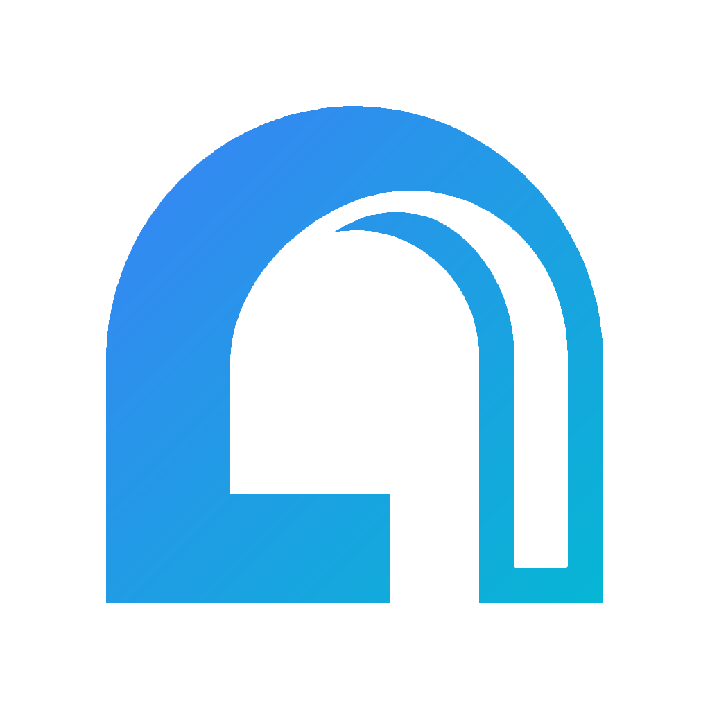
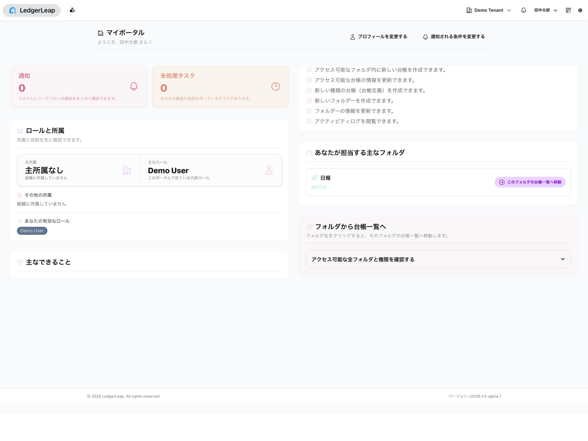
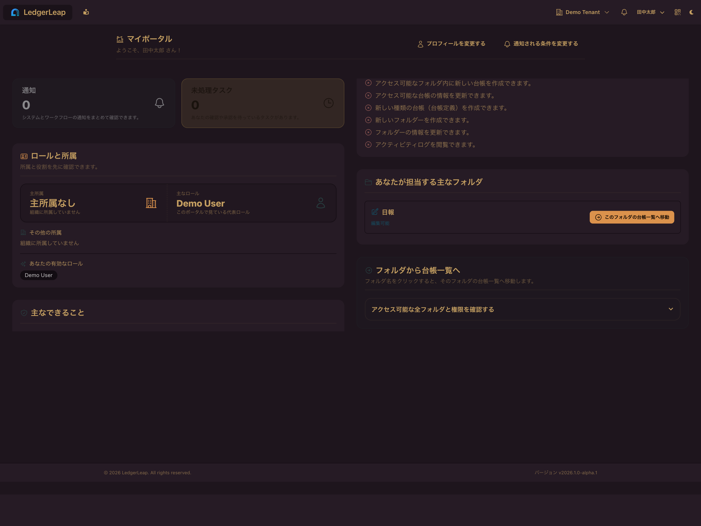
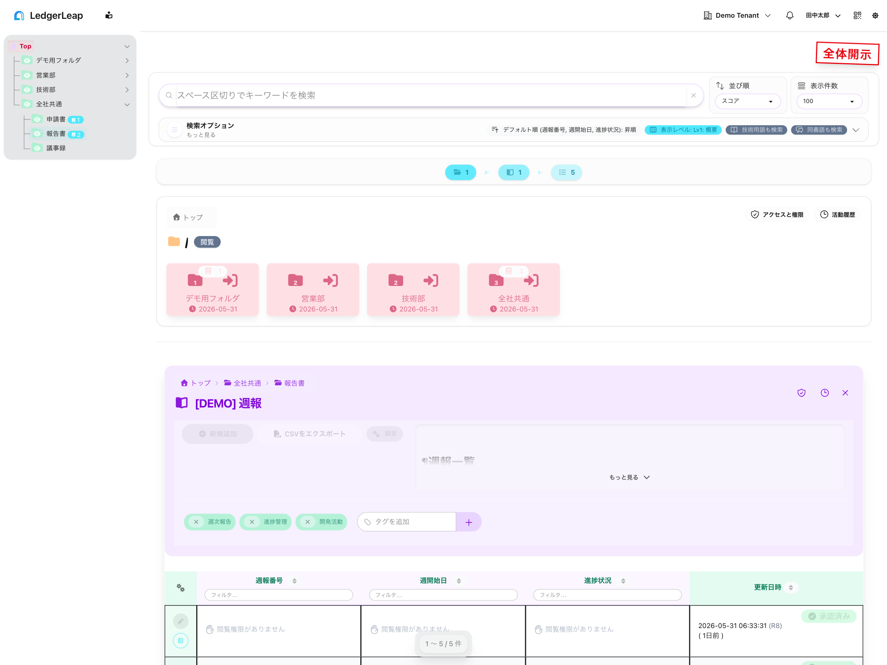
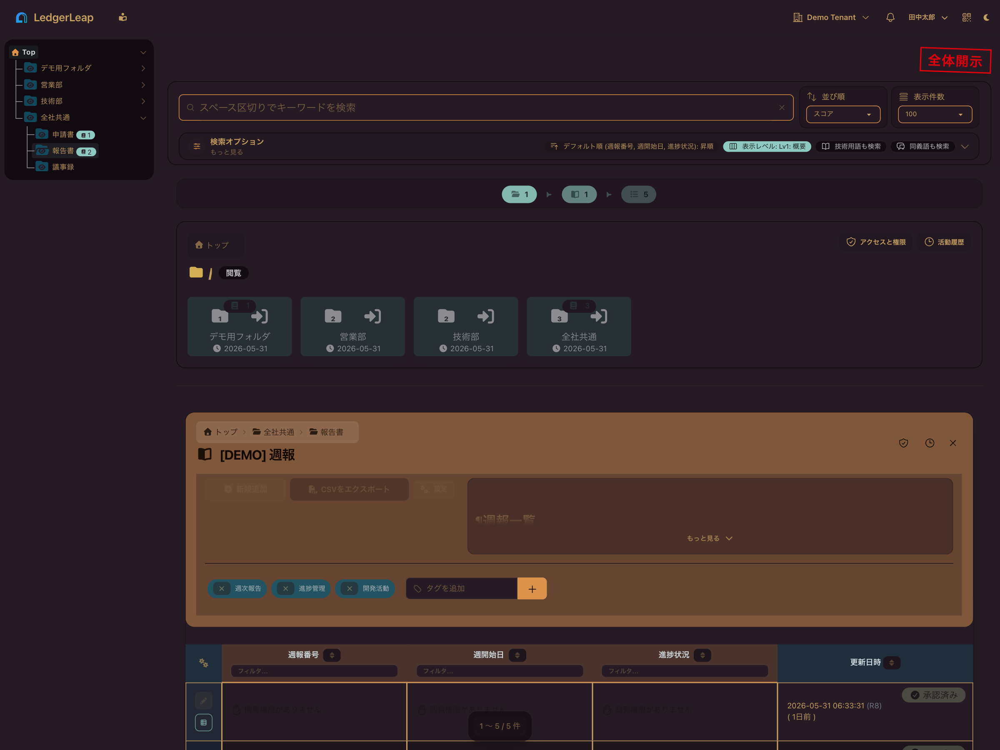

<p align="center">
  
</p>

<h1 align="center">LedgerLeap</h1>

<p align="center">
  <strong>A ledger and document management system that balances findability, governance, and day-to-day usability.</strong>
</p>

<p align="center">
  Find records when needed ・ share safely by permission ・ preserve clear approval and change history
</p>

<p align="center">
  <a href="README.md">日本語</a> |
  <a href="README.en.md"><strong>English</strong></a> |
  <a href="#problems-ledgerleap-is-built-to-solve">Problems</a> |
  <a href="#benefits-by-persona">Personas</a> |
  <a href="#ui-preview">UI</a> |
  <a href="#quick-start">Quick Start</a>
</p>

LedgerLeap is a web-based ledger and document management system for teams that need to **find records quickly, share them safely, and keep a clear audit trail**.

It is designed for organizations that want to move beyond paper, shared folders, spreadsheets, and email-driven operations without losing governance or day-to-day usability.

<p align="center"><em>This is the real My Portal screen, shown in both light mode and dark mode.</em></p>

| Light mode | Dark mode |
| --- | --- |
|  |  |

## Problems LedgerLeap is built to solve

- Critical records can only be found by the person who created them
- PDF, Office files, scanned documents, and structured records are stored separately
- Access rules differ by team, project, or tenant
- Approval history and change reasons are hard to explain during audits
- Frontline teams need simple input flows, while administrators need control and traceability

## Benefits by persona

| Persona | What gets better | Backed by |
| --- | --- | --- |
| Frontline staff | Faster retrieval of records and attachments, less duplicate entry, more consistent data capture | Flexible ledger definitions, full-text search, record duplication |
| Team leaders / managers | Better visibility into pending work, approvals, and review status; easier handoff and decision-making | My Portal, workflows, notifications, related ledgers |
| IT / administrators | Fine-grained access control and clearer visibility into who did what | Multi-tenancy, permissions, access visualization, activity logs |
| Audit / internal control / DX teams | Easier explanation of changes, approval paths, version differences, and external integration routes | Diff views, workflows, audit logs, API / MCP |

## Why LedgerLeap

- **Searchable after the fact**: Ledger data and attachments can be searched together, including content extracted from PDF, Office, and image-based files.
- **Adaptable to each business workflow**: Teams can define ledger fields for their own operations instead of forcing one rigid form on every process.
- **Governable without slowing down the field**: Tenant-, folder-, and role-based permissions work alongside activity tracking and approval workflows.
- **Designed for heavy file processing**: OCR and text extraction can run asynchronously so end users are not blocked by attachment analysis.
- **Ready for integration**: Public REST API and remote MCP contracts are available for external systems and LLM clients.

## Key capabilities

- **Multi-tenant architecture** for logical isolation between organizations and projects
- **Flexible ledger definitions** with text, numbers, auto-numbering, attachments, and Markdown-capable fields
- **Hierarchical folders** for intuitive record organization
- **Japanese full-text search** powered by MySQL / Mroonga
- **Attachment analysis pipeline** using Apache Tika, OcrMyPDF, and PaddleOCR-VL 0.9B
- **FileInspector drawer** for extracted text, processing status, and file history
- **Asynchronous file processing** through Redis and queue workers
- **Granular permissions and access visualization** across roles, organizations, and folders
- **Activity tracking and audit visibility** with scope and filter support
- **Approval workflows** including multi-step review, multiple approvers, and assignee recommendations
- **Record duplication** for repeatable reporting and data entry
- **Related ledger discovery** by identifier matching and semantic (RAG vector) search
- **Auto-linking** from identifiers in content to internal or external references
- **User-focused UI** with My Portal, grouped columns, display-level controls, and responsive design

## Target organizations and usage scenarios

- **Target organizations**: teams and departments that want better record keeping, search, sharing, and audit readiness
- **Typical users**:
  - frontline workers
  - team leaders
  - approvers
  - IT administrators
  - audit / internal control / DX stakeholders
- **Expected scale**:
  - users: from a few people to thousands
  - organizations / projects: hundreds
  - ledger definitions: thousands
  - ledger records: millions
- **Common use cases**:
  - operational logs, handover notes, customer records, and approval-driven forms
  - cross-team information sharing
  - audit-oriented record management with access control
  - migration from paper and attachment-heavy workflows to searchable digital records

## UI preview

Below is a **real ledger list screen** captured from the current demo dataset. It shows search, folder navigation, display-level controls, and list review in a single workflow. Both **light mode** and **dark mode** are included.

| Light mode | Dark mode |
| --- | --- |
|  |  |

## Documentation guide

| Goal | Document |
| --- | --- |
| Main developer documentation hub | [docs/README.md](docs/README.md) |
| Public REST API / remote MCP contract | [docs/api/README.md](docs/api/README.md) |
| Development environment setup details | [docs/development/environment-setup.md](docs/development/environment-setup.md) |
| End-user navigation overview | [My Portal and Navigation](docs/getting-started/portal-and-navigation.md) |
| Public search contract | [Search API](docs/api/search-api.md) |

> Public AI / automation entry points are intentionally concentrated under **`docs/api/`**.

## Quick Start

### Development environment setup

For full setup instructions, see:

- [Developer Documentation (`docs/README.md`)](docs/README.md)
- [Environment Setup Details (`docs/development/environment-setup.md`)](docs/development/environment-setup.md)

**Quick setup:**

```bash
# Clone the repository
git clone [repository-url] ledgerleap
cd ledgerleap

# Setup (automatically detects your environment)
./bin/setup.sh        # Development environment
./bin/setup.sh -p     # Production environment
```

The setup script will:

- build Docker containers
- install Composer and NPM dependencies
- run database migrations
- detect ARM64 / AMD64 automatically
- apply GPU-related settings based on `.env`

### Manual Composer installation

If you need Composer dependencies before starting Sail:

Reference: https://readouble.com/laravel/9.x/ja/sail.html#installing-composer-dependencies-for-existing-projects

```bash
docker run --rm \
  -u "$(id -u):$(id -g)" \
  -v $(pwd):/var/www/html \
  -w /var/www/html \
  laravelsail/php84-composer:latest \
  composer install --ignore-platform-reqs
```

## Technical summary

- **Language / framework**: PHP 8.4, Laravel 13
- **Database**: MySQL / MariaDB, Mroonga
- **Frontend**: Livewire 4, Alpine.js, Tailwind CSS 4, DaisyUI 5, Mary UI, Filament
- **Core foundations**:
  - multi-tenancy: `stancl/tenancy`
  - permissions: `spatie/laravel-permission`
  - activity log: `spatie/laravel-activitylog`
  - attachment analysis: Apache Tika, OcrMyPDF, PaddleOCR-VL 0.9B
  - API authentication: Laravel Sanctum
- **Development environment**: Laravel Sail (Docker)

For architecture and API / MCP details, see [docs/README.md](docs/README.md) and [docs/api/README.md](docs/api/README.md).

## License

LedgerLeap is open-sourced software licensed under the [MIT license](LICENSE).

## Credit

- Japanese Wordnet (v1.1) © 2009-2011 NICT, 2012-2015 Francis Bond and 2016-2022 Francis Bond, Takayuki Kuribayashi
  https://bond-lab.github.io/wnja/index.en.html
- Japanese Wordnet (Japanese site)
  https://bond-lab.github.io/wnja/index.ja.html
