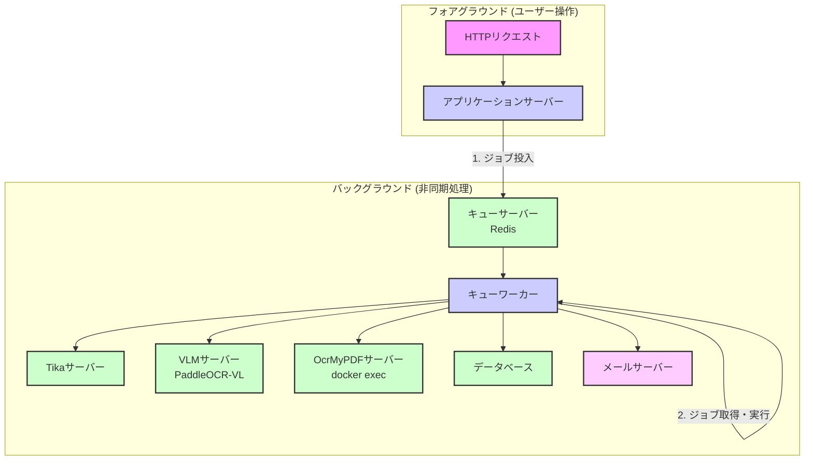
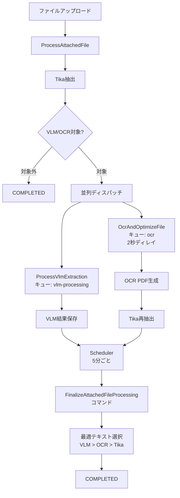

# キューワーカと非同期処理

**最終更新:** 2026年1月3日  
**ステータス:** Phase 3（VLM統合）実装完了

## 1. 概要

LedgerLeapでは、ユーザー体験を損なう可能性のある時間のかかる処理をバックグラウンドで実行するために、Laravelのキューシステムを積極的に活用しています。これにより、ユーザーは重いタスクの完了を待つことなく、アプリケーションの操作を続けることができます。

**主な非同期処理:**
- 添付ファイルのVLM/OCR/Tika処理（Phase 3で統合完了）
- ワークフローに関連する通知送信
- 台帳のRAGインデックス更新（将来拡張）

**記載範囲:**
- キューシステムのアーキテクチャと設計思想
- 添付ファイル処理ジョブのフロー
- キューワーカーの実行環境

**記載しない内容:**
- 実装コード詳細 → `app/Jobs/`ディレクトリ
- 運用監視 → `docs/operations/`
- UI操作 → `docs/function/Attachment.md`

## 2. 主要コンポーネントとデータフロー



### 2.1. ジョブの投入と実行

1.  **ジョブの投入 (Dispatching)**: ユーザーのアクション（ファイルアップロード、ワークフロー承認等）をトリガーとして、アプリケーションサーバーは対応するジョブを作成し、キューサーバー（Redis）に投入します。

2.  **ジョブの実行 (Processing)**: キューワーカーは、Redisのキューを監視し、新しいジョブが投入されると即座に（または指定された時間に）取得して実行します。

3.  **外部サービス連携**: キューワーカーは、ジョブの内容に応じて以下の外部サービスと通信します：
    *   **Tikaサーバー**: Office文書や画像からのテキスト抽出
    *   **VLMサーバー**: PaddleOCR-VLによるMarkdown抽出と構造化データ生成
    *   **OcrMyPDFサーバー**: 画像ファイルのOCR処理とPDF最適化
    *   **メールサーバー**: 通知メール送信

## 3. 添付ファイル処理ジョブ（Phase 3実装完了）

Phase 3（2025年12月）で、VLM/OCR/Tika統合が完了し、3エンジンの並列処理による高精度かつ堅牢なテキスト抽出を実現しました。

### 3.1. 処理フロー概要



### 3.2. 主要ジョブの役割

#### ProcessAttachedFile
- **役割**: Tikaによるテキスト抽出（初期処理）
- **キュー**: default
- **処理時間**: 3-5秒
- **次のアクション**: VLM/OCR対象の場合、並列ディスパッチ

#### ProcessVlmExtraction
- **役割**: PaddleOCR-VLによるMarkdown抽出と構造化データ生成
- **キュー**: vlm-processing（専用キュー）
- **処理時間**: 8-25秒（ファイルサイズに依存）
- **リトライ**: 2回、5分間隔
- **タイムアウト**: 600秒（設定可能）
- **保存データ**: vlm_markdown、vlm_structured_data、vlm_confidence

#### OcrAndOptimizeFile
- **役割**: OcrMyPDFによるOCR処理とPDF最適化
- **キュー**: ocr
- **ディレイ**: 2秒（VLM処理を優先）
- **処理時間**: 15-120秒（ファイルタイプに依存）
- **次のアクション**: Tika再抽出をディスパッチ

#### FinalizeAttachedFileProcessing（コマンド）
- **役割**: VLM/OCR/Tikaの結果から最適テキストを選択
- **実行タイミング**: スケジューラーで5分ごと
- **選択優先順位**: VLM（最優先） > OCR（次点） > Tika（フォールバック）
- **追加処理**: 台帳のRAGインデックス更新ジョブをディスパッチ

### 3.3. 並列処理戦略

**設計思想:**
- VLMとOCRを並列実行し、処理時間を短縮
- VLMを優先（即座実行）、OCRは2秒ディレイで開始
- 各エンジンは独立して処理し、失敗しても他のエンジンに影響しない

**処理タイミング:**
```
0:00 - ファイルアップロード
0:01 - Tika処理開始
0:06 - Tika完了 → ユーザー画面復帰可能
0:06 - VLM処理開始（並列）
0:08 - OCR処理開始（2秒ディレイ）
0:18 - VLM完了
0:68 - OCR完了（画像ファイルの場合）
0:70-0:75 - 最終化処理（スケジューラー）
```

### 3.4. エラーハンドリングとリトライ

**VLM処理:**
- 失敗時: `vlm_failed_at`タイムスタンプを記録
- 自動リトライ: 2回、5分間隔
- タイムアウト: 600秒（設定可能）
- 全失敗時: OCR/Tikaにフォールバック

**OCR処理:**
- 失敗時: `ocr_failed_at`タイムスタンプを記録
- 全失敗時: Tika結果を使用

**最終化処理:**
- 待機条件: VLM/OCRの両方が完了または失敗、かつタイムアウト（300秒）経過
- 最大処理件数: 50件/回（設定可能）

## 4. キューワーカーの実行環境

本システムの安定した非同期処理を実現するため、キューワーカーの実行環境には特別な構成が適用されています。

-   **Docker in Docker (DooD) 方式の採用:**
    -   `queue` サービスのDockerイメージ (`docker/app/DockerfileQueue`) には、PHPの実行環境に加え、**Docker CLI** がインストールされています。
    -   `docker-compose.yml` の設定により、`queue` コンテナにはホストマシンのDockerソケット (`/var/run/docker.sock`) がマウントされています。
    -   この構成により、`queue` コンテナはホストのDockerデーモンと通信し、自身以外のコンテナ（`ocrmypdf`など）に対して `docker exec` のようなコマンドを実行する権限を持ちます。これにより、Laravelのジョブから直接、他のサービスコンテナを柔軟に制御することが可能になっています。

-   **ログディレクトリのパーミッション自動修正:**
    -   コンテナ起動時に実行される `docker/app/start-container` スクリプトには、`storage/logs` ディレクトリの所有者を、コンテナ内のプロセス実行ユーザー (`sail`) に自動で変更する処理が含まれています。
    -   これにより、ホスト環境のファイルパーミッションの状態に依らず、キューワーカーが常にログファイルへの書き込み権限を持つことが保証され、ログの欠損によるデバッグの困難化を防ぎます。

## 4. キューワーカーの実行環境

本システムの安定した非同期処理を実現するため、キューワーカーの実行環境には特別な構成が適用されています。

### 4.1. Docker in Docker (DooD) 方式

-   **Docker CLI統合**: `queue`サービスのDockerイメージには、PHPの実行環境に加えてDocker CLIがインストールされています。
-   **Dockerソケットマウント**: `docker-compose.yml`の設定により、`queue`コンテナにはホストマシンのDockerソケット（`/var/run/docker.sock`）がマウントされています。
-   **コンテナ間制御**: この構成により、`queue`コンテナはホストのDockerデーモンと通信し、他のサービスコンテナ（`ocrmypdf`、`vlm`等）に対して`docker exec`コマンドを実行できます。

**メリット:**
- Laravelのジョブから直接、外部サービスコンテナを柔軟に制御可能
- OcrMyPDFやVLMサービスを独立したコンテナとして管理
- リソース隔離とスケーラビリティの向上

### 4.2. ログディレクトリのパーミッション自動修正

-   コンテナ起動時に実行される`docker/app/start-container`スクリプトには、`storage/logs`ディレクトリの所有者を、コンテナ内のプロセス実行ユーザー（`sail`）に自動変更する処理が含まれています。
-   これにより、ホスト環境のファイルパーミッションに依らず、キューワーカーが常にログファイルへの書き込み権限を持つことが保証されます。

### 4.3. 専用キューの設定

**vlm-processingキュー:**
- VLM処理専用のキュー
- 高優先度設定
- リソース消費が大きいため、並列処理数を制限

**ocrキュー:**
- OCR処理専用のキュー
- VLM処理を優先するため、2秒ディレイ付きでディスパッチ

**defaultキュー:**
- Tika処理、通知送信等の汎用キュー

## 5. 通知処理ジョブ

ワークフローに関連する通知は、全てキューを通じて処理されます。

**主な通知ジョブ:**
- `GenericNotification`: 個別通知（ワークフローステップ完了等）
- `WorkflowSummaryNotification`: 集約通知（定期実行）

**設計思想:**
- メール送信の遅延がユーザー操作に影響しない
- リトライ機能により、一時的なメールサーバー障害に対応

## 6. 関連ドキュメントと設定ファイル

### 関連ドキュメント
- **[添付ファイル機能](../function/Attachment.md)** - ユーザー向け機能説明
- **[VLM-OCR技術選定](./vlm-ocr-technology-selection.md)** - 技術選定理由とアーキテクチャ
- **[AttachedFileモデル](../models/AttachedFile.md)** - データモデル仕様

### 設定ファイル
- **`config/queue.php`**: キュー設定
- **`config/vlm.php`**: VLM処理設定（リトライ回数、タイムアウト等）
- **`docker-compose.yml`**: キューワーカーサービス定義
- **`docker/app/DockerfileQueue`**: キューワーカーDockerfile
- **`docker/app/start-container`**: コンテナ起動スクリプト

### 実装ファイル
- **`app/Jobs/Ledger/ProcessAttachedFile.php`**: Tika処理
- **`app/Jobs/Ledger/ProcessVlmExtraction.php`**: VLM処理
- **`app/Jobs/Ledger/OcrAndOptimizeFile.php`**: OCR処理
- **`app/Console/Commands/Ledger/FinalizeAttachedFileProcessing.php`**: 最終化処理
- **`app/Notifications/`**: 通知クラス
