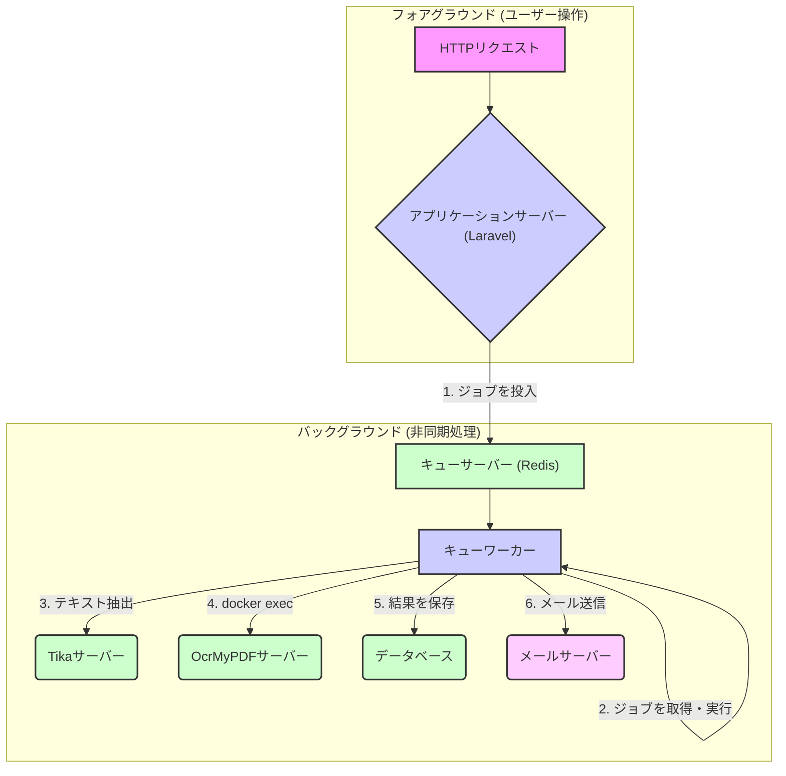

# キューワーカと非同期処理

## 概要

LedgerLeapでは、ユーザー体験を損なう可能性のある時間のかかる処理をバックグラウンドで実行するために、Laravelのキューシステムを積極的に活用しています。これにより、ユーザーは重いタスクの完了を待つことなく、アプリケーションの操作を続けることができます。

## 2. 主要コンポーネントとデータフロー

1.  **ジョブの投入 (Dispatching Jobs)**: ユーザーのアクション（例: ファイルのアップロード、ワークフローの承認）をトリガーとして、アプリケーションサーバー (Laravel) は対応するジョブを作成し、キューサーバー (Redis) に投入します。

2.  **ジョブの実行 (Processing Jobs)**: キューワーカーは、Redisのキューを常に監視しており、新しいジョブが投入されると即座に（または指定された時間に）ジョブを取得して実行を開始します。

3.  **具体的な処理**: キューワーカーは、ジョブの内容に応じて様々な処理を実行します。
    *   **ファイル内容の抽出**: `ProcessAttachedFile` ジョブが Tika サーバーと通信し、アップロードされたファイルからテキストを抽出します。
    *   **OCR処理**: Tikaでの抽出に失敗した画像ベースのファイルの場合、`OcrAndOptimizeFile` ジョブが `docker exec` コマンドを介して OcrMyPDF サーバーを直接呼び出し、OCR処理を実行します。
    *   **データベース更新**: 抽出したテキストや処理結果を `attached_files` テーブルや `ledgers` テーブルに保存します。
    *   **通知送信**: ワークフローの進行や特定のアクションに応じて、`GenericNotification` や `WorkflowSummaryNotification` などの通知ジョブがメールサーバーと連携してメールを送信します。

## 3. キューワーカーの実行環境

本システムの安定した非同期処理を実現するため、キューワーカーの実行環境には特別な構成が適用されています。

-   **Docker in Docker (DooD) 方式の採用:**
    -   `queue` サービスのDockerイメージ (`docker/app/DockerfileQueue`) には、PHPの実行環境に加え、**Docker CLI** がインストールされています。
    -   `docker-compose.yml` の設定により、`queue` コンテナにはホストマシンのDockerソケット (`/var/run/docker.sock`) がマウントされています。
    -   この構成により、`queue` コンテナはホストのDockerデーモンと通信し、自身以外のコンテナ（`ocrmypdf`など）に対して `docker exec` のようなコマンドを実行する権限を持ちます。これにより、Laravelのジョブから直接、他のサービスコンテナを柔軟に制御することが可能になっています。

-   **ログディレクトリのパーミッション自動修正:**
    -   コンテナ起動時に実行される `docker/app/start-container` スクリプトには、`storage/logs` ディレクトリの所有者を、コンテナ内のプロセス実行ユーザー (`sail`) に自動で変更する処理が含まれています。
    -   これにより、ホスト環境のファイルパーミッションの状態に依らず、キューワーカーが常にログファイルへの書き込み権限を持つことが保証され、ログの欠損によるデバッグの困難化を防ぎます。

## 4. 主な非同期処理の例

*   **添付ファイルのテキスト抽出とOCR**: ユーザーがファイルをアップロードすると、`ProcessAttachedFile` ジョブがキューに追加されます。このジョブはTikaによるテキスト抽出を試み、失敗した場合は `OcrAndOptimizeFile` ジョブをさらにキューに追加します。この一連の処理はすべてバックグラウンドで行われます。
*   **通知送信**: ワークフローの各ステップでの個別通知や、定期的に実行される集約通知は、すべてキューを通じて処理され、メール送信の遅延がユーザーの操作に影響を与えないようにしています。

## 5. 関連ファイル

*   **設定ファイル**: `config/queue.php`
*   **キューワーカーサービス定義**: `docker-compose.yml` の `queue` サービス
*   **キューワーカーDockerfile**: `docker/app/DockerfileQueue`
*   **コンテナ起動スクリプト**: `docker/app/start-container`
*   **ジョブクラス**: `app/Jobs/` ディレクトリ以下 (例: `app/Jobs/Ledger/ProcessAttachedFile.php`, `app/Jobs/Ledger/OcrAndOptimizeFile.php`)
*   **通知クラス**: `app/Notifications/` ディレクトリ以下
