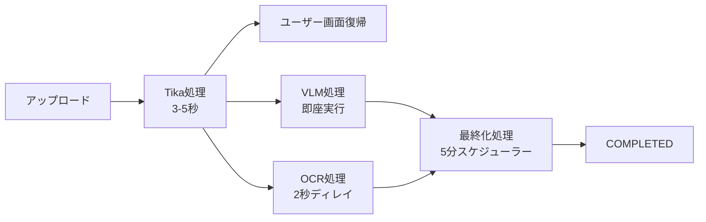
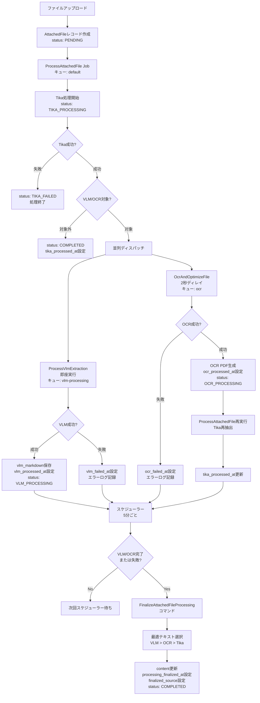
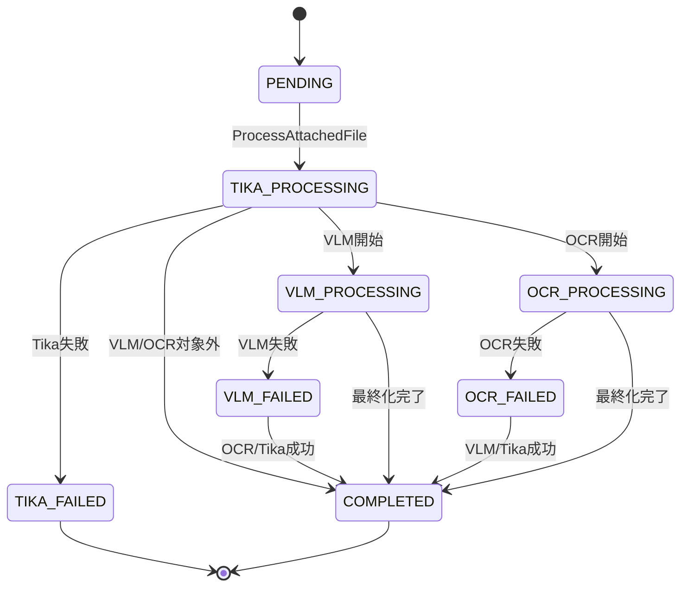

# 添付ファイル処理フロー詳細

**最終更新:** 2026年1月3日  
**Phase 1-5実装完了:** 添付ファイル機能統合（2025年12月-2026年1月）

## 1. 概要

LedgerLeapの添付ファイル処理は、VLM（Visual Language Model）、OCR、Apache Tikaの3つのエンジンを統合し、高精度かつ堅牢なテキスト抽出を実現しています。

**処理の特徴:**
- **3エンジン並列処理**: VLMとOCRを並列実行し、処理時間を短縮
- **エンジン優先順位**: VLM（最優先） > OCR（次点） > Tika（フォールバック）
- **非同期処理**: ユーザー待機時間を最小化（Tika完了後、約5秒で画面復帰）
- **自動フォールバック**: VLM失敗時にOCR/Tikaが自動的にカバー

**記載範囲:**
- 全体フローと各エンジンの役割
- ファイルタイプ別の処理パターン
- 状態遷移とエラーハンドリング
- 最終化処理のロジック

**記載しない内容:**
- ジョブの実装詳細 → `app/Jobs/Ledger/`
- UI操作方法 → `docs/function/Attachment.md`
- 技術選定理由 → `docs/architecture/vlm-ocr-technology-selection.md`

## 2. 全体処理フロー

### 2.1. 処理ステージの概要



**処理時間の内訳（CPU環境）:**

| ステージ | 処理時間 | ユーザー影響 | 備考 |
|---------|---------|------------|------|
| アップロード | 即座 | あり | ファイルサイズに依存 |
| Tika処理 | 3-5秒 | あり | ユーザー待機時間 |
| **画面復帰** | **約5秒** | - | **ユーザーは操作継続可能** |
| VLM処理 | 8-25秒 | なし（バックグラウンド） | ファイルタイプに依存 |
| OCR処理 | 15-120秒 | なし（バックグラウンド） | 画像ファイルは長時間 |
| 最終化処理 | 1-2秒 | なし | スケジューラー実行 |

**重要:** ユーザーはTika処理完了後（約5秒）に画面に復帰でき、VLM/OCR処理の完了を待つ必要はありません。

### 2.2. 処理フロー詳細図



## 3. 各エンジンの役割

### 3.1. VLM (PaddleOCR-VL 0.9B)

**役割:** 高精度なビジュアル言語モデルによるテキスト抽出

**特徴:**
- Markdown形式での出力（見出し、リスト、表構造を保持）
- 構造化データの抽出（JSON形式）
- 信頼度スコアの算出（0.0000-1.0000）
- 手書き文字認識対応
- 109言語対応（日本語含む）

**処理対象:**
- 画像ファイル（JPG、PNG、GIF等）
- PDFファイル（全タイプ）

**処理時間:**
- 画像（1MB）: 8-15秒
- PDF（1ページ）: 10-18秒

**出力データ:**
- `vlm_markdown`: Markdown形式のテキスト
- `vlm_structured_data`: 構造化データ（JSON）
- `vlm_confidence`: 信頼度スコア
- `vlm_model`: 使用モデル名
- `vlm_processing_time_ms`: 処理時間

**リトライ設定:**
- 試行回数: 2回
- バックオフ: 5分間隔
- タイムアウト: 600秒（設定可能）

### 3.2. OCR (OcrMyPDF)

**役割:** 画像ベースのファイルからテキストを抽出し、検索可能なPDFを生成

**特徴:**
- Tesseract OCRエンジンを使用
- PDF最適化機能
- テキスト付きPDFは`--skip-text`で最適化のみ実行
- 画像ファイルは自動的にPDF化

**処理対象:**
- 画像ファイル（JPG、PNG、GIF等） → PDF化してOCR
- テキスト付きPDF → 最適化のみ（`--skip-text`）
- 画像のみのPDF → OCR処理

**処理時間:**
- 画像（1MB）: 30-60秒
- PDF（テキスト付き）: 15-30秒
- PDF（画像のみ）: 30-120秒

**出力:**
- OCR処理後、`path`カラムが最適化済みPDFを指す
- 元ファイルは`original_file_path`に退避
- `ocr_processed_at`タイムスタンプが設定される

**重要な実装詳細:**
- OCR処理後、`ProcessAttachedFile`を再実行してTika再抽出
- 画像ファイルのキーは`.pdf`に変換される（例: `image.jpg` → `image.pdf`）

### 3.3. Tika (Apache Tika)

**役割:** 汎用的なテキスト抽出とメタデータ抽出

**特徴:**
- Office文書（Word、Excel、PowerPoint等）に対応
- PDF、画像、アーカイブ等、多様なファイル形式に対応
- メタデータの抽出（作成日時、作成者等）
- VLM/OCR失敗時のフォールバック

**処理対象:**
- 全ファイルタイプ（初期処理として必ず実行）

**処理時間:**
- 3-5秒（大半のファイル）
- 最大10秒（大容量ファイル）

**出力:**
- `ledgers.content_attached`にテキストを保存
- `tika_processed_at`タイムスタンプが設定される

## 4. ファイルタイプ別の処理パターン

### 4.1. 処理マトリックス

| ファイルタイプ | MIME | Tika | VLM | OCR | ファイル名変更 | 最終source |
|--------------|------|------|-----|-----|---------------|-----------|
| **画像（JPG/PNG）** | image/* | ✅ | ✅ | ✅ | ✅ → PDF化 | vlm > ocr > tika |
| **テキスト付きPDF** | application/pdf | ✅ | ✅ | ✅ (skip-text) | ❌ | vlm > tika |
| **画像のみPDF** | application/pdf | ✅ | ✅ | ✅ | ❌ | vlm > ocr > tika |
| **Office文書** | application/vnd.* | ✅ | ❌ | ❌ | ❌ | tika |
| **テキスト** | text/* | ✅ | ❌ | ❌ | ❌ | tika |

### 4.2. パターン1: 画像ファイル（JPG/PNG）

**処理フロー:**
```
1. Tika抽出 → content_attached['1']['image.jpg']
2. VLM処理 → vlm_markdown
3. OCR処理:
   - image.jpg → image.pdf に変換
   - Tika再抽出 → content_attached['1']['image.pdf']
4. 最終化:
   - VLM成功 → finalized_source = 'vlm'
   - VLM失敗、OCR成功 → finalized_source = 'ocr'
   - 両方失敗 → finalized_source = 'tika'
```

**キー変更:**
- アップロード時: `content_attached[$columnId]['image.jpg']`
- OCR処理後: `content_attached[$columnId]['image.pdf']`（新規キー作成）

### 4.3. パターン2: テキスト付きPDF

**処理フロー:**
```
1. Tika抽出 → content_attached['1']['document.pdf']
2. VLM処理 → vlm_markdown
3. OCR処理:
   - --skip-text オプションで最適化のみ
   - Tika再抽出 → content_attached['1']['document.pdf']（上書き）
4. 最終化:
   - VLM成功 → finalized_source = 'vlm'
   - VLM失敗 → finalized_source = 'tika'（OCRは最適化のみなので選択肢に含まれない）
```

**キー変更:**
- 変更なし: `content_attached[$columnId]['document.pdf']`（元のキーを上書き）

### 4.4. パターン3: 画像のみPDF

**処理フロー:**
```
1. Tika抽出 → content_attached['1']['scan.pdf']（ほぼ空）
2. VLM処理 → vlm_markdown
3. OCR処理:
   - OCR実行してテキスト抽出
   - Tika再抽出 → content_attached['1']['scan.pdf']（上書き）
4. 最終化:
   - VLM成功 → finalized_source = 'vlm'
   - VLM失敗、OCR成功 → finalized_source = 'ocr'
   - 両方失敗 → finalized_source = 'tika'
```

### 4.5. パターン4: Office文書

**処理フロー:**
```
1. Tika抽出 → content_attached['1']['report.docx']
2. VLM処理: スキップ（対象外）
3. OCR処理: スキップ（対象外）
4. 最終化:
   - finalized_source = 'tika'
```

## 5. 状態遷移

### 5.1. AttachedFileStatusの状態定義

| 状態 | 説明 | 遷移元 | 遷移先 |
|------|------|--------|--------|
| `PENDING_INITIAL_PROCESSING` | 処理待ち（初期状態） | - | INITIAL_PROCESSING |
| `INITIAL_PROCESSING` | Tika処理中 | PENDING_INITIAL_PROCESSING | COMPLETED, VLM_PROCESSING, OCR_PROCESSING, PARALLEL_PROCESSING, TIKA_FAILED |
| `VLM_PROCESSING` | VLM処理中 | INITIAL_PROCESSING | COMPLETED, VLM_FAILED |
| `OCR_PROCESSING` | OCR処理中 | INITIAL_PROCESSING | COMPLETED, OCR_FAILED |
| `COMPLETED` | 全処理完了（最終状態） | 全ての状態 | - （上書き不可: VLM/OCR/ProcessAttachedFile は processing_finalized_at 設定済みの場合ステータス変更しない） |
| `TIKA_FAILED` | Tika処理失敗 | INITIAL_PROCESSING | - |
| `VLM_FAILED` | VLM処理失敗 | VLM_PROCESSING | COMPLETED（OCR/Tika成功時） |
| `OCR_FAILED` | OCR処理失敗 | OCR_PROCESSING | COMPLETED（VLM/Tika成功時） |
| `PROCESSING_FAILED` | VLM+OCR両方失敗 | - | - |

### 5.2. 状態遷移図



### 5.3. 処理状態の24パターン

最終化処理前後、およびVLM/OCR/Tikaの成功/失敗/未実施の組み合わせにより、理論上24パターンの処理状態が存在します。

**主要な6パターン:**

| # | VLM | OCR | Tika | finalized_source | 説明 |
|---|-----|-----|------|-----------------|------|
| 1 | ✅ | ✅ | ✅ | vlm | VLM成功（最も望ましい） |
| 2 | ❌ | ✅ | ✅ | ocr | VLM失敗、OCR成功 |
| 3 | ❌ | ❌ | ✅ | tika | VLM/OCR失敗、Tika成功 |
| 4 | - | - | ✅ | tika | Office文書（VLM/OCR未実施） |
| 5 | ✅ | ⏳ | ✅ | vlm | VLM成功、OCR処理中 |
| 6 | ❌ | ❌ | ❌ | null | 全エンジン失敗 |

## 6. 最終化処理のロジック

### 6.1. FinalizeAttachedFileProcessingコマンド

**ファイル:** `app/Console/Commands/Ledger/FinalizeAttachedFileProcessing.php`

**実行タイミング:** スケジューラーで5分ごと

**実行条件:**
- `processing_finalized_at`が未設定
- `tika_processed_at`が設定済み
- 以下のいずれか:
  - `vlm_processed_at`または`vlm_failed_at`が設定済み
  - `ocr_processed_at`または`ocr_failed_at`が設定済み
- タイムアウト（デフォルト300秒）経過

**処理内容:**
```php
1. 最適テキストソースを選択（VLM > OCR > Tika）
2. content_attached を更新（悲観的ロック lockForUpdate）
3. finalized_source を設定
4. processing_finalized_at を設定
5. status を determineFinalStatus() で判定
   - テキスト抽出成功 → COMPLETED
   - 画像由来ファイル（original_mime_type が image/）+ OCR/Tika処理済み
     → テキスト空でも COMPLETED（画像のテキスト抽出はオプショナル）
   - VLM+OCR両方失敗 → PROCESSING_FAILED
   - VLMのみ失敗 → VLM_FAILED
6. 台帳のRAGインデックス更新ジョブをディスパッチ
```

**注意:** `ProcessVlmExtraction`、`OcrAndOptimizeFile`、`ProcessAttachedFile` はいずれも
`processing_finalized_at` が設定済みの場合、ステータスを上書きしない。
タイムスタンプのみ記録する。これにより並列ジョブが finalize 後の COMPLETED を
VLM_FAILED 等に巻き戻すことを防止する。

### 6.2. テキストソース選択ロジック

```php
// 優先順位: VLM > OCR > Tika

if ($file->vlm_processed_at && $file->vlm_markdown) {
    // VLM結果を採用
    $file->content = $file->vlm_markdown;
    $file->finalized_source = 'vlm';
} elseif ($file->ocr_processed_at) {
    // OCR結果を採用
    $isImageFile = str_starts_with($file->original_mime_type ?? '', 'image/');
    
    if ($isImageFile) {
        // 画像ファイル: .pdf キーをチェック
        $pdfKey = pathinfo($file->hashedbasename, PATHINFO_FILENAME) . '.pdf';
        $text = $ledger->content_attached[$columnId][$pdfKey]['meta']['content'] ?? null;
    } else {
        // PDFファイル: 元のキーをチェック
        $text = $ledger->content_attached[$columnId][$file->hashedbasename]['meta']['content'] ?? null;
    }
    
    $file->content = $text;
    $file->finalized_source = 'ocr';
} else {
    // Tika結果を採用
    $text = $ledger->content_attached[$columnId][$file->hashedbasename]['meta']['content'] ?? null;
    $file->content = $text;
    $file->finalized_source = 'tika';
}
```

### 6.3. 最終化処理のタイミング調整

**設定可能なパラメータ:**

| パラメータ | デフォルト値 | 説明 |
|-----------|------------|------|
| `--timeout` | 300秒 | VLM/OCR処理のタイムアウト |
| `--limit` | 50件 | 1回の実行で処理する最大件数 |

**カスタマイズ例:**
```bash
# 大容量ファイルが多い場合
php artisan ledger:finalize-processing --timeout=600 --limit=20

# 高速処理が必要な場合
php artisan ledger:finalize-processing --timeout=120 --limit=100
```

## 7. エラーハンドリングとリトライ戦略

### 7.1. VLM処理のエラーハンドリング

**リトライ設定:**
```php
// config/vlm.php
'retry' => [
    'times' => 2,      // リトライ回数
    'backoff' => 300,  // バックオフ時間（秒）
],
'timeout' => 600,      // タイムアウト（秒）
```

**エラー時の動作:**
```
1. 1回目の失敗: 5分後に自動リトライ
2. 2回目の失敗: vlm_failed_at を設定
3. OCR/Tikaにフォールバック
```

**よくあるエラー:**
- タイムアウト（大きいファイル）
- VLMサービス停止
- ファイル形式非対応
- メモリ不足

### 7.2. OCR処理のエラーハンドリング

**エラー時の動作:**
```
1. OCR失敗: ocr_failed_at を設定
2. VLM/Tikaにフォールバック
3. リトライなし（処理時間が長いため）
```

**よくあるエラー:**
- 画像品質不良
- ファイル破損
- メモリ不足

### 7.3. Tika処理のエラーハンドリング

**エラー時の動作:**
```
1. Tika失敗: status = TIKA_FAILED
2. 処理終了（VLM/OCRもスキップ）
3. ユーザーに再アップロードを促す
```

**よくあるエラー:**
- ファイル破損
- 未対応ファイル形式
- Tikaサービス停止

## 8. パフォーマンス最適化

### 8.1. 並列処理による高速化

**設計思想:**
- VLMとOCRを並列実行
- VLMは即座実行、OCRは2秒ディレイ（VLMを優先）
- Tikaは初期処理として単独実行

**効果:**
- VLM/OCRの並列処理により、全体処理時間を30-40%短縮
- ユーザー待機時間はTika完了時（約5秒）のみ

### 8.2. キュー設定の最適化

**推奨設定（`config/queue.php`）:**
```php
'connections' => [
    'vlm-processing' => [
        'driver' => 'redis',
        'queue' => 'vlm-processing',
        'processes' => 2,  // 並列処理数
    ],
    'ocr' => [
        'driver' => 'redis',
        'queue' => 'ocr',
        'processes' => 1,  // OCRは重いため1推奨
    ],
],
```

### 8.3. スケジューラーの調整

**最終化処理の頻度:**
```php
// app/Console/Kernel.php
$schedule->command('ledger:finalize-processing')
    ->everyFiveMinutes();  // デフォルト: 5分ごと

// 高速化が必要な場合
$schedule->command('ledger:finalize-processing')
    ->everyMinute();       // 1分ごと（負荷注意）
```

## 9. 関連ドキュメント

### アーキテクチャ
- **[VLM-OCR技術選定](./vlm-ocr-technology-selection.md)** - 技術選定理由と実測ベンチマーク
- **[非同期処理](./QueueProcessing.md)** - ジョブフローとキューワーカー設定

### 機能仕様
- **[添付ファイル機能](../function/Attachment.md)** - ユーザー向け機能説明
- **[AttachedFileモデル](../models/AttachedFile.md)** - データモデル仕様

### 開発ガイド
- **[VLM/OCR開発者ガイド](../development/vlm-ocr.md)** - 実装ガイドとトラブルシューティング
- **[テストのベストプラクティス](../development/Testing-Best-Practices.md)** - テストの書き方

### データベース
- **[データベーススキーマ](../database/schema.md)** - `attached_files`テーブルの詳細

---

**実装完了:** Phase 1-5（2025年12月-2026年1月）  
**最終更新:** 2026年1月3日

