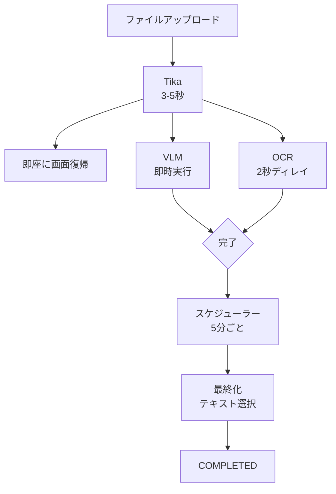

# ファイル処理パイプライン

## なぜ3エンジンパイプラインが必要か

LedgerLeap では、台帳に添付されたファイルからテキストを抽出し、検索可能にする必要があります。このテキスト抽出を単一のエンジンに依存すると、次の問題が発生します。

- **対応形式の制限**: エンジンごとに得意なファイル形式が異なる（画像、PDF、Office文書）
- **抽出精度のばらつき**: スキャン品質やレイアウトによって精度が大きく変動する
- **単一障害点**: エンジンのダウンやタイムアウトで処理が完全に停止する

LedgerLeap は **VLM（Vision Language Model）**、**OCR（OcrMyPDF + Tesseract）**、**Apache Tika** の3エンジンを並列・直列に組み合わせ、優先順位に基づいて最適なテキストを選択するアーキテクチャを採用しています。

## 設計思想

### 1. VLM優先主義

VLM（PaddleOCR-VL）は3エンジン中もっとも高精度で、Markdownの構造（見出し、リスト、表）を保持したテキスト抽出が可能です。そのため、VLMが成功した場合は常に VLM の結果を採用します。

### 2. 並列処理によるレイテンシー隠蔽

VLM（8-25秒）と OCR（15-120秒）は重い処理です。これらを直列に実行するとユーザーの待機時間が長くなります。LedgerLeap では VLM と OCR を並列に起動し、ユーザーには Tika 完了（約5秒）時点で画面を返すことで、体感待機時間を最小化しています。

### 3. 非同期・疎結合

各エンジンの処理はキューを介した非同期ジョブとして実行されます。これにより：

- 処理の失敗がユーザー操作をブロックしない
- エンジンごとにキューを分離し、負荷を分散できる
- 後からエンジンを追加・交換しやすい

## アーキテクチャ概要



### 処理時間

| ステージ | 時間 | ユーザー影響 |
|---------|------|------------|
| Tika | 3-5秒 | あり（待機） |
| **画面復帰** | **約5秒** | - |
| VLM | 8-25秒 | なし（非同期） |
| OCR | 15-120秒 | なし（非同期） |
| 最終化 | 1-2秒 | なし（スケジューラー） |

## 優先順位とテキスト選択

最終化処理では、以下の優先順位で最適なテキストを選択します。

```
VLM 成功 ──→ VLMのMarkdown結果を採用
 │
 └─ VLM失敗 → OCR成功 ──→ OCR抽出テキストを採用
                │
                └─ OCR失敗 → Tika結果を採用（Office文書もここ）
```

**選択ロジックのポイント:**

- **VLM > OCR > Tika**: 精度と構造保持能力の順
- **画像ファイルのOCR**: OCR処理後にファイル名が `.pdf` に変わるため、最終化時には元のMIMEタイプ（`image/`）を基準に PDF キーを解決する
- **テキスト付きPDFのOCR**: `--skip-text` オプションで最適化のみ実行。抽出テキストは Tika の再抽出結果を使う

## ファイルタイプ別の処理パターン

| ファイルタイプ | Tika | VLM | OCR | 最終source |
|--------------|------|-----|-----|-----------|
| **画像（JPG/PNG）** | ✅ | ✅ | ✅→PDF化 | vlm > ocr > tika |
| **テキスト付きPDF** | ✅ | ✅ | ✅（最適化のみ） | vlm > tika |
| **画像のみPDF** | ✅ | ✅ | ✅ | vlm > ocr > tika |
| **Office文書** | ✅ | - | - | tika |

## キュー構成

3つのキューを使い分けることで、エンジン間の負荷干渉を防いでいます。

| キュー | ジョブ | 特性 |
|-------|--------|------|
| `default` | `ProcessAttachedFile` | Tika処理。短時間で完了 |
| `vlm-processing` | `ProcessVlmExtraction` | 8-25秒。並列度2推奨 |
| `ocr` | `OcrAndOptimizeFile` | 15-120秒。並列度1推奨 |

## 状態管理

AttachedFile の status は、各エンジンの処理状態を追跡するために複数の中間状態を持ちます。

```
PENDING → TIKA_PROCESSING → VLM_PROCESSING / OCR_PROCESSING → COMPLETED
                              ↘ VLM_FAILED / OCR_FAILED        → COMPLETED（他エンジン成功時）
```

**重要なガード:** `processing_finalized_at` が設定済みの場合、後続のジョブは status を上書きしません。これにより、最終化完了後の COMPLETED が VLM/OCR の遅延ジョブで巻き戻されることを防ぎます。

## トレードオフと制約

- **VLM精度と処理時間のトレードオフ**: 高精度だが1ファイル8-25秒かかる。大量一括アップロード時はキューが滞留する可能性がある。
- **OCRの重さ**: 画像ファイルのOCRはPDF変換 + OCR処理で長時間になる。画像ファイルが多いユースケースではキューワーカーの台数調整が必要。
- **Tikaの限界**: 画像のみPDFからのテキスト抽出はほとんど空になる。VLM/OCRが必須。
- **テナント間のリソース競合**: キューは全テナント共有のため、あるテナントの大量アップロードが他テナントの処理を遅延させる可能性がある。

## 関連ドキュメント

- **[ファイル処理フロー詳細](./file-processing-flow.md)** - 状態遷移、エラーハンドリング、パフォーマンス最適化の詳細
- **[VLM-OCR技術選定](./vlm-ocr-technology-selection.md)** - 技術選定理由と実測ベンチマーク
- **[添付ファイルとファイルインスペクター](../features/attachments-and-file-inspector.md)** - ユーザー向け機能説明
- **[非同期処理](./QueueProcessing.md)** - ジョブフローとキューワーカー設定

---

**対象読者:** 開発者・アーキテクト
**最終更新:** 2026年6月1日
