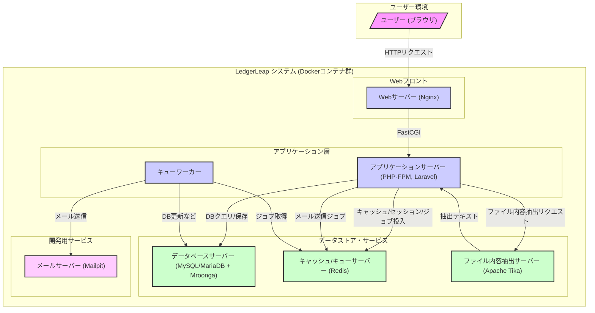

# LedgerLeap システムアーキテクチャ概要

## 概要説明
LedgerLeapは、複数のコンポーネントが連携して動作するWebアプリケーションです。本ドキュメントでは、これらのコンポーネント構成と、それらがどのように連携して機能を提供するかを概説します。

## 主要コンポーネント図 (Mermaid.js)

## 各コンポーネントの説明

*   **ユーザー (ブラウザ)**: システムの利用者。Webブラウザを通じてシステムにアクセスする。
*   **Webサーバー**: HTTPリクエストを受け付け、静的コンテンツの配信やPHP-FPMへのリクエスト転送を行う。 (例: Nginx)
*   **アプリケーションサーバー (Laravel)**: ビジネスロジック、ルーティング、コントローラー、モデル、ビューなどの処理を担当するコアコンポーネント。PHP-FPM上で動作。
*   **データベースサーバー (MySQL/Mroonga)**: 台帳データ、ユーザー情報、設定など永続的なデータを格納。Mroongaによる全文検索機能を提供する。
*   **キャッシュ/キューサーバー (Redis)**: セッション情報、キャッシュデータ、非同期ジョブのキューイングに使用されるインメモリデータストア。
*   **ファイル内容抽出サーバー (Apache Tika Server)**: アップロードされたファイル (Word, Excel, PDF等) の内容を抽出し、全文検索の対象とするために使用。LaravelアプリケーションからAPI経由で利用される。
*   **メールサーバー**: システムからの通知メール（ワークフロー関連、アラートなど）を送信する。開発環境ではMailpitが使用される。
*   **キューワーカー**: Redisに積まれた非同期ジョブ（メール送信、重い処理など）をバックグラウンドで実行するプロセス。
