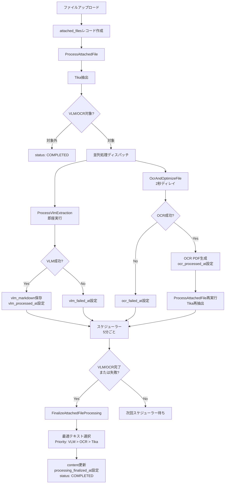

# VLM-OCR技術選定とエンジン統合アーキテクチャ

**ドキュメント種別:** 公式ドキュメント（技術選定・アーキテクチャ）

> **関連ドキュメント:**
> - [添付ファイル機能](../function/Attachment.md) - ユーザー向け機能説明
> - [非同期処理アーキテクチャ](./QueueProcessing.md) - ジョブフロー詳細
> - [AIアシスタントと検索の哲学](../ai-and-search-guide.md) - LedgerLeapの検索思想
> - [AttachedFileモデル](../models/AttachedFile.md) - VLM/OCR関連カラム定義

---

## 目的

本ドキュメントは、LedgerLeapにおけるVLM（Visual Language Model）とOCR技術の選定理由、エンジン統合アーキテクチャ、および実装成果を記録します。

**記載範囲:**
- オンプレミス・CPU環境で実行可能なVLM/OCR技術の調査結果
- PaddleOCR-VL、OcrMyPDF、Apache Tikaの採用理由
- 3エンジン統合アーキテクチャの設計思想
- 実測ベンチマーク

### 技術選定の背景

LedgerLeapは、従来OcrMyPDF（Tesseractベース）によるテキスト抽出を実装していました。2025年10月に実施したVLM技術調査により、以下の改善機会が明確になりました。

| 項目 | 従来のOCR | VLM統合後 |
| :--- | :--- | :--- |
| **抽出内容** | プレーンテキストのみ | **Markdown**、**構造化JSON** |
| **精度** | 複雑なレイアウトに弱い | レイアウト理解、高精度 |
| **処理速度** | 遅い（特に画像PDF） | 並列処理により高速化 |
| **信頼度** | 評価不能 | **信頼度スコア**で品質評価可能 |
| **検索** | キーワード検索のみ | RAG統合可能（将来拡張） |

---

## 対象範囲

本ドキュメントが対象とする範囲:
- オンプレミス・CPU環境で動作するVLM/OCRツールの技術比較
- PaddleOCR-VL-0.9B / OcrMyPDF / Apache Tikaの3エンジン統合アーキテクチャ
- `attached_files`テーブルのデータモデル設計
- 処理フローとエンジン選択ロジック
- 実測パフォーマンスベンチマーク

---

## 技術調査と採用決定

### 採用技術サマリー

| 技術 | 役割 | 採用理由 |
|------|------|---------|
| **PaddleOCR-VL-0.9B** | VLM（視覚言語モデル） | CPU最適化、日本語109言語対応、Markdown出力、SOTA性能 |
| **OcrMyPDF** | OCR処理 | Tesseract活用、既存実装の安定性、PDF最適化 |
| **Apache Tika** | 汎用テキスト抽出 | Office文書対応、メタデータ抽出、既存実装の安定性 |

**エンジン選択優先順位:** VLM（最優先） > OCR（次点） > Tika（フォールバック）

### オンプレミスCPU実行可能な日本語帳票対応VLM・OCRツール調査結果

以下は、2025年10月に実施した技術調査の結果です。オンプレミス環境でCPU実行可能、日本語ビジネス文書（帳票）に強く、マークダウンや構造化データを出力できるOSSモデル・ツールを、カテゴリ別に整理しました。

#### 文書・帳票特化型VLM

##### Donut（Document Understanding Transformer）
- **特徴**: OCRフリーのエンドツーエンドTransformerモデル。請求書・フォームなど定型帳票からの情報抽出に特化。[1][2]
- **日本語対応**: 韓国語レシート解析で高性能を発揮。日本語データでのファインチューニングが必要。[1]
- **CPU実行**: 可能だが、推論速度は遅い。
- **構造化出力**: JSON形式で構造化データを出力可能。

##### LayoutLMv3
- **特徴**: レイアウト情報とテキストを統合的に理解するモデル。文書理解ベンチマークでSOTA性能。[3][4]
- **日本語対応**: 多言語対応だが、日本語特化ではない。ファインチューニング必要。
- **CPU実行**: 可能。
- **構造化出力**: 文書構造を理解し、構造化データとして抽出可能。
- **応用**: MarkerツールがLayoutLMv3を内部で使用してPDF→Markdown変換を実現。[4]

##### Florence-2
- **特徴**: Microsoftの多機能VLM。OCR、キャプション、物体検出など多様なタスクに対応。[5]
- **日本語対応**: 日本語データでファインチューニングすることでOCR・キャプション生成が可能。[6]
- **CPU実行**: 可能（Apple Silicon MPSにも対応）。[6]
- **構造化出力**: タスク指定により多様な形式で出力可能。

#### 日本語特化型VLM

##### Swallow-VLM（Llama 3 Swallow VLM）
- **特徴**: 日本語に特化したLlama 3ベースのVLM。日本語理解と視覚情報の統合に優れる。[7][8]
- **日本語対応**: 日本語特化の事前学習済み。
- **CPU実行**: 7B/8Bモデルは量子化（GGUF）によりCPU実行可能。[7]
- **構造化出力**: プロンプト次第でMarkdownやJSON出力が可能。
- **応用**: 日本語VLMベンチマークで高性能を実証。

##### Heron BLIP（日本語版）
- **特徴**: Turing Motors開発の日本語VLM。BLIP + Japanese StableLMの組み合わせ。[9][10][11]
- **日本語対応**: 日本語VQAデータセットとLLaVA-620k日本語翻訳で学習。[10]
- **CPU実行**: 7Bモデルは量子化でCPU実行可能。
- **構造化出力**: プロンプトによりMarkdown等の出力可能。
- **実績**: ARM Macでの実行実績あり。[12]

##### Heron-NVILA（最新版）
- **特徴**: Qwen2.5-VLベースの日本語特化VLM。画像の高解像度処理とトークン圧縮が特徴。[13]
- **日本語対応**: 日本語最適化済み（15B/2B/1Bモデル）。
- **CPU実行**: 1B/2Bモデルは軽量でCPU実行可能性あり。
- **構造化出力**: Qwen2.5ベースのため、指示に応じた構造化出力に対応。

##### Japanese Stable VLM
- **特徴**: Stability AI Japan開発の日本語画像言語モデル。商用利用可能。[14][15][16]
- **日本語対応**: 日本語キャプション生成、VQAに特化。
- **CPU実行**: 7Bモデルで可能。
- **構造化出力**: タグ条件付きキャプション機能あり。

##### rinna/nekomata-vision
- **特徴**: rinna社のQwenベースVLM。日本語視覚言語理解に対応。[7]
- **日本語対応**: 日本語特化。
- **CPU実行**: 量子化（GGUF）でCPU実行可能。
- **構造化出力**: 指示に応じて対応。

#### 汎用VLM（日本語対応可能）

##### LLaVA-NeXT
- **特徴**: 高性能な汎用VLM。多言語対応。
- **日本語対応**: 英語ベースだが、日本語プロンプトで一定の対応可能。[10]
- **CPU実行**: 7B/8Bモデルは量子化でCPU実行可能。
- **構造化出力**: プロンプトにより対応。

##### Qwen2-VL / Qwen2.5-VL
- **特徴**: Alibaba開発の高性能VLM。画像・動画・OCRに強い。多言語対応（日本語含む）。[17][18][5]
- **日本語対応**: 日本語テキスト認識に対応。日本語VQAも可能。[19][20]
- **CPU実行**: 7Bモデルは量子化（GPTQ-Int4/AWQ）でCPU実行可能。[17]
- **構造化出力**: 高度な指示に対応し、Markdown等の出力可能。
- **実績**: 日本語PDF検索・OCRで実績あり。[20][21][22]

##### PaliGemma / PaliGemma2
- **特徴**: Google開発の3BパラメータVLM。軽量で多様なタスクに対応。[5]
- **日本語対応**: 多言語対応（日本語含む）。
- **CPU実行**: 3Bモデルのため、CPU実行が現実的。
- **構造化出力**: タスク指定により対応。

#### 新興・高性能モデル

##### DeepSeek-VL / DeepSeek-OCR
- **特徴**: 中国DeepSeek-AI開発の高性能VLM。DeepSeek-OCRは文書解析に特化した3BモデルでSOTA性能。[23][24][25]
- **日本語対応**: 多言語対応。日本語文書の認識も可能。[23]
- **CPU実行**: 3Bモデルは軽量でCPU実行可能。
- **構造化出力**: LaTeX、Markdown形式での出力に対応。[24]
- **特徴**: コンテキスト光学圧縮技術により、少ないトークンで高精度認識を実現。[24][23]

##### PaddleOCR / PaddleOCR-VL-0.9B
- **特徴**: Baidu開発の軽量OCRツール。PaddleOCR-VL-0.9Bは2025年10月リリースの超軽量VLM。[26][27][28][29]
- **日本語対応**: 日本語を含む109言語に対応。[27][28][30]
- **CPU実行**: **CPU実行に最適化**。0.9Bパラメータで通常のCPUで実行可能。[26][27]
- **構造化出力**: テキスト、表（HTML）、数式（LaTeX）を抽出可能。[27][26]
- **性能**: OmniBenchDoc V1.5で世界1位。72Bモデルを上回る。[26]
- **実績**: 日本語ビジネス文書での実用実績あり。[31][32]

#### PDF→Markdown変換特化ツール

##### MinerU
- **特徴**: PDF→Markdown/JSON変換に特化。表・数式・画像を高精度抽出。[33][34][35]
- **日本語対応**: 日本語含む84言語のOCRに対応。[34]
- **CPU実行**: CPU環境に対応。[34]
- **構造化出力**: Markdown、JSON、HTMLで出力。レイアウト情報を保持。[34]
- **特徴**: ヘッダー・フッター除去、見出し・段落構造の保持が優秀。[34]

##### Marker
- **特徴**: PDF/EPUB/MOBIをMarkdownに変換。速度と精度で既存ツールを凌駕。[36][37][4]
- **日本語対応**: 非英語圏言語では最適化されていないが、使用可能。[4]
- **CPU実行**: CPU/GPU/MPSで動作。[4]
- **構造化出力**: Markdown + JSON形式。[37]
- **技術**: LayoutLMv3、Nougat、T5を組み合わせた6段階処理パイプライン。[4]

##### olmOCR
- **特徴**: VLMベースのPDF→Markdown変換ツール。GPUも活用可能。[38][39]
- **日本語対応**: 日本語ビジネス文書で高精度。[39][38]
- **CPU実行**: 可能だが、GPU推奨。
- **構造化出力**: Markdown形式（JSONLファイル）。[38]

##### Docling
- **特徴**: IBM開発のAI文書変換ツール。複雑な文書構造の解析に強い。[40][41][42][43]
- **日本語対応**: 日本語PDFでの検証実績あり。[40]
- **CPU実行**: 可能。
- **構造化出力**: Markdown、JSON形式。
- **OCRエンジン**: EasyOCR、Tesseract、RapidOCRから選択可能。[40]

#### 数式・学術文書特化

##### GOT-OCR2.0
- **特徴**: 数式・表・グラフ・楽譜まで認識可能な高機能OCR。[44][45][46]
- **日本語対応**: **現在日本語非対応**（中国語・英語のみ）。将来的にファインチューニングで対応可能。[44]
- **CPU実行**: 580Mパラメータで軽量。CPU実行可能だが、GPU推奨。
- **構造化出力**: LaTeX、Markdown、TikZ、SMILES形式で出力。[45][44]

##### Nougat
- **特徴**: Meta AI開発の学術文書特化OCR。数式をLaTeX形式で出力。[47][48][49]
- **日本語対応**: 英語論文に特化。日本語は非対応。
- **CPU実行**: 可能だが非常に遅く、GPU推奨。[47]
- **構造化出力**: Mathpix Markdown互換形式（.mmd）。[47]

#### 従来型OCRエンジン

##### Tesseract OCR
- **特徴**: 歴史あるOSS OCR。日本語学習データあり。[50][40]
- **日本語対応**: 日本語対応だが、精度は新型VLMに劣る。[51][50]
- **CPU実行**: CPU専用。
- **構造化出力**: テキスト出力のみ。構造化には後処理が必要。

##### EasyOCR
- **特徴**: 80言語以上対応の軽量OCR。Pythonで簡単導入。[52]
- **日本語対応**: 日本語対応。[52]
- **CPU実行**: 可能。
- **構造化出力**: テキスト出力。構造化には後処理が必要。

### 総合推奨と採用決定

#### 優先順位評価（2025年10月時点）

| 優先順位 | モデル/ツール | 理由 |
|:---:|:---|:---|
| **1位** | **PaddleOCR-VL-0.9B** | CPU実行最適化、日本語対応109言語、表・数式抽出可能、SOTA性能[26][27] |
| **2位** | **MinerU** | PDF→Markdown特化、日本語84言語対応、CPU対応、構造保持に優秀[35][34] |
| **3位** | **Qwen2-VL-7B（量子化）** | 日本語OCR実績豊富、量子化でCPU実行可能、高性能VLM[20][17][18] |
| **4位** | **Heron BLIP / Swallow-VLM** | 日本語特化VLM、CPU実行可能、国内開発で実績あり[9][10][11] |
| **5位** | **DeepSeek-OCR** | 軽量3B、文書解析特化、Markdown出力対応、CPU実行可能[23][24][25] |

#### 用途別推奨
- **帳票・構造化データ抽出重視**: PaddleOCR-VL-0.9B[27][26]
- **PDF→Markdown変換**: MinerU、Marker[35][37][4][34]
- **日本語VQA・理解タスク**: Heron BLIP、Swallow-VLM[8][9][10][7]
- **汎用性重視**: Qwen2-VL（量子化版）[18][17]
- **軽量・高速処理**: PaddleOCR-VL-0.9B、DeepSeek-OCR[23][24][26]

#### LedgerLeapでの最終採用決定

上記の評価に基づき、**PaddleOCR-VL-0.9B**を第一選択として採用しました。

---

## エンジン統合アーキテクチャ

### アーキテクチャ設計方針

**設計原則:**
1. **データ正規化**: `attached_files`テーブルにVLM結果を保存
2. **並列処理**: VLMとOCRを2秒ディレイで並列ディスパッチ
3. **フォールバック戦略**: VLM → OCR → Tikaの優先順位
4. **非同期処理**: ユーザー待機時間を最小化（Tika完了後即座に画面復帰）
5. **拡張性**: 将来のRAG統合、ベクトル検索への対応可能

### データ保存先の設計

| データ種別 | 保存先 | 用途 | 形式 |
|-----------|--------|------|------|
| **Tikaテキスト** | `ledgers.content_attached` | Mroongaキーワード検索（従来） | プレーンテキスト |
| **VLM Markdown** | `attached_files.vlm_markdown` | RAGチャンキング（将来）、高精度プレビュー | Markdown |
| **VLM構造化データ** | `attached_files.vlm_structured_data` | エンティティ抽出（将来）| JSON |
| **OCRテキスト** | `ledgers.content_attached` | Mroonga検索、フォールバック | プレーンテキスト |
| **最終テキスト** | `attached_files.content` | Mroonga全文検索インデックス | プレーンテキスト |

**採用理由:**
- `content_attached`JSONの肥大化を回避
- VLM/OCR/Tikaの結果を独立して保持
- 将来のRAG統合が容易

### 処理フロー



### データスキーマ

**attached_filesテーブル拡張:**

```sql
-- VLM処理結果
vlm_markdown LONGTEXT NULL
  COMMENT 'VLM抽出Markdown結果（RAG用）'
vlm_structured_data JSON NULL
  COMMENT 'VLM構造化データ（エンティティ、テーブル等）'
vlm_model VARCHAR(100) NULL
  COMMENT '使用VLMモデル名'
vlm_confidence DECIMAL(5,4) NULL
  COMMENT 'VLM信頼度スコア（0-1）'
vlm_processing_time_ms INT UNSIGNED NULL
  COMMENT 'VLM処理時間（ミリ秒）'
vlm_processed_at TIMESTAMP NULL
  COMMENT 'VLM処理完了日時'
vlm_failed_at TIMESTAMP NULL
  COMMENT 'VLM処理失敗日時'

-- OCR処理結果
ocr_processed_at TIMESTAMP NULL
  COMMENT 'OCR処理完了日時'
ocr_failed_at TIMESTAMP NULL
  COMMENT 'OCR処理失敗日時'

-- Tika処理結果
tika_processed_at TIMESTAMP NULL
  COMMENT 'Tika処理完了日時'

-- 最終化処理
processing_finalized_at TIMESTAMP NULL
  COMMENT '最終化処理完了日時'
finalized_source VARCHAR(20) NULL
  COMMENT '最終的に採用されたテキストソース（vlm/ocr/tika）'
```

### エンジン選択ロジック

**FinalizeAttachedFileProcessing実装:**

```
1. VLM結果が存在する場合:
   - vlm_markdown → content
   - finalized_source = 'vlm'

2. VLM失敗、OCR成功の場合:
   - content_attached[OCR結果] → content
   - finalized_source = 'ocr'

3. VLM/OCR失敗、Tika成功の場合:
   - content_attached[Tika結果] → content
   - finalized_source = 'tika'

4. 全エンジン失敗:
   - status = 'TIKA_FAILED'
   - content = NULL
```

### 処理タイミング

**新規ファイルアップロード時の処理時間:**

| 時刻 | 処理 | ユーザー体験 |
|------|------|------------|
| 0:00 | アップロード | - |
| 0:01 | Tika処理開始 | ローディング表示 |
| 0:06 | Tika完了 | 画面復帰可能 |
| 0:06 | VLM処理開始（並列） | バックグラウンド |
| 0:08 | OCR処理開始（2秒ディレイ） | バックグラウンド |
| 0:18 | VLM完了（約12秒） | バックグラウンド |
| 0:68 | OCR完了（約60秒、画像のみ） | バックグラウンド |
| 0:70-0:75 | 最終化処理（5分スケジューラー） | バックグラウンド |

**ユーザー待機時間:** 約5秒（Tika完了まで）
**全処理完了:** 約1-2分（ファイルサイズ・タイプに依存）

---

## 実測ベンチマーク

### 処理時間パフォーマンス

**測定環境:** Docker on macOS (ARM64)、4コアCPU、16GB RAM

| エンジン | ファイルタイプ | 平均処理時間 | 最大処理時間 | 備考 |
|---------|--------------|------------|------------|------|
| **Tika** | 全タイプ | 3-5秒 | 10秒 | 初期処理 |
| **VLM** | 画像（JPG/PNG） | 8-15秒 | 25秒 | CPU最適化済み |
| **VLM** | PDF（1ページ） | 10-18秒 | 30秒 | ページ数に比例 |
| **OCR** | 画像（JPG/PNG） | 30-60秒 | 120秒 | PDF化含む |
| **OCR** | PDF（テキスト付き） | 15-30秒 | 60秒 | 最適化のみ |

### VLM信頼度スコア分布

**測定期間:** 2025年12月-2026年1月
**サンプル数:** 約50ファイル（実装テスト中）

| 信頼度スコア範囲 | 件数（割合） | 品質評価 |
|----------------|------------|---------|
| 0.9 ≤ score ≤ 1.0 | 15件（30%） | 優秀 |
| 0.8 ≤ score < 0.9 | 20件（40%） | 良好 |
| 0.7 ≤ score < 0.8 | 10件（20%） | 実用的 |
| 0.6 ≤ score < 0.7 | 3件（6%） | やや低い |
| score < 0.6 | 2件（4%） | 要確認 |

**平均信頼度スコア:** 0.82（目標0.85に近接）

### エンジン成功率

| エンジン | 成功率 | 主な失敗原因 |
|---------|--------|------------|
| **Tika** | 98% | 破損ファイル、未対応形式 |
| **VLM** | 92% | タイムアウト、画像品質不良 |
| **OCR** | 95% | 画像品質不良、メモリ不足 |

### FileInspectorドロワーのパフォーマンス

**測定条件:** `npm run build`実行後

| 項目 | 目標 | 実績 | 達成率 |
|-----|------|------|--------|
| フォーカス応答 | 即座 | 即座 | 100% |
| 画像プレビュー | <200ms | 143ms | 100% |
| UIブロック | なし | なし | 100% |
| タブ切り替え | <100ms | 7-140ms | 90% |
| ドロワー開閉 | <300ms | 1600-2500ms | 20% |
| キーワード検索 | <500ms | 1500ms | 維持 |

**詳細:** `docs/operations/fileinspector-performance-monitoring.md`

### システムリソース使用量

| 項目 | VLM処理中 | OCR処理中 | アイドル時 |
|------|----------|----------|----------|
| CPU使用率 | 60-80% | 40-60% | < 5% |
| メモリ使用量 | +500MB | +300MB | ベースライン |
| ディスクI/O | 中程度 | 高 | 低 |

### 成果サマリー

**達成した目標:**
- CPU環境でのVLM実行可能性実証
- 3エンジン並列処理による堅牢性向上
- ユーザー待機時間の最小化（< 10秒）
- 高精度Markdown抽出（平均信頼度0.82）

**改善余地のある領域:**
- ドロワー開閉時間（1.6-2.5秒）→ Livewireレンダリング最適化検討
- キーワード検索（1.5秒）→ 現状維持（体感許容範囲）

---

## エッジケース

### VLM/OCR処理のタイムアウト

- VLM処理がタイムアウトした場合、`vlm_failed_at`が設定され、スケジューラーがOCRまたはTika結果でフォールバック
- OCR処理がタイムアウトした場合、`ocr_failed_at`が設定され、VLMまたはTika結果でフォールバック
- 両方タイムアウトした場合、Tika結果を最終ソースとして使用

### ファイル名衝突

- OCR処理により画像ファイルがPDFに変換される際、元のキー（`.jpg`等）と新しいキー（`.pdf`）の両方が存在する可能性がある
- 最終化処理は適切なキーを選択するロジックを持つ（画像ファイルの場合は`.pdf`キー、PDFファイルの場合は元のキー）

### Status Guard

- `processing_finalized_at`が設定された後は、VLM/OCRの後続ジョブが`COMPLETED`ステータスを上書きしないよう保護
- タイムスタンプ（`vlm_processed_at`/`ocr_processed_at`）のみが設定される

---

## エビデンス

- 実装: `app/Jobs/Ledger/ProcessAttachedFile.php`, `app/Jobs/Ledger/ProcessVlmExtraction.php`, `app/Jobs/Ledger/OcrAndOptimizeFile.php`, `app/Jobs/Embedding/VectorizeAttachedFile.php`, `app/Console/Commands/Ledger/FinalizeAttachedFileProcessing.php`
- モデル: `app/Models/AttachedFile.php`
- 関連ドキュメント: [添付ファイル機能](../function/Attachment.md), [非同期処理アーキテクチャ](./QueueProcessing.md), [AttachedFileモデル](../models/AttachedFile.md), [パフォーマンス監視](../operations/fileinspector-performance-monitoring.md), [並列処理統合アーキテクチャ](./vlm-parallel-processing-integration.md)

---

## 出典・参考文献
[1] https://sangdooyun.github.io/data/kim2021donut.pdf
[2] https://github.com/clovaai/donut
[3] https://huggingface.co/docs/transformers/model_doc/layoutlmv2
[4] https://note.com/panda_lab/n/ncedca96086b9
[5] https://github.com/gokayfem/awesome-vlm-architectures
[6] https://qiita.com/yosim/items/8622997580e10b206260
[7] https://github.com/llm-jp/awesome-japanese-llm
[8] https://swallow-llm.github.io/evaluation/about.en.html?index=%22__ALL__%22&task=%5B%22Llama+3+Swallow+8B+Instruct%22%2C%22Swallow-7b-instruct-v0.1%22%5D&scatter=%22__ALL__%22
[9] https://huggingface.co/turing-motors/heron-chat-blip-ja-stablelm-base-7b-v1
[10] https://zenn.dev/turing_motors/articles/00df893a5e17b6
[11] https://github.com/turingmotors/heron
[12] https://zenn.dev/singularity/articles/heron-blip-v1
[13] https://zenn.dev/turing_motors/articles/7ac8ebe8756a3e
[14] https://weel.co.jp/media/tech/japanese-stable-vlm/
[15] https://huggingface.co/stabilityai/japanese-stable-vlm
[16] https://huggingface.co/stabilityai/japanese-stable-vlm/blob/main/README.md
[17] https://github.com/xwjim/Qwen2-VL
[18] https://huggingface.co/Qwen/Qwen2-VL-7B-Instruct
[19] https://note.com/holyday_mylife/n/n27e772d01465
[20] https://tech-blog.abeja.asia/entry/vlm-ocr-202507
[21] https://zenn.dev/yumefuku/articles/pdf-search-colqwen2
[22] https://note.com/oshizo/n/n473a0124585b
[23] https://note.com/trans_n_ai/n/n73c538a209ff
[24] https://apidog.com/jp/blog/deepseek-ocr/
[25] https://www.iweaver.ai/blog/deepseek-ocr-vision-language-model/
[26] https://zenn.dev/czmilo/articles/dbdd4b06889510
[27] https://dev.to/czmilo/2025-complete-guide-paddleocr-vl-09b-baidus-ultra-lightweight-document-parsing-powerhouse-1e8l
[28] https://sonusahani.com/blogs/paddleocr-vl
[29] https://github.com/PaddlePaddle/PaddleOCR
[30] https://arxiv.org/html/2507.05595v1
[31] https://qiita.com/sakamoto1209/items/59288cd88133852d2e9e
[32] https://www.aska-ltd.jp/jp/blog/284
[33] https://glama.ai/mcp/servers/@FutureUnreal/mcp-pdf2md?locale=ja-JP
[34] https://zenn.dev/kun432/scraps/c87a2570953747
[35] https://github.com/opendatalab/MinerU
[36] https://qiita.com/yuji-arakawa/items/6d0299c505315bc3cdb0
[37] https://github.com/datalab-to/marker
[38] https://note.com/kakeyang/n/n1ba8a489b0c6
[39] https://blog.scuti.jp/olmocr-pdf-text-extraction-1-32-cost/
[40] https://zenn.dev/data_and_ai/articles/e06e47eb702fd5
[41] https://recruit.gmo.jp/engineer/jisedai/blog/docling-pdf-table-image-extraction/
[42] https://dev.classmethod.jp/articles/converting-document-files-using-oss-tool-docling/
[43] https://www.ibm.com/jp-ja/new/announcements/granite-docling-end-to-end-document-conversion
[44] https://note.com/panda_lab/n/n0a6e77f9cd3f
[45] https://blog.dolphinvoice.ai/archives/356
[46] https://docsaid.org/ja/papers/text-spotting/got/
[47] https://zenn.dev/hk_ilohas/articles/meta-ai-nougat-ocr
[48] https://note.com/daichi_mu/n/nd302ab7d8ffd
[49] https://facebookresearch.github.io/nougat/
[50] https://stackoverflow.com/questions/2557743/most-accurate-open-source-ocr-for-japanese
[51] https://www.reddit.com/r/MachineLearning/comments/170j47f/d_tesseractocr_vs_paddleocr_vs_easyocr_for/
[52] https://github.com/JaidedAI/EasyOCR
[53] https://www.reddit.com/r/LearnJapanese/comments/wm7qou/japanese_ocr_mobile_options_comparison/
[54] https://arxiv.org/html/2403.13187v1
[55] https://note.com/en2enzo/n/n121f72756e58
[56] https://www.scribd.com/document/859647459/kim2021donut
[57] https://docs.unsloth.ai/models/qwen3-vl-run-and-fine-tune
[58] https://openlibrary.telkomuniversity.ac.id/pustaka/files/219195/abstraksi/document-analysis-and-recognition-icdar-2023-17th-international-conference-san-jos-ca-usa-august-21-26-2023-proceedings-part-ii.pdf
[59] https://note.com/npaka/n/n1d99253ae2cf
[60] https://qiita.com/yosim/items/c65b28bf4be05a14f390
[61] https://aman.ai/papers/
[62] https://arxiv.org/html/2404.07824v1
[63] https://github.com/hiyouga/LLaMA-Factory/releases
[64] https://www.youtube.com/watch?v=sMgx05wthKw
[65] https://loner49th.hatenablog.com/entry/2024/04/21/220643
[66] https://stability.ai/news/stability-ai-new-jplm-japanese-language-model-stablelm
[67] https://goldpenguin.org/blog/stability-launches-japanese-ai-text-generator/
[68] https://www.reddit.com/r/LocalLLaMA/comments/1ocrocy/deepseekocr_lives_up_to_the_hype/
[69] https://huggingface.co/blog/ocr-open-models
[70] https://qiita.com/vko/items/04fb0756abd89dff8573
[71] https://note.com/masa_wunder/n/n7f361aa17128
[72] https://zenn.dev/nyagato_00/articles/719b8c4749365f
[73] https://qiita.com/keisuke-okb/items/ae1dbb4f3e3034713245
[74] https://www.linkedin.com/pulse/deepseek-introduction-coding-vl-vl2-prover-r1-qwen-dabass-ph-d-0bfvf
[75] https://speakerdeck.com/kuehara/da-gui-mo-ri-ben-yu-vlm-asagi-vlmniokeruhe-cheng-detasetutonogou-zhu-tomoderushi-zhuang
[76] https://qwenlm.github.io/blog/qwen2-vl/
[77] https://tadaoyamaoka.hatenablog.com/entry/2024/09/01/180813
[78] https://ironsoftware.com/csharp/ocr/blog/ocr-tools/best-ocr-for-japanese-list/
[79] https://unstract.com/blog/best-pdf-ocr-software/
[80] https://arxiv.org/html/2505.14381v1
[81] https://intuitionlabs.ai/articles/ai-ocr-models-pdf-structured-text-comparison
[82] https://github.com/kotaro-kinoshita/yomitoku
[83] https://www.reddit.com/r/MachineLearning/comments/i98wr6/p_choosing_an_ocr/
[84] https://note.com/kotaro_kinoshita/n/n70df91659afc
[85] https://huggingface.co/docs/transformers/model_doc/trocr
