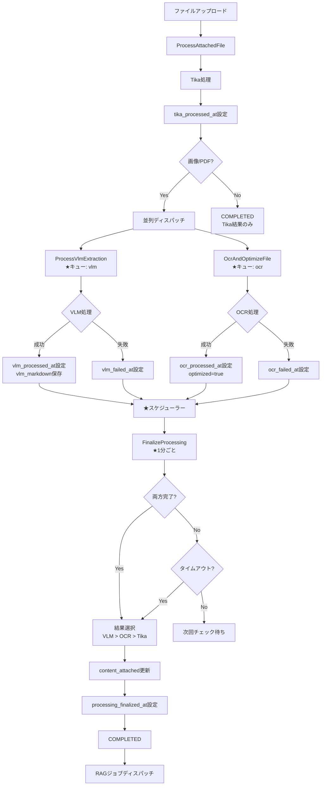

# VLM/OCR並列処理統合アーキテクチャ

**作成日:** 2025年11月8日  
**ステータス:** 🔄 **Phase5 設計完了・実装準備中**  
**ドキュメント種別:** 公式アーキテクチャ文書  

**関連ドキュメント:**
- [並列処理提案書](../work/vlm-rag-integration/2025-11-08_parallel-processing-proposal.md)
- [Phase4実装完了レポート](../work/vlm-rag-integration/2025-11-08_phase4-id3-implementation-report.md)
- [VLM-OCR技術調査](./vlm-ocr-technology-selection.md)

---

## 📋 エグゼクティブサマリー

本文書は、VLM（Visual Language Model）とOCRの**並列処理統合アーキテクチャ**を定義します。

### 🎯 設計方針

**✅ 並列処理**: VLMとOCRを同時実行し、処理時間を最大50%削減  
**✅ スケジュール最終化**: 1分ごとの定期処理でインデックス空白期間を最小化  
**✅ 結果優先順位**: VLM > OCR > Tika の順で最高品質データを自動選択  
**✅ 冗長性**: 片方が失敗しても他方で補完可能

### 🔄 アーキテクチャ概要

```
ファイルアップロード
  ↓
Tika処理（基本メタデータ・テキスト抽出）
  ↓
並列ディスパッチ（画像/PDF対象）
  ├─ VLM処理（構造化・Markdown生成）
  └─ OCR処理（テキストレイヤー追加）
  
★スケジューラー（1分ごと）
  ↓
FinalizeProcessing コマンド
  - VLM/OCR完了ファイルを検索
  - 最適な結果を選択
  - content_attached更新
  - インデックス構築
```

---

## 1. 処理フロー詳細設計

### 1.1. 全体フローチャート



### 1.2. 各フェーズの詳細

#### フェーズ1: 基本処理（Tika）

**目的:** メタデータ抽出と基本テキスト抽出

**実装:** `app/Jobs/Ledger/ProcessAttachedFile.php`

**処理内容:**
1. Tikaでテキスト・メタデータ抽出
2. `tika_processed_at`設定
3. 画像/PDFの場合は並列ディスパッチ
4. その他のファイルは即座に完了

**データフロー:**
```php
// 一時的にcontent_attachedに保存（後で上書きされる可能性）
$ledger->content_attached[$columnId][$filename] = [
    'meta' => [
        'content' => $tikaText,
        'source' => 'tika',
        // ... メタデータ
    ]
];
```

#### フェーズ2a: VLM処理（並列）

**目的:** 高品質Markdown生成、構造化データ抽出

**実装:** `app/Jobs/Ledger/ProcessVlmExtraction.php`

**処理内容:**
1. VLMコンテナAPIに画像/PDF送信
2. Markdown、構造化データを取得
3. `attached_files`に保存
4. `vlm_processed_at`または`vlm_failed_at`設定
5. **最終化トリガーはなし**（スケジューラーが検出）

**データ保存:**
```php
$attachedFile->update([
    'vlm_markdown' => $markdown,           // Markdown形式（高品質）
    'vlm_structured_data' => $structured,  // JSON形式
    'vlm_model' => 'PaddleOCR-VL-0.9B',
    'vlm_confidence' => 0.95,
    'vlm_processed_at' => now(),
]);
```

**キュー設定:**
- キュー名: `vlm`
- 専用ワーカー: 2プロセス
- タイムアウト: 300秒

#### フェーズ2b: OCR処理（並列）

**目的:** テキストレイヤー追加、PDF最適化

**実装:** `app/Jobs/Ledger/OcrAndOptimizeFile.php`

**処理内容:**
1. OcrMyPDFでOCR処理
2. テキストレイヤー付きPDF生成
3. `ocr_processed_at`または`ocr_failed_at`設定
4. **最終化トリガーはなし**（スケジューラーが検出）

**データ保存:**
```php
$attachedFile->update([
    'optimized' => true,
    'path' => $optimizedPdfPath,
    'ocr_processed_at' => now(),
]);
```

**キュー設定:**
- キュー名: `ocr`
- 専用ワーカー: 2プロセス
- タイムアウト: 600秒

#### フェーズ3: 最終化処理（スケジュール）

**目的:** VLM/OCR結果を統合し、最適な結果をインデックス化

**実装:** `app/Console/Commands/Ledger/FinalizeAttachedFileProcessing.php`

**スケジュール設定:**
```php
// app/Console/Kernel.php
$schedule->command('ledger:finalize-processing')
    ->everyMinute()
    ->withoutOverlapping(10)
    ->onOneServer()
    ->runInBackground();
```

**処理内容:**

1. **最終化待ちファイルを検索**:
```sql
SELECT * FROM attached_files
WHERE tika_processed_at IS NOT NULL
  AND processing_finalized_at IS NULL
  AND (
    -- 両方完了（成功/失敗問わず）
    (vlm_processed_at IS NOT NULL OR vlm_failed_at IS NOT NULL)
    AND (ocr_processed_at IS NOT NULL OR ocr_failed_at IS NOT NULL)
  )
  OR created_at <= NOW() - INTERVAL 600 SECOND  -- タイムアウト
LIMIT 50
```

2. **結果選択（優先順位）**:
```php
private function selectBestContent(AttachedFile $file): ?string
{
    // 1. VLM結果（最優先）
    if ($file->vlm_markdown) {
        return $file->vlm_markdown;
    }
    
    // 2. OCR結果
    if ($file->optimized && $file->ocr_processed_at) {
        // optimized PDFからTikaで再抽出
        return $tikaClient->getText($file->path);
    }
    
    // 3. 元のTika結果
    return $ledger->content_attached[$file->column_id][$file->filename]['meta']['content'];
}
```

3. **content_attached更新**:
```php
$ledger->content_attached[$columnId][$filename] = [
    'meta' => [
        'content' => $bestContent,
        'source' => 'vlm|ocr|tika',
        // ... メタデータ
    ]
];
```

4. **最終化マーク**:
```php
$file->update([
    'status' => AttachedFileStatus::COMPLETED,
    'processing_finalized_at' => now(),
    'contain_content' => $bestContent !== null,
]);
```

5. **RAGジョブディスパッチ**:
```php
ProcessLedgerForRagJob::dispatch($file->ledger)->delay(5);
```

---

## 2. データベース設計

### 2.1. 新規カラム

```sql
ALTER TABLE attached_files
  ADD COLUMN tika_processed_at TIMESTAMP NULL COMMENT 'Tika処理完了日時',
  ADD COLUMN vlm_processed_at TIMESTAMP NULL COMMENT 'VLM処理成功日時',
  ADD COLUMN vlm_failed_at TIMESTAMP NULL COMMENT 'VLM処理失敗日時',
  ADD COLUMN ocr_processed_at TIMESTAMP NULL COMMENT 'OCR処理成功日時',
  ADD COLUMN ocr_failed_at TIMESTAMP NULL COMMENT 'OCR処理失敗日時',
  ADD COLUMN processing_finalized_at TIMESTAMP NULL COMMENT '最終化完了日時',
  
  ADD INDEX idx_finalization (
    tika_processed_at,
    processing_finalized_at,
    vlm_processed_at,
    vlm_failed_at,
    ocr_processed_at,
    ocr_failed_at
  );
```

### 2.2. 処理状態の判定

```php
// AttachedFile モデル
public function getProcessingStatusAttribute(): array
{
    return [
        'tika_completed' => $this->tika_processed_at !== null,
        'vlm_completed' => $this->vlm_processed_at !== null,
        'vlm_failed' => $this->vlm_failed_at !== null,
        'ocr_completed' => $this->ocr_processed_at !== null,
        'ocr_failed' => $this->ocr_failed_at !== null,
        'finalized' => $this->processing_finalized_at !== null,
    ];
}

public function isReadyForFinalization(): bool
{
    // 画像/PDF以外はTika完了のみで最終化可能
    if (!$this->isVlmOrOcrTarget()) {
        return $this->tika_processed_at !== null;
    }
    
    // 両方完了（成功/失敗問わず）
    $vlmDone = $this->vlm_processed_at || $this->vlm_failed_at;
    $ocrDone = $this->ocr_processed_at || $this->ocr_failed_at;
    
    return $this->tika_processed_at && $vlmDone && $ocrDone;
}

public function isVlmOrOcrTarget(): bool
{
    return str_starts_with($this->mime, 'image/') 
        || str_starts_with($this->mime, 'application/pdf');
}
```

---

## 3. キュー設定

### 3.1. キュー構成

```
default (4 workers)
  - ProcessAttachedFile
  - ProcessLedgerForRagJob
  - その他一般ジョブ

vlm (2 workers)
  - ProcessVlmExtraction

ocr (2 workers)
  - OcrAndOptimizeFile
```

### 3.2. Supervisor設定

```ini
[program:ledgerleap-queue-default]
command=/usr/bin/php /var/www/html/artisan queue:work --queue=default --tries=3
process_name=%(program_name)s_%(process_num)02d
numprocs=4
autostart=true
autorestart=true

[program:ledgerleap-queue-vlm]
command=/usr/bin/php /var/www/html/artisan queue:work --queue=vlm --tries=2 --timeout=300
process_name=%(program_name)s_%(process_num)02d
numprocs=2
autostart=true
autorestart=true

[program:ledgerleap-queue-ocr]
command=/usr/bin/php /var/www/html/artisan queue:work --queue=ocr --tries=2 --timeout=600
process_name=%(program_name)s_%(process_num)02d
numprocs=2
autostart=true
autorestart=true
```

---

## 4. RAG統合

### 4.1. Chunking処理

**タイミング:** FinalizeProcessing完了後、ProcessLedgerForRagJobがディスパッチ

**処理内容:**
1. `attached_files`のVLM結果を取得
2. VLM Markdown優先でChunk生成
3. `ledger_chunks`テーブルに保存

**実装:**
```php
// ChunkingService::createChunksFromLedger()
foreach ($ledger->attachedFiles as $file) {
    // VLM結果優先
    $content = $file->vlm_markdown 
             ?? $ledger->content_attached[$file->column_id][$file->filename]['meta']['content']
             ?? '';
    
    $chunks = $this->splitIntoChunks($content);
    
    foreach ($chunks as $index => $text) {
        LedgerChunk::create([
            'ledger_id' => $ledger->id,
            'attached_file_id' => $file->id,
            'chunk_index' => $index,
            'chunk_text' => $text,
            'source_type' => $file->vlm_markdown ? 'vlm' : 'tika',
        ]);
    }
}
```

### 4.2. Embedding生成

**タイミング:** Chunk作成後、GenerateEmbeddingJobがディスパッチ

**処理内容:**
1. Embeddingコンテナに送信
2. ベクトルを取得
3. `ledger_chunks.embedding`に保存

---

## 5. UI/UX設計

### 5.1. ステータス表示

**処理中の表示例:**
```
📄 file.png
  ├─ Tika処理: ✅ 完了
  ├─ VLM処理: 🔄 処理中
  └─ OCR処理: 🔄 処理中
```

**完了後の表示例:**
```
📄 file.png ✅ 完了
  ├─ 使用結果: VLM (高品質)
  ├─ VLM信頼度: 95.3%
  └─ 最終化: 1分前
```

### 5.2. プレビュー機能

- VLM結果プレビューボタン（Phase4実装済み）
- Markdown表示モーダル
- ダウンロード機能（Markdown/JSON）

---

## 6. 運用・監視

### 6.1. ログ確認

```bash
# 最終化処理のログ
tail -f storage/logs/laravel.log | grep "\[Finalize\]"

# VLM処理のログ
tail -f storage/logs/queue.log | grep "\[VLM\]"

# OCR処理のログ
tail -f storage/logs/queue.log | grep "\[OCR\]"
```

### 6.2. 手動最終化

```bash
# 通常実行
php artisan ledger:finalize-processing

# タイムアウト短縮（300秒）
php artisan ledger:finalize-processing --timeout=300

# 処理件数増加（100件）
php artisan ledger:finalize-processing --limit=100
```

### 6.3. 監視ポイント

- 最終化待ちファイル数
- VLM/OCR処理時間
- 失敗率
- キュー滞留数

---

## 7. メリットとトレードオフ

### 7.1. メリット

✅ **処理時間50%削減**: 並列実行により待ち時間を大幅短縮  
✅ **インデックス空白最大1分**: スケジュール方式で確実に更新  
✅ **結果の冗長性**: VLM/OCR片方失敗しても補完可能  
✅ **最高品質データ**: VLM優先で自動選択  
✅ **タイムアウト処理**: スケジューラーで確実に処理  
✅ **システム安定性**: キュー詰まりに影響されない  

### 7.2. トレードオフ

⚠️ **複雑性増加**: 処理フローが増加（スケジューラーで吸収）  
⚠️ **リソース消費**: 並列実行により同時リソース使用（専用キューで制限）  
⚠️ **デバッグ難易度**: 非同期処理の追跡（詳細ログで対応）  

---

## 8. 移行計画

Phase5として実装します。詳細は別途WBSドキュメントを参照してください。

---

**作成者:** GitHub Copilot CLI  
**最終更新:** 2025年11月8日  
**バージョン:** 3.0（並列処理アーキテクチャ版）
