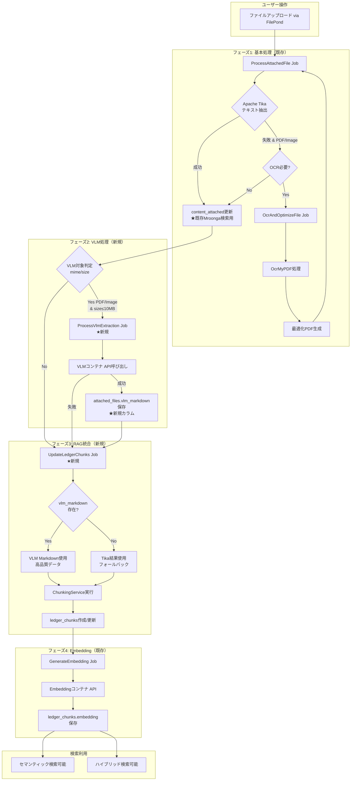

# VLM/RAG統合実装計画書（最終版）

**作成日:** 2025年10月25日  
**ステータス:** ✅ **実装準備完了**  
**ドキュメント種別:** 公式ドキュメント（実装計画書）  
**基準文書:**
- [VLM-OCR技術調査](./vlm-ocr-technology-selection.md)
- [Phase 0: VLM動作検証PoC計画書](../work/vlm-implementation/2025-10-25_phase0-vlm-poc-plan.md)
- [Phase 0: VLM動作検証PoC 実施記録](../work/vlm-implementation/2025-10-25_phase0-vlm-poc-execution-log.md)
- [VLM保存戦略提案](../work/vlm-implementation/2025-10-25_vlm-storage-strategy-proposal.md)
- [技術評価レポート](../work/vlm-implementation/2025-10-25_indexing-strategy-review-evaluation.md)

---

## 📋 エグゼクティブサマリー

本文書は、VLM（Visual Language Model）とRAG（Retrieval-Augmented Generation）の統合実装計画を、**処理フローの詳細を含めて**包括的に記述します。

### 🎯 設計方針の決定

**✅ 採用:** `attached_files`テーブルにVLM結果を保存し、`ledger_chunks`作成時に活用  
**❌ 不採用:** `content_attached` JSONへの保存（肥大化リスク）

### 🔄 処理フローの全体像

```
ファイルアップロード
  ↓
[フェーズ1] Apache Tika処理 → content_attached保存（従来通り）
  ↓
[フェーズ2] VLM処理 → attached_files.vlm_markdown保存（★新規）
  ↓
[フェーズ3] Chunking処理 → ledger_chunks作成（vlm_markdown優先）
  ↓
[フェーズ4] Embedding生成 → ledger_chunks.embedding保存
  ↓
セマンティック検索可能
```

---

## 1. 処理フロー詳細設計

### 1.1. 全体フローチャート（統合版）



### 1.2. 各フェーズの詳細仕様

#### フェーズ1: 基本処理（既存 - 変更なし）

**目的:** Apache Tika/OCRによるテキスト抽出と`content_attached`への保存

**処理内容:**
1. `ProcessAttachedFile` ジョブ起動
2. Apache Tikaでテキスト抽出
3. `ledgers.content_attached` JSON更新（Mroonga全文検索用）
4. 必要に応じて `OcrAndOptimizeFile` ジョブをディスパッチ

**保存先:**
```php
// ledgers.content_attached
[
  column_id => [
    "hashed_filename.pdf" => [
      "meta" => [
        "content" => "Tika/OCR抽出テキスト",
        "Content-Type" => "application/pdf"
      ]
    ]
  ]
]
```

**ステータス遷移:**
```
PENDING_INITIAL_PROCESSING 
  → INITIAL_PROCESSING 
  → (PENDING_OCR → OCR_PROCESSING → 再度INITIAL_PROCESSING)
  → COMPLETED
```

---

#### フェーズ2: VLM処理（新規実装）

**目的:** VLMによるMarkdown/構造化データ抽出と`attached_files`への保存

**トリガー条件:**
```php
// ProcessAttachedFile.php の末尾に追加
if ($this->shouldProcessWithVlm($this->attachedFile)) {
    ProcessVlmExtraction::dispatch($this->attachedFile)
        ->onQueue('vlm-processing')
        ->delay(now()->addSeconds(10));
}

protected function shouldProcessWithVlm(AttachedFile $file): bool
{
    return (
        str_starts_with($file->mime, 'image/') ||
        $file->mime === 'application/pdf'
    ) 
    && $file->size <= config('vlm.max_file_size', 10 * 1024 * 1024) // 10MB
    && config('vlm.enabled', false);
}
```

**処理内容:**

1. **VLMコンテナへのAPI呼び出し**
```php
// ProcessVlmExtraction.php
$vlmOutput = $vlmClient->extract(
    $this->attachedFile->getPhysicalPath(),
    $this->vlmModel, // 'PaddleOCR-VL-0.9B'
    timeout: 300
);
```

2. **`attached_files`テーブルへの保存**
```php
$this->attachedFile->update([
    'vlm_markdown' => $vlmOutput['markdown'] ?? null,
    'vlm_structured_data' => [
        'entities' => $vlmOutput['entities'] ?? [],
        'tables' => $vlmOutput['tables'] ?? [],
    ],
    'vlm_model' => $this->vlmModel,
    'vlm_confidence' => $vlmOutput['confidence'] ?? null,
    'vlm_processing_time_ms' => $processingTimeMs,
    'vlm_processed_at' => now(),
    'status' => AttachedFileStatus::COMPLETED,
]);
```

**保存先:**
```sql
-- attached_files テーブル
id | filename | vlm_markdown | vlm_structured_data | vlm_model | vlm_confidence
123 | invoice.pdf | "# 請求書\n\n..." | {"entities":[...]} | PaddleOCR-VL-0.9B | 0.95
```

**ステータス遷移:**
```
COMPLETED (Tika処理完了)
  → VLM_PROCESSING
  → COMPLETED (VLM処理成功)
  or VLM_FAILED (VLM処理失敗でも台帳検索は可能)
```

**エラーハンドリング:**
- VLM処理失敗時も `content_attached` のTika結果は維持
- ステータスを `VLM_FAILED` に設定
- 管理画面から再処理可能

---

#### フェーズ3: RAG統合（新規実装）

**目的:** VLM結果を優先して`ledger_chunks`を作成

**トリガー条件（2パターン）:**

1. **自動トリガー（推奨）:**
```php
// ProcessVlmExtraction.php の成功時
if (config('rag.auto_update_chunks', true)) {
    UpdateLedgerChunks::dispatch($this->attachedFile->ledger);
}
```

2. **手動トリガー（運用開始初期）:**
```bash
# Artisanコマンド
./vendor/bin/sail artisan rag:update-chunks --ledger-id=123
./vendor/bin/sail artisan rag:update-chunks --all  # 全台帳
```

**処理内容:**

```php
// ChunkingService::createChunksFromLedger()

public function createChunksFromLedger(Ledger $ledger): void
{
    DB::transaction(function () use ($ledger) {
        // 1. 既存チャンクを削除
        LedgerChunk::where('ledger_id', $ledger->id)->delete();
        
        $chunkIndex = 0;
        $allTexts = [];
        
        // 2. 台帳本体のテキスト
        $allTexts[] = $this->extractTextFromContent($ledger->content);
        
        // 3. ★ 添付ファイルのVLM結果を優先使用
        foreach ($ledger->attachedFiles as $file) {
            if (!empty($file->vlm_markdown)) {
                // VLM Markdownを使用（構造化された高品質データ）
                $allTexts[] = "## 添付ファイル: {$file->original_filename}\n\n{$file->vlm_markdown}";
                
                Log::info("[Chunking] Using VLM markdown", [
                    'ledger_id' => $ledger->id,
                    'file_id' => $file->id,
                    'model' => $file->vlm_model,
                    'confidence' => $file->vlm_confidence,
                ]);
            } else {
                // フォールバック: Tika/OCR結果を使用
                $tikaText = $this->extractTikaTextFromFile($file, $ledger);
                if ($tikaText) {
                    $allTexts[] = "## 添付ファイル: {$file->original_filename}\n\n{$tikaText}";
                }
            }
        }
        
        // 4. テキストをチャンク分割（500トークン単位）
        $chunks = $this->splitIntoChunks(
            implode("\n\n---\n\n", $allTexts),
            maxTokens: 500,
            overlap: 100
        );
        
        // 5. チャンクをDBに保存
        foreach ($chunks as $chunkText) {
            LedgerChunk::create([
                'ledger_id' => $ledger->id,
                'ledger_define_id' => $ledger->ledger_define_id,
                'folder_id' => $ledger->define->folder_id,
                'chunk_index' => $chunkIndex++,
                'chunk_text' => $chunkText,
                // embedding は次のフェーズで生成
            ]);
        }
        
        Log::info("[Chunking] Chunks created", [
            'ledger_id' => $ledger->id,
            'chunk_count' => $chunkIndex,
            'vlm_used' => $ledger->attachedFiles->filter(fn($f) => !empty($f->vlm_markdown))->count(),
            'tika_fallback' => $ledger->attachedFiles->filter(fn($f) => empty($f->vlm_markdown))->count(),
        ]);
    });
}
```

**データフロー図:**

```
[Ledger本体]
  ├─ content (JSON) → 平文テキスト化 ────┐
  │                                        │
[AttachedFile 1]                           │
  ├─ vlm_markdown (あり) ────────────────┤
  │                                        │
[AttachedFile 2]                           │
  ├─ vlm_markdown (なし)                   │
  └─ content_attached[...]['content'] ───┤
                                           │
[AttachedFile 3]                           ▼
  └─ vlm_markdown (あり) ─────────► 結合テキスト
                                           │
                                           ▼
                                    チャンク分割
                                           │
                                           ▼
                              ┌─────────────────────┐
                              │ ledger_chunks       │
                              │ ├─ chunk_index: 0   │
                              │ ├─ chunk_text: "..." │
                              │ └─ embedding: null   │
                              │                      │
                              │ ├─ chunk_index: 1   │
                              │ └─ ...              │
                              └─────────────────────┘
```

**保存先:**
```sql
-- ledger_chunks テーブル
id | ledger_id | chunk_index | chunk_text | embedding
1  | 100       | 0           | "台帳本体..." | NULL (次フェーズ)
2  | 100       | 1           | "## 添付..." | NULL
3  | 100       | 2           | "| 品名 |..." | NULL
```

---

#### フェーズ4: Embedding生成（既存 - 拡張）

**目的:** `ledger_chunks`のテキストをベクトル化

**トリガー:**
```php
// UpdateLedgerChunks 完了後
GenerateEmbedding::dispatch($ledger);
```

**処理内容（既存実装を活用）:**
```php
// GenerateEmbedding.php
$chunks = LedgerChunk::where('ledger_id', $this->ledger->id)
    ->whereNull('embedding')
    ->get();

foreach ($chunks as $chunk) {
    $embedding = $this->embeddingService->encode($chunk->chunk_text);
    $chunk->update(['embedding' => $embedding]);
}
```

**最終結果:**
```sql
-- ledger_chunks テーブル
id | ledger_id | chunk_index | chunk_text | embedding
1  | 100       | 0           | "台帳本体..." | [0.123, -0.456, ...]
2  | 100       | 1           | "## 添付..." | [0.789, 0.234, ...]
```

---

### 1.3. 処理フローの実行タイミング

#### パターンA: 新規ファイルアップロード時

```
時刻 0:00 - ファイルアップロード
  │
  ├─ 0:01 - ProcessAttachedFile 開始
  │   └─ Tika処理 (5秒)
  │       └─ content_attached 更新
  │
  ├─ 0:06 - ProcessVlmExtraction ディスパッチ（10秒遅延）
  │   └─ キューに追加（vlm-processing）
  │
  ├─ 0:16 - VLM処理開始（低優先度キュー）
  │   └─ VLM API呼び出し (12秒)
  │       └─ vlm_markdown 保存
  │
  ├─ 0:28 - UpdateLedgerChunks ディスパッチ
  │   └─ チャンク作成 (3秒)
  │       └─ ledger_chunks 保存
  │
  └─ 0:31 - GenerateEmbedding ディスパッチ
      └─ Embedding生成 (5秒/chunk)
          └─ 完了 (0:46)
```

**合計処理時間:** 約46秒（非同期・並列処理）  
**ユーザー体験:** アップロード後すぐに画面に戻れる（Tika完了後）

#### パターンB: 既存台帳の再処理

```bash
# VLM未処理のファイルを一括処理
./vendor/bin/sail artisan vlm:batch-process --status=completed --limit=100

# 処理フロー:
# 1. 対象ファイル抽出（vlm_markdown IS NULL）
# 2. ProcessVlmExtraction を順次ディスパッチ
# 3. 完了後、UpdateLedgerChunks を台帳単位で実行
# 4. GenerateEmbedding で一括ベクトル化
```

**推奨実行時間:** 深夜バッチ（ユーザー負荷なし）

---

## 2. データスキーマ詳細設計

### 2.1. attached_files テーブル拡張

```sql
-- 既存カラム
id BIGINT PRIMARY KEY
ledger_id BIGINT INDEX
ledger_define_id BIGINT INDEX
column_id INT INDEX
filename VARCHAR(500) INDEX
hashedbasename VARCHAR(500) INDEX
status VARCHAR(50) INDEX
contain_content BOOLEAN INDEX
optimized BOOLEAN INDEX
mime VARCHAR(500) INDEX
path TEXT
original_file_path VARCHAR
original_mime_type VARCHAR
size BIGINT
creator_id INT
modifier_id INT
created_at TIMESTAMP
updated_at TIMESTAMP
deleted_at TIMESTAMP

-- ★ 新規追加カラム
vlm_markdown LONGTEXT NULLABLE
  COMMENT 'VLM抽出Markdown結果（RAG用）'
  
vlm_structured_data JSON NULLABLE
  COMMENT 'VLM構造化データ（エンティティ、テーブル等）'
  
vlm_model VARCHAR(100) NULLABLE
  COMMENT '使用VLMモデル名'
  INDEX idx_vlm_model
  
vlm_confidence DECIMAL(4,3) NULLABLE
  COMMENT 'VLM処理信頼度（0.000-1.000）'
  
vlm_processing_time_ms INT UNSIGNED NULLABLE
  COMMENT 'VLM処理時間（ミリ秒）'
  
vlm_processed_at TIMESTAMP NULLABLE
  COMMENT 'VLM処理完了日時'
  INDEX idx_vlm_processed_at

-- ★ 複合インデックス
INDEX idx_status_vlm_processed (status, vlm_processed_at)
```

**サイズ見積もり:**
- `vlm_markdown`: 平均 5KB/ファイル（A4 1ページの場合）
- `vlm_structured_data`: 平均 2KB/ファイル
- **合計:** 約 7KB/ファイル

**1000ファイルの場合:** 約 7MB（許容範囲）

### 2.2. ledger_chunks テーブル（既存 - 変更なし）

```sql
id BIGINT PRIMARY KEY
ledger_id BIGINT INDEX
ledger_define_id BIGINT INDEX
folder_id BIGINT INDEX
chunk_index INT
chunk_text TEXT
  FULLTEXT INDEX
embedding LONGTEXT
  COMMENT 'flags "COLUMN_VECTOR", type "Float"'
created_at TIMESTAMP
updated_at TIMESTAMP

INDEX idx_ledger_chunk (ledger_id, chunk_index)
```

**チャンク数見積もり:**
- 台帳本体: 200文字 = 1チャンク
- 添付ファイル（VLM Markdown）: 5KB = 約3チャンク
- **1台帳あたり:** 平均 5-10チャンク

---

## 3. ジョブ実装詳細

### 3.1. ProcessVlmExtraction（新規）

```php
<?php

namespace App\Jobs\Ledger;

use App\Enums\AttachedFileStatus;
use App\Models\AttachedFile;
use App\Services\VlmClientService;
use Illuminate\Bus\Queueable;
use Illuminate\Contracts\Queue\ShouldQueue;
use Illuminate\Foundation\Bus\Dispatchable;
use Illuminate\Queue\InteractsWithQueue;
use Illuminate\Queue\SerializesModels;
use Illuminate\Support\Facades\Log;

class ProcessVlmExtraction implements ShouldQueue
{
    use Dispatchable, InteractsWithQueue, Queueable, SerializesModels;

    public $timeout = 600; // 10分
    public $tries = 2;
    public $backoff = 300; // 5分後にリトライ

    protected AttachedFile $attachedFile;
    protected string $vlmModel;

    public function __construct(AttachedFile $attachedFile, string $vlmModel = 'PaddleOCR-VL')
    {
        $this->attachedFile = $attachedFile;
        $this->vlmModel = $vlmModel;
        $this->onQueue('vlm-processing'); // 低優先度キュー
    }

    public function handle(VlmClientService $vlmClient): void
    {
        tenancy()->initialize($this->attachedFile->tenant_id);
        
        Log::info("[VLM] Starting extraction", [
            'file_id' => $this->attachedFile->id,
            'filename' => $this->attachedFile->filename,
            'model' => $this->vlmModel,
            'attempt' => $this->attempts(),
        ]);

        // ステータス更新
        $this->attachedFile->update(['status' => AttachedFileStatus::VLM_PROCESSING]);

        try {
            $startTime = microtime(true);
            
            // VLM APIコール
            $vlmOutput = $vlmClient->extract(
                $this->attachedFile->getPhysicalPath(),
                $this->vlmModel,
                timeout: 300
            );
            
            $processingTimeMs = (int)((microtime(true) - $startTime) * 1000);

            // バリデーション
            if (empty($vlmOutput['markdown'])) {
                throw new \RuntimeException('VLM returned empty markdown');
            }

            // データベース保存
            $this->attachedFile->update([
                'vlm_markdown' => $vlmOutput['markdown'],
                'vlm_structured_data' => [
                    'entities' => $vlmOutput['entities'] ?? [],
                    'tables' => $vlmOutput['tables'] ?? [],
                ],
                'vlm_model' => $this->vlmModel,
                'vlm_confidence' => $vlmOutput['confidence'] ?? null,
                'vlm_processing_time_ms' => $processingTimeMs,
                'vlm_processed_at' => now(),
                'status' => AttachedFileStatus::COMPLETED,
            ]);

            Log::info("[VLM] Extraction successful", [
                'file_id' => $this->attachedFile->id,
                'processing_time_ms' => $processingTimeMs,
                'confidence' => $vlmOutput['confidence'] ?? null,
                'markdown_length' => strlen($vlmOutput['markdown']),
            ]);
            
            // RAG更新トリガー（オプション）
            if (config('rag.auto_update_chunks', true)) {
                \App\Jobs\Rag\UpdateLedgerChunks::dispatch($this->attachedFile->ledger)
                    ->delay(now()->addSeconds(5));
            }

        } catch (\Exception $e) {
            Log::error("[VLM] Extraction failed", [
                'file_id' => $this->attachedFile->id,
                'error' => $e->getMessage(),
                'trace' => $e->getTraceAsString(),
                'attempt' => $this->attempts(),
            ]);

            // 最終試行失敗時のみステータス更新
            if ($this->attempts() >= $this->tries) {
                $this->attachedFile->update([
                    'status' => AttachedFileStatus::VLM_FAILED
                ]);
            }
            
            throw $e; // リトライ処理のため再スロー
        }
    }
    
    public function failed(\Throwable $exception): void
    {
        Log::error("[VLM] Job failed permanently", [
            'file_id' => $this->attachedFile->id,
            'error' => $exception->getMessage(),
        ]);
        
        $this->attachedFile->update([
            'status' => AttachedFileStatus::VLM_FAILED
        ]);
    }
}
```

### 3.2. UpdateLedgerChunks（新規）

```php
<?php

namespace App\Jobs\Rag;

use App\Models\Ledger;
use App\Services\Rag\ChunkingService;
use Illuminate\Bus\Queueable;
use Illuminate\Contracts\Queue\ShouldQueue;
use Illuminate\Foundation\Bus\Dispatchable;
use Illuminate\Queue\InteractsWithQueue;
use Illuminate\Queue\SerializesModels;
use Illuminate\Support\Facades\Log;

class UpdateLedgerChunks implements ShouldQueue
{
    use Dispatchable, InteractsWithQueue, Queueable, SerializesModels;

    public $timeout = 300; // 5分
    public $tries = 2;

    protected Ledger $ledger;

    public function __construct(Ledger $ledger)
    {
        $this->ledger = $ledger;
        $this->onQueue('rag-processing');
    }

    public function handle(ChunkingService $chunkingService): void
    {
        tenancy()->initialize($this->ledger->tenant_id);
        
        Log::info("[RAG] Updating chunks", [
            'ledger_id' => $this->ledger->id,
            'attached_files_count' => $this->ledger->attachedFiles->count(),
        ]);

        try {
            $chunkingService->createChunksFromLedger($this->ledger);
            
            // Embedding生成トリガー
            GenerateEmbedding::dispatch($this->ledger)
                ->delay(now()->addSeconds(5));
                
        } catch (\Exception $e) {
            Log::error("[RAG] Chunk update failed", [
                'ledger_id' => $this->ledger->id,
                'error' => $e->getMessage(),
            ]);
            
            throw $e;
        }
    }
}
```

---

## 4. 設定ファイル

### 4.1. config/vlm.php（新規作成）

```php
<?php

return [
    // VLM機能の有効化
    'enabled' => env('VLM_ENABLED', false),
    
    // VLMコンテナURL
    'url' => env('VLM_URL', 'http://vlm:8000'),
    
    // 処理対象の最大ファイルサイズ（バイト）
    'max_file_size' => env('VLM_MAX_FILE_SIZE', 10 * 1024 * 1024), // 10MB
    
    // デフォルトモデル
    'default_model' => env('VLM_DEFAULT_MODEL', 'PaddleOCR-VL-0.9B'),
    
    // タイムアウト設定（秒）
    'timeout' => env('VLM_TIMEOUT', 300),
    
    // リトライ設定
    'retry' => [
        'times' => env('VLM_RETRY_TIMES', 2),
        'backoff' => env('VLM_RETRY_BACKOFF', 300), // 5分
    ],
];
```

### 4.2. config/rag.php 拡張

```php
<?php

return [
    // 既存設定
    'embedding_model' => env('RAG_EMBEDDING_MODEL', 'sentence-transformers/all-MiniLM-L6-v2'),
    'chunk_size' => env('RAG_CHUNK_SIZE', 500),
    'chunk_overlap' => env('RAG_CHUNK_OVERLAP', 100),
    
    // ★ 新規追加
    'auto_update_chunks' => env('RAG_AUTO_UPDATE_CHUNKS', true),
    
    // VLM結果の優先使用
    'prefer_vlm_markdown' => env('RAG_PREFER_VLM_MARKDOWN', true),
];
```

### 4.3. .env 設定例

```bash
# VLM設定
VLM_ENABLED=true
VLM_URL=http://vlm:8000
VLM_MAX_FILE_SIZE=10485760
VLM_DEFAULT_MODEL=PaddleOCR-VL-0.9B
VLM_TIMEOUT=300

# RAG設定
RAG_AUTO_UPDATE_CHUNKS=true
RAG_PREFER_VLM_MARKDOWN=true
```

---

## 5. エラーハンドリングとリトライ戦略

### 5.1. エラーパターンと対処

| エラー | 原因 | 対処 | リトライ |
|--------|------|------|---------|
| VLMコンテナ未起動 | Docker停止 | 自動リトライ | ✅ 5分後 |
| VLM処理タイムアウト | ファイル大容量 | ステータス: VLM_FAILED | ✅ 1回のみ |
| VLM空結果 | モデル非対応形式 | Tikaにフォールバック | ❌ なし |
| Chunking失敗 | DB接続エラー | 自動リトライ | ✅ 2回 |
| Embedding失敗 | APIエラー | 自動リトライ | ✅ 3回 |

### 5.2. リトライ設定

```php
// ProcessVlmExtraction
public $tries = 2;
public $backoff = 300; // 5分

// UpdateLedgerChunks
public $tries = 2;
public $backoff = 60; // 1分

// GenerateEmbedding
public $tries = 3;
public $backoff = 120; // 2分
```

---

## 6. モニタリングとログ

### 6.1. 重要なログポイント

```php
// VLM処理開始
Log::info("[VLM] Starting extraction", [
    'file_id' => $attachedFile->id,
    'model' => $vlmModel,
    'attempt' => $attempts,
]);

// VLM処理成功
Log::info("[VLM] Extraction successful", [
    'file_id' => $attachedFile->id,
    'processing_time_ms' => $processingTimeMs,
    'confidence' => $confidence,
    'markdown_length' => strlen($markdown),
]);

// Chunking時のVLM使用状況
Log::info("[Chunking] Chunks created", [
    'ledger_id' => $ledger->id,
    'chunk_count' => $chunkCount,
    'vlm_used' => $vlmUsedCount,
    'tika_fallback' => $tikaFallbackCount,
]);
```

### 6.2. 監視メトリクス

```php
// config/monitoring.php
return [
    'vlm' => [
        'processing_time_threshold' => 60000, // 60秒
        'failure_rate_threshold' => 0.05, // 5%
        'confidence_threshold' => 0.8, // 80%
    ],
    
    'rag' => [
        'chunks_per_ledger_threshold' => 50,
        'embedding_time_threshold' => 10000, // 10秒
    ],
];
```

---

## 7. 実装チェックリスト

### 7.1. Phase 1: 基盤整備（Week 1-2）

#### データベース
- [ ] `attached_files` テーブルへのVLMカラム追加マイグレーション作成
- [ ] マイグレーション実行・確認
- [ ] インデックス性能テスト

#### モデル
- [ ] `AttachedFile` モデルへのアクセサ追加
  - [ ] `hasVlmResult()`
  - [ ] `isVlmProcessing()`
  - [ ] `isVlmFailed()`
  - [ ] `getVlmConfidenceAttribute()`

#### Enum
- [ ] `AttachedFileStatus` へのVLM関連ステータス追加
  - [ ] `VLM_PROCESSING`
  - [ ] `VLM_FAILED`

#### 設定
- [ ] `config/vlm.php` 作成
- [ ] `config/rag.php` 拡張
- [ ] `.env.example` 更新

### 7.2. Phase 2: VLM処理実装（Week 2-3）

#### サービス
- [ ] `VlmClientService` 実装
  - [ ] `extract()` メソッド
  - [ ] HTTPクライアント設定
  - [ ] エラーハンドリング

#### ジョブ
- [ ] `ProcessVlmExtraction` ジョブ実装
  - [ ] VLM API呼び出し
  - [ ] データベース保存
  - [ ] ログ出力
  - [ ] エラーハンドリング

#### 統合
- [ ] `ProcessAttachedFile` への分岐ロジック追加
- [ ] `shouldProcessWithVlm()` メソッド実装

#### テスト
- [ ] ユニットテスト: `VlmClientServiceTest`
- [ ] ジョブテスト: `ProcessVlmExtractionTest`
- [ ] 統合テスト: `VlmIntegrationTest`

### 7.3. Phase 3: RAG統合（Week 3-4）

#### サービス
- [ ] `ChunkingService` 更新
  - [ ] VLM Markdown優先使用ロジック
  - [ ] Tikaフォールバック
  - [ ] チャンク分割アルゴリズム

#### ジョブ
- [ ] `UpdateLedgerChunks` ジョブ実装
  - [ ] トランザクション管理
  - [ ] 既存チャンク削除
  - [ ] 新規チャンク作成

#### 統合
- [ ] `ProcessVlmExtraction` からの自動トリガー
- [ ] Artisanコマンド: `rag:update-chunks`

#### テスト
- [ ] チャンキングテスト: `ChunkingServiceTest`
- [ ] 統合テスト: `RagIntegrationTest`

### 7.4. Phase 4: UI機能（Week 4-6）

- [ ] ダウンロード機能実装
- [ ] プレビュー機能実装
- [ ] Bladeコンポーネント拡張
- [ ] フロントエンドテスト

---

## 8. デプロイメント計画

### 8.1. ステージング環境（Week 5）

```bash
# 1. マイグレーション実行
./vendor/bin/sail artisan migrate

# 2. VLMコンテナ起動確認
docker-compose ps vlm

# 3. 設定確認
./vendor/bin/sail artisan config:cache

# 4. キューワーカー起動
./vendor/bin/sail artisan queue:work --queue=vlm-processing,rag-processing

# 5. テストファイルでPoC
./vendor/bin/sail artisan vlm:test --file=sample.pdf
```

### 8.2. 本番環境（Week 6）

#### 前提条件
- [ ] ステージング環境で1週間の安定稼働
- [ ] VLM処理成功率 > 95%
- [ ] パフォーマンステスト完了

#### デプロイ手順
```bash
# 1. メンテナンスモード開始
./vendor/bin/sail artisan down

# 2. コードデプロイ
git pull origin main

# 3. 依存関係更新
./vendor/bin/sail composer install --no-dev

# 4. マイグレーション
./vendor/bin/sail artisan migrate --force

# 5. キャッシュクリア
./vendor/bin/sail artisan config:cache
./vendor/bin/sail artisan route:cache

# 6. メンテナンスモード終了
./vendor/bin/sail artisan up

# 7. キューワーカー再起動
supervisorctl restart laravel-worker:*
```

---

## 9. パフォーマンス見積もり

### 9.1. 処理時間

| 処理 | 時間 | 備考 |
|------|------|------|
| Apache Tika | 5秒 | 既存 |
| VLM処理 | 10-15秒 | PaddleOCR-VL, A4 1ページ |
| Chunking | 2-3秒 | 1台帳あたり |
| Embedding | 1秒/chunk | 既存 |
| **合計（非同期）** | **約30秒** | ユーザー待機なし |

### 9.2. スループット（1時間あたり）

| 処理 | スループット | 設定 |
|------|-------------|------|
| VLM処理 | 240ファイル/時 | ワーカー1台 |
| Chunking | 1200台帳/時 | ワーカー1台 |
| Embedding | 3600チャンク/時 | ワーカー1台 |

### 9.3. リソース要件

```yaml
# docker-compose.yml
vlm:
  cpus: 4
  memory: 8G
  
embedding:
  cpus: 2
  memory: 4G
```

---

## 10. 運用マニュアル

### 10.1. 日常監視項目

```bash
# VLM処理状況確認
./vendor/bin/sail artisan vlm:status

# 出力例:
# Total files: 1000
# VLM processed: 850 (85%)
# VLM processing: 50 (5%)
# VLM failed: 100 (10%)
# Average confidence: 0.92
# Average processing time: 12.5s
```

### 10.2. トラブルシューティング

#### VLM処理が進まない
```bash
# 1. キューの確認
./vendor/bin/sail artisan queue:monitor vlm-processing

# 2. ワーカーの再起動
supervisorctl restart laravel-worker:*

# 3. VLMコンテナの確認
docker-compose logs vlm --tail=100
```

#### VLM失敗率が高い
```bash
# 1. 失敗ファイルの確認
./vendor/bin/sail artisan vlm:failed-files

# 2. ログ確認
./vendor/bin/sail artisan log:show --filter="[VLM]"

# 3. 再処理
./vendor/bin/sail artisan vlm:retry-failed --limit=100
```

---

## 11. 今後の拡張計画

### 11.1. フェーズ5: マルチモデル対応（Month 4-6）

```php
// 複数VLMモデルの並行処理
ProcessVlmExtraction::dispatch($file, 'PaddleOCR-VL-0.9B');
ProcessVlmExtraction::dispatch($file, 'Donut');

// 結果の比較・選択
$bestResult = $this->selectBestVlmResult($file);
```

### 11.2. フェーズ6: リアルタイム更新（Month 6-9）

```php
// WebSocket経由でVLM処理状況をリアルタイム配信
broadcast(new VlmProcessingCompleted($file));
```

### 11.3. フェーズ7: 機械学習改善（Month 9-12）

```php
// ユーザーフィードバックに基づくモデル最適化
$this->vlmService->improveModel($feedbackData);
```

---

## ✅ 結論

本計画書は、VLM/RAG統合の**完全な処理フロー**を含む実装計画を提供します。

**主要な設計決定:**
1. ✅ `attached_files`テーブルにVLM結果を保存
2. ✅ `ledger_chunks`作成時にVLM Markdownを優先使用
3. ✅ 段階的な実装（フェーズ1-4）でリスク管理

**処理フローの安全性:**
1. ✅ 既存のTika/OCR処理は維持（後方互換性）
2. ✅ VLM失敗時のフォールバック機構
3. ✅ 非同期処理でユーザー体験を損なわない

**次のステップ:**
- Week 1: データベースマイグレーション
- Week 2-3: VLM処理実装
- Week 3-4: RAG統合
- Week 4-6: UI機能追加

---

**作成者:** GitHub Copilot CLI (Serena)  
**最終更新:** 2025-10-25  
**バージョン:** 1.0（最終版）
