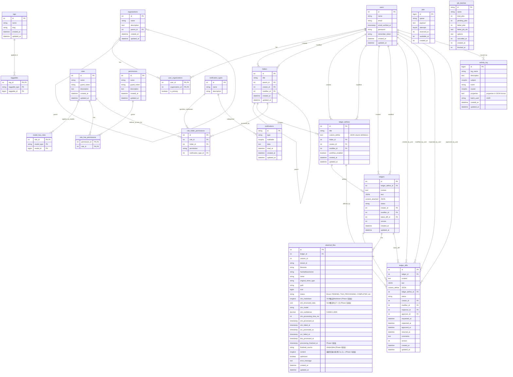

# LedgerLeap データベーススキーマ概要

**最終更新:** 2026年1月3日  
**Phase 1-5実装完了:** 添付ファイル機能統合（2025年12月-2026年1月）

## 1. 概要

LedgerLeapが使用する主要なデータベーステーブルの構造とテーブル間の関連についての概要を記述します。

**記載範囲:**
- 主要テーブルの構造とリレーション
- 全文検索（Mroonga）の仕様と制約
- テスト実装時の注意点

**記載しない内容:**
- モデルクラスの詳細 → `docs/models/`
- マイグレーションの実装 → `database/migrations/`
- 機能説明 → `docs/function/`

## 2. 主要テーブルER図 (Mermaid.js)



## 3. 全文検索 (Mroonga) に関する仕様と注意点

`ledgers` テーブルの `content` および `content_attached` カラムは、Mroongaを利用した全文検索のために特別な設定がされています。開発およびテストを行う際には、以下の点に注意してください。

### 3.1. スキーマとデータ構造

-   **カラム定義:** `content` と `content_attached` は `longtext` 型ですが、Mroongaの `flags "COLUMN_VECTOR"` コメントによって、**ベクターカラム**として扱われます。これにより、JSON配列の各要素がインデックス化の対象となります。
-   **データ形式:** これらのカラムには、Laravelのカスタムキャスト (`AsColumnArrayJson`) を通じてPHPの配列がJSON配列として保存されます。注意点として、配列の要素には単純な文字列だけでなく、**PHPでシリアライズされた配列 (`___serialized___...`) が含まれる**ことがあり、データ構造は複雑です。

#### contentの正規化プロセス

**重要**: Ledgerの`content`および`content_attached`は、保存前に`LedgerDefine::normalizeByColumnDefine()`によって正規化され、`AsColumnArrayJson`キャストによって変換されます：

1. **Livewireでの管理**: カラムIDをキーとした連想配列 `[1 => 'value', 3 => 'value']`
2. **正規化処理**: カラムIDの欠番を空文字で埋める → `[0 => '', 1 => 'value', 2 => '', 3 => 'value']`
3. **DB保存**: `array_values()`で連番配列に変換 → JSON: `["", "value", "", "value"]`
4. **DB読み取り**: 連番配列として復元 → `[0 => '', 1 => 'value', 2 => '', 3 => 'value']`

この正規化により、**カラムIDが配列インデックスと一致**し、`$ledger->content[$columnId]`で直接値にアクセスできます。

**重要な注意点（Phase6で判明）:**
- この正規化は**0から始まる連番配列の場合のみ**正しく動作します
- カラムIDが1から始まる場合、インデックス0に空要素が必要です：
  ```php
  // 正しいデータ構造（カラムID 1を使用する場合）
  'content' => [
      0 => [],  // カラムID 0（空）
      1 => ['hashed123' => 'test.pdf'],  // カラムID 1
  ]
  ```
- テストやシーダーでデータを作成する際は、必ず0から始まる連番配列として準備してください

詳細は [Ledgerモデルのドキュメント](../models/Ledger.md#contentとcontent_attachedの正規化とデータ構造) および [Testing-Best-Practices.md](../development/Testing-Best-Practices.md#-ledgerモデルのcontentデータ構造とテスト) を参照してください。

### 3.2. インデックスの挙動と制約

-   **単一カラムインデックス:** `content` と `content_attached` には、それぞれ個別の `FULLTEXT` インデックスが作成されています。`tinker` 等を用いた直接のDB検証により、これらの**単一カラムインデックスは正しく機能する**ことが確認されています。
-   **複合インデックスの問題:** マイグレーションでは `(content, content_attached)` の複合インデックスも定義されていますが、長期間のデバッグの結果、**この複合インデックスは期待通りに機能しない**ことが判明しています。複数のベクターカラムを対象とした複合インデックスは、現在のMroongaの実装では正しく動作しないようです。
-   **結論:** 全文検索クエリを構築する際は、複合インデックスに頼らず、**個別の単一カラムインデックスを `OR` で組み合わせて検索する必要があります。**

### 3.3. 検索ロジックの実装

-   **`Ledger::scopeSearch`:** `Ledger` モデルの `scopeSearch` メソッドに、上記の制約を考慮した全文検索ロジックが実装されています。このスコープは、内部で `match(content) ... OR match(content_attached) ...` というクエリを生成し、正しい検索を実現します。API等で全文検索を実装する際は、このスコープを利用してください。

### 3.4. Mroonga対応の自動型変換（重要）

**問題:** Mroongaのベクターカラム処理には、数値キーのJSON配列内に整数値がある場合、その配列をさらにJSON配列としてエンコードしてしまう副作用があります。

```php
// 問題のあるケース
["EXP-0001", "2025-10-11", "交通費", 1000, "説明", []]
// → Mroongaの処理により二重配列化・分割
// → ["[\"EXP-00","01\",\"2025-","10-11\",..."]"]
// → Eloquentでの取得時にJSON decodeエラーでnullに
```

**解決策:** `AsColumnArrayJson`カスタムキャストの`setContent()`メソッドで、**整数・浮動小数点数を自動的に文字列に変換**しています：

```php
// app/Casts/AsColumnArrayJson.php
public function setContent(mixed $item): mixed
{
    // Mroongaのベクターカラム処理の副作用を回避
    if (is_int($item) || is_float($item)) {
        return (string) $item;
    }
    // ... 他の処理
}
```

この対策により：
- シーダーやテストで整数を直接渡しても正しく動作
- 開発者がMroongaの副作用を意識する必要がない
- UIからのフォーム入力（自動的に文字列）との整合性が保たれる
- 一箇所で対策が完結し、メンテナンスが容易

詳細は`app/Casts/AsColumnArrayJson.php`のクラスコメントおよび[Ledgerモデルのドキュメント](/docs/models/Ledger.md)を参照してください。

### 3.5. AsColumnArrayJsonキャストの制約（Phase 6で判明）

**`data_get()`ヘルパーとの非互換性:**

`AsColumnArrayJson`キャストは内部でシリアライゼーション（`___serialized___`プレフィックス）を使用しているため、Laravelの`data_get()`ヘルパー関数が正しく動作しません。

```php
// ❌ 動作しない
$text = data_get($ledger->content_attached, '1.test.pdf.meta.content');
// => NULL

// ✅ 正しい方法：直接配列アクセスを使用
$text = $ledger->content_attached[$column_id][$filename]['meta']['content'] ?? null;
```

**対策:**
- `content`や`content_attached`にアクセスする際は、**必ず直接配列アクセスを使用**してください
- `data_get()`、`Arr::get()`などのヘルパー関数は使用しないでください
- Null-safe演算子（`??`）で安全にアクセスしてください

**関連実装:**
- `AttachedFile::getPreviewableText()`: 直接配列アクセスの実装例
- Phase 6実装報告書（添付ファイル機能統合）: 詳細な問題と解決策

### 3.6. テスト実装時の極めて重要な注意点

-   **`RefreshDatabase` トレイトとの非互換性:** Mroongaのインデックス更新は、データベースのトランザクションがコミットされた後に行われると推測されます。Laravelのテストで一般的に使われる `RefreshDatabase` トレイトは、テスト全体を単一のトランザクション内で実行し、最後にロールバックするため、テスト中に作成されたデータのインデックスが更新されません。これにより、**`RefreshDatabase` を使用したテストでは、全文検索が必ず失敗します。**
-   **必須の対策:** 全文検索機能を含むフィーチャーテストを記述する際は、必ず `RefreshDatabase` の代わりに **`Illuminate\Foundation\Testing\DatabaseMigrations` トレイトを使用してください。** これにより、テストごとにDBが再構築され、トランザクションの問題を回避できます。
-   **インデックス更新の待機:** `DatabaseMigrations` を使用した場合でも、データの作成からインデックスの更新完了までにごくわずかな遅延が発生する可能性があります。テストが不安定な場合は、データ作成後に `sleep(1);` のような短い待機時間を入れると安定することがあります。
```

## 4. 主要テーブルの説明

### 4.1. ユーザーと組織

*   **`users`**:
    *   目的: システムの全ユーザー情報を格納します。認証、ユーザープロファイル情報が含まれます。
    *   主要カラム: `id`, `name`, `email`, `password`。
*   **`organizations`**:
    *   目的: ユーザーが所属する組織（部署、チームなど）の情報を格納します。階層構造を持つことができます。
    *   主要カラム: `id`, `name`, `parent_id` (自己参照による階層化)。
*   **`user_organizations`**:
    *   目的: `users` と `organizations` の多対多の関係を定義する中間テーブル。ユーザーがどの組織に所属し、主要な所属組織がどれかを示します。
    *   主要カラム: `user_id`, `organization_id`, `is_primary`。

### 4.2. フォルダと台帳定義

*   **`folders`**:
    *   目的: 台帳定義 (`ledger_defines`) を格納・整理するためのフォルダ。階層構造を持ち、フォルダ単位での権限設定の基盤となります。
    *   主要カラム: `id`, `title`, `parent_id` (自己参照), `creator_id`, `modifier_id`。
*   **`ledger_defines`**:
    *   目的: 台帳のテンプレート（カラム構成、ワークフロー設定など）を定義します。
    *   主要カラム: `id`, `title`, `column_define` (JSON形式でカラム定義を格納。`number` 型の場合、`min`, `max`, `step`, `unit` などの属性を含む), `folder_id`, `workflow_enabled`。

### 4.3. 台帳データと履歴

*   **`ledgers`**:
    *   目的: 台帳レコードの最新データを格納します。`content` カラムはJSON形式で柔軟なデータを保持します。`status` カラムでワークフローの状態を管理します。
    *   主要カラム: `id`, `ledger_define_id`, `content` (JSON), `content_attached` (JSON, 添付ファイル検索用インデックス), `status`, `creator_id`, `modifier_id`, `latest_diff_id`, `version`, `activity_score` (活動スコア), `composite_score` (複合スコア)。
    *   **スコアリング関連カラム:**
        *   `activity_score` (DECIMAL 5,2): 直近の操作頻度を反映した活動スコア (0-100)
        *   `composite_score` (DECIMAL 5,2): 活動・新鮮度・重要度を統合した複合スコア (0-100)
    *   **インデックス:**
        *   `idx_ledgers_composite_score`: 複合スコアによる高速ソートのためのインデックス
*   **`ledger_diffs`**:
    *   目的: 台帳レコードの変更履歴（スナップショット）を格納します。ワークフローの各ステップ（点検依頼、承認など）や編集時のデータ変更が記録されます。
    *   主要カラム: `id`, `ledger_id`, `content` (JSON, 変更時のデータ), `column_define` (JSON, 変更時の定義), `status` (変更時のステータス), `creator_id`, `modifier_id`, `inspector_id`, `approver_id`, `version`, `comments`。

### 4.4. 添付ファイル（Phase 1-5で大幅拡張）

*   **`attached_files`**:
    *   目的: `ledgers` レコードに添付されたファイルのメタデータと処理状態を格納します。Phase 1-5（2025年12月-2026年1月）でVLM/OCR統合に伴い大幅に拡張されました。
    *   **基本情報カラム:**
        *   `id`, `ledger_id`, `column_id`, `tenant_id`
        *   `filename`: 元のファイル名
        *   `hashedbasename`: ハッシュ化されたファイル名（ストレージ保存用）
        *   `mime`, `original_mime_type`: MIMEタイプ
        *   `path`: ストレージパス
        *   `size`: ファイルサイズ（バイト）
        *   `status`: 処理ステータス（Enum: PENDING, TIKA_PROCESSING, VLM_PROCESSING, COMPLETED等）
    *   **VLM処理関連カラム（Phase 2追加）:**
        *   `vlm_markdown` (longtext): VLM抽出結果（Markdown形式、RAG統合用）
        *   `vlm_structured_data` (json): VLM構造化データ（エンティティ、テーブル等）
        *   `vlm_model` (varchar 100): 使用VLMモデル名（例: PaddleOCR-VL-0.9B）
        *   `vlm_confidence` (decimal 5,4): VLM信頼度スコア（0.0000-1.0000）
        *   `vlm_processing_time_ms` (int unsigned): VLM処理時間（ミリ秒）
        *   `vlm_processed_at` (timestamp): VLM処理完了日時
        *   `vlm_failed_at` (timestamp): VLM処理失敗日時
    *   **OCR処理関連カラム（Phase 3追加）:**
        *   `ocr_processed_at` (timestamp): OCR処理完了日時
        *   `ocr_failed_at` (timestamp): OCR処理失敗日時
        *   `optimized` (boolean): PDF最適化フラグ
    *   **Tika処理関連カラム（Phase 3追加）:**
        *   `tika_processed_at` (timestamp): Tika処理完了日時
    *   **最終化処理関連カラム（Phase 3追加）:**
        *   `processing_finalized_at` (timestamp): 最終化処理完了日時
        *   `finalized_source` (varchar 20): 最終的に採用されたテキストソース（'vlm' | 'ocr' | 'tika'）
        *   `content` (longtext): 最終化後の採用テキスト（Mroonga全文検索対象）
    *   **その他:**
        *   `error_message` (text): エラーメッセージ
        *   `created_at`, `updated_at`
    *   **重要:** VLM/OCRの抽出結果は`attached_files`テーブルに格納され、`ledgers.content_attached`には最終化後に採用されたテキストのみが保存されます。エンジン選択優先順位は VLM（最優先） > OCR（次点） > Tika（フォールバック）です。

### 4.5. 権限管理

*   **`roles`**:
    *   目的: (Spatie/laravel-permission) ユーザーに割り当てる役割（ロール）を定義します。パーミッションをグループ化します。
    *   主要カラム: `id`, `name`, `guard_name`, `description`。
*   **`permissions`**:
    *   目的: (Spatie/laravel-permission) システム内の個別の操作権限（パーミッション）を定義します。
    *   主要カラム: `id`, `name`, `guard_name`, `description`。
*   **`model_has_roles`**:
    *   目的: (Spatie/laravel-permission) `User` や `Organization` などのモデルと `roles` の多対多の関係（ポリモーフィック）を定義する中間テーブル。
    *   主要カラム: `role_id`, `model_type`, `model_id`。
*   **`role_has_permissions`**:
    *   目的: (Spatie/laravel-permission) `roles` と `permissions` の多対多の関係を定義する中間テーブル。
    *   主要カラム: `permission_id`, `role_id`。
*   **`role_folder_permissions`**:
    *   目的: ロールとフォルダに対する詳細な権限（読み取り、書き込み、点検、承認、通知設定など）を管理します。
    *   主要カラム: `id`, `role_id`, `folder_id`, `permission` (権限の種類), `notification_type_id`。

### 4.6. タグと通知

*   **`tags`**:
    *   目的: 台帳定義などに付与できるタグを定義します。
    *   主要カラム: `id`, `name`, `slug`。
*   **`taggables`**:
    *   目的: `tags` と他のモデル（例: `LedgerDefine`）との多対多の関係（ポリモーフィック）を定義する中間テーブル。
    *   主要カラム: `tag_id`, `taggable_type`, `taggable_id`。
*   **`notifications`**:
    *   目的: (Laravel標準) システム内で発生した通知（ワークフロー関連、お知らせなど）を格納します。
    *   主要カラム: `id`, `type` (通知クラス名), `notifiable_type`, `notifiable_id`, `data` (JSON), `read_at`。
*   **`notification_types`**:
    *   目的: システム内で送信される通知の種類を定義・管理します（例: 点検依頼通知、承認完了通知）。
    *   主要カラム: `id`, `name`, `description`。

### 4.7. 非同期処理とログ

*   **`jobs` / `job_batches`**:
    *   目的: (Laravel Queue) 非同期処理のためのジョブおよびバッチジョブの情報を格納します。メール送信や重い処理などに使用されます。
    *   主要カラム (`jobs`): `id`, `queue`, `payload`, `attempts`, `reserved_at`, `available_at`。
    *   主要カラム (`job_batches`): `id`, `name`, `total_jobs`, `pending_jobs`, `failed_jobs`。
*   **`activity_log`**:
    *   目的: (spatie/laravel-activitylog) システム内の主要なモデルに対する操作ログ（作成、更新、削除など）を記録します。
    *   主要カラム: `id`, `log_name`, `description`, `subject_type`, `subject_id`, `event`, `causer_type`, `causer_id`, `properties` (JSON)。

## 5. 関連ドキュメント

### データモデル
- **[AttachedFileモデル](../models/AttachedFile.md)** - 添付ファイルの詳細仕様
- **[Ledgerモデル](../models/Ledger.md)** - 台帳データの詳細仕様

### アーキテクチャ
- **[VLM-OCR技術選定](../architecture/vlm-ocr-technology-selection.md)** - 添付ファイル処理の技術選定
- **[非同期処理](../architecture/QueueProcessing.md)** - ジョブフローとエラーハンドリング

### 開発ガイド
- **[テストのベストプラクティス](../development/Testing-Best-Practices.md)** - Mroonga対応テストの書き方
- **[VLM/OCR開発者ガイド](../development/vlm-ocr.md)** - VLM/OCR機能の実装ガイド

