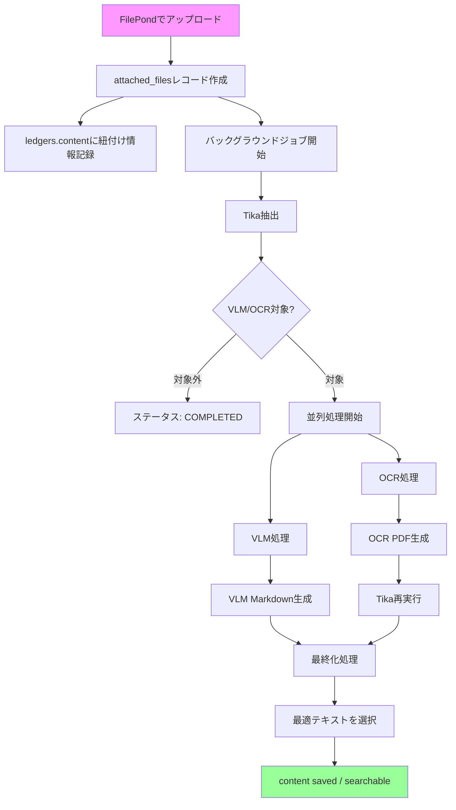

# 添付ファイル機能

## 1. 概要

LedgerLeapは、台帳の各レコードにファイルを添付する機能を提供します。本機能は、単なるファイルアップロードに留まらず、セキュリティ、検索性、ユーザー体験を向上させるための高度な仕組みを備えています。

### 主な特徴

-   **セキュアなダウンロード:** 全てのファイルダウンロードは、ユーザーの権限を厳密にチェックするルートを経由して行われ、不正なアクセスを防ぎます。
-   **高度なテキスト抽出:** VLM（視覚言語モデル）、OCR（光学文字認識）、Apache Tikaを組み合わせた処理により、画像・PDF・Office文書から高精度にテキストを抽出します。
-   **全文検索対応:** 抽出されたテキストはMroongaによる日本語全文検索の対象となり、添付ファイル内のキーワードで台帳を検索できます。
-   **FileInspectorドロワー:** ファイルの詳細情報、処理状態、抽出テキスト、履歴を統合表示するインタラクティブなUIを提供します。
-   **非同期処理:** ファイルのテキスト抽出は、バックグラウンドのキュージョブとして実行されるため、ユーザーは処理の完了を待つことなくスムーズに操作を継続できます。

## 2. データフローとアーキテクチャ

添付ファイルのライフサイクルは以下の通りです。

1.  **アップロード:** ユーザーはFilePond UIを通じてファイルをアップロードします。
2.  **メタデータの保存:**
    *   `attached_files`テーブルにファイルのメタデータ（パス、MIMEタイプ、サイズ等）が保存されます。
    *   `ledgers`テーブルの`content`カラムに、`{"hashed_filename.ext": "original_filename.ext"}`形式で紐づけ情報が記録されます。
3.  **テキスト抽出（非同期）:**
    *   アップロード直後に、バックグラウンドでテキスト抽出ジョブが開始されます。
    *   VLM、OCR、Tikaの3つのエンジンが、ファイルタイプに応じて並列または順次実行されます。
    *   最も信頼性の高いテキストが自動選択され、`attached_files.content`に保存されます。
4.  **表示とダウンロード:**
    *   FileInspectorドロワーでファイルの詳細情報、処理状態、抽出されたテキストを確認できます。
    *   ダウンロードは、セキュアなURL（`/files/{id}/download`）を経由して行われます。



**詳細:**
- テキスト抽出の技術詳細: `docs/architecture/vlm-ocr-technology-selection.md`
- 非同期処理のアーキテクチャ: `docs/architecture/QueueProcessing.md`
- ファイル処理パイプライン: `docs/architecture/file-processing-pipeline.md`

## 3. 機能詳細

### 3.1. ファイルとサムネイルの保存パス

添付ファイルとそれに関連するサムネイルは、テナントごと、および台帳定義ごとに整理された構造で保存されます。

-   **添付ファイル本体:** `storage/app/public/tenants/{tenant_id}/Ledger/Attachments/{ledger_define_id}/{hashed_basename}`
-   **OCR処理前のオリジナルファイル:** `storage/app/public/tenants/{tenant_id}/Ledger/Attachments/{ledger_define_id}/Originals/{hashed_basename}`
-   **サムネイル:** `storage/app/public/tenants/{tenant_id}/Ledger/thumbs/{hashed_basename}`

パス生成は`app/Helpers/AttachedFilePathHelper.php`ヘルパーが一元管理しています。

### 3.2. FileInspectorドロワー

ファイルアイコンをクリックすると、FileInspectorドロワーが開き、添付ファイルの詳細情報を統合的に確認できます。

#### 4つのタブ構成

**Contentタブ（内容）:**
- VLM、OCR、Tikaの各エンジンで抽出されたテキストをタブ切り替えで確認できます。
- VLMタブでは、Markdown形式で構造化されたテキストと信頼度スコアが表示されます。
- キーワード検索機能により、テキスト内の特定の文字列を強調表示できます。
- 大規模テキストの場合、省略表示と全文表示を切り替え可能です。

**Detailsタブ（詳細情報）:**
- ファイル名、サイズ、MIMEタイプ、アップロード日時、アップロードユーザーなどの基本情報が表示されます。
- 各エンジン（VLM/OCR/Tika）の処理時間がベンチマークとして記録されます。
- Tikaから抽出されたメタデータ（作成日、アプリケーション名など）が表示されます。
- 所属する台帳とフォルダへのリンクが表示されます。

**Historyタブ（履歴）:**
- ファイルのアップロード、各エンジンの処理完了、エラー発生などをタイムライン形式で表示します。
- 処理の失敗時には、エラーメッセージが記録されます。
- ユーザーによるダウンロード操作もアクティビティログとして記録されます。

**Permissionsタブ（権限とアクション）:**
- 現在のユーザーの権限（閲覧、ダウンロード、削除など）が表示されます。
- VLM処理の再実行、OCR処理の再実行など、処理失敗時の再試行アクションを実行できます。
- 所属する台帳への編集権限がある場合、ファイル削除操作も可能です。

#### 処理状態の可視化

- **ステータスバッジ:** 各エンジンの処理状態（完了、処理中、失敗、未実行）がアイコンとカラーで直感的に表示されます。
- **ローディングスピナー:** 処理中のエンジンにはスピナーアニメーションが表示されます。
- **エラーアラート:** 全エンジンが失敗した場合や、処理タイムアウト時には、明確なエラーメッセージと再試行ボタンが表示されます。

#### パフォーマンス測定

FileInspectorドロワーは、パフォーマンス監視機能を内蔵しています。
- ドロワーの開閉時間、タブ切り替え時間、画像プレビュー読み込み時間などが自動的に記録されます。
- 測定機能は`config/ledgerleap.php`の`performance.enabled`設定により、環境ごとにON/OFF可能です。

**詳細:** `docs/operations/fileinspector-performance-monitoring.md`を参照してください。

### 3.3. セキュアなダウンロード

ファイルへのアクセスは、`AttachedFileDownloadController`によって制御されます。

-   **認可処理:** ユーザーがファイルにアクセスする際は、そのファイルが紐づく台帳に対する閲覧権限（`Gate::authorize('view', $ledger)`）が厳密にチェックされます。
-   **情報漏洩対策:** 権限がない場合やファイルが存在しない場合は、一律で`404 Not Found`を返すことで、ファイルの存在有無を推測させません。
-   **ログ記録:** 全てのダウンロード操作は、IPアドレスやユーザーエージェントといった詳細情報と共にアクティビティログに記録され、監査証跡として利用できます。

### 3.4. テキスト抽出とエンジン統合

ファイルがアップロードされると、バックグラウンドで以下の非同期処理が実行されます。VLM、OCR、Tikaの3つのエンジンを組み合わせることで、高精度かつ堅牢なテキスト抽出を実現しています。

#### エンジンの役割と対象ファイル

| エンジン | 役割 | 対象ファイル | 出力形式 |
|---------|------|------------|---------|
| **VLM** | 視覚的理解に基づく構造化テキスト抽出 | 画像、PDF | Markdown、JSON |
| **OCR** | 光学文字認識とPDF最適化 | 画像、PDF | テキスト付きPDF |
| **Tika** | 汎用テキスト抽出 | 全ファイルタイプ | プレーンテキスト |

#### ファイルタイプ別の処理パターンと最終ソース優先順位

エンジン選択の優先度は **VLM（最優先） > OCR（次点） > Tika（フォールバック）** です。

| ファイルタイプ | MIME | VLM | OCR | ファイル名変更 | 備考 |
|--------------|------|-----|-----|---------------|-----------|
| **画像（JPG/PNG）** | image/* | ✅ | ✅ | ✅ .jpg→.pdf | OCRでPDF化 |
| **テキスト付きPDF** | application/pdf | ✅ | ✅ (skip-text) | ❌ | OCRは最適化のみ |
| **画像のみPDF** | application/pdf | ✅ | ✅ | ❌ | OCRでテキスト抽出 |
| **Office文書** | application/vnd.* | ❌ | ❌ | ❌ | Tikaのみ |
| **テキスト** | text/* | ❌ | ❌ | ❌ | 即座に完了 |

#### 実装上の重要事項

**並列処理と待機時間:**
- VLMとOCRは並列実行され、処理時間を30-40%短縮します。
- Tika処理（約5秒）が完了した時点で、ユーザーは画面を操作可能になります。

**キー命名規則:**
OCR処理後、画像ファイルはPDFに変換されるため、台帳コンテンツ内のキーが変更されます。
- 元のキー: `content_attached[$columnId][$hashedbasename]`
- OCR後のキー（画像のみ）: `content_attached[$columnId][$hashedbasename_without_ext . '.pdf']`

**OCR結果の判定ロジック:**
```php
if ($file->ocr_processed_at) {
    $isImageFile = str_starts_with($file->original_mime_type ?? '', 'image/');
    if ($isImageFile) {
        $pdfKey = pathinfo($file->hashedbasename, PATHINFO_FILENAME) . '.pdf';
        $text = $ledger->content_attached[$columnId][$pdfKey]['meta']['content'] ?? null;
    } else {
        $text = $ledger->content_attached[$columnId][$file->hashedbasename]['meta']['content'] ?? null;
    }
}
```

### 3.5. 処理ステータスと再処理

ユーザーは、FileInspectorドロワーで各添付ファイルの現在の処理状況を直感的に把握できます。

#### ステータス一覧

`attached_files.status`カラムには、以下のステータスが記録されます。

| ステータス | 説明 |
|----------|------|
| `PENDING_INITIAL_PROCESSING` | アップロード直後、Tika処理待ち |
| `INITIAL_PROCESSING` | Tika処理中 |
| `VLM_PROCESSING` | VLM処理中 |
| `OCR_PROCESSING` | OCR処理中 |
| `COMPLETED` | 全処理完了、検索可能 |
| `TIKA_FAILED` | Tika処理失敗 |
| `VLM_FAILED` | VLM処理失敗。ただしOCR/Tika成功時は最終化により`COMPLETED`に遷移。最終化済みの場合はVLM_FAILEDに上書きされない |
| `OCR_FAILED` | OCR処理失敗。ただしVLM/Tika成功時は最終化により`COMPLETED`に遷移。最終化済みの場合はOCR_FAILEDに上書きされない |
| `PROCESSING_FAILED` | VLM+OCR両方失敗 |

#### 処理完了の判定

ファイルの処理が完了したかどうかは、以下の条件で判定されます。

-   `processing_finalized_at`タイムスタンプが設定されている
-   `finalized_source`（vlm/ocr/tika）が記録されている
-   `status`が`COMPLETED`である
-   **画像由来ファイルの特例**: `original_mime_type`が`image/`で始まるファイルは、OCR/Tika処理が完了していればテキスト抽出結果が空でも`COMPLETED`になります。画像のテキスト抽出はオプショナルであるためです。
-   **Status Guard**: `ProcessVlmExtraction`、`OcrAndOptimizeFile`、`ProcessAttachedFile` は、`processing_finalized_at`が既に設定されている場合、`COMPLETED`ステータスを上書きしません。これにより、初期処理で先に最終化されたファイルのステータスがVLM/OCRの後続処理で巻き戻されることを防止します。

#### 再処理機能

処理に失敗した場合、FileInspectorドロワーのPermissionsタブから再処理を実行できます。

-   **VLM再処理:** VLMエンジンによる処理を再実行します。ただしファイルが既に最終化済み（`processing_finalized_at`設定済み）の場合、VLM結果はタイムスタンプのみ更新され、ステータスは上書きされません。
-   **全エンジン再処理:** VLM、OCR、Tikaの全処理を最初からやり直します。画像由来ファイル（`original_mime_type`が`image/`で始まるファイル）は、再処理時にサムネイルも再生成されます。
-   **OCR PDF再ダウンロード:** OCR処理によって生成されたテキスト付きPDFをダウンロードできます。

#### サムネイル生成の重複抑止

- `thumbnail=true` のリクエストでサムネイルが未生成の場合は、`GenerateThumbnail` を1件だけキュー投入します。
- 同じ `attachedFileId` のサムネイルがすでに処理中（`OPTIMIZING`）の場合は、追加のキュー投入を行いません。
- 100MB級の TIFF のように生成時間が長い画像でも、同一サムネイルのキュー多発を防ぎます。
- **画像由来ファイル**: OCR処理でPDFに変換されたファイルも、`original_mime_type`（元の画像MIME）を参照してサムネイルが生成されます。`GenerateThumbnail` ジョブは元の画像ファイル（`original_file_path`）をソースとして使用します。
- 再処理（`retryProcessing()`）および `ProcessAttachedFile` の処理完了時にも、画像由来ファイルに対して自動的に `GenerateThumbnail` がdispatchされます。

### 3.6. ファイルの削除

ユーザーが台帳から添付ファイルを削除した場合、以下の処理が行われます。

-   **`ledgers`テーブルの更新:** 削除されたファイルの`hashed_filename`と`original_filename`のペアが、`ledgers.content`および`ledgers.content_attached`カラムのJSONデータから削除されます。
-   **`attached_files`テーブルの更新:** 該当する`attached_files`レコードは物理的に削除されず、`SoftDeletes`トレイトによって論理削除されます（`deleted_at`カラムにタイムスタンプが設定されます）。これにより、監査証跡としてレコードが保持されます。
-   **物理ファイルの保持:** ストレージ上の物理ファイル（`storage/app/public/...`）は削除されません。これは、論理削除された`attached_files`レコードと合わせて、監査や復元が必要な場合に備えるためです。

---

## 4. UI/UX詳細

### 4.1 FilePondによるファイルアップロード

-   **ドラッグ＆ドロップ:** ユーザーはFilePondエリアにファイルをドラッグ＆ドロップすることで、簡単にファイルをアップロードできます。
-   **ファイルタイプチェック:** 対応していないファイルタイプの場合、アップロード時にリアルタイムでエラーメッセージが表示されます。
-   **プレビュー表示:** 画像ファイルの場合、アップロード前にサムネイルプレビューが表示されます。

### 4.2 FileInspectorドロワーの操作

-   **ドロワーの開閉:** ファイルアイコンをクリックすることで、FileInspectorドロワーがスライドイン・アウトします。
-   **タブ切り替え:** Content、Details、History、Permissionsの各タブは、クリックまたはショートカットキー（Ctrl+1〜4）で切り替え可能です。
-   **テキスト検索:** Contentタブ内では、キーワード検索ボックスに入力することで、リアルタイムにテキスト内検索が行えます。
-   **QR共有導線:** FileInspector内の共有ボタンは、`window.location.href` に含まれる `file` クエリを前提に、ドロワーを閉じてからページQRダイアログを開きます。
    - 同じQRダイアログはトップメニューからも開けますが、こちらは FileInspector 非表示時の入口として残します。
    - ドロワー表示中にQRを開く場合は、ブラーや重なりを避けるために先に FileInspector を閉じる実装を維持してください。

### 4.3 エラーハンドリングとユーザー通知

-   **エラーメッセージ:** 処理失敗時や権限エラー時には、赤色のエラーメッセージがドロワー内に表示されます。
-   **再試行ボタン:** エラー発生時には、再試行ボタンが表示され、クリックすることで即座に再処理が開始されます。
-   **処理状況のインジケーター:** 処理中はスピナーアイコンが表示され、ユーザーに処理が行われていることを通知します。

### 4.4 パフォーマンス最適化

-   **遅延読み込み:** 大きなファイルや多数のサムネイルは、遅延読み込みされるため、初期表示が高速化されます。
-   **キャッシュ利用:** 一度表示されたファイルのサムネイルやテキストは、ブラウザキャッシュを利用して再利用されます。

**詳細:** UI/UXに関する詳細な設計は`docs/ui/ux-design.md`を参照してください。

---

## 5. データモデル

添付ファイル機能に関連するデータモデルの詳細は、以下のドキュメントを参照してください。

-   **`attached_files`テーブル:** `docs/models/AttachedFile.md` - カラム定義、リレーション、主要メソッド
-   **`ledgers.content`と`ledgers.content_attached`:** `docs/models/Ledger.md` - JSON構造、AsColumnArrayJsonキャストの制約

**重要な仕様:**
- `AsColumnArrayJson`キャストを使用しているため、`data_get()`関数は使用できません。
- 配列の直接アクセス（`$ledger->content_attached[$columnId][$hashedbasename]`）を使用してください。

---

## 6. 関連ドキュメント

### アーキテクチャ
-   **`docs/architecture/vlm-ocr-technology-selection.md`** - VLM/OCR技術選定理由とエンジン統合アーキテクチャ
-   **`docs/architecture/QueueProcessing.md`** - 非同期ジョブのアーキテクチャとチェーン戦略
-   **`docs/architecture/file-processing-pipeline.md`** - ファイル処理パイプラインのアーキテクチャ

### データモデル
-   **`docs/models/AttachedFile.md`** - AttachedFileモデルの詳細（カラム定義、メソッド、リレーション）
-   **`docs/models/Ledger.md`** - Ledgerモデルのcontent/content_attachedカラム仕様（予定）

### 運用・監視
-   **`docs/operations/fileinspector-performance-monitoring.md`** - FileInspectorのパフォーマンス監視設定と運用ガイド

### 開発者向け
-   **`docs/development/performance-optimization.md`** - パフォーマンス最適化手法と新メトリクス追加方法（予定）
-   **`docs/development/vlm-ocr.md`** - VLM/OCR開発者向けガイド

