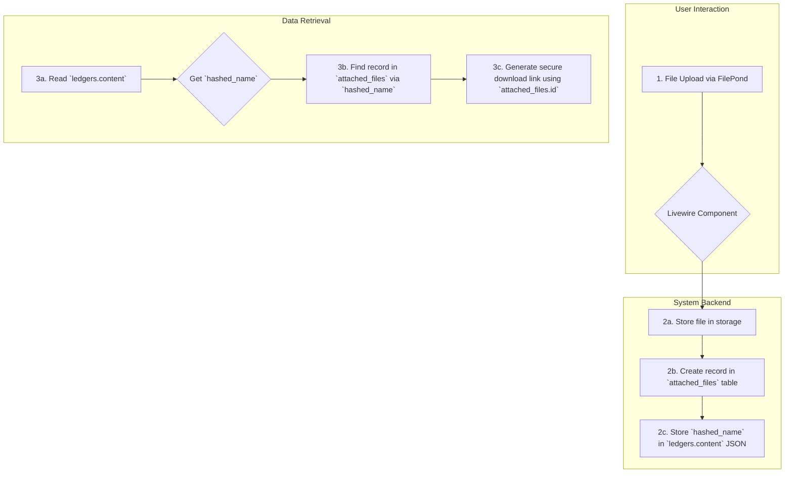
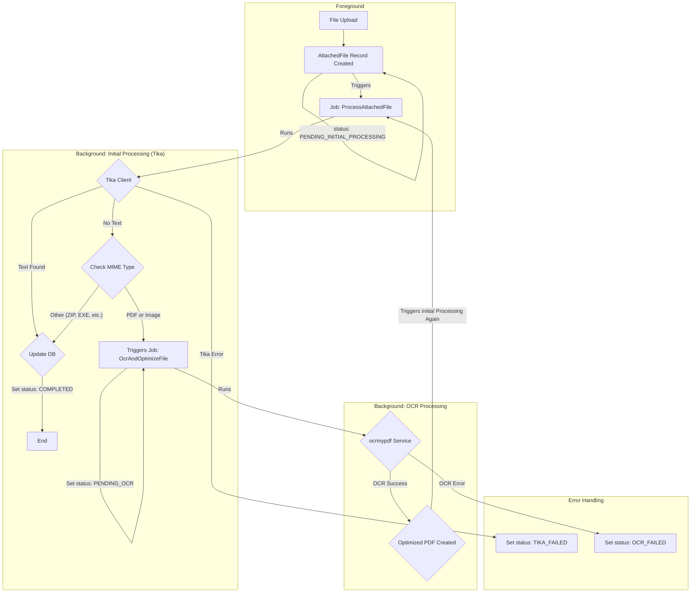

# 添付ファイル機能

## 1. 概要

LedgerLeapは、台帳の各レコードにファイルを添付する機能を提供します。本機能は、単なるファイルアップロードに留まらず、セキュリティ、検索性、ユーザー体験を向上させるための高度な仕組みを備えています。

-   **セキュアなダウンロード:** 全てのファイルダウンロードは、ユーザーの権限を厳密にチェックするルートを経由して行われ、不正なアクセスを防ぎます。
-   **OCRによる全文検索:** アップロードされた画像ファイルやスキャンPDFは、OCR（光学文字認識）処理によってテキストが抽出され、台帳データと同様に全文検索の対象となります。
-   **非同期処理:** ファイルのテキスト抽出やOCRといった重い処理は、バックグラウンドのキュージョブとして実行されるため、ユーザーは処理の完了を待つことなくスムーズに操作を継続できます。

## 2. データフローとアーキテクチャ

添付ファイルのライフサイクルは以下の通りです。

1.  **アップロード:** ユーザーはFilePond UIを通じてファイルをアップロードします。
2.  **テーブルへの保存:**
    *   **`attached_files` テーブル:** ファイルのメタデータ（物理パス、MIMEタイプ、ファイルサイズ、処理ステータス等）と、全文検索用の抽出テキスト(`content`)がこのテーブルに保存されます。
    *   **`ledgers` テーブル:** 添付ファイルを含むカラムの`content`部分には、`{"hashed_filename.ext": "original_filename.ext"}` のような形式で、どのファイルが紐づいているかを示すJSONが保存されます。
3.  **表示とダウンロード:**
    *   画面にファイル情報を表示する際、`ledgers.content`の`hashed_filename`をキーにして`attached_files`テーブルから完全なファイル情報を取得します。
    *   ダウンロードリンクは、`attached_files`の`id`を元に生成されたセキュアなURL (`/files/{id}/download`) を指します。

## 3. 機能詳細

### 3.1. セキュアなダウンロード

-   **認可処理:** ファイルへのアクセスは、`AttachedFileDownloadController`によって制御されます。ユーザーがファイルにアクセスする際は、そのファイルが紐づく台帳に対する閲覧権限（`Gate::authorize('view', $ledger)`）が厳密にチェックされます。
-   **情報漏洩対策:** 権限がない場合やファイルが存在しない場合は、一律で `404 Not Found` を返すことで、ファイルの存在有無を推測させません。
-   **ログ記録:** 全てのダウンロード操作は、IPアドレスやユーザーエージェントといった詳細情報と共にアクティビティログに記録され、監査証跡として利用できます。

### 3.2. 非同期でのテキスト抽出とOCR処理

ファイルがアップロードされると、バックグラウンドで以下の非同期処理が実行されます。

1.  **初期処理 (`ProcessAttachedFile` ジョブ):**
    *   まず、Apache Tika を用いてファイルからテキスト抽出を試みます。
    *   テキストが抽出できた場合（例: テキスト情報を持つPDF、Word文書）、抽出したテキストをDBに保存し、処理を完了します。
    *   テキストが抽出できなかった場合（例: 画像、スキャンされたPDF）、ファイルのMIMEタイプをチェックします。

2.  **OCR処理 (`OcrAndOptimizeFile` ジョブ):**
    *   初期処理でテキストが抽出できず、かつファイルが画像またはPDFだった場合に、このジョブが実行されます。
    *   `OcrMyPDF` を利用してファイルからテキストを抽出し、検索可能なテキストレイヤーを持つ最適化済みPDFを生成します。
    *   生成されたPDFは、再度「初期処理」ジョブに送られ、テキストが抽出・保存されます。

この2段階の処理により、効率的かつ網羅的なテキスト抽出を実現しています。

### 3.3. 処理ステータスの可視化とユーザー操作

ユーザーは、UI上で各添付ファイルの現在の処理状況を直感的に把握できます。

-   **ステータス表示:** ファイル名の横に、現在の状態（処理中、処理失敗など）を示すアイコンとツールチップが表示されます。
-   **結果の提供:**
    *   OCR処理によって画像がPDFに変換された場合でも、メインのリンクからは元の画像ファイルをダウンロードできます。
    *   補助リンクとして「テキスト付きPDFをダウンロード」が表示され、ユーザーはOCR結果を含むPDFも取得できます。
-   **再処理:** テキスト抽出やOCR処理に失敗した場合、ファイル名の横に再試行アイコンが表示されます。ユーザーはこれをクリックすることで、処理を再度実行させることができます。
