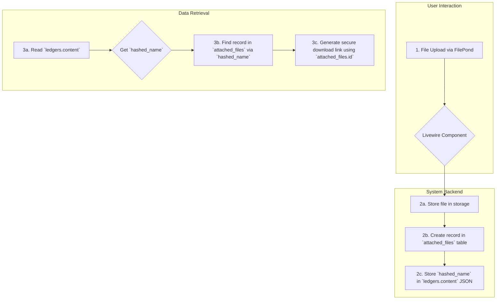
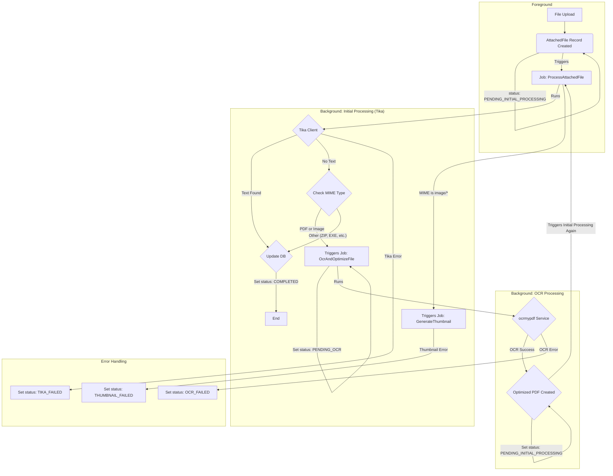

# 添付ファイル機能

## 1. 概要

LedgerLeapは、台帳の各レコードにファイルを添付する機能を提供します。本機能は、単なるファイルアップロードに留まらず、セキュリティ、検索性、ユーザー体験を向上させるための高度な仕組みを備えています。

-   **セキュアなダウンロード:** 全てのファイルダウンロードは、ユーザーの権限を厳密にチェックするルートを経由して行われ、不正なアクセスを防ぎます。
-   **OCRによる全文検索:** アップロードされた画像ファイルやスキャンPDFは、OCR（光学文字認識）処理によってテキストが抽出され、台帳データと同様に全文検索の対象となります。
-   **非同期処理:** ファイルのテキスト抽出やOCRといった重い処理は、バックグラウンドのキュージョブとして実行されるため、ユーザーは処理の完了を待つことなくスムーズに操作を継続できます。

## 2. データフローとアーキテクチャ

添付ファイルのライフサイクルは以下の通りです。

1.  **アップロード:** ユーザーはFilePond UIを通じてファイルをアップロードします。
2.  **テーブルへの保存:**
    *   **`attached_files` テーブル:** ファイルのメタデータ（物理パス、MIMEタイプ、ファイルサイズ、処理ステータス等）と、全文検索用の抽出テキスト(`content`)がこのテーブルに保存されます。
    *   **`ledgers` テーブル:** 添付ファイルを含むカラムの`content`部分には、`{"hashed_filename.ext": "original_filename.ext"}` のような形式で、どのファイルが紐づいているかを示すJSONが保存されます。
3.  **表示とダウンロード:**
    *   画面にファイル情報を表示する際、`ledgers.content`の`hashed_filename`をキーにして`attached_files`テーブルから完全なファイル情報を取得します。
    *   ダウンロードリンクは、`attached_files`の`id`を元に生成されたセキュアなURL (`/files/{id}/download`) を指します。

## 3. 機能詳細

### 3.1. ファイルとサムネイルの保存パス

添付ファイルとそれに関連するサムネイルは、テナントごと、および台帳定義ごとに整理された構造で保存されます。ファイルパスの生成は、すべて `app/Helpers/AttachedFilePathHelper.php` ヘルパーが一元管理しており、システム全体で一貫したパス解決を保証します。

-   **添付ファイル本体:**
    -   **パス構造:** `storage/app/public/tenants/{tenant_id}/Ledger/Attachments/{ledger_define_id}/{hashed_basename}`
    -   **説明:** アップロードされたファイルは、テナントIDと台帳定義IDによってディレクトリが分けられ、ハッシュ化されたファイル名で保存されます。
-   **OCR処理前のオリジナルファイル:**
    -   **パス構造:** `storage/app/public/tenants/{tenant_id}/Ledger/Attachments/{ledger_define_id}/Originals/{hashed_basename}`
    -   **説明:** OCR処理の対象となるファイルは、処理前にこの `Originals` ディレクトリに退避され、原本として保持されます。
-   **サムネイル:**
    -   **パス構造:** `storage/app/public/tenants/{tenant_id}/Ledger/thumbs/{hashed_basename}`
    -   **説明:** サムネイルは、テナント直下の `thumbs` ディレクトリにまとめて保存されます。ファイル名は添付ファイル本体のハッシュ名を流用するため、異なる台帳定義間でもファイル名の衝突は発生しません。

### 3.2. セキュアなダウンロード

-   **認可処理:** ファイルへのアクセスは、`AttachedFileDownloadController`によって制御されます。ユーザーがファイルにアクセスする際は、そのファイルが紐づく台帳に対する閲覧権限（`Gate::authorize('view', $ledger)`）が厳密にチェックされます。
-   **情報漏洩対策:** 権限がない場合やファイルが存在しない場合は、一律で `404 Not Found` を返すことで、ファイルの存在有無を推測させません。
-   **ログ記録:** 全てのダウンロード操作は、IPアドレスやユーザーエージェントといった詳細情報と共にアクティビティログに記録され、監査証跡として利用できます。

### 3.3. 非同期でのテキスト抽出とOCR処理

ファイルがアップロードされると、バックグラウンドで以下の非同期処理が実行されます。このフローは、システムの堅牢性と効率性を両立させるための重要な設計です。

1.  **初期処理 (`ProcessAttachedFile` ジョブ):**
    *   このジョブが、テキスト抽出と後続処理の振り分けを行う中心的な役割を担います。
    *   まず、Apache Tika を用いてファイルからテキスト抽出を試みます。`ExtractTextWithTika` という個別のジョブは存在せず、テキスト抽出処理はこのジョブ内で直接実行されます。
    *   **テキスト抽出成功時:** 抽出したテキストをDBに保存し、`status` を `COMPLETED` に更新して処理を完了します。
    *   **テキスト抽出失敗時:** ファイルのMIMEタイプをチェックします。
        *   **OCR対象の場合 (画像/PDF):** `status` を `PENDING_OCR` に更新し、`OcrAndOptimizeFile` ジョブをディスパッチします。
        *   **OCR対象外の場合 (ZIP等):** `status` を `COMPLETED` に更新し、処理を終了します。
    *   **サムネイル生成:** TikaによるMIMEタイプの判定後、ファイルが画像（`image/*`）であれば、`GenerateThumbnail` ジョブをディスパッチします。サムネイルの初回生成はこのタイミングでトリガーされます。

2.  **OCR処理 (`OcrAndOptimizeFile` ジョブ):**
    *   初期処理でテキストが抽出できず、かつファイルが画像またはPDFだった場合に、このジョブが実行されます。
    *   `OcrMyPDF` を利用してファイルからテキストを抽出し、検索可能なテキストレイヤーを持つ最適化済みPDFを生成します。
    *   処理が成功すると、`status` を `PENDING_INITIAL_PROCESSING` に戻し、**再度 `ProcessAttachedFile` ジョブをディスパッチします。** これにより、OCR処理後のPDFからテキストを抽出し、DBに保存する処理が、他のファイル形式と同じフローで一貫して行われます。

この2段階の処理と再処理のループにより、効率的かつ網羅的なテキスト抽出を実現しています。

### 3.4. 処理ステータスの可視化とユーザー操作

ユーザーは、UI上で各添付ファイルの現在の処理状況を直感的に把握できます。

-   **ステータス表示:** ファイル名の横に、現在の状態（処理中、処理失敗など）を示すアイコンとツールチップが表示されます。
-   **結果の提供:**
    *   OCR処理によって画像がPDFに変換された場合でも、メインのリンクからは元の画像ファイルをダウンロードできます。
    *   補助リンクとして「テキスト付きPDFをダウンロード」が表示され、ユーザーはOCR結果を含むPDFも取得できます。
-   **再処理:** テキスト抽出やOCR処理に失敗した場合、ファイル名の横に再試行アイコンが表示されます。ユーザーはこれをクリックすることで、処理を再度実行させることができます。
-   **サムネイルの再試行:** サムネイル生成に失敗した場合、ユーザーがサムネイルを表示しようとしたタイミング（例: ダウンロードリンクをクリック）で、`AttachedFileDownloadController` が再試行ロジックをトリガーします。

### 3.5. ファイルの削除

ユーザーが台帳から添付ファイルを削除した場合、以下の処理が行われます。

-   **`ledgers` テーブルの更新:** 削除されたファイルの `hashed_filename` と `original_filename` のペアが、`ledgers.content` カラムのJSONデータから削除されます。
-   **`attached_files` テーブルの更新:** 該当する `attached_files` レコードは物理的に削除されず、`SoftDeletes` トレイトによって論理削除されます (`deleted_at` カラムにタイムスタンプが設定されます)。これにより、監査証跡としてレコードが保持されます。
-   **物理ファイルの保持:** ストレージ上の物理ファイル（`storage/app/public/...`）は削除されません。これは、論理削除された `attached_files` レコードと合わせて、監査や復元が必要な場合に備えるためです。
