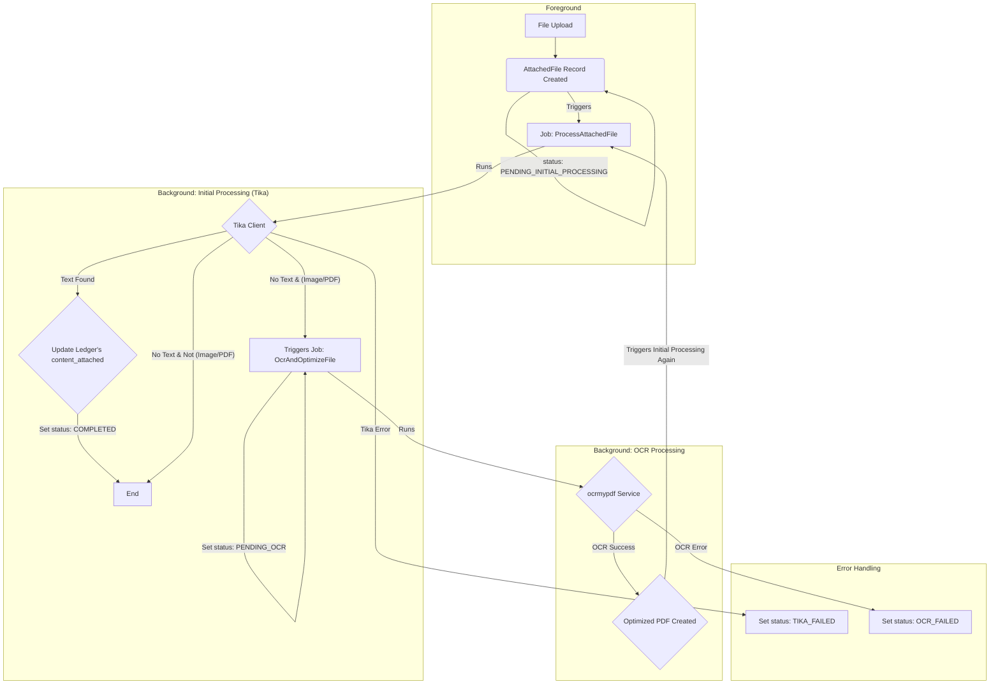

# 台帳添付ファイルのダウンロード処理改善とOCR機能の追加

## 1. 背景と目的

現状の台帳添付ファイル機能は、FilePondライブラリを利用してリッチなUIを提供している。しかし、ファイルのダウンロード（プレビュー含む）処理において、ファイルの物理パスが推測可能な状態にあり、認可（パーミッションチェック）をバイパスしてファイルにアクセスされるリスクが存在する。また、誰がいつファイルをダウンロードしたかというアクティビティログが記録されていないため、証跡管理の観点からも改善が必要である。

さらに、現状では画像として保存されている書類（スキャンされたPDFや写真など）は、ファイル名以外のテキスト情報が検索対象となっていない。これらのファイルにOCR処理を施し、ファイル内の文字をテキストデータとして認識させることで、システムの検索能力を大幅に向上させることが求められる。

本計画では、これらの課題を解決するため、以下の2点を目的とする。
1.  添付ファイルのダウンロード処理をセキュアにし、操作ログを記録する仕組みを実装する。
2.  OCR機能を追加し、全文検索の対象範囲を拡張すると共に、ファイルの利便性を向上させる。

## 2. 当初計画からの変更点

*   **FilePondの利用:** 当初はファイルアップロード機能のUI/UX改善もスコープに含まれていたが、議論を通じて、すでに高機能なFilePondライブラリが導入済みであることが判明した。このため、UIの新規開発は不要と判断し、既存のFilePond実装を活かす方針に変更した。
*   **課題の明確化:** 計画の焦点が「添付ファイル機能全般の改善」から、「ダウンロード処理のセキュリティ強化とログ記録」という、より具体的で優先度の高い課題に絞られた。
*   **既存コードの活用:** 当初は新規にコントローラーを作成する計画だったが、調査の結果、類似機能を持つ `AttachedFileDownloadController` が存在することが判明した。重複する実装を避け、保守性を高めるため、この既存コントローラーを修正・活用する方針に切り替えた。
*   **セキュリティ要件の深化:** テスト段階で、権限エラー（403）とファイル不存在エラー（404）のレスポンスが異なることによる情報漏洩リスクが指摘された。これを受け、どちらのケースでも404を返すように実装を修正し、セキュリティを強化した。

## 3. 機能改善のステップ

### Step 1: ダウンロード処理の現状把握

*   **状態:** 完了
*   **結果:**
    *   `resources/views/components/ledger/form/files.blade.php` を調査した結果、FilePondのファイルソースURLが `Storage::url()` ヘルパによって生成されていることを特定した。
    *   これにより、ファイルの物理パスが推測可能な公開URLがクライアントに渡されており、認可処理をバイパスしてアクセスされうるセキュリティ上の課題が存在することを確認した。

### Step 2: セキュアなダウンロード用APIエンドポイントの作成

*   **状態:** 完了
*   **結果:**
    *   当初は新規コントローラーの作成を予定していたが、調査により既存の `app/Http/Controllers/AttachedFileDownloadController.php` を活用する方針に変更した。
    *   同コントローラーの `download` メソッドを修正し、以下の機能改善を実施した。
        1.  **認可処理の強化:** 簡易的な認証チェックから、`Gate::authorize('view', $ledger)` を用いた、台帳ごとの厳密なポリシーベースの権限チェックに切り替えた。
        2.  **情報漏洩対策:** ファイルが存在しない場合と、アクセス権がない場合の両方で `404 Not Found` を返すようにロジックを修正し、レスポンスの違いからファイルの存在を推測できないようにした。
        3.  **ログ記録の強化:** `activitylog` に、操作イベント名 (`downloaded`)、IPアドレス、ユーザーエージェント、関連ID (`ledger_id`, `ledger_define_id`) を含む詳細な情報を `properties` として記録するようにした。
    *   `routes/web.php` を更新し、`/files/{attachedFile}/download` ルートが上記コントローラーのアクションを指すように設定した。

### Step 3 (改): 詳細画面 (`ledger.show`) の添付ファイル表示をセキュア化

**目的:** `ColumnHtmlService` が生成するファイルURLとサムネイルURLを、認可とログ記録を行うセキュアなエンドポイント経由に変更する。

**調査結果サマリ (訂正):**
*   台帳の**詳細表示画面** (`ledger.show`) における添付ファイルの表示は、`FilePond` を使う編集画面とは異なり、`app/Services/Ledger/ColumnHtmlService.php` が担っています。
*   このサービスは、`resources/views/livewire/ledger/show.blade.php` の中で `ColumnHtml` ファサード経由で呼び出されています。
*   `ColumnHtmlService` の `getFileHtml()` メソッド内で、ファイルのダウンロードURLとサムネイル画像のURLが、セキュアでない `Storage::url()` を使って直接生成されています。これが認可をバイパスできる根本的な原因です。
*   このサービスは現在、ファイルのハッシュ名しか受け取っておらず、セキュアなURL (`/files/{id}/download`) の生成に必要な `AttachedFile` のIDを知りません。

---

#### Step 3.1: `Show` Livewireコンポーネントの改修（ファイルIDの準備）

*   **状態:** 完了
*   **目的:** `ColumnHtmlService` がセキュアなURLを生成できるよう、`AttachedFile` のIDマップを準備する。
*   **タスク:**
    1.  `app/Livewire/Ledger/Show.php` に `public ?Collection $currentLedgerAttachments = null;` プロパティを追加しました。
    2.  `app/Livewire/Ledger/Show.php` の `mount()` メソッド内で、現在の台帳レコードに紐づく全ての `AttachedFile` レコードを取得し、`$this->currentLedgerAttachments` に格納しました。
    3.  `app/Livewire/Ledger/Show.php` の `prepareContentDiff()` メソッド内で、現在の台帳レコードに紐づく全ての `AttachedFile` レコードを取得し、`['hashedbasename' => 'id']` の形式の連想配列を作成し、`$this->contentChanges` の各カラムの `'current_attachments'` や `'old_attachments'` のような新しいキーに格納しました。

#### Step 3.2: `ColumnHtmlService` の改修（IDマップの受け取りとURL生成）

*   **状態:** 完了
*   **目的:** `ColumnHtmlService` がIDマップを受け取り、それを使ってセキュアなURLを生成できるようにする。
*   **タスク:**
    1.  `app/Services/Ledger/ColumnHtmlService.php` を修正しました。
    2.  `setAttachments()` を `setAttachmentCollection()` にリネームし、`\Illuminate\Support\Collection` 型を受け取るように変更しました。
    3.  `getFileHtml()` メソッド内で `Storage::url()` を使用している箇所を全て削除し、代わりに、保持したIDマップを使って `hashedFilename` から `AttachedFile` のIDを検索し、`route('file.download', ['attachedFile' => ID])` ヘルパを使ってファイルのダウンロードURLとサムネイルURLを生成するようにロジックを全面的に書き換えました。サムネイルURLには `?thumbnail=true` のクエリパラメータを付与しました。

#### Step 3.3: `show.blade.php` の修正（IDマップの受け渡し）

*   **状態:** 完了
*   **目的:** Livewireコンポーネントで準備したIDマップを `ColumnHtmlService` に渡す。
*   **タスク:**
    1.  `resources/views/livewire/ledger/show.blade.php` を修正し、`x-ledger.detail.table` コンポーネントを呼び出す際に、`:allAttachments="$currentLedgerAttachments"` を追加しました。
    2.  `resources/views/components/ledger/detail/table.blade.php` を修正し、`@props` に `allAttachments` を追加し、`ColumnHtml::setAttachmentCollection($allAttachments->keyBy('hashedbasename'))` を使って添付ファイル情報を渡すように変更しました。
    3.  `app/Livewire/Ledger/RecordsTable.php` を修正し、`allAttachments` を `x-ledger.table-row` に渡すように変更しました。
    4.  `resources/views/components/ledger/table-row.blade.php` を修正し、`@props` に `allAttachments` を追加し、`ColumnHtml::setAttachmentCollection($allAttachments->get($ledgerRecord->id, collect())->keyBy('hashedbasename'))` を使って添付ファイル情報を渡すように変更しました。

#### Step 3.4: `AttachedFileDownloadController` のサムネイル対応

*   **状態:** 完了
*   **目的:** セキュアなダウンロードエンドポイントが、サムネイル画像の要求に対応できるようにする。
*   **タスク:**
    1.  `app/Http/Controllers/AttachedFileDownloadController.php` の `download` メソッドを修正し、リクエストに `?thumbnail=true` パラメータが含まれているかをチェックし、含まれている場合、認可とログ記録を行った上で、レスポンスとして実ファイルの代わりに、対応するサムネイルファイルを返すロジックを追加しました。
    2.  `routes/web.php` の `file.download` ルートが正しく定義されていることを確認しました。

### Step 4: 動作確認（ダウンロード処理）

**目的:** 実装されたダウンロード機能が正しく動作し、セキュリティ要件を満たしていることを確認する。

*   **テストケース:**
    *   **テスト1: 正常系（権限あり）**
        *   **目的:** 権限を持つユーザーが正常にファイルをダウンロードでき、ログが記録されることを確認する。
        *   **期待する結果:** ファイルが正常にダウンロードされ、`activity_log` テーブルに詳細情報（IPアドレス等）を含むログが記録される。
    *   **テスト2: 異常系（権限なし）**
        *   **目的:** 権限を持たないユーザーがファイルにアクセスできず、ファイルの存在も推測できないことを確認する。
        *   **期待する結果:** 404 Not Found エラーページが表示される。
    *   **テスト3: 異常系（ファイルなし）**
        *   **目的:** 存在しないファイルIDを指定した場合の挙動を確認する。
        *   **期待する結果:** 404 Not Found エラーページが表示される。

## 4. 添付ファイル保存処理のアーキテクチャ

**目的:** 添付ファイルの保存処理の全体像を明確にし、`content` カラムの構造変更の是非を判断する。

**調査結果:**
*   **処理の起点:** ファイルアップロードは、FilePond (`files.blade.php`) から Livewire の標準アップロード機能 (`@this.upload(...)`) を通じて行われる。
*   **Livewireコンポーネントの役割 (`CreateColumn.php` / `ModifyColumn.php`):
    1.  **一時ファイル処理:** Livewire はアップロードされたファイルを一時ディレクトリに保存する。
    2.  **永続化:** ユーザーが「保存」系のアクションを実行すると、`processFilesForSave()` メソッドが呼び出される。この中で、`storeFile()` が一時ファイルを永続ストレージ (`storage/app/public/Ledger/Attachments`) に移動し、ファイル名をハッシュ化する。
    3.  **`attached_files` レコードの準備:** `storeFile()` は、DBに保存するためのファイル情報（オリジナル名、ハッシュ名、パス等）を `$this->newAttachedFiles` プロパティに蓄積する。
    4.  **`ledgers` レコードの保存:** `saveDraft()` や `saveDirectly()` メソッド内で、まず `ledgers` テーブルにレコードが作成・更新される。このとき、`content` カラムには `['hashedbasename' => 'original_filename']` という形式のJSONが保存される。
    5.  **`attached_files` レコードの保存:** `ledgers` レコードの保存が完了し、`ledger_id` が確定した **後** で、`addAttachedFileRecord()` が呼び出される。このメソッドが `$newAttachedFiles` の内容を元に、`ledger_id` を関連付けて `attached_files` テーブルにレコードを作成する。

**考察と結論:**
*   **`content` カラムへのID保存は困難:** 現在のアーキテクチャでは、`ledgers` レコードを保存する時点では `attached_files` レコードのIDはまだ存在しない。`content` にIDを含めるには、`ledgers` を一度空の `content` で作成し、`attached_files` を作成後、再度 `ledgers` を更新する必要があり、処理が複雑化する。
*   **採用方針:** `content` カラムの構造は変更せず、**表示・ダウンロード時に `hashedbasename` をキーとして `attached_files` テーブルを検索し、IDを取得する**方針が、既存の構造を活かせるため最も合理的であると判断する。

---

### Step 5: OCRによる全文検索対象の拡張とファイル最適化 (計画)

**目的:** 画像ベースのPDFや画像ファイルに対し、OCR処理（光学文字認識）を実行することで、ファイル内のテキスト情報を抽出する。これにより、今まで検索対象外だったファイルも全文検索できるようにし、システムの検索能力を大幅に向上させる。また、処理済みのファイルは最適化されたクリアテキスト付きPDFとして保存し、利便性を高める。

**背景:** 現状、画像として保存されている書類（スキャンされたPDFや写真など）は、ファイル名以外のテキスト情報が検索対象となっていない。これらのファイルにOCR処理を施すことで、ファイル内の文字をテキストデータとして認識し、Mroongaによる全文検索の対象に含めることが可能になる。

---

### Step 6: OCR環境構築 (Docker & OcrMyPDF) (計画)

**目的:** `OcrMyPDF` を日本語対応のDockerサービスとしてLedgerLeap環境に統合する。

*(このステップの計画は前回提案から変更ありません)*

#### 6.1. Dockerfileの作成

*   **場所:** `docker/ocrmypdf/Dockerfile` (新規作成)
*   **内容:**
    ```Dockerfile
    # 公式イメージをベースにする
    FROM jbarlow83/ocrmypdf:latest

    # システムを更新し、日本語のTesseract言語パックをインストールする
    RUN apt-get update && apt-get install -y --no-install-recommends \
        tesseract-ocr-jpn \
        && apt-get clean \
        && rm -rf /var/lib/apt/lists/*
    ```

#### 6.2. docker-compose.yml の設定

*   **場所:** `docker-compose.yml` (修正)
*   **追加するサービス定義:**
    ```yaml
    services:
      # ... (既存のlaravel.test, mysql, redis等のサービス)

      ocrmypdf:
        build:
          context: ./docker/ocrmypdf
          dockerfile: Dockerfile
        volumes:
          - .:/var/www/html
        working_dir: /var/www/html
        command: tail -f /dev/null
        restart: unless-stopped
        networks:
          - sail

      # ... (既存のtika, mailpit等のサービス)
    ```

---

### Step 7: OCR非同期処理アーキテクチャの再設計 (計画)

**目的:** ファイルアップロード後、まずTikaでテキスト抽出を試み、失敗した場合にのみOCR処理を起動する、効率的で堅牢な非同期アーキテクチャを設計する。

#### 7.1. アーキテクチャ概要図



#### 7.2. 状態管理とDBスキーマ

*   **状態管理:** 新規カラムは追加せず、既存の `attached_files.status` カラムを拡張してファイルの状態を管理します。
*   **Enumの拡張 (`app/Enums/AttachedFileStatus.php`):**
    *   `PENDING_INITIAL_PROCESSING`, `INITIAL_PROCESSING`, `PENDING_OCR`, `OCR_PROCESSING`, `COMPLETED`, `TIKA_FAILED`, `OCR_FAILED` の状態を定義します。
*   **オリジナルファイル保持のためのスキーマ変更:**
    *   **マイグレーション:** `attached_files` テーブルに以下のカラムを追加します。
        *   `original_file_path`: `string`, nullable. OCR処理前のオリジナルファイルのパスを記録。
        *   `original_mime_type`: `string`, nullable. オリジナルファイルのMIMEタイプ。

#### 7.3. Tikaテキスト抽出失敗の判定条件

*   **背景:** 既存の `app/Jobs/Ledger/AttachedFileScanJob.php` に見られるように、システムは `vaites/php-apache-tika` ライブラリの `getText()` メソッドを利用してファイルから本文テキストを抽出します。
*   **判定条件:** `getText()` メソッドが返す文字列を `trim()` した結果が、空文字列 (`''`) になる場合を「テキストが抽出できなかった」と判断します。

#### 7.4. `content_attached` の構造と更新方針

*   **構造:** `content_attached` カラムは、`{カラムID: {ファイルハッシュ名: {meta: {content: "..."}}}}` という構造のJSONです。
*   **更新方針:** 各ジョブは、この構造に従い、`Ledger`モデルから配列として取得した `content_attached`に対し、自身が処理したファイルのテキスト情報 `meta.content` をマージ（追加/上書き）し、配列全体を書き戻します。

#### 7.5. ジョブの実装詳細

1.  **初期処理ジョブ (`ProcessAttachedFile.php`):**
    *   `handle()` メソッド:
        1.  `status` を `INITIAL_PROCESSING` に更新。
        2.  Tikaでテキスト抽出を試行。
        3.  **テキスト抽出成功時:** 抽出テキストを `Ledger` の `content_attached` にマージし、`status` を `COMPLETED` に更新。
        4.  **テキスト抽出失敗時:** ファイルが画像/PDFなら `status` を `PENDING_OCR` に更新して `OcrAndOptimizeFile` をディスパッチ。それ以外なら `status` を `COMPLETED` に更新。
        5.  **Tikaサービスエラー時:** `status` を `TIKA_FAILED` に更新。

2.  **OCR処理ジョブ (`OcrAndOptimizeFile.php`):**
    *   `handle()` メソッド:
        1.  `status` を `OCR_PROCESSING` に更新。
        2.  **オリジナルファイルの退避:**
            *   元のファイル（画像またはPDF）を `storage/app/Ledger/Attachments/Originals/` ディレクトリに移動します。
            *   移動したパスと元のMIMEタイプを、`attached_files` レコードの `original_file_path` と `original_mime_type` に記録します。
        3.  **OCRとPDF生成の実行:**
            *   `OcrMyPDF` を実行し、**テキストレイヤーを持つ最適化済みPDF**を生成させます。入力が画像ファイルの場合も、出力はPDFとなります。
            *   生成されたPDFを、**元のファイルがあったパス** (`storage/app/public/Ledger/Attachments/`) に保存します。
        4.  **レコード情報の更新:**
            *   `attached_files` レコードの `file_name` (拡張子を.pdfに)、`path`, `mime_type`, `size` を、新しく生成されたPDFの情報に更新します。
        5.  **Tikaによる再処理:**
            *   `status` を `PENDING_INITIAL_PROCESSING` に戻し、`ProcessAttachedFile` ジョブを再度ディスパッチします。これにより、最適化・テキスト化された新しいPDFファイルから、一貫した方法でテキストが抽出され `content_attached` に反映されます。
        6.  **失敗時:** `status` を `OCR_FAILED` に更新します。オリジナルファイルの退避処理は行いません。

---

### Step 8: UI/UXの設計 (計画)

**目的:** ユーザーがファイルの処理状況を把握し、必要に応じて対応できるようにするためのUIを設計する。

*   **状態表示:**
    *   **実装:** `AttachedFile` の `status` に応じて、ファイル名の横にMaryUIの `<x-mary-icon />` をツールチップ付きで表示します。
        *   `PENDING_...`: `<x-mary-icon name="o-clock" title="処理待ちです" />`
        *   `..._PROCESSING`: `<x-mary-icon name="o-cog-6-tooth" class="animate-spin" title="処理中です..." />`
        *   `COMPLETED`: `<x-mary-icon name="o-check-circle" class="text-success" title="処理完了" />`
        *   `TIKA_FAILED`: `<x-mary-icon name="o-exclamation-triangle" class="text-warning" title="テキスト抽出に失敗しました。クリックで再試行できます。" />`
        *   `OCR_FAILED`: `<x-mary-icon name="o-exclamation-triangle" class="text-error" title="OCR処理に失敗しました。クリックで再試行できます。" />`
*   **結果の提供:**
    *   **ダウンロード:** 通常のダウンロードリンクでは、常に現在のファイル（OCR処理済みの場合は最適化PDF）がダウンロードされます。
    *   **オリジナルファイルのダウンロード:** `original_file_path` が記録されているファイルについては、「オリジナルをダウンロード」リンクを追加で表示します。このリンクは `AttachedFileDownloadController` の新しいアクション（例: `downloadOriginal`）を指し、退避させた元のファイルを返します。
*   **手動実行:**
    *   `status` が `TIKA_FAILED` または `OCR_FAILED` のファイルにのみ、再実行アイコン `<x-mary-icon name="o-arrow-path" class="cursor-pointer" />` を表示します。
    *   このアイコンはLivewireアクション (`retryProcessing($id)`) をトリガーし、対象ファイルの `status` を `PENDING_INITIAL_PROCESSING` にリセットして、`ProcessAttachedFile` ジョブを再度ディスパッチします。


