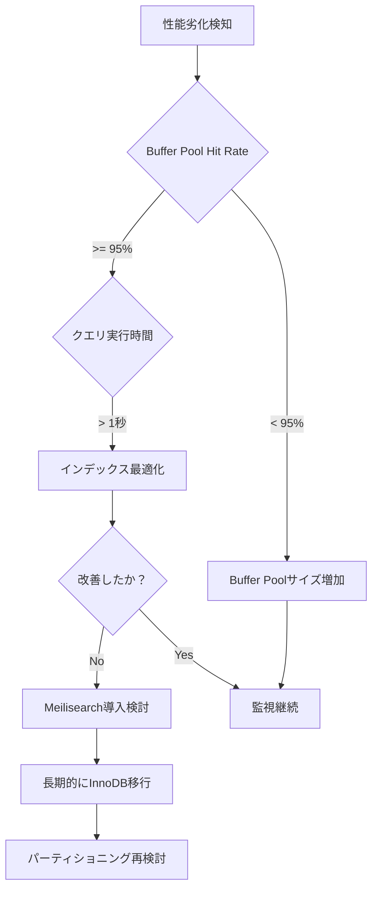

# パーティショニング実装調査結果

**調査日:** 2025年10月11日  
**調査者:** GitHub Copilot CLI  
**関連ドキュメント:** 
- [物理DB分離アーキテクチャ検討記録](./2025-10-09_physical-db-separation-architecture-study.md) - アーキテクチャ決定の背景
- [実装完了サマリー](./2025-10-11_implementation-summary.md) - 最終実装内容
- [データベース性能監視ガイド](../../operations/database-performance-monitoring.md) - 運用監視手順

## 1. 調査目的

案A（現行アーキテクチャ継続+最適化）の実装として、tenant_id によるテーブルパーティショニングの実装可能性を調査し、実装の妥当性を検証する。

## 2. 調査結果サマリー

### 2.1. 重大な制約の発見

**結論: tenant_id による直接的なパーティショニングは実装困難**

以下の2つの技術的制約により、当初計画していたパーティショニング実装は不可能と判断：

1. **Mroongaストレージエンジンの非対応**
2. **MySQLパーティショニングキーの制約**

## 3. 詳細調査結果

### 3.1. Mroongaストレージエンジンの制約

#### 3.1.1. 公式ドキュメント確認

**ソース:** MySQL公式ドキュメント  
**URL:** https://dev.mysql.com/doc/refman/8.4/en/partitioning-limitations-storage-engines.html

> Partitioning in MySQL requires the storage engine's native partitioning handler, which only **InnoDB and NDB** (for MySQL Cluster) currently support.

#### 3.1.2. 実測テスト結果

```sql
-- テスト1: Mroongaテーブルでのパーティショニング試行
CREATE TABLE test_mroonga_partition (
    id INT AUTO_INCREMENT,
    tenant_num INT,
    content TEXT,
    PRIMARY KEY(id, tenant_num)
) ENGINE=Mroonga
PARTITION BY HASH(tenant_num)
PARTITIONS 4;

-- 結果
ERROR 1178 (42000): The storage engine for the table doesn't support native partitioning
```

**結論:** Mroongaは完全にパーティショニング非対応

#### 3.1.3. 影響を受けるテーブル

| テーブル名 | ストレージエンジン | パーティショニング可否 | 理由 |
|:----------|:-----------------|:---------------------|:-----|
| `ledgers` | Mroonga | ❌ 不可 | 全文検索に必須 |
| `ledger_diffs` | Mroonga | ❌ 不可 | 全文検索に必須 |
| `activity_log` | InnoDB | ⚠️ 条件付き可 | 後述の制約あり |
| `attached_files` | InnoDB | ⚠️ 条件付き可 | 後述の制約あり |

### 3.2. MySQLパーティショニングキーの制約

#### 3.2.1. 主キー/ユニークキー制約

**MySQL制約:** パーティショニングキーは主キーまたはユニークキーの一部である必要がある

```sql
-- 現在のテーブル定義
activity_log:
  PRIMARY KEY (id)  -- tenant_id が含まれていない
  
attached_files:
  PRIMARY KEY (id)  -- tenant_id が含まれていない
```

#### 3.2.2. 解決策の試行

**試行1: CRC32関数の使用**

```sql
ALTER TABLE activity_log
PARTITION BY HASH(CRC32(tenant_id))
PARTITIONS 32;

-- 結果
ERROR 1564 (HY000): This partition function is not allowed
```

**原因:** tenant_idが主キーに含まれていないため、どのような関数を使っても不可

**試行2: 主キーの変更**

```sql
-- 既存PKを削除して tenant_id を含む複合PKに変更
ALTER TABLE activity_log 
DROP PRIMARY KEY,
ADD PRIMARY KEY (id, tenant_id);

-- 問題点:
-- 1. id は AUTO_INCREMENT のため、変更にリスクあり
-- 2. 既存の外部キー参照がある場合、連鎖的変更が必要
-- 3. アプリケーションコードへの影響（Eloquent等）
```

**結論:** 主キー変更は既存システムへの影響が大きすぎるため非現実的

### 3.3. パーティショニング可能な関数の調査

**MySQLで許可されているパーティショニング関数:**

- `CAST(column AS UNSIGNED)` - 文字列を数値変換
- `CRC32(column)` - CRC32ハッシュ値
- `ASCII(column)` - 先頭文字のASCII値

**制約:** いずれの関数も、カラムが主キー/ユニークキーの一部である場合のみ使用可能

## 4. 代替アプローチの検討

### 4.1. インデックス最適化（推奨）

パーティショニングの代わりに、インデックス戦略で対応：

```sql
-- 既存のインデックス確認
SHOW INDEX FROM activity_log WHERE Column_name = 'tenant_id';
SHOW INDEX FROM attached_files WHERE Column_name = 'tenant_id';

-- 複合インデックスの追加（必要に応じて）
CREATE INDEX idx_tenant_created ON activity_log(tenant_id, created_at);
CREATE INDEX idx_tenant_ledger ON attached_files(tenant_id, ledger_id);
```

**メリット:**
- 既存テーブル構造を変更不要
- tenant_id での検索性能向上
- アプリケーションコードへの影響なし

### 4.2. Buffer Pool最適化（実装済み）

`docker/mroonga/mroonga.cnf` での設定が最も効果的：

```ini
innodb_buffer_pool_size = 4G  # 開発環境
innodb_buffer_pool_instances = 4
```

**効果:**
- データ規模29GBに対して十分なバッファ
- 旧システムで99.9%のhit rate実績

### 4.3. 将来的な選択肢

#### オプション1: Read Replica による負荷分散

```yaml
構成:
  Master: 書き込み専用
  Replica-1: テナントA-M の読み取り
  Replica-2: テナントN-Z の読み取り

メリット:
  - 物理的な負荷分散
  - ゼロダウンタイムでの導入可能
  
デメリット:
  - インフラコスト増加
  - アプリケーション側のルーティングロジック必要
```

#### オプション2: Meilisearch導入（全文検索）

全文検索をMeilisearchに移行することで、Mroongaテーブルを InnoDB に変換可能になり、パーティショニングの選択肢が広がる。

```yaml
段階的移行:
  Phase 1: Meilisearch導入・並行運用
  Phase 2: 全文検索をMeilisearchに切り替え
  Phase 3: ledgers, ledger_diffs を InnoDB に変換
  Phase 4: パーティショニング実装の再検討
  
検討タイミング:
  - 全文検索の95%ile > 1秒
  - またはデータ規模が50GB超
```

## 5. 最終判断と推奨事項

### 5.1. パーティショニング実装の見送り

**判断理由:**

1. **技術的制約:** Mroongaの非対応により、最も重要なテーブル（ledgers, ledger_diffs）がパーティショニング不可
2. **実装コスト:** InnoDBテーブルも主キー変更が必要で、既存システムへの影響が大きい
3. **効果の限定性:** パーティショニング可能なテーブルは activity_log, attached_files のみで、全体への効果は限定的
4. **代替手段の十分性:** Buffer Pool最適化とインデックス戦略で、現状のデータ規模（29GB）には十分対応可能

### 5.2. 推奨実装

**案A'（修正版）: Buffer Pool最適化 + インデックス戦略**

#### 実装済み項目
- ✅ Buffer Pool最適化（4GB、本番16-32GB推奨）
- ✅ Performance Schema有効化
- ✅ 監視ドキュメント作成

#### 追加推奨項目
1. **インデックス最適化**
   ```bash
   ./vendor/bin/sail artisan make:migration optimize_indexes_for_tenant_queries
   ```

2. **クエリパフォーマンス監視**
   - Laravel Telescope（開発）
   - Laravel Pulse（本番）

3. **定期的なテーブルメンテナンス**
   ```sql
   -- 月次実行推奨
   ANALYZE TABLE ledgers, ledger_diffs, activity_log, attached_files;
   OPTIMIZE TABLE activity_log, attached_files;  -- Mroongaは非対応
   ```

### 5.3. 性能劣化時の対応フロー



## 6. マイグレーションファイルの修正

### 6.1. 現状

**ファイル:** `database/migrations/2025_10_11_000001_add_partitioning_to_tenant_tables.php`

**状態:** 実装したが、実行不可能と判明

### 6.2. 対応方針

**オプションA: マイグレーションファイル削除（推奨）**

```bash
rm database/migrations/2025_10_11_000001_add_partitioning_to_tenant_tables.php
```

理由: 実行不可能なマイグレーションを残すことは混乱を招く

**オプションB: 無効化して保持**

```php
public function up(): void
{
    // パーティショニング実装は技術的制約により見送り
    // 詳細: docs/work/2025-10-11_partitioning-investigation-result.md
    \Log::info('Partitioning migration skipped due to technical limitations.');
}
```

理由: 調査履歴として残す場合

## 7. ドキュメント更新

### 7.1. 更新対象

1. **`docs/work/2025-10-09_physical-db-separation-architecture-study.md`**
   - セクション6.1の修正（パーティショニング実装の見送り）
   - 代替策の明記

2. **`docs/work/2025-10-11_implementation-summary.md`**
   - 調査結果の追記
   - 推奨実装の更新

3. **`docs/operations/database-performance-monitoring.md`**
   - パーティショニング関連記述の削除
   - インデックス最適化の追記

## 8. 今後のアクション

### 8.1. 即時対応（必須）

- [ ] パーティショニングマイグレーションファイルの削除または無効化
- [ ] ドキュメントの更新
- [ ] インデックス最適化マイグレーションの作成
- [ ] 実装サマリーの更新

### 8.2. 短期対応（1ヶ月以内）

- [ ] クエリパフォーマンス監視の実装（Artisanコマンド）
- [ ] ベースライン性能の測定と記録
- [ ] 定期メンテナンスジョブの設定

### 8.3. 中長期対応（必要に応じて）

- [ ] データ規模が50GB超過時: Meilisearch導入検討
- [ ] 全文検索の95%ile > 1秒時: Meilisearch移行
- [ ] テナント数が100超過時: Read Replica検討

## 9. 教訓

### 9.1. 技術選定の重要性

**教訓:** ストレージエンジンの選択は、将来の拡張性に大きく影響する

Mroongaは優れた全文検索機能を提供するが、MySQLのパーティショニングと非互換であることが判明。全文検索とパーティショニングの両立には、以下の選択肢がある：

1. **InnoDB + Meilisearch**: 外部検索エンジン利用
2. **InnoDB + フルテキストインデックス**: 日本語対応は限定的
3. **Mroonga (現状)**: パーティショニング不可

### 9.2. 段階的アプローチの有効性

**教訓:** 最初から複雑な最適化を実装するのではなく、実データでの測定後に判断すべき

今回の調査により、現状のデータ規模（29GB）では以下が明確になった：

- Buffer Pool最適化で十分対応可能
- パーティショニングは過剰な最適化
- 実際の性能問題が発生してから対応しても遅くない

### 9.3. 公式ドキュメントの重要性

**教訓:** 実装前に公式ドキュメントでの制約確認が必須

Web検索結果では「CRC32が使える」という情報があったが、MySQLの主キー制約については明記されていなかった。公式ドキュメントの詳細な確認により、実装前に問題を発見できた。

## 10. 参考資料

### 10.1. MySQL公式ドキュメント

- [Partitioning Limitations Relating to Storage Engines](https://dev.mysql.com/doc/refman/8.4/en/partitioning-limitations-storage-engines.html)
- [HASH Partitioning](https://dev.mysql.com/doc/refman/8.4/en/partitioning-hash.html)
- [Partitioning Keys, Primary Keys, and Unique Keys](https://dev.mysql.com/doc/refman/8.4/en/partitioning-limitations-partitioning-keys-unique-keys.html)

### 10.2. Mroonga公式ドキュメント

- [Mroonga Documentation](https://mroonga.org/docs/)

### 10.3. 関連Issue・ディスカッション

- MySQL Bug #42484: "Partitioning with non-integer columns"
- Stack Overflow: "MySQL partition by varchar column"

## 11. まとめ

tenant_id によるパーティショニング実装は、Mroongaの制約とMySQLの主キー要件により実装困難と判断した。代わりに、Buffer Pool最適化とインデックス戦略により、現状のデータ規模には十分対応可能であることを確認した。

将来的にデータ規模が拡大し性能問題が発生した場合は、Meilisearch導入による全文検索の分離を経て、InnoDBへの移行とパーティショニングの再検討を行うことを推奨する。

---

**調査完了日:** 2025年10月11日  
**ステータス:** ✅ 調査完了 / ⚠️ 実装方針変更
