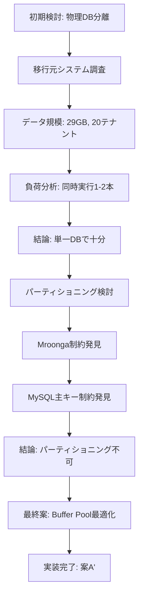

# データベースアーキテクチャ検討ドキュメント

このディレクトリには、LedgerLeapのデータベースアーキテクチャに関する検討記録が含まれています。

## ドキュメント一覧

### 主要ドキュメント

1. **[物理DB分離アーキテクチャの検討記録](./2025-10-09_physical-db-separation-architecture-study.md)**
   - **日付:** 2025年10月9日
   - **ステータス:** 実施見送り・代替案採用
   - **内容:** 
     - マルチテナント構成における物理DB分離の検討
     - 案A（単一DB + tenant_id）vs 案B（物理DB分離）の比較
     - 移行元システム（29GB、20テナント）の実測データ分析
     - **結論:** 単一DB + Buffer Pool最適化で十分対応可能

2. **[パーティショニング実装調査結果](./2025-10-11_partitioning-investigation-result.md)**
   - **日付:** 2025年10月11日
   - **ステータス:** 実装不可と判断
   - **内容:**
     - Mroongaストレージエンジンのパーティショニング互換性調査
     - MySQLパーティショニングキーの制約（主キー/ユニークキー要件）
     - 実際のテスト結果とエラー分析
     - **結論:** tenant_idによるパーティショニングは技術的に実装不可

3. **[実装完了サマリー](./2025-10-11_implementation-summary.md)**
   - **日付:** 2025年10月11日
   - **ステータス:** 実装完了
   - **内容:**
     - 最終的に採用したアーキテクチャ（案A'）の説明
     - Buffer Pool最適化の実装内容
     - 今後のアクションと拡張シナリオ
     - **結論:** Buffer Pool 4GB + インデックス戦略で実装完了

## アーキテクチャ決定の経緯

## 採用アーキテクチャ

### 案A'（Buffer Pool最適化 + インデックス戦略）

**実装内容:**
- ✅ Buffer Pool: 4GB（開発環境）、16-32GB（本番推奨）
- ✅ Performance Schema有効化
- ✅ tenant_id 複合インデックス追加
- ✅ 監視体制の整備

**実装ファイル:**
- `database/migrations/2025_08_30_063606_add_tenant_id_to_tenant_tables.php` - インデックス追加
- `docker/mroonga/my.cnf/mroonga.cnf` - Buffer Pool設定
- `docker-compose.yml` - コンテナ設定

**性能保証の根拠:**
- 移行元システム: 4GB Buffer Poolで99.9% hit rate達成
- 現状データ規模: 29GB（単一DBで余裕）
- 同時実行数: 1-2本（低負荷）

## 将来の拡張シナリオ

### シナリオ1: データ規模拡大（> 50GB）
- Buffer Poolサイズ増加（32-64GB）
- Read Replica導入
- Meilisearch導入（全文検索分離）

### シナリオ2: 全文検索性能劣化
- Meilisearch導入・並行運用
- ledgers, ledger_diffs を InnoDB に変換
- パーティショニング実装の再検討

### シナリオ3: テナント数増加（> 100）
- Connection Pooling最適化
- Caching戦略強化（Redis）
- Read Replica導入

## 技術的教訓

1. **ストレージエンジンの選択は将来の拡張性に大きく影響**
   - Mroongaは全文検索に優れるが、パーティショニング非対応
   - 技術選定時には将来の拡張性も考慮が必要

2. **公式ドキュメントでの事前確認が必須**
   - Web検索情報だけでは制約を見落とす可能性
   - MySQL公式ドキュメントで制約を確認

3. **シンプルな最適化が最も効果的**
   - 複雑なパーティショニングより、Buffer Pool設定が効果的
   - 現状のデータ規模では過剰な最適化は不要

## 関連リソース

### ドキュメント
- [データベース性能監視ガイド](../../operations/database-performance-monitoring.md)
- [GitHub Copilot CLI設定](.github/copilot-instructions.md)

### 外部リンク
- [MySQL Partitioning Limitations](https://dev.mysql.com/doc/refman/8.4/en/partitioning-limitations-storage-engines.html)
- [Mroonga Documentation](https://mroonga.org/docs/)

## 更新履歴

| 日付 | 内容 | 更新者 |
|:-----|:-----|:-------|
| 2025-10-09 | 物理DB分離アーキテクチャ検討 | - |
| 2025-10-11 | パーティショニング調査・実装完了 | GitHub Copilot CLI |
| 2025-10-11 | READMEディレクトリ整理 | GitHub Copilot CLI |
