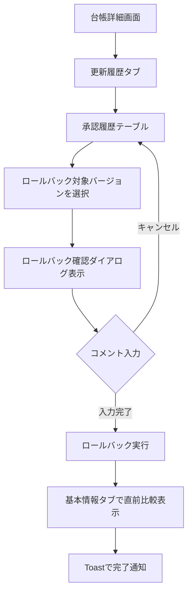

# W2-2 Phase2 ロールバック機能 要件定義（統合版）

**最終更新:** 2026-01-24  
**対象:** LedgerLeap v12.0 / Branch: `feature/ledger-rollback`  
**ステータス:** PMレビュー済み（部分承認、一部調整中）  
**管理場所:** `docs/work/core-features/ledger-diff-rollback/`

---

## 関連ドキュメント

本ドキュメントは以下の検討結果を前提としています:

- [2026-01-03_plan.md](2026-01-03_plan.md) - 台帳差分表示拡充・ロールバック全体計画
- [2026-01-04_W2-1-1_diff_component_scope.md](2026-01-04_W2-1-1_diff_component_scope.md) - 共通差分コンポーネント機能範囲定義
- [2026-01-04_W2-1-3_persona_ux_requirements.md](2026-01-04_W2-1-3_persona_ux_requirements.md) - ペルソナ別UX要件整理
- [docs/work/core-features/workflow/2025-06-27_workflow-feature-implementation.md](../../workflow/2025-06-27_workflow-feature-implementation.md) - ワークフロー機能の実装作業計画と実績

---

## 1. 目的・背景

Phase 1で実装した台帳差分表示機能を基盤として、Phase 2では**レコードロックされていない台帳**（ワークフロー無効、またはワークフロー有効でも未承認）を対象としたロールバック機能を提供する。現場リーダーや管理者が誤更新を安全に修正でき、かつ操作履歴が適切に記録される仕組みを構築する。

### 記載範囲

- ロールバック対象範囲の定義（W2-2.1）
- ロールバックフローの定義（W2-2.2）
- 監査・運用要件の定義（W2-2.3）
- 非機能要件の定義（W2-2.4）

### 記載しない内容

- ワークフロー有効時のロールバック仕様（Phase 3以降で定義）
- UI詳細設計（W3-2.xで定義）
- 実装詳細（W4-2.xで定義）

---

## 2. W2-2.1 ロールバック対象範囲定義

### 2.1 対象台帳の条件

#### 必須条件

ロールバック機能は以下の条件を**すべて満たす台帳**のみを対象とする:

1. **レコードがロックされていない**: `Ledger::isLocked()` が `false` を返す
   - ワークフロー無効台帳: 常にロック解除状態
   - ワークフロー有効台帳: `status` が `DRAFT`, `PENDING_INSPECTION`, `PENDING_APPROVAL` の場合（承認済み `APPROVED` は除外）
2. **非削除状態**: `ledgers.deleted_at IS NULL`
3. **差分履歴が存在**: 対象台帳に関連する`ledger_diffs`レコードが2件以上存在

#### 対象台帳の具体例

| ワークフロー設定 | ステータス | ロールバック可否 | 理由 |
|---------------|----------|--------------|------|
| 無効 | `NONE` | ✅ 可能 | レコードロック無し |
| 有効 | `DRAFT` | ✅ 可能 | 未承認、レコードロック無し |
| 有効 | `PENDING_INSPECTION` | ✅ 可能 | 未承認、レコードロック無し |
| 有効 | `PENDING_APPROVAL` | ✅ 可能 | 未承認、レコードロック無し |
| 有効 | `APPROVED` | ❌ 不可 | 承認済み、レコードロック有り |

#### 除外条件

以下の条件に該当する台帳は、ロールバック対象から**除外**する:

1. **承認済み台帳**: `status = APPROVED` の台帳（`Ledger::isLocked()` が `true` を返す）
   - **理由**: 承認フローを経たデータは確定しており、ロールバックによる変更は監査証跡の観点から不適切
2. **削除済み台帳**: ソフトデリートされた台帳

> [!NOTE]
> **既存実装の流用**
> 
> ワークフロー有効台帳を編集した場合、既存の`WorkflowService::saveEditedRecord()`により自動的に`DRAFT`ステータスに戻る実装が存在します。ロールバック実行時も同様のパターンを流用し、以下の処理を行います:
> 
> 1. ロールバック実行時に `status` を `DRAFT` に変更
> 2. ワークフロー関連のカウンターを調整（担当者のタスクカウントをデクリメント）
> 3. 新規 `LedgerDiff` レコードに `status = DRAFT` を記録
> 
> これにより、ワークフロー有効台帳でも安全にロールバックが可能になります。

### 2.2 権限モデル

#### 権限階層

ロールバック実行には、以下の権限階層に基づく認可を行う:

```
ADMIN > WRITE
```

- **WRITE権限以上**: ロールバック実行可能
- **READ権限**: ロールバック不可（履歴閲覧のみ）

#### 権限チェックロジック

既存の`UserService::hasFolderPermission()`を活用し、以下の条件をすべて満たすことを確認:

1. **フォルダ権限**: ユーザーが対象台帳の所属フォルダ（または祖先フォルダ）に対して`WRITE`以上の権限を保持
2. **Permission**: ユーザーが`update_ledgers` Permissionを保持
3. **Policy**: `LedgerPolicy::update()`が`true`を返す
4. **レコードロック**: `Ledger::isLocked()` が `false` を返す

**実装参照**: `app/Policies/LedgerPolicy.php::update()`, `app/Services/UserService.php::hasFolderPermission()`

### 2.3 コメント必須要件

> [!IMPORTANT]
> **要件調整中**
> 
> コメント必須要件については、Phase 2実装時に運用実績を踏まえて最終判断します。
> 初期実装では以下の方針で進め、後から調整可能な設計とします。

#### コメント入力（暫定仕様）

ロールバック実行時のコメント入力は、以下の暫定仕様で実装:

- **フィールド名**: `comments`
- **入力形式**: テキストエリア、任意入力
- **最小文字数**: なし（空欄可）
- **最大文字数**: 500文字
- **バリデーション**: 
  ```php
  'comments' => 'nullable|string|max:500'
  ```

#### 将来の調整方針

運用開始後、以下の観点で要件を見直し:

1. **コメント必須化の検討**: ロールバック理由の記録が監査上必要と判断された場合、`required|min:10`に変更
2. **機能フラグによる制御**: `config/ledgerleap.php`の設定で必須/任意を切り替え可能にする
3. **ロール別の制御**: 管理者は任意、一般ユーザーは必須など、柔軟な設定を可能にする

**設計上の配慮**: バリデーションルールを設定ファイルから読み込む構造とし、コード修正なしで調整可能にする。

#### コメントの記録先

- **`ledger_diffs`テーブル**: ロールバックイベントを示す新規`LedgerDiff`レコードの`comments`カラムに記録
- **`activity_log`テーブル**: Spatie ActivityLogによる操作ログの`properties`に記録

### 2.4 制約条件

> [!IMPORTANT]
> **要件調整中**
> 
> クールダウン期間および連続ロールバック制限については、Phase 2実装時に運用実績を踏まえて最終判断します。
> 初期実装では制限なしで進め、後から追加可能な設計とします。

#### ロールバック実行の制限

1. **最新バージョンへのロールバック禁止**: 現在のバージョンと同じバージョンへのロールバックは不可
2. **並行実行制御**: 同一台帳に対する並行ロールバックを排他制御（トランザクション + 楽観的ロック）

#### 将来の調整方針（検討中）

運用開始後、必要に応じて以下の制限を追加:

- **連続ロールバック制限**: 同一台帳に対して、前回のロールバックから**X分以内**の再ロールバックを禁止（誤操作防止）
  - 初期案: 5分間のクールダウン期間
  - 設定ファイルで調整可能にする
- **レート制限**: ユーザー単位で1時間あたり最大Y回のロールバック実行
  - 初期案: 20回/時間
  - 設定ファイルで調整可能にする

**設計上の配慮**: 
- クールダウンチェックを独立したメソッド（`canRollbackNow()`）に分離
- 機能フラグ `rollback.cooldown_enabled` でON/OFF制御
- レート制限は Laravel のレートリミッター機能を活用

#### エラーハンドリング

以下の場合はロールバックを中断し、ユーザーにエラーメッセージを表示:

- 対象`LedgerDiff`が存在しない
- 権限不足
- レコードロックされている台帳（`isLocked() = true`）へのロールバック試行
- バリデーションエラー
- トランザクション失敗


---

## 3. W2-2.2 ロールバックフロー定義

### 3.1 基本フロー

#### ユーザー導線



#### 導線の実装箇所

1. **更新履歴タブ**: `app/Livewire/Ledger/Show.php` - `LedgerHistoryManager`コンポーネント
2. **承認履歴テーブル**: Phase 1で実装済み
3. **ロールバック確認ダイアログ**: 新規Livewireコンポーネント（W3-2.2で設計）

### 3.2 標準フロー: ロールバック → 直前比較

#### フロー詳細

ロールバック実行後、ユーザーに以下の体験を提供:

1. **ロールバック実行**: コメント入力 → 実行ボタンクリック
2. **画面遷移**: 更新履歴タブ → 基本情報タブへ自動遷移
3. **即時差分表示**: 基本情報タブの既存機能により、ロールバック前後の差分を自動表示
4. **Toast通知**: 「ロールバックが完了しました。Ver. X に復元されました。」

#### 技術実装

- **画面遷移**: Livewireの`$dispatch('switch-tab', {tab: 'basic-info'})`イベント
- **差分表示**: 既存の即時差分機能を流用（Phase 1で実装済み）
- **Toast通知**: MaryUIの`$this->success()`トレイト

### 3.3 専用履歴画面からの導線

Phase 1では更新履歴タブへの統合を優先するため、専用履歴画面(`ShowDiff`)からのロールバック導線は**Phase 2.5または3で検討**とする。

**現時点の方針**: 専用履歴画面には「詳細画面の更新履歴タブで実行」への導線リンクを設置

---

## 4. W2-2.3 監査・運用要件定義

### 4.1 操作ログ記録

#### 記録対象イベント

ロールバック実行時に、以下の情報を**Spatie ActivityLog**を用いて記録:

| 項目 | 記録内容 | データソース |
|------|---------|------------|
| **イベント種別** | `'ledger_rollback'` | カスタムイベント名 |
| **実行者** | ユーザーID、ユーザー名 | `Auth::user()` |
| **対象台帳** | 台帳ID、台帳名 | `Ledger` |
| **ロールバック元** | 現在のバージョン番号 | `Ledger::version` |
| **ロールバック先** | ロールバック先のバージョン番号 | `LedgerDiff::version` |
| **実行日時** | タイムスタンプ | `now()` |
| **理由コメント** | ユーザー入力コメント | UIから取得 |
| **IPアドレス** | リクエスト元IP | `request()->ip()` |
| **User Agent** | ブラウザ情報 | `request()->userAgent()` |

#### 実装方法

```php
activity('ledger_rollback')
    ->performedOn($ledger)
    ->causedBy(Auth::user())
    ->withProperties([
        'ledger_id' => $ledger->id,
        'from_version' => $currentVersion,
        'to_version' => $targetVersion,
        'target_diff_id' => $targetDiff->id,
        'comments' => $comments,
        'ip_address' => request()->ip(),
        'user_agent' => request()->userAgent(),
    ])
    ->log('台帳をVer. ' . $targetVersion . 'にロールバック');
```

**参考実装**: 既存のワークフロー操作ログ実装（`WorkflowService`）

### 4.2 `ledger_diffs`への履歴追加

#### 新規LedgerDiffレコードの作成

ロールバック実行時に、以下のデータで新規`LedgerDiff`レコードを作成:

| カラム | 値 | 備考 |
|--------|-----|------|
| `ledger_id` | 対象台帳ID | |
| `content` | ロールバック先の`content` | 完全復元 |
| `column_define` | ロールバック先の`column_define` | 完全復元 |
| `ledger_define_id` | 台帳定義ID | |
| `creator_id` | 台帳の作成者ID | 変更しない |
| `modifier_id` | ロールバック実行者ID | |
| `status` | `WorkflowStatus::NONE` | ワークフロー無効のため |
| `version` | 現在version + 1 | 新バージョン |
| `comments` | ユーザー入力コメント + 「(Ver. Xからロールバック)」 | |
| `created_at` | `now()` | |

#### イベント種別の識別

`comments`フィールドに、ロールバック元バージョンを明記することで、通常の更新とロールバックを識別可能にする:

```
「{ユーザー入力コメント} (Ver. {元バージョン}からロールバック)」
```

### 4.3 機能フラグによるON/OFF制御

#### 設定ファイル

`config/ledgerleap.php`に以下の設定を追加:

```php
'rollback' => [
    'enabled' => env('LEDGER_ROLLBACK_ENABLED', false),
    'require_comment_min_length' => env('ROLLBACK_COMMENT_MIN_LENGTH', 10),
    'cooldown_minutes' => env('ROLLBACK_COOLDOWN_MINUTES', 5),
],
```

#### UI制御

- `rollback.enabled = false`の場合、ロールバックボタン自体を非表示
- 環境変数`.env`で`LEDGER_ROLLBACK_ENABLED=true`を設定することで有効化

**運用想定**: 
- 開発・ステージング環境: デフォルトで有効
- 本番環境: 初期導入時は無効、段階的に有効化

---

## 5. W2-2.4 非機能要件定義

### 5.1 ロールバック後の後続処理

#### 後続ジョブの実行

ロールバック完了後、以下のジョブを**キューに投入**して非同期実行:

| ジョブ名 | 処理内容 | SLA | 失敗時 |
|---------|---------|-----|--------|
| **スコアリング再計算** | `RecalculateScoringJob` | 5分以内 | リトライ3回、管理者通知 |
| **全文検索インデックス更新** | `UpdateFullTextIndexJob` | 10分以内 | リトライ3回、管理者通知 |
| **添付ファイルメタデータ整合チェック** | `ValidateAttachedFilesJob` | 15分以内 | リトライ3回、管理者通知 |

#### スコアリング再計算

- **対象**: ロールバックされた台帳の`activity_score`, `freshness_score`, `composite_score`
- **実装**: 既存の`ActivityScoreService`, `FreshnessScoreService`を活用
- **理由**: ロールバックはアクティビティログに記録されるため、アクティビティスコアに影響

#### 全文検索インデックス更新

- **対象**: Mroonga全文検索インデックス（`ledgers.content`, `ledgers.content_attached`）
- **実装**: 既存のインデックス更新ロジックを流用
- **理由**: ロールバックにより`content`が変更されるため、検索結果との整合性を保つ

#### 添付ファイルメタデータ整合チェック

- **対象**: `content_attached`に記録されたファイルキーと、実際のストレージ上のファイルの整合性
- **処理**: 
  1. `content_attached`のキーリストを取得
  2. Storageにファイルが存在するか確認
  3. 不整合があればログに記録（自動修復はPhase 3で検討）
- **理由**: 添付ファイルのOCR処理やキー変換があるため、ロールバック時に整合性を確認

### 5.2 SLA定義

#### パフォーマンス目標

| 指標 | 目標値 | 測定方法 |
|------|--------|---------|
| **ロールバック実行時間** | 2秒以内 | サーバーサイド（トランザクション開始～完了） |
| **UI応答時間** | 3秒以内 | クライアントサイド（ボタンクリック～Toast表示） |
| **後続ジョブ完了時間** | 15分以内 | すべての後続ジョブが完了するまでの時間 |

#### スケーラビリティ

- **想定台帳サイズ**: 1台帳あたり最大1000バージョンの履歴
- **想定同時実行**: 同時に最大10件のロールバックを処理可能
- **キュー処理**: Redis + Laravel Queueで非同期処理、ワーカー数は環境に応じて調整

### 5.3 失敗時のリトライ戦略

#### ロールバック本体の失敗

トランザクション内で処理するため、失敗時は**自動ロールバック**され、データ不整合は発生しない:

1. エラーログに記録
2. ユーザーにエラーToast表示
3. 手動リトライ可能（ユーザーが再度実行）

#### 後続ジョブの失敗

各ジョブは独立して実行され、失敗時のリトライ戦略を個別に定義:

```php
class RecalculateScoringJob implements ShouldQueue
{
    public $tries = 3; // 最大3回リトライ
    public $backoff = [60, 300, 900]; // リトライ間隔（秒）
    
    public function failed(Throwable $exception)
    {
        // 管理者に通知
        Notification::route('mail', config('mail.admin'))
            ->notify(new JobFailedNotification($this, $exception));
            
        // ログ記録
        Log::error('スコアリング再計算ジョブ失敗', [
            'ledger_id' => $this->ledgerId,
            'exception' => $exception->getMessage(),
        ]);
    }
}
```

### 5.4 セキュリティ要件

#### 認可制御

- **フォルダ権限**: `WRITE`以上
- **Permission**: `update_ledgers`
- **Policy**: `LedgerPolicy::update()`
- **追加チェック**: ワークフロー無効台帳であることの確認

#### 監査ログ

- **すべてのロールバック試行**（成功・失敗問わず）を`activity_log`に記録
- **IPアドレス、User Agent**を記録し、不正操作の追跡を可能にする

#### レート制限

- **ユーザー単位**: 1時間あたり最大20回のロールバック実行
- **台帳単位**: 5分間のクールダウン期間（連続ロールバック防止）

### 5.5 運用監視

#### メトリクス収集

以下のメトリクスを収集し、**Laravelログ**(`storage/logs/laravel-*.log`)に出力:

- ロールバック実行回数（成功/失敗）
- ロールバック実行時間の分布
- 後続ジョブの実行時間と失敗率
- ロールバック対象バージョンの分布（直前、過去10件、それ以前）

**実装方針**:
- 既存の`config/ledgerleap.php`の`performance`設定パターンを流用
- `Log::info()`でメトリクスを記録
- JSON形式で構造化ログを出力し、後からパース可能にする

**出力例**:
```json
{
  "event": "ledger_rollback_metrics",
  "ledger_id": 123,
  "from_version": 5,
  "to_version": 3,
  "execution_time_ms": 1250,
  "success": true,
  "timestamp": "2026-01-24T09:50:00+09:00"
}
```

> [!NOTE]
> **将来の拡張性**
> 
> 外部モニタリングツール（Prometheus, Datadog等）への送信が必要になった場合、ログパーサーまたは専用のメトリクスエクスポーターを追加実装できるよう設計します。

#### アラート条件

- 後続ジョブの失敗率が20%を超えた場合
- ロールバック実行時間が5秒を超える場合
- 1時間あたりのロールバック回数が100回を超えた場合（異常検知）

---

## 6. PM確認事項（レビュー結果）

> [!NOTE]
> **PMレビュー結果** (2026-01-24)
> 
> - ✅ **承認**: フロー設計（W2-2.2）、非機能要件（W2-2.4）
> - 🔄 **調整中**: コメント必須要件、クールダウン期間（運用実績を踏まえて判断）
> - ✅ **方針確定**: ロールバック対象範囲をレコードロック未実施台帳に拡張

### 6.1 対象範囲の確定事項

1. **ロールバック対象**: ✅ **承認済み**
   - レコードロックされていない台帳（ワークフロー無効 + ワークフロー有効かつ未承認）
   - 既存の`WorkflowService::saveEditedRecord()`パターンを流用してDRAFTに戻す

2. **コメント必須**: 🔄 **調整中**
   - 初期実装: 任意入力（`nullable`）
   - 運用開始後、監査要件に応じて必須化を検討
   - 設定ファイルで後から調整可能な設計

3. **クールダウン期間**: 🔄 **調整中**
   - 初期実装: 制限なし
   - 運用開始後、誤操作防止の観点で必要に応じて追加
   - 設定ファイルで後から調整可能な設計

### 6.2 フロー設計（承認済み）

1. **標準フロー**: ✅ **承認済み**
   - ロールバック → 基本情報タブで直前比較表示
   
2. **専用履歴画面からの導線**: ✅ **承認済み**
   - Phase 2.5以降に延期
   - 現時点では詳細画面への導線リンクのみ設置

### 6.3 非機能要件（承認済み）

1. **後続ジョブのSLA**: ✅ **承認済み**
   - 最大15分以内に完了

2. **機能フラグによるON/OFF制御**: ✅ **承認済み**
   - `config/ledgerleap.php`の`rollback.enabled`で制御
   - 開発環境: デフォルト有効、本番環境: 段階的に有効化

3. **メトリクス収集**: ✅ **承認済み**
   - Laravelログへの出力を基本とする
   - 既存の`performance`設定パターンを流用

---

## 7. 次のアクション

1. **PMレビュー**: 本ドキュメントの承認
2. **W3-2.1（ロールバックサービス設計）**: トランザクション構造、権限チェック、`ledger_diffs`への履歴追加の詳細設計
3. **W3-2.2（ロールバック確認UI設計）**: ドロワー/ダイアログでの変更点表示、コメント入力UIの詳細設計
4. **W3-2.3（ロールバック後連携設計）**: 基本情報タブへの遷移、即時差分表示との連携の詳細設計
5. **GitHubイシュー起草**: Phase 2の実装タスクをイシュー化し、Phase 1（#37, #42）との紐付け

---

## 8. 補足: 既存実装の流用可能性

### 8.1 WorkflowServiceのパターン流用

既存の`WorkflowService`（`saveDraft`, `returnToDraft`等）の実装パターンを参考に、以下を流用:

- **トランザクション構造**: `DB::transaction()`による原子性保証
- **LedgerDiff作成ロジック**: `content`, `column_define`, `version`の記録
- **Ledger更新ロジック**: `latest_diff_id`, `version`, `modifier_id`の更新
- **通知/ログ**: トランザクション外での通知・ログ処理

### 8.2 権限チェックの流用

既存の`LedgerPolicy::update()`と`UserService::hasFolderPermission()`を組み合わせて使用:

```php
// ロールバック実行可否の判定
public function canRollback(User $user, Ledger $ledger): bool
{
    // ワークフロー無効チェック
    if ($ledger->define->workflow_enabled) {
        return false;
    }
    
    // Policy + フォルダ権限チェック
    return $user->can('update', $ledger)
        && $this->userService->hasFolderPermission(
            $user,
            $ledger->define->folder,
            FolderPermissionType::WRITE
        );
}
```

### 8.3 Activity Logの流用

Spatie ActivityLogは既に`Ledger`, `LedgerDefine`等で使用されており、同様の実装パターンを適用:

- **カスタムイベント名**: `'ledger_rollback'`
- **プロパティ記録**: ロールバック元/先バージョン、コメント、IP等
- **翻訳キー**: `lang/ja/ledger.php`の`activitylog`セクションに追加

---

**このドキュメントはPhase 2の要件定義（W2-2.1～2.4）を統合したものです。PM承認後、詳細設計（W3-2.x）および実装（W4-2.x）フェーズに進みます。**
