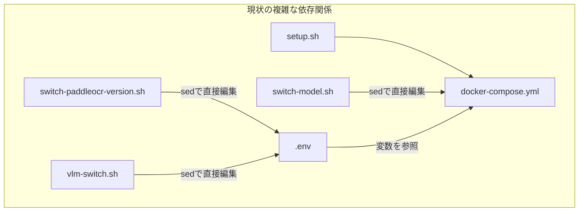
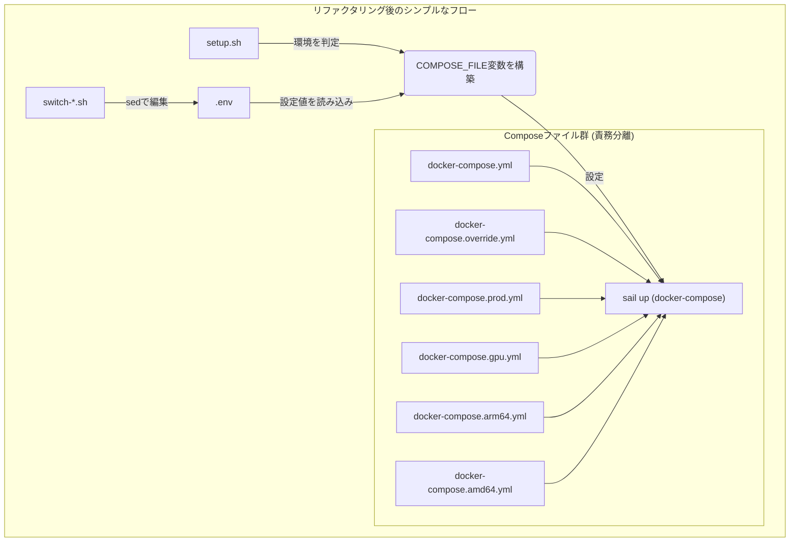

# Docker Compose構成のリファクタリング計画

**作成日:** 2025年11月2日  
**最終更新:** 2025年11月2日（ステップバイステップ化）  
**ドキュメント種別:** 作業ファイル（計画・設計）  
**ステータス:** 実装準備完了

> **📖 関連ドキュメント:**
> - [環境構築スクリプト実装記録](../../development/environment-setup.md)
> - `bin/setup.sh`, `docker-compose.yml`, `docker-compose.prod.yml`, `docker-compose.gpu.yml`
> - `bin/switch-model.sh`, `bin/vlm-switch.sh`, `bin/switch-paddleocr-version.sh`

---

## 目次

1. [背景と目的](#1-背景と目的)
2. [現状の課題](#2-現状の課題)
3. [リファクタリング方針](#3-リファクタリング方針)
4. [実装ロードマップ](#4-実装ロードマップ)
5. [Phase 1: 準備作業](#phase-1-準備作業破壊的変更なし)
6. [Phase 2: スクリプト移行](#phase-2-スクリプト移行)
7. [Phase 3: クリーンアップ](#phase-3-クリーンアップ)
8. [テスト戦略](#8-テスト戦略)
9. [リスクと対策](#9-リスクと対策)

---

## 1. 背景と目的

### 1.1. 背景

現在のLedgerLeap開発環境は、複数のシェルスクリプトと複数のDocker Composeファイルによって管理されているが、コンポーネント間の責務分担が不明確で、環境構築の複雑性が増大している。

**主な課題:**
- `setup.sh` が開発環境のみに対応（本番環境・GPU環境未対応）
- `switch-*.sh` スクリプトが `docker-compose.yml` を直接 `sed` で書き換え、Gitと競合
- 設定の信頼できる情報源（Single Source of Truth）が分散

### 1.2. 目的

1. **責務の明確化:** 各Docker Composeファイルの役割を明確に分離
2. **設定の一元化:** `.env` ファイルを環境設定の唯一の情報源とする
3. **構築プロセスの統一:** `setup.sh` を全環境対応の統一スクリプトへ昇格
4. **保守性の向上:** `docker-compose.yml` の直接編集を廃止

---

## 2. 現状の課題（詳細分析）

### 2.1. 設定の重複と不整合

`docker-compose.yml`（開発用）と `docker-compose.prod.yml`（本番用）では、大半のサービス定義が重複している。これはメンテナンス性を低下させ、両ファイル間で設定の乖離を生む原因となっている。

### 2.2. 責務の分散

| 設定項目 | 管理場所 | 問題点 |
|:---|:---|:---|
| **環境種別 (開発/本番)** | `setup.sh` の `-p` オプション（未実装）、`dev.sh`/`prod.sh` | 環境切り替え方法が二重化 |
| **GPU利用の有無** | `switch-paddleocr-version.sh` | `.env` に `COMPOSE_FILE` を直接書き込む |
| **アーキテクチャ (ARM/AMD)** | `switch-model.sh` | `docker-compose.yml` を直接編集 |
| **VLMモデルの選択** | `vlm-switch.sh` | `.env` の `VLM_SERVICE_CONTEXT` を書き換える |

### 2.2. Git管理との競合

`switch-*.sh` が `docker-compose.yml` を直接変更するため、`git status` で常に差分が検出される。

### 2.3. Git管理との競合

`switch-*.sh` スクリプトが `docker-compose.yml` を直接変更するため、`git status` で常に差分として検出される。これにより、開発者は意図しない変更をコミットしてしまうリスクを負う。



### 2.4. 既存ファイルの問題点（再検証結果）

**`dev.sh` / `prod.sh`:**
- `setup.sh` と独立して動作し、環境切り替え方法が二重化
- `prod.sh` は `--build` オプションを使用するが、`setup.sh` との整合性なし

**`switch-model.sh`:**
- `EMBEDDING_MODEL` 環境変数を `docker-compose.yml` で直接 `sed` 編集
- `platform` ディレクティブも `sed` で書き換え

**`switch-paddleocr-version.sh`:**
- GPU版切り替え時に `.env` の `COMPOSE_FILE` を直接書き込み
- `setup.sh` の動的構築と競合

---

---

## 3. リファクタリング方針

### 3.1. Docker Composeファイルの責務を明確化

Docker Composeの[マージ機能](https://docs.docker.com/compose/multiple-compose-files/)を最大限に活用し、各ファイルを特定の責務に特化させる。

-   **`docker-compose.yml` (ベース):**
    -   全環境で共通のサービス定義のみを記述。
    -   環境依存の値はすべて `.env` の変数を参照 (`${...}`)。
    -   `platform` 等のハードウェア依存の指定は削除。
-   **`docker-compose.override.yml` (開発環境):**
    -   開発時にのみ必要な設定（ポート公開、Xdebug、ボリュームマウント等）。
    -   Docker Composeがデフォルトで読み込むため、特別な指定は不要。
-   **`docker-compose.prod.yml` (本番環境):**
    -   本番用のオーバーライド設定（リソース制限強化、ポート非公開等）。
-   **`docker-compose.gpu.yml` (GPU用):**
    -   GPUを必要とするサービスの `deploy` セクションや `build` 引数をオーバーライド。
-   **`docker-compose.arm64.yml` / `docker-compose.amd64.yml` (アーキテクチャ用 - 新設):**
    -   `platform` ディレクティブやアーキテクチャ依存のイメージ指定を分離。

### 3.2. 各ファイルの責務分離表

| ファイル | 責務 | 読み込みタイミング |
|:---|:---|:---|
| `docker-compose.yml` | 全環境共通のベース定義 | 常に |
| `docker-compose.override.yml` | 開発環境用設定 | 開発時（自動） |
| `docker-compose.prod.yml` | 本番環境用オーバーライド | `setup.sh -p` 指定時 |
| `docker-compose.gpu.yml` | GPU利用時の設定 | `.env` の `PADDLEOCR_DEVICE=gpu` 時 |
| `docker-compose.arm64.yml` | ARM64アーキテクチャ用 | `uname -m` が arm64 時 |
| `docker-compose.amd64.yml` | AMD64アーキテクチャ用 | `uname -m` が x86_64 時 |

### 3.3. `.env` を唯一の信頼できる情報源 (Single Source of Truth) とする

-   モデル選択、バージョン指定など、コンテナの挙動を変える設定は**すべて `.env` ファイルで管理**する。
-   各種 `switch-*.sh` スクリプトは、`docker-compose.yml` を直接編集せず、**.env ファイルの変数を書き換える**責務に特化させる。

### 3.4. `bin/setup.sh` を環境構築の司令塔とする

-   `setup.sh` が、環境変数やオプションを解釈し、読み込むべきDocker Composeファイルのリストを動的に組み立てる。
-   組み立てたリストを `COMPOSE_FILE` 環境変数に設定し、`sail` コマンドを実行する。



### 3.2. `.env` を Single Source of Truth とする

**新規追加する環境変数:**
```bash
# Embedding Service Configuration
EMBEDDING_MODEL=cl-nagoya/ruri-v3-310m
EMBEDDING_DIMENSIONS=768
EMBEDDING_USE_ONNX=false
EMBEDDING_CPU_THREADS=4

# PaddleOCR Configuration
PADDLEOCR_VERSION=2
PADDLEOCR_DEVICE=cpu

# Environment Type
APP_ENV=local
```

### 3.3. スクリプトの役割再定義

- **`setup.sh`:** 環境を判定し、適切な `COMPOSE_FILE` を動的構築して起動
- **`switch-*.sh`:** `.env` ファイルの変数のみを編集（`docker-compose.yml` には触らない）
- **`dev.sh` / `prod.sh`:** `setup.sh` のラッパーとして再実装、または廃止

---

## 4. 実装ロードマップ

### Phase 1: 準備（破壊的変更なし）
- **期間:** 1-2日
- **目標:** 新しいファイルと環境変数を追加し、既存動作に影響を与えない

### Phase 2: スクリプト移行
- **期間:** 2-3日
- **目標:** `setup.sh` と `switch-*.sh` を新ロジックに移行、並行運用期間を設ける

### Phase 3: クリーンアップ
- **期間:** 1日
- **目標:** 旧ロジックの削除、ドキュメント整備

---

## Phase 1: 準備作業（破壊的変更なし）

### Step 1.1: アーキテクチャ用Composeファイルの作成

**作業内容:**
`docker-compose.arm64.yml` と `docker-compose.amd64.yml` を新規作成し、`platform` ディレクティブを集約する。

**対象サービス（現在 `platform` を持つもの）:**
- `embedding`
- `vlm`
- `redis`
- `tika`

**作業手順:**
1. `docker-compose.arm64.yml` を作成
   ```yaml
   services:
     embedding:
       platform: linux/arm64
     vlm:
       platform: linux/arm64
     redis:
       platform: linux/arm64
     tika:
       platform: linux/arm64
   ```

2. `docker-compose.amd64.yml` を作成
   ```yaml
   services:
     embedding:
       platform: linux/amd64
     vlm:
       platform: linux/amd64
     redis:
       platform: linux/amd64
     tika:
       platform: linux/amd64
   ```

**検証:**
```bash
# ARM64環境での確認
export COMPOSE_FILE=docker-compose.yml:docker-compose.arm64.yml
docker compose config | grep platform

# AMD64環境での確認
export COMPOSE_FILE=docker-compose.yml:docker-compose.amd64.yml
docker compose config | grep platform
```

**完了条件:**
- [ ] `docker-compose.arm64.yml` 作成完了
- [ ] `docker-compose.amd64.yml` 作成完了
- [ ] `docker compose config` で `platform` が正しく適用されることを確認

---

### Step 1.2: `.env.example` への環境変数追加

**作業内容:**
`.env.example` に新しい環境変数を追加する（既存の挙動は変えない）。

**追加する変数:**
```bash
# ========================================
# Embedding Service Configuration
# ========================================
EMBEDDING_MODEL=cl-nagoya/ruri-v3-310m
EMBEDDING_DIMENSIONS=768
EMBEDDING_USE_ONNX=false
EMBEDDING_CPU_THREADS=4

# ========================================
# PaddleOCR Configuration
# ========================================
PADDLEOCR_VERSION=2
PADDLEOCR_DEVICE=cpu

# ========================================
# Environment Type
# ========================================
# APP_ENV is already defined, but ensure it exists
# APP_ENV=local
```

**作業手順:**
1. `.env.example` を開く
2. 既存の `EMBEDDING_SERVICE_URL` の下に `EMBEDDING_MODEL` 等を追加
3. 既存の `VLM_MODEL` の下に `PADDLEOCR_VERSION` 等を追加
4. コメントで各変数の用途を明記

**検証:**
```bash
# .env.example の差分確認
git diff .env.example
```

**完了条件:**
- [ ] `.env.example` に変数追加完了
- [ ] 各変数にコメントで説明を追加
- [ ] 既存の変数との重複がないことを確認

---

### Step 1.3: `docker-compose.yml` での環境変数参照への準備

**作業内容:**
`docker-compose.yml` で `EMBEDDING_MODEL` をハードコードから環境変数参照に変更する（まだ `platform` は削除しない）。

**変更箇所:**
```yaml
# 変更前
services:
  embedding:
    environment:
      - EMBEDDING_MODEL=cl-nagoya/ruri-v3-310m
    platform: linux/arm64  # Auto-set by switch-model.sh

# 変更後
services:
  embedding:
    environment:
      - EMBEDDING_MODEL=${EMBEDDING_MODEL:-cl-nagoya/ruri-v3-310m}
      - USE_ONNX=${EMBEDDING_USE_ONNX:-false}
      - CPU_THREADS=${EMBEDDING_CPU_THREADS:-4}
    platform: linux/arm64  # Auto-set by switch-model.sh
```

**検証:**
```bash
# 環境変数が正しく展開されるか確認
docker compose config | grep EMBEDDING_MODEL
```

**完了条件:**
- [ ] `EMBEDDING_MODEL` を環境変数参照に変更
- [ ] デフォルト値が設定されている
- [ ] `docker compose config` で正しく展開されることを確認

---

### Step 1.4: Phase 1 統合テスト

**テスト内容:**
新しいファイルと環境変数を追加した状態で、既存の動作に影響がないことを確認する。

**テスト手順:**
1. `.env` ファイルを作成（`.env.example` からコピー）
2. 新しい環境変数を `.env` に追加
3. 既存の `setup.sh` で環境を起動
4. 各サービスが正常に起動することを確認

```bash
# テスト実行
cp .env.example .env
./bin/setup.sh

# 確認
./vendor/bin/sail ps
./vendor/bin/sail artisan --version
```

**完了条件:**
- [ ] 開発環境（ARM64 Mac）で正常起動
- [ ] 全サービスが healthy 状態
- [ ] 既存の動作に影響がない

---

## Phase 2: スクリプト移行

### Step 2.1: `setup.sh` の新ロジック実装

**作業内容:**
`setup.sh` に `COMPOSE_FILE` を動的に構築するロジックを追加する。

**実装内容:**
```bash
#!/bin/bash
set -e

# --- Helper Functions ---
info() {
    echo "INFO: $1"
}

error() {
    echo "ERROR: $1" >&2
}

# --- Environment Configuration ---
ENV="development"
COMPOSE_FILES_ARRAY=()

# 0. .env ファイルの存在確認と読み込み
if [ ! -f .env ]; then
    info "Creating .env file from .env.example..."
    cp .env.example .env
fi

# .env を読み込む（GPU判定等で使用）
if [ -f ".env" ]; then
    set -a
    source .env
    set +a
fi

# 1. ベースファイルの追加
COMPOSE_FILES_ARRAY+=("docker-compose.yml")

# 2. 環境に応じたオーバーライドファイルの判定
while getopts "ph" opt; do
  case ${opt} in
    p )
      ENV="production"
      COMPOSE_FILES_ARRAY+=("docker-compose.prod.yml")
      ;;
    h )
      echo "Usage: $0 [-p]"
      echo "  -p  Use production configuration"
      exit 0
      ;;
    \? )
      error "Invalid option"
      exit 1
      ;;
  esac
done

# 開発環境では docker-compose.override.yml が自動で読み込まれる
# （Docker Compose のデフォルト挙動）
if [ "$ENV" = "development" ] && [ -f "docker-compose.override.yml" ]; then
    info "docker-compose.override.yml will be loaded automatically (development mode)"
fi

# 3. アーキテクチャの自動検出
ARCH=$(uname -m)
info "Detected architecture: $ARCH"

if [[ "$ARCH" == "arm64" || "$ARCH" == "aarch64" ]]; then
    if [ -f "docker-compose.arm64.yml" ]; then
        COMPOSE_FILES_ARRAY+=("docker-compose.arm64.yml")
        info "Using ARM64 architecture configuration"
    fi
elif [[ "$ARCH" == "x86_64" ]]; then
    if [ -f "docker-compose.amd64.yml" ]; then
        COMPOSE_FILES_ARRAY+=("docker-compose.amd64.yml")
        info "Using AMD64 architecture configuration"
    fi
else
    error "Unsupported architecture: $ARCH"
    exit 1
fi

# 4. GPU利用の判定
if [ "$PADDLEOCR_DEVICE" = "gpu" ]; then
    if [ -f "docker-compose.gpu.yml" ]; then
        COMPOSE_FILES_ARRAY+=("docker-compose.gpu.yml")
        info "GPU support enabled"
    else
        error "docker-compose.gpu.yml not found, but PADDLEOCR_DEVICE=gpu is set"
        exit 1
    fi
fi

# 5. COMPOSE_FILE環境変数を構築
export COMPOSE_FILE=$(IFS=: ; echo "${COMPOSE_FILES_ARRAY[*]}")
info "Using COMPOSE_FILE: $COMPOSE_FILE"

# --- Main Setup ---
info "Starting LedgerLeap setup..."

# Build and start Docker containers
info "Building and starting Docker containers with Sail... (This may take a while)"
./vendor/bin/sail build --no-cache
./vendor/bin/sail up -d

# Install dependencies and run migrations
info "Installing dependencies and running migrations..."
rm -rf node_modules package-lock.json
./bin/install_dependencies_and_migrate.sh

info "Setup complete! The application should be running at http://localhost"
echo "You can now create a tenant using 'sail artisan tinker'."
```

**検証:**
```bash
# 開発環境での起動テスト
./bin/setup.sh

# 本番環境での起動テスト（ドライラン）
./bin/setup.sh -p
```

**完了条件:**
- [ ] `setup.sh` の新ロジック実装完了
- [ ] `-p` オプションが正しく動作
- [ ] アーキテクチャ自動検出が動作
- [ ] GPU判定が動作

---

### Step 2.2: `switch-model.sh` の修正

**作業内容:**
`docker-compose.yml` の直接編集を廃止し、`.env` ファイルの変数のみを編集するように変更する。

**変更箇所:**
```bash
# 削除する処理（sedによるdocker-compose.yml編集）
# docker-compose.ymlの更新
if [ -f "$PROJECT_ROOT/docker-compose.yml" ]; then
    if [[ "$OSTYPE" == "darwin"* ]]; then
        sed -i '' "s|EMBEDDING_MODEL=.*|EMBEDDING_MODEL=${model_name}|" "$PROJECT_ROOT/docker-compose.yml"
        sed -i '' "s|platform: linux/.*|platform: ${TARGET_PLATFORM}  # Auto-set by switch-model.sh|" "$PROJECT_ROOT/docker-compose.yml"
    else
        sed -i "s|EMBEDDING_MODEL=.*|EMBEDDING_MODEL=${model_name}|" "$PROJECT_ROOT/docker-compose.yml"
        sed -i "s|platform: linux/.*|platform: ${TARGET_PLATFORM}  # Auto-set by switch-model.sh|" "$PROJECT_ROOT/docker-compose.yml"
    fi
fi

# 追加する処理（.env編集）
update_env_file() {
    local key=$1
    local value=$2
    local env_file="$PROJECT_ROOT/.env"

    if grep -q "^${key}=" "$env_file"; then
        if [[ "$OSTYPE" == "darwin"* ]]; then
            sed -i '' "s|^${key}=.*|${key}=${value}|" "$env_file"
        else
            sed -i "s|^${key}=.*|${key}=${value}|" "$env_file"
        fi
    else
        echo "${key}=${value}" >> "$env_file"
    fi
}

# 使用例
update_env_file "EMBEDDING_MODEL" "$model_name"
update_env_file "EMBEDDING_DIMENSIONS" "$dimensions"
```

**変更後の動作:**
1. モデル情報を `.env` の `EMBEDDING_MODEL` に書き込む
2. `platform` の変更は行わない（アーキテクチャ用ファイルで自動対応）
3. コンテナ再起動を促すメッセージを表示

**検証:**
```bash
# モデル切り替えテスト
./bin/switch-model.sh ruri-v3-30m

# .envの確認
grep EMBEDDING_MODEL .env

# docker-compose.ymlが変更されていないことを確認
git diff docker-compose.yml
```

**完了条件:**
- [ ] `docker-compose.yml` の直接編集を削除
- [ ] `.env` 編集のみに変更
- [ ] 動作テスト完了

---

### Step 2.3: `switch-paddleocr-version.sh` の修正

**作業内容:**
`.env` への `COMPOSE_FILE` 書き込みを削除し、`PADDLEOCR_DEVICE` 変数のみを管理する。

**削除する処理:**
```bash
# COMPOSE_FILE の書き込み（削除）
remove_from_env_file "COMPOSE_FILE"
update_env_file "COMPOSE_FILE" "docker-compose.yml:docker-compose.gpu.yml"
```

**変更する処理:**
```bash
switch_to_gpu() {
    echo -e "${BLUE}Switching to PaddleOCR-VL (GPU)...${NC}"
    
    # .env の更新（PADDLEOCR_DEVICE のみ）
    update_env_file "PADDLEOCR_DEVICE" "gpu"
    update_env_file "VLM_MODEL" "paddleocr-vl"
    update_env_file "VLM_SERVICE_CONTEXT" "./docker/paddleocr-vl"
    update_env_file "VLM_INTERNAL_PORT" "8002"
    
    echo -e "${GREEN}✓ Configuration updated${NC}"
    echo -e "${YELLOW}Please restart the environment:${NC}"
    echo -e "  ./vendor/bin/sail down"
    echo -e "  ./bin/setup.sh"
}

switch_to_cpu() {
    echo -e "${GREEN}Switching to PaddleOCR CPU version...${NC}"
    
    # .env の更新
    update_env_file "PADDLEOCR_DEVICE" "cpu"
    update_env_file "VLM_MODEL" "paddleocr"
    update_env_file "VLM_SERVICE_CONTEXT" "./docker/paddle"
    update_env_file "VLM_INTERNAL_PORT" "8000"
    
    # バージョン固有のファイル切り替え処理...
    # （既存のロジックを維持）
}
```

**検証:**
```bash
# GPU版への切り替え
./bin/switch-paddleocr-version.sh gpu

# .envの確認
grep PADDLEOCR_DEVICE .env
grep COMPOSE_FILE .env  # 存在しないことを確認

# CPU版への切り替え
./bin/switch-paddleocr-version.sh 2
```

**完了条件:**
- [ ] `COMPOSE_FILE` の書き込みを削除
- [ ] `PADDLEOCR_DEVICE` のみを管理
- [ ] 動作テスト完了

---

### Step 2.4: `vlm-switch.sh` の連携強化

**作業内容:**
GPU必須のモデルへの切り替え時に `PADDLEOCR_DEVICE=gpu` を自動設定する。

**追加する処理:**
```bash
switch_to_paddleocr_vl() {
    echo -e "${BLUE}Switching to PaddleOCR-VL (GPU required)...${NC}"
    
    # GPU必須の警告
    echo -e "${YELLOW}Warning: PaddleOCR-VL requires GPU support${NC}"
    
    # .env の更新
    update_env_file "VLM_MODEL" "paddleocr-vl"
    update_env_file "VLM_SERVICE_CONTEXT" "./docker/paddleocr-vl"
    update_env_file "VLM_INTERNAL_PORT" "8002"
    update_env_file "PADDLEOCR_DEVICE" "gpu"  # 追加
    
    echo -e "${GREEN}✓ Configuration updated${NC}"
    echo -e "${YELLOW}Please restart the environment with GPU support:${NC}"
    echo -e "  ./vendor/bin/sail down"
    echo -e "  ./bin/setup.sh"
}

switch_to_paddleocr_cpu() {
    echo -e "${GREEN}Switching to PaddleOCR (CPU)...${NC}"
    
    # .env の更新
    update_env_file "VLM_MODEL" "paddleocr"
    update_env_file "VLM_SERVICE_CONTEXT" "./docker/paddle"
    update_env_file "VLM_INTERNAL_PORT" "8000"
    update_env_file "PADDLEOCR_DEVICE" "cpu"  # 追加
    
    echo -e "${GREEN}✓ Configuration updated${NC}"
}
```

**検証:**
```bash
# VLMモデル切り替えテスト
./bin/vlm-switch.sh

# .envの確認
grep PADDLEOCR_DEVICE .env
```

**完了条件:**
- [ ] GPU必須モデル切り替え時に `PADDLEOCR_DEVICE=gpu` を自動設定
- [ ] CPU版切り替え時に `PADDLEOCR_DEVICE=cpu` を自動設定
- [ ] 動作テスト完了

---

### Step 2.5: `dev.sh` / `prod.sh` の再実装

**作業内容:**
`dev.sh` と `prod.sh` を `setup.sh` のラッパーとして再実装する。

**`dev.sh` の実装:**
```bash
#!/bin/bash
# Development environment launcher
# This is a wrapper script for setup.sh

set -e

# .env.development を .env にコピー（存在する場合）
if [ -f .env.development ]; then
    echo "INFO: Copying .env.development to .env"
    cp .env.development .env
fi

# setup.sh を呼び出し
./bin/setup.sh "$@"
```

**`prod.sh` の実装:**
```bash
#!/bin/bash
# Production environment launcher
# This is a wrapper script for setup.sh

set -e

# .env.production を .env にコピー（存在する場合）
if [ -f .env.production ]; then
    echo "INFO: Copying .env.production to .env"
    cp .env.production .env
fi

# setup.sh を -p オプション付きで呼び出し
./bin/setup.sh -p "$@"
```

**検証:**
```bash
# 開発環境起動
./dev.sh

# 本番環境起動（ドライラン）
./prod.sh
```

**完了条件:**
- [ ] `dev.sh` の再実装完了
- [ ] `prod.sh` の再実装完了
- [ ] 動作テスト完了

---

### Step 2.6: Phase 2 統合テスト

**テスト内容:**
全てのスクリプトが新ロジックで正しく動作することを確認する。

**テストケース:**

1. **開発環境起動（ARM64）**
   ```bash
   ./bin/setup.sh
   # 期待: docker-compose.yml + docker-compose.override.yml + docker-compose.arm64.yml
   ```

2. **本番環境起動（AMD64）**
   ```bash
   ./bin/setup.sh -p
   # 期待: docker-compose.yml + docker-compose.prod.yml + docker-compose.amd64.yml
   ```

3. **GPU環境起動**
   ```bash
   # .env で PADDLEOCR_DEVICE=gpu に設定
   ./bin/setup.sh
   # 期待: docker-compose.yml + docker-compose.override.yml + docker-compose.arm64.yml + docker-compose.gpu.yml
   ```

4. **モデル切り替え**
   ```bash
   ./bin/switch-model.sh ruri-v3-30m
   # 期待: .env のみ変更、docker-compose.yml は変更なし
   ```

5. **OCRバージョン切り替え**
   ```bash
   ./bin/switch-paddleocr-version.sh gpu
   # 期待: .env のみ変更、COMPOSE_FILE 書き込みなし
   ```

**完了条件:**
- [ ] 全テストケースが成功
- [ ] `git status` で `docker-compose.yml` が Untracked にならない
- [ ] 全サービスが正常起動

---

## Phase 3: クリーンアップ

### Step 3.1: `docker-compose.yml` から `platform` 削除

**作業内容:**
`docker-compose.yml` と `docker-compose.prod.yml` から全ての `platform` ディレクティブを削除する。

**削除対象:**
```yaml
# docker-compose.yml から削除
services:
  embedding:
    # platform: linux/arm64  # ← 削除
  vlm:
    # platform: linux/arm64  # ← 削除
  redis:
    # platform: linux/arm64  # ← 削除
  tika:
    # platform: linux/arm64  # ← 削除
```

```yaml
# docker-compose.prod.yml から削除
services:
  embedding:
    # platform: linux/amd64  # ← 削除
  vlm:
    # platform: linux/amd64  # ← 削除
  redis:
    # platform: linux/amd64  # ← 削除
  tika:
    # platform: linux/amd64  # ← 削除
```

**検証:**
```bash
# platform が存在しないことを確認
grep -n "platform:" docker-compose.yml docker-compose.prod.yml

# 動作確認
./bin/setup.sh
./vendor/bin/sail ps
```

**完了条件:**
- [ ] 全ての `platform` ディレクティブを削除
- [ ] 動作テスト完了

---

### Step 3.2: `docker-compose.yml` の `EMBEDDING_MODEL` をハードコード削除

**作業内容:**
`docker-compose.yml` で環境変数参照のみにし、ハードコードされた値を削除する。

**変更箇所:**
```yaml
# 変更前
services:
  embedding:
    environment:
      - EMBEDDING_MODEL=${EMBEDDING_MODEL:-cl-nagoya/ruri-v3-310m}

# 変更後（デフォルト値は .env で管理）
services:
  embedding:
    environment:
      - EMBEDDING_MODEL=${EMBEDDING_MODEL}
```

> **注意:** デフォルト値は `.env.example` で定義されているため、`docker-compose.yml` ではデフォルト値なしで参照する。

**検証:**
```bash
# 環境変数が正しく読み込まれるか確認
docker compose config | grep EMBEDDING_MODEL
```

**完了条件:**
- [ ] ハードコードされた値を削除
- [ ] 環境変数参照のみに変更

---

### Step 3.3: 旧スクリプトのコメント削除

**作業内容:**
`switch-model.sh` と `switch-paddleocr-version.sh` から、削除したコードに関連するコメントを削除する。

**削除対象:**
```bash
# switch-model.sh
# "Auto-set by switch-model.sh" などのコメント

# switch-paddleocr-version.sh
# "COMPOSE_FILE" に関する説明
```

**完了条件:**
- [ ] 旧ロジックに関するコメントを削除
- [ ] Usage セクションを更新

---

### Step 3.4: ドキュメント更新

**更新対象:**
1. `README.md`: 環境構築手順の更新
2. `docs/development/environment-setup.md`: 詳細な環境構築手順
3. `.github/copilot-instructions.md`: 開発コマンドの更新
4. 各 `switch-*.sh` スクリプトの Usage セクション

**`README.md` の更新内容:**
```markdown
## 環境構築

### 開発環境

```bash
# 初回セットアップ
./bin/setup.sh

# または
./dev.sh
```

### 本番環境

```bash
./bin/setup.sh -p

# または
./prod.sh
```

### GPU環境

```bash
# .env で PADDLEOCR_DEVICE=gpu に設定
./bin/setup.sh
```
```

**各スクリプトの Usage 更新:**

**`bin/setup.sh`:**
```bash
print_usage() {
    echo "Usage: $0 [-p] [-h]"
    echo ""
    echo "Options:"
    echo "  -p  Use production configuration"
    echo "  -h  Show this help message"
    echo ""
    echo "Environment detection:"
    echo "  - Architecture: Automatically detected (ARM64/AMD64)"
    echo "  - GPU support: Based on PADDLEOCR_DEVICE in .env"
    echo ""
    echo "Examples:"
    echo "  $0      # Development environment"
    echo "  $0 -p   # Production environment"
}
```

**`bin/switch-model.sh`:**
```bash
print_usage() {
    echo "Usage: $0 [model-key]"
    echo ""
    echo "This script updates EMBEDDING_MODEL in .env file."
    echo "After switching, restart the environment:"
    echo "  ./vendor/bin/sail down"
    echo "  ./bin/setup.sh"
    echo ""
    echo "Available models:"
    echo "  ruri-v3-310m, ruri-v3-30m, multilingual-e5-small, etc."
}
```

**完了条件:**
- [ ] `README.md` 更新完了
- [ ] `docs/development/environment-setup.md` 更新完了
- [ ] `.github/copilot-instructions.md` 更新完了
- [ ] 各スクリプトの Usage 更新完了

---

### Step 3.5: バックアップファイルの削除

**作業内容:**
リファクタリング前に作成したバックアップファイルを削除する。

```bash
rm -f docs/work/environment/2025-11-02_docker-compose-refactoring-plan.md.backup
```

**完了条件:**
- [ ] バックアップファイル削除完了

---

## 8. テスト戦略

### 8.1. ユニットテスト（各Step完了時）

各Stepの完了条件に従ってテストを実施する。

### 8.2. 統合テスト（Phase完了時）

**Phase 1 完了時:**
- [ ] 開発環境（ARM64 Mac）での起動確認
- [ ] 新しいファイルが正しく読み込まれることを確認
- [ ] 既存の動作に影響がないことを確認

**Phase 2 完了時:**
- [ ] 開発環境（ARM64 Mac）での起動確認
- [ ] 本番環境（AMD64 Linux）での起動確認（可能であれば）
- [ ] GPU環境での起動確認（利用可能な場合）
- [ ] モデル切り替えスクリプトの動作確認
- [ ] OCRバージョン切り替えの動作確認
- [ ] `git status` で `docker-compose.yml` が変更されていないことを確認

**Phase 3 完了時:**
- [ ] 全環境での起動確認
- [ ] ドキュメントの記載内容が正しいことを確認
- [ ] CI/CDパイプラインへの影響確認

### 8.3. エンドツーエンドテスト

**テストシナリオ:**
1. 新規プロジェクトクローン
2. `./bin/setup.sh` で環境構築
3. モデル切り替え → 環境再起動 → 正常動作確認
4. GPU版切り替え → 環境再起動 → 正常動作確認

---

## 9. リスクと対策

| リスク | 影響度 | 対策 | 軽減策 |
|:---|:---|:---|:---|
| **既存スクリプトとの互換性問題** | 中 | 各スクリプトの動作を個別にテスト | 並行運用期間を設ける |
| **Docker Composeのマージ順序** | 低 | ファイル指定順序を正しく構築 | `docker compose config` で検証 |
| **環境変数の読み込みタイミング** | 低 | `.env` を `COMPOSE_FILE` 構築前に読み込む | `set -a; source .env; set +a` を使用 |
| **本番環境での未検証動作** | 中 | テスト環境で十分に検証 | ドライラン機能を実装 |
| **開発者の混乱** | 低 | ドキュメントを充実させる | 移行ガイドを作成 |

---

## 10. 次のアクション

### 即座に開始可能な作業
1. **Phase 1, Step 1.1**: アーキテクチャ用Composeファイルの作成
2. **Phase 1, Step 1.2**: `.env.example` への環境変数追加

### 承認が必要な決定事項
- [ ] `dev.sh` / `prod.sh` を廃止するか、ラッパーとして残すか
- [ ] 並行運用期間の長さ（推奨: 1週間）

### 今後の拡張可能性
- `setup.sh` に `-t` オプションを追加してテスト環境を構築
- `docker-compose.test.yml` の作成（CI/CD用）
- `setup.sh` にドライランモード（`--dry-run`）を追加

---

**このドキュメントに従って、段階的にリファクタリングを進めてください。**  
**各Stepの完了条件を満たすことで、安全かつ確実に移行が完了します。**
