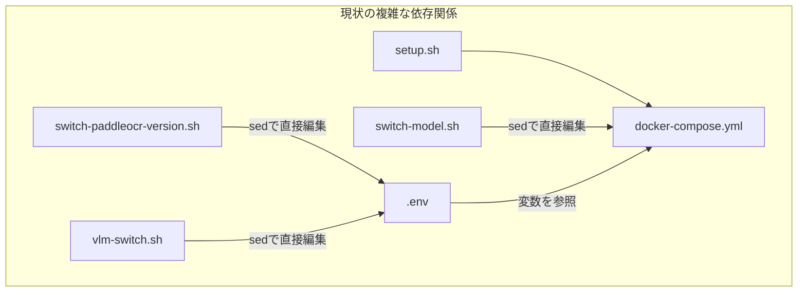
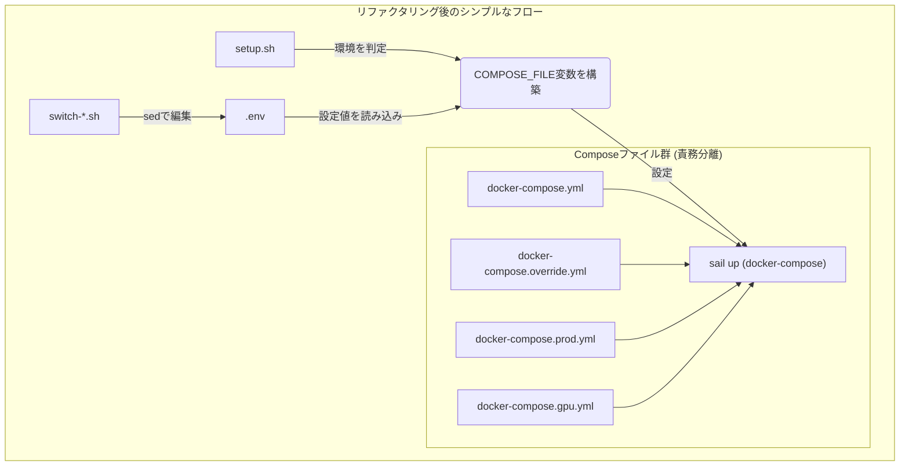

# Docker Compose構成のリファクタリング計画

**作成日:** 2025年11月2日
**ドキュメント種別:** 作業ファイル（計画・設計）
**ステータス:** 計画策定

> **📖 関連ドキュメント:**
> - [環境構築スクリプト実装記録](../../development/environment-setup.md) - 既存の環境構築に関する記録
> - `bin/setup.sh`, `docker-compose.yml`, `docker-compose.prod.yml`, `docker-compose.gpu.yml`
> - `bin/switch-model.sh`, `bin/vlm-switch.sh`

---

## 1. 背景と目的

### 1.1. 背景

現在のLedgerLeap開発環境は、複数のシェルスクリプト (`setup.sh`, `switch-model.sh` 等) と複数のDocker Composeファイル (`docker-compose.yml`, `docker-compose.prod.yml` 等) によって管理されている。しかし、これらのコンポーネント間の責務分担が不明確であり、設定変更のメカニズムが複数存在するため、環境構築の複雑性が増大している。

特に、以下の点が課題として挙げられる。

-   `setup.sh` が開発環境用の `docker-compose.yml` に依存しており、本番環境やGPU環境の構築に対応していない。
-   `switch-*.sh` スクリプトが `docker-compose.yml` や `.env` ファイルを直接 `sed` コマンドで書き換えており、Gitでのバージョン管理と競合しやすい。
-   設定の信頼できる情報源 (Single Source of Truth) が分散しており、どの設定がどこで管理されているのか追跡が困難。

### 1.2. 目的

本計画の目的は、Docker環境の構成管理をリファクタリングし、以下の状態を実現することである。

1.  **責務の明確化:** 各Docker Composeファイルの役割を明確に分離する。
2.  **設定の一元化:** `.env` ファイルを環境設定の唯一の信頼できる情報源とする。
3.  **構築プロセスの統一:** `setup.sh` を、あらゆる環境（開発/本番/GPU/CPU/ARM/AMD）に対応可能な統一的な構築スクリプトへと昇格させる。
4.  **保守性の向上:** `docker-compose.yml` の直接編集を廃止し、Gitでの管理を容易にする。

---

## 2. 現状の課題（詳細分析）

### 2.1. 設定の重複と不整合

`docker-compose.yml`（開発用）と `docker-compose.prod.yml`（本番用）では、大半のサービス定義が重複している。これはメンテナンス性を低下させ、両ファイル間で設定の乖離を生む原因となっている。

### 2.2. 責務の分散

環境を決定する設定が、複数のファイルとスクリプトに分散している。

| 設定項目 | 管理場所 | 問題点 |
| :--- | :--- | :--- |
| **環境種別 (開発/本番)** | `setup.sh` の `-p` オプション（未実装） | `setup.sh` が本番用Composeファイルを知らない |
| **GPU利用の有無** | `switch-paddleocr-version.sh` | `.env` に `COMPOSE_FILE` を書き込む |
| **アーキテクチャ (ARM/AMD)** | `switch-model.sh` | `docker-compose.yml` を直接編集 |
| **VLMモデルの選択** | `vlm-switch.sh` | `.env` の `VLM_SERVICE_CONTEXT` を書き換える |

この分散により、全体像の把握が困難になり、意図しない副作用のリスクが高まっている。

### 2.3. Git管理との競合

`switch-*.sh` スクリプトが `docker-compose.yml` を直接変更するため、`git status` で常に差分として検出される。これにより、開発者は意図しない変更をコミットしてしまうリスクを負う。



---

## 3. リファクタリング方針

### 3.1. Docker Composeファイルの責務を明確化

Docker Composeの[マージ機能](https://docs.docker.com/compose/multiple-compose-files/)を最大限に活用し、各ファイルを特定の責務に特化させる。

-   **`docker-compose.yml` (ベース):**
    -   全環境で共通のサービス定義のみを記述。
    -   環境依存の値はすべて `.env` の変数を参照 (`${...}`)。
    -   `platform` 等のハードウェア依存の指定は削除。
-   **`docker-compose.override.yml` (開発環境):**
    -   開発時にのみ必要な設定（ポート公開、Xdebug、ボリュームマウント等）。
    -   Docker Composeがデフォルトで読み込むため、特別な指定は不要。
-   **`docker-compose.prod.yml` (本番環境):**
    -   本番用のオーバーライド設定（リソース制限強化、ポート非公開等）。
-   **`docker-compose.gpu.yml` (GPU用):**
    -   GPUを必要とするサービスの `deploy` セクションや `build` 引数をオーバーライド。
-   **`docker-compose.arm64.yml` / `docker-compose.amd64.yml` (アーキテクチャ用 - 新設):**
    -   `platform` ディレクティブやアーキテクチャ依存のイメージ指定を分離。

### 3.2. `.env` を唯一の信頼できる情報源 (Single Source of Truth) とする

-   モデル選択、バージョン指定など、コンテナの挙動を変える設定は**すべて `.env` ファイルで管理**する。
-   各種 `switch-*.sh` スクリプトは、`docker-compose.yml` を直接編集せず、**.env ファイルの変数を書き換える**責務に特化させる。

### 3.3. `bin/setup.sh` を環境構築の司令塔とする

-   `setup.sh` が、環境変数やオプションを解釈し、読み込むべきDocker Composeファイルのリストを動的に組み立てる。
-   組み立てたリストを `COMPOSE_FILE` 環境変数に設定し、`sail` コマンドを実行する。



---

## 4. 実装計画（ステップ・バイ・ステップ）

### ステップ1: Docker Composeファイルの分割とリファクタリング

1.  **`docker-compose.yml` のクリーンアップ:**
    -   開発環境固有の設定（`ports`, `volumes` の一部）を `docker-compose.override.yml` に移動する。
    -   `platform` ディレクティブをすべて削除する。
    -   `docker-compose.prod.yml` との重複箇所を精査し、共通部分を `docker-compose.yml` に集約する。
2.  **`docker-compose.override.yml` の作成:**
    -   `docker-compose.yml` から移動した開発環境用設定を配置する。
3.  **`docker-compose.prod.yml` の最適化:**
    -   `docker-compose.yml` との差分のみを記述するようにリファクタリングする。
4.  **アーキテクチャ用ファイルの作成:**
    -   `docker-compose.arm64.yml` と `docker-compose.amd64.yml` を作成し、各サービスに必要な `platform` ディレクティブを記述する。

### ステップ2: `bin/setup.sh` の改修

`setup.sh` に、`COMPOSE_FILE` 環境変数を動的に構築するロジックを追加する。

```bash
#!/bin/bash
set -e

# ... (Helper Functions) ...

# --- Environment Configuration ---
ENV="development"
COMPOSE_FILES_ARRAY=()

# 1. ベースファイルの追加
COMPOSE_FILES_ARRAY+=("docker-compose.yml")

# 2. 環境に応じたオーバーライドファイルの判定
while getopts "p" opt; do
  case ${opt} in
    p )
      ENV="production"
      COMPOSE_FILES_ARRAY+=("docker-compose.prod.yml")
      ;;
    \? ) exit 1 ;;
  esac
done

if [ "$ENV" = "development" ] && [ -f "docker-compose.override.yml" ]; then
    # 開発環境では override.yml を自動で読み込むため、配列に含めない
    # (Docker Composeのデフォルト挙動)
    :
fi

# 3. アーキテクチャの自動検出
ARCH=$(uname -m)
if [[ "$ARCH" == "arm64" || "$ARCH" == "aarch64" ]]; then
    if [ -f "docker-compose.arm64.yml" ]; then
        COMPOSE_FILES_ARRAY+=("docker-compose.arm64.yml")
    fi
elif [[ "$ARCH" == "x86_64" ]]; then
    if [ -f "docker-compose.amd64.yml" ]; then
        COMPOSE_FILES_ARRAY+=("docker-compose.amd64.yml")
    fi
fi

# 4. GPU利用の判定 (.envから読み取る)
if [ -f ".env" ]; then
    source .env
fi
if [ "$PADDLEOCR_DEVICE" = "gpu" ] && [ -f "docker-compose.gpu.yml" ]; then
    COMPOSE_FILES_ARRAY+=("docker-compose.gpu.yml")
fi

# 5. COMPOSE_FILE環境変数を構築
export COMPOSE_FILE=$(IFS=: ; echo "${COMPOSE_FILES_ARRAY[*]}")
info "Using COMPOSE_FILE: $COMPOSE_FILE"

# --- Main Setup ---
# ... (sail build, sail up -d などを実行) ...
```

### ステップ3: `switch-*.sh` スクリプトの修正

-   `docker-compose.yml` を直接編集している `sed` コマンドをすべて削除する。
-   `switch-paddleocr-version.sh` が `.env` に `COMPOSE_FILE` を書き込む処理を削除し、代わりに `PADDLEOCR_DEVICE=gpu` のような変数を設定するように変更する。
-   各スクリプトの責務が `.env` ファイルの更新のみになるようにリファクタリングする。

---

## 5. 期待される効果

-   **環境構築の簡素化:** 開発者は `-p` オプションの有無だけで、開発環境と本番環境の構築を切り替えられる。
-   **自動最適化:** マシンのアーキテクチャやGPUの有無が自動で検出され、最適な構成が適用される。
-   **保守性の向上:** 設定の責務が明確になり、将来的なサービス追加や設定変更が容易になる。
-   **バージョン管理の健全化:** `docker-compose.yml` がスクリプトによって変更されなくなり、Gitの差分が常に意図したものだけになる。

---

## 6. リスクと対策

| リスク | 影響度 | 対策 |
| :--- | :--- | :--- |
| **既存スクリプトとの互換性問題** | 中 | `switch-*.sh` の修正を慎重に行い、各スクリプトの動作を個別にテストする。 |
| **Docker Composeのマージ順序** | 低 | ファイルの指定順序がマージの優先順位になることを理解し、`setup.sh` で正しい順序で配列を構築する。 |
| **環境変数の読み込みタイミング** | 低 | `setup.sh` で `.env` を `source` するタイミングを、`COMPOSE_FILE` 構築前に行う。 |

---
