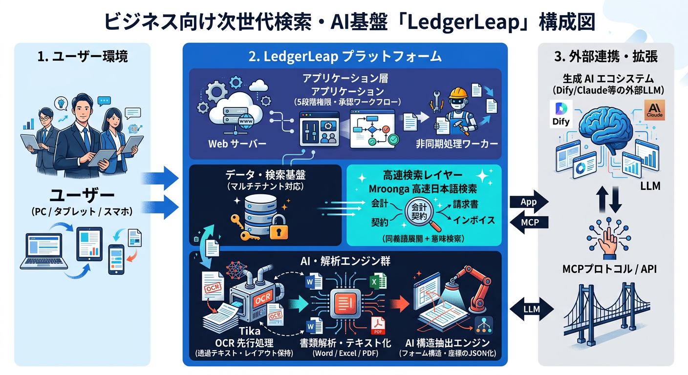

# 「請負開発」の未来を、今日から変える

## 投資ゼロで始める、現場のためのAI駆動開発実践

---
# 結論

- 利用現場で積み上げた実践記録
- テーマは「AIに仕事を奪われる」不安を、使いこなして楽になる現実へ変えること
- ツールを増やさずに手順を少し変えるための小さな工夫

---

## 2. 背景

### 生成AIとLedgerLeapの誕生

- 自作ツールが7000名以上の基幹システムへ成長し、後継課題の整理のために個人開発を開始
- 生成AIの台頭をきっかけに、仕様策定から実装までを対話中心で進める試みを選択
- 「チャットとの対話だけで仕様が形になり、動くものが出てくる」体験が転換点
- 直面した壁は開発そのものより、周囲の認識とのギャップと社内合意形成
- 仕様の抜け漏れ、ドキュメント、テスト、エビデンス整理をAIに任せる発想が出発点

---

---

## 3. 現在のシステム・アーキテクチャ
- 複雑に見えても、実態は動くパーツの組み合わせ

### 技術スタックの真意

- Laravel / Livewire : 画面開発の工数を極限まで減らすための枠組み
- Mroonga : 高速全文検索

### 注力ポイント

- フォームを開いた瞬間に連番・氏名・日時が入るなど、1、2歩楽になる体験を優先する
- 設定項目を減らして、運用時に「どこを見ればいいか」を分かりやすくする
- 管理者が知りたい情報を自然に残し、足跡が追えるようにする
- 小さな課題を一つずつ繋ぎ込み、運用負荷を上げずに機能を増やす

---

## 4. 開発方法の変化

### 従来型ウォーターフォールの空転

- 現場を知らない要求者と、技術スタックが違うエンジニアが、別レイヤーで会話しがち
- 動くものがないまま議論が進み、「言ったはず」「そんなつもりはない」が起きやすい

### AI駆動開発の合意形成

- AIは魔法ではなく、高性能な辞書・処理器として扱う
- 誰が、どの環境で、どう使うかを先に固めると、成果物の焦点が揃う
- まずはペルソナとシナリオをAIと一緒に詰め、共通認識をテキスト化する

### 明日からの小さな変化

- 仕様書より先に、使う人の日常と困りごとを言語化する
- 動くものを前提に議論を進め、空転を止める

---

## 5. AIを指揮するコントロールセンター

### `.github` はプロジェクトの脳

- 単なる設定置き場ではなく、AIにLedgerLeapのルールと技を教える場所
- 人間向けの作法を、そのままAI向けの運用ルールに落としている

### 構造の役割

- `.github/instructions/` は標準作業手順書
- `.github/prompts/` はよくある業務の指示書
- `.github/skills/` は特定課題に効く、再利用可能な治具

### 進化のサイクル

- 不具合やボトルネックを失敗で終わらせず、ルールにフィードバックする
- 過去の失敗をチェックリストにして、同じミスを繰り返さない

---

## 6. 実践プロセス

### 機能開発・改善

- `docs/work/...` のようなMarkdown計画書を、AIへの指示書兼ログとして使う
- 実装とテストはAIエージェントが進め、人間はレビューとマージに集中する

### パフォーマンス改善・調査

- HAR解析のような重い調査をAIに渡し、ボトルネックを特定させる
- 調査結果を `.github/skills/` に戻して、再利用できる形にする

### メタ開発

- テストDB汚染などのインシデントは、復旧手順を記録してルールへ反映する
- AIには、部下・相棒・先生の3つの立ち位置を使い分ける
- 完璧さより、小さく試して変化に順応し続けることを重視する

---

## 7. 現在の課題と今後の展望

### 新しい負債

- ドキュメント、Issue、コード、テスト、ヒヤリハットが分散し、文脈を追うコストが増えている
- AIによる高速実装の裏で、仕様漏れや人間が見切れないエッジケースがリスクになる
- 特にマルチテナント環境の権限モデルは、テスト網羅が最重要課題

### 次の方向性

- 指示書やスキルを増やすだけでなく、矛盾検知や整理までAIに担わせる
- 人間向けの読みやすさ以上に、AIが理解しやすく操作しやすい構造を目指す

---

## 8. 製造業・請負開発への提言

### 役割の再定義

- コードを書く人から、システムを育てる設計者へ
- 役割は作業者ではなく、環境・ルール・テストを管理する監督に近づく

### ドキュメントの再定義

- Excelの完璧な仕様書より、AIが扱える生きたドキュメントを重視する
- ペルソナ、ユーザーシナリオ、ヒヤリハット記録を軸にする

### スモールスタート

- まずはエビデンス作成、テストの雛形、ログ調査のような面倒な業務から任せる
- その小さな成功が、現場のやり方を変えていく

---

## 9. まとめ

- 明日からの武器は、新しい言語ではなく、AIを相棒として使いこなす力
- LedgerLeapは、個人や少人数でもAIを脳として使えば、複雑な現場に立ち向かえることの証明
- 最初の一歩は、面倒な業務を一つ、AIと一緒にやってみること

---

### 質疑応答

ご質問ください。
