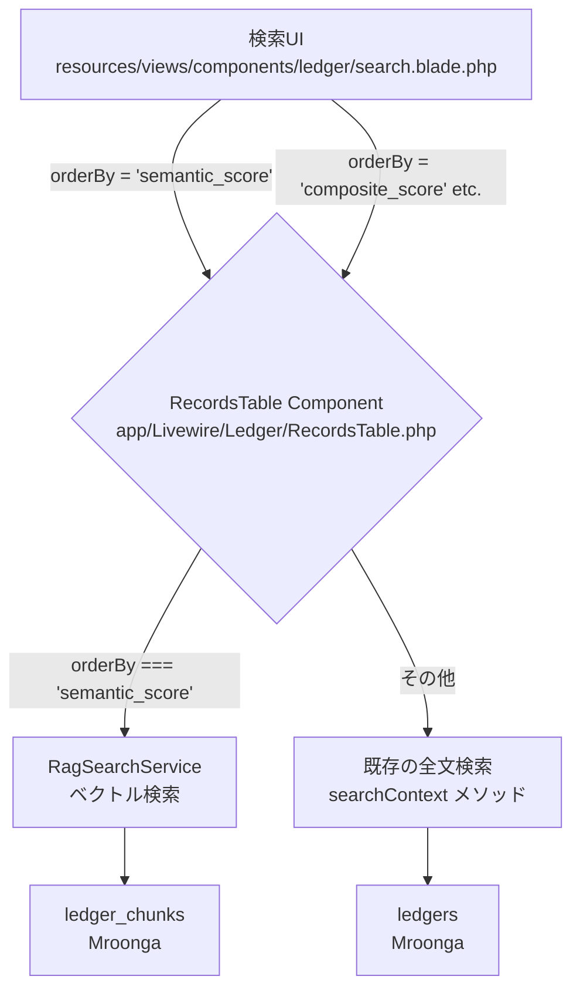
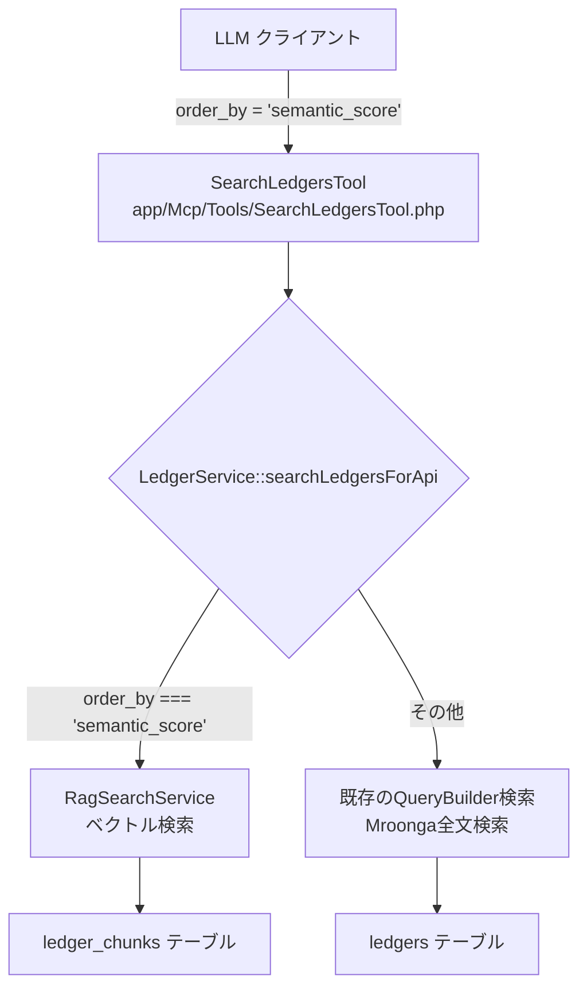

# RAG導入 Phase1 実装計画 - セマンティック検索追加

**作成日:** 2025年10月17日  
**更新日:** 2025年10月17日  
**ステータス:** 実装中  
**更新者:** GitHub Copilot CLI

> **📖 関連ドキュメント:**
> - [2025-10-16-rag-implementation-study.md](./2025-10-16-rag-implementation-study.md) - 技術検討・全体戦略

---

## 1. はじめに

### 1.1. 本計画の目的

技術検討書（`2025-10-16-rag-implementation-study.md`）で評価したアプローチに基づき、RAG機能導入の第一歩（フェーズ1）として、具体的な実装タスク、スケジュール、成功基準を定義する。

### 1.2. 採用アプローチ

以下のリスクを抑えつつ迅速に価値を検証できるアプローチをフェーズ1として採用する。

- **技術基盤:** 技術検討書における「**アプローチ1: MySQL/Mroonga 活用案**」をベースとする。既存インフラを最大限に活用し、新規ミドルウェアの導入は行わない。
- **UI/UX:** 既存の検索画面（Livewireコンポーネント）のソート順選択UIに「**セマンティック検索**」を追加する。ユーザーが明示的にセマンティック検索を選択できるようにすることで、機能の価値を直接的に評価可能にする。
- **統合範囲:** Web UI（Livewire）とMCP API（SearchLedgersTool）の両方にセマンティック検索機能を実装する。

このアプローチにより、既存の検索体験を維持しつつ、セマンティック検索という新しい価値を選択肢として提供する、スモールスタートを実現する。

### 1.3. 既存実装との統合点

#### 1.3.1. Livewire検索画面
- **コンポーネント:** `app/Livewire/Ledger/RecordsTable.php`
- **ビュー:** `resources/views/livewire/ledger/records-table.blade.php`
- **検索UI:** `resources/views/components/ledger/search.blade.php`
- **既存ソート:** `composite_score`, `created_at`, `updated_at`（`orderBy`プロパティで制御）

#### 1.3.2. MCP API
- **ツール:** `app/Mcp/Tools/SearchLedgersTool.php`
- **サービス:** `app/Services/LedgerService.php` の `searchLedgersForApi()`メソッド
- **既存パラメータ:** `order_by`, `order_direction`でソート制御

## 2. 全体アーキテクチャ

### 2.1. Web UI (Livewire) のフロー

ユーザーが検索UIで「セマンティック検索」を選択すると、Livewireコンポーネント（`RecordsTable`）の`orderBy`プロパティが`semantic_score`に設定される。コンポーネントはこのパラメータを識別し、`RagSearchService`を使用してベクトル検索を実行する。それ以外のソート順が選択された場合は、従来の全文検索ロジックが使用される。



### 2.2. MCP API のフロー

MCPツール（`SearchLedgersTool`）が`order_by=semantic_score`パラメータを受け取ると、`LedgerService::searchLedgersForApi()`内で分岐処理を行い、`RagSearchService`を呼び出す。



## 3. 実装タスク一覧 (WBS)

| ID | タスク | 担当 | 見積工数 | 備考 |
| :--- | :--- | :--- | :--- | :--- |
| **1** | **バックエンド基盤構築** | **Backend** | **3.5日** | |
| 1.1 | `ledger_chunks` テーブルのマイグレーション作成 | Backend | 0.5日 | スキーマ設計、Mroongaベクトルインデックス |
| 1.2 | Mroongaベクトル検索の技術検証（Spike） | Backend | 0.5日 | ベクトル格納・検索の実装方式確認 |
| 1.3 | `LedgerObserver` の実装 | Backend | 0.5日 | `created`, `updated`, `deleted`イベント処理 |
| 1.4 | `ProcessLedgerForRagJob` の実装 | Backend | 1.0日 | content + content_attachedのチャンキング |
| 1.5 | `EmbeddingService` の実装 | Backend | 0.5日 | OpenAI APIラッパー、エラーハンドリング |
| 1.6 | コスト試算とAPI予算確保 | Backend | 0.5日 | OpenAI API使用料の見積もり |
| **2** | **API・検索ロジック実装** | **Backend** | **2.5日** | |
| 2.1 | `RagSearchService` の基本骨格作成 | Backend | 0.5日 | インターフェース定義、DI設定 |
| 2.2 | ベクトル検索とスコア集計ロジック実装 | Backend | 1.0日 | チャンク→台帳スコア集計 |
| 2.3 | Livewire `RecordsTable` への統合 | Backend | 0.5日 | `orderBy='semantic_score'`分岐実装 |
| 2.4 | `LedgerService::searchLedgersForApi()`への統合 | Backend | 0.5日 | MCP API対応 |
| **3** | **フロントエンド実装** | **Frontend** | **1.0日** | |
| 3.1 | ソート順選択UIへの「セマンティック検索」追加 | Frontend | 0.5日 | `search.blade.php`修正 |
| 3.2 | ローディングインジケーター実装 | Frontend | 0.5日 | `wire:loading`ディレクティブ活用 |
| **4** | **データ移行・準備** | **Backend** | **1.0日** | |
| 4.1 | 既存台帳の一括チャンク化コマンド作成 | Backend | 0.5日 | `php artisan rag:chunk-existing-ledgers` |
| 4.2 | 既存台帳のチャンク化実行 | Backend | 0.5日 | 段階的実行（100台帳→全台帳） |
| **5** | **テストと検証** | **全員** | **3.0日** | |
| 5.1 | バックエンド単体テスト作成 | Backend | 1.0日 | Job, Service, Observer, Mroonga検索 |
| 5.2 | Livewire統合テスト | Backend | 0.5日 | UI操作のエンドツーエンドテスト |
| 5.3 | MCP API統合テスト | Backend | 0.5日 | SearchLedgersToolの動作確認 |
| 5.4 | パフォーマンス測定 | 全員 | 0.5日 | レスポンスタイム、検索品質評価 |
| 5.5 | モニタリング設定 | Backend | 0.5日 | ジョブ失敗率、APIレイテンシ監視 |
| | **合計** | | **11.0日** | |

### 3.1. コスト試算（追加タスク 1.6）

OpenAI Embeddings API使用料の概算：

```
モデル: text-embedding-3-small
料金: $0.02 / 1Mトークン

【初期投入コスト】
- 想定台帳数: 10,000台帳
- 平均トークン数: 1,500トークン/台帳
- 合計: 15Mトークン
- コスト: $0.30

【月間運用コスト（想定）】
- 新規・更新台帳: 500台帳/月
- 合計: 0.75Mトークン/月
- コスト: $0.015/月

→ Phase1での予算: $1.00（十分なバッファ込み）
```

## 4. 詳細設計

### 4.1. UI/UX仕様（Livewire）

#### 4.1.1. 検索UIの拡張

既存の`resources/views/components/ledger/search.blade.php`のソート順選択セクションに「セマンティック検索」を追加：

```blade
<div class="form-control">
    <label class="label">
        <span class="label-text">{{ __('ledger.sort_by') }}</span>
    </label>
    <select wire:model.live="orderBy" class="select select-bordered select-sm">
        @if ($orderByLabel !== '')
            <option value="{{ $orderBy }}" selected>{{ $orderByLabel }}</option>
        @endif
        <option value="composite_score">{{ __('ledger.scoring.score') }}</option>
        <option value="created_at">{{ __('ledger.created_at') }}</option>
        <option value="updated_at">{{ __('ledger.updated_at') }}</option>
        <option value="semantic_score" {{ empty($search) ? 'disabled' : '' }}>
            {{ __('ledger.semantic_search') }}
        </option>
    </select>
</div>
```

**実装ポイント:**
- 検索クエリが空の場合は`semantic_score`オプションを非活性化
- `wire:model.live`により、選択時に即座にLivewireコンポーネントの`orderBy`プロパティが更新される

#### 4.1.2. ローディングインジケーター

セマンティック検索実行中の視覚的フィードバック：

```blade
<div wire:loading wire:target="orderBy" 
     class="alert alert-info">
    <i class="fas fa-spinner fa-spin"></i>
    {{ __('ledger.semantic_search_processing') }}
</div>
```

#### 4.1.3. 言語ファイルの追加

`lang/ja/ledger.php`に以下を追加：

```php
'semantic_search' => 'セマンティック検索（意味理解）',
'semantic_search_processing' => 'セマンティック検索を実行中...',
```

### 4.2. Livewireコンポーネントの改修

#### 4.2.1. RecordsTable.php の変更点

```php
public function render(SearchContext $searchContext)
{
    $this->initSearchContext();
    
    // ... 既存コード ...
    
    // セマンティック検索の分岐
    if ($this->orderBy === 'semantic_score' && !empty($this->search)) {
        $ledgerRecords = app(RagSearchService::class)->search(
            query: $this->search,
            user: auth()->user(),
            ledgerDefineIds: $searchTargetLedgerDefineIds,
            filter: $this->filter,
            perPage: $this->perPage
        );
    } else {
        // 既存の検索ロジック
        $ledgerRecords = Ledger::whereIn('ledger_define_id', $searchTargetLedgerDefineIds)
            ->searchContext($this->searchContext)
            ->contentsFilter($this->filter)
            // ... 既存のクエリビルディング ...
            ->simplePaginate($this->perPage);
    }
    
    // ... 既存コード ...
}
```

#### 4.2.2. getStandardSortLabel() の拡張

```php
private function getStandardSortLabel(string $columnName): string
{
    return match ($columnName) {
        'composite_score' => __('ledger.scoring.score'),
        'created_at' => __('ledger.created_at'),
        'updated_at' => __('ledger.updated_at'),
        'semantic_score' => __('ledger.semantic_search'),
        default => '',
    };
}
```

### 4.3. MCP API統合

#### 4.3.1. SearchLedgersTool の更新

`app/Mcp/Tools/SearchLedgersTool.php`のdescriptionに追加：

```php
protected string $description = <<<'MARKDOWN'
    ...既存の説明...
    
    **Sorting (ソート機能):**
    - 'order_by': Field to sort by (default: composite_score)
      - 'composite_score': Overall importance combining activity, freshness, and workflow status
      - 'activity_score': Recent activity frequency
      - 'created_at': Creation date
      - 'updated_at': Last update date
      - 'semantic_score': Semantic relevance to search query (requires 'q' parameter)
    ...
MARKDOWN;
```

#### 4.3.2. LedgerService::searchLedgersForApi() の改修

```php
public function searchLedgersForApi(\App\Models\User $user, array $params)
{
    \Log::info('[MCP Search Debug] === Start searchLedgersForApi ===');
    
    // セマンティック検索の分岐
    if (($params['order_by'] ?? null) === 'semantic_score') {
        if (empty($params['q'])) {
            throw new \InvalidArgumentException(
                'semantic_score sorting requires a search query (q parameter)'
            );
        }
        
        return app(RagSearchService::class)->searchForApi(
            user: $user,
            params: $params
        );
    }
    
    // 既存のキーワード検索ロジック
    // ... 既存コード ...
}
```

### 4.4. `RagSearchService` 設計

#### 4.4.1. インターフェース定義

```php
namespace App\Services;

use App\Models\User;
use Illuminate\Contracts\Pagination\LengthAwarePaginator;

class RagSearchService
{
    /**
     * セマンティック検索を実行（Livewire用）
     */
    public function search(
        string $query,
        User $user,
        array $ledgerDefineIds,
        array $filter = [],
        int $perPage = 100
    ): LengthAwarePaginator;
    
    /**
     * セマンティック検索を実行（MCP API用）
     */
    public function searchForApi(
        User $user,
        array $params
    ): array;
}
```

#### 4.4.2. スコア集計ロジック

**Phase1での簡素化アプローチ:**
- 台帳ごとに最もスコアの高いチャンクの値を、その台帳の代表スコアとする
- 将来的な拡張: 合計スコア、平均スコア、重み付き平均など

```php
private function aggregateChunkScores(Collection $chunks): Collection
{
    return $chunks->groupBy('ledger_id')->map(function ($ledgerChunks) {
        return [
            'ledger_id' => $ledgerChunks->first()->ledger_id,
            'max_score' => $ledgerChunks->max('similarity_score'),
            'best_chunk_text' => $ledgerChunks->sortByDesc('similarity_score')
                ->first()->chunk_text,
        ];
    })->sortByDesc('max_score');
}
```

#### 4.4.3. 権限フィルタリング

既存の`WritableFolderRepository`を活用：

```php
public function search(string $query, User $user, array $ledgerDefineIds, ...)
{
    // ユーザーが読み取り可能なフォルダIDを取得
    $readableFolderIds = $this->writableFolderRepository
        ->getReadableFolderIds($user);
    
    // チャンク検索時に権限フィルタを適用
    $chunks = DB::table('ledger_chunks')
        ->whereIn('folder_id', $readableFolderIds)
        ->whereIn('ledger_define_id', $ledgerDefineIds)
        // ... ベクトル検索クエリ ...
        ->get();
    
    // ... スコア集計とページネーション ...
}
```

### 4.5. データベース設計（詳細）

#### 4.5.1. ledger_chunks テーブル

```php
Schema::create('ledger_chunks', function (Blueprint $table) {
    $table->engine = 'Mroonga';
    $table->id();
    $table->unsignedBigInteger('ledger_id')->index();
    $table->unsignedBigInteger('ledger_define_id')->index(); // 検索絞り込み用
    $table->unsignedBigInteger('folder_id')->index(); // 権限チェック用
    
    $table->unsignedInteger('chunk_index'); // チャンク順序
    $table->text('chunk_text'); // 元テキスト
    $table->enum('chunk_source', ['content', 'content_attached']);
    
    // ベクトルデータ（1536次元 × 4bytes = 6144bytes）
    $table->binary('embedding')->nullable();
    
    $table->timestamps();
    
    $table->index(['ledger_id', 'chunk_index']);
});

// Mroongaベクトルインデックス（実装方式は技術検証で確定）
DB::statement('ALTER TABLE ledger_chunks ADD ...[ベクトルインデックス設定]');
```

#### 4.5.2. 権限管理カラムの同期

**フォルダ移動時の対応:**

```php
// app/Observers/FolderObserver.php（既存）に追加
class FolderObserver
{
    public function moved(Folder $folder)
    {
        // 配下の全チャンクのfolder_idを更新
        DB::table('ledger_chunks')
            ->whereIn('ledger_id', function ($query) use ($folder) {
                $query->select('id')
                    ->from('ledgers')
                    ->whereIn('ledger_define_id', function ($q) use ($folder) {
                        $q->select('id')
                            ->from('ledger_defines')
                            ->where('folder_id', $folder->id);
                    });
            })
            ->update(['folder_id' => $folder->id]);
    }
}
```

### 4.6. チャンク化トリガーの実装

#### 4.6.1. LedgerObserverによる自動チャンク化

台帳レコードの作成・更新時に自動的にチャンク化を実行する：

```php
// app/Observers/LedgerObserver.php
class LedgerObserver
{
    /**
     * 台帳作成時のイベント処理
     */
    public function created(Ledger $ledger)
    {
        // 新規作成時は必ずチャンク化を実行
        ProcessLedgerForRagJob::dispatch($ledger);
    }
    
    /**
     * 台帳更新時のイベント処理
     */
    public function updated(Ledger $ledger)
    {
        // content または content_attached が変更された場合のみチャンク化
        if ($ledger->wasChanged(['content', 'content_attached'])) {
            // 既存チャンクを削除してから再チャンク化
            ProcessLedgerForRagJob::dispatch($ledger);
        }
    }
    
    /**
     * 台帳削除時のイベント処理
     */
    public function deleted(Ledger $ledger)
    {
        // 関連するチャンクを削除
        DB::table('ledger_chunks')
            ->where('ledger_id', $ledger->id)
            ->delete();
    }
}
```

**チャンク化が実行されるタイミング:**

1. **台帳新規作成時** (`created`イベント)
   - ユーザーが新しい台帳を作成した時
   - `ledger.content` に初期データが含まれる

2. **台帳本体の更新時** (`updated`イベント)
   - ユーザーが台帳の内容を編集した時
   - `ledger.content` が変更される

3. **添付ファイル処理完了時** (`updated`イベント)
   - OCR/Tika処理が完了し、`ledger.content_attached` が更新された時

#### 4.6.2. 既存OCRパイプラインとの統合

既存のOCRフローに自動的に統合される：

```
【台帳本体の更新フロー】
ユーザー編集 → Ledger::save()
            → LedgerObserver::updated
            → ProcessLedgerForRagJob（contentをチャンク化）

【添付ファイルの処理フロー】
ファイルアップロード → ProcessAttachedFile 
                   → OcrAndOptimizeFile
                   → AttachedFileOcrJob
                   → ProcessOcrJob (Tika抽出)
                   → ledger.content_attached 更新
                   → LedgerObserver::updated ← 【統合点】
                   → ProcessLedgerForRagJob（content + content_attachedをチャンク化）
```

#### 4.6.3. チャンク化処理の詳細

```php
// app/Jobs/ProcessLedgerForRagJob.php
class ProcessLedgerForRagJob implements ShouldQueue
{
    use Dispatchable, InteractsWithQueue, Queueable, SerializesModels;
    
    public function __construct(
        private Ledger $ledger
    ) {}
    
    public function handle(EmbeddingService $embeddingService)
    {
        Log::channel('rag')->info('Start chunking', [
            'ledger_id' => $this->ledger->id
        ]);
        
        // 既存のチャンクを削除（更新時の場合）
        DB::table('ledger_chunks')
            ->where('ledger_id', $this->ledger->id)
            ->delete();
        
        $chunks = [];
        
        // 1. ledger.content のチャンク化
        if (!empty($this->ledger->content)) {
            $contentText = $this->extractTextFromContent($this->ledger->content);
            $contentChunks = $this->chunkText($contentText, 'content');
            $chunks = array_merge($chunks, $contentChunks);
        }
        
        // 2. ledger.content_attached のチャンク化
        if (!empty($this->ledger->content_attached)) {
            $attachedChunks = $this->chunkText(
                $this->ledger->content_attached, 
                'content_attached'
            );
            $chunks = array_merge($chunks, $attachedChunks);
        }
        
        // 3. エンベディング生成とDB保存
        foreach ($chunks as $index => $chunk) {
            $embedding = $embeddingService->embed($chunk['text']);
            
            DB::table('ledger_chunks')->insert([
                'ledger_id' => $this->ledger->id,
                'ledger_define_id' => $this->ledger->ledger_define_id,
                'folder_id' => $this->ledger->define->folder_id,
                'chunk_index' => $index,
                'chunk_text' => $chunk['text'],
                'chunk_source' => $chunk['source'],
                'embedding' => $this->serializeEmbedding($embedding),
                'created_at' => now(),
                'updated_at' => now(),
            ]);
        }
        
        Log::channel('rag')->info('Chunking completed', [
            'ledger_id' => $this->ledger->id,
            'chunks_created' => count($chunks)
        ]);
    }
    
    /**
     * JSON形式のcontentからテキストを抽出
     */
    private function extractTextFromContent(array $content): string
    {
        // ColumnDefineの定義に基づいてテキストフィールドを抽出
        $textFields = [];
        
        foreach ($content as $key => $value) {
            if (is_string($value)) {
                $textFields[] = $value;
            } elseif (is_array($value)) {
                // ネストされた配列も再帰的に処理
                $textFields[] = $this->extractTextFromContent($value);
            }
        }
        
        return implode("\n", $textFields);
    }
    
    /**
     * テキストをチャンクに分割
     */
    private function chunkText(string $text, string $source): array
    {
        $chunkSize = 1000; // トークン数の目安
        $overlapSize = 200;
        
        // 簡易的な文字ベースの分割（Phase1）
        // Phase2以降でLangChain PHPのRecursiveCharacterTextSplitterを使用
        $chunks = [];
        $textLength = mb_strlen($text);
        $position = 0;
        
        while ($position < $textLength) {
            $chunkText = mb_substr($text, $position, $chunkSize);
            
            $chunks[] = [
                'text' => $chunkText,
                'source' => $source
            ];
            
            $position += ($chunkSize - $overlapSize);
        }
        
        return $chunks;
    }
    
    private function serializeEmbedding(array $embedding): string
    {
        // float32配列をバイナリに変換
        return pack('f*', ...$embedding);
    }
}
```

#### 4.6.4. チャンク化対象データの優先順位

Phase1では以下の優先順位でチャンク化を実施：

1. **高優先度:** `ledger.content` （台帳本体）
   - ユーザーが直接入力するデータ
   - 検索で最も頻繁にヒットする内容

2. **高優先度:** `ledger.content_attached` （添付ファイルのテキスト）
   - OCR/Tikaで抽出されたテキスト
   - PDFや画像内の情報を検索可能にする

**Phase2以降の拡張候補:**
- コメント・履歴データ
- タグ・メタデータ
- 関連する他の台帳の情報

## 5. テスト戦略

### 5.1. 単体テスト

#### 5.1.1. Mroongaベクトル検索のテスト

**重要:** Mroonga全文検索のテストでは`DatabaseMigrations`トレイトを使用する必要がある（`RefreshDatabase`は不可）。

```php
<?php

use Illuminate\Foundation\Testing\DatabaseMigrations;

class RagSearchServiceTest extends TestCase
{
    use DatabaseMigrations;
    
    /** @test */
    public function it_performs_vector_search()
    {
        // テストデータの作成
        $ledger = Ledger::factory()->create([
            'content' => ['title' => 'テスト台帳']
        ]);
        
        // チャンクを手動作成（ジョブをバイパス）
        DB::table('ledger_chunks')->insert([
            'ledger_id' => $ledger->id,
            'chunk_text' => 'テストコンテンツ',
            'embedding' => $this->generateMockEmbedding(),
            // ...
        ]);
        
        sleep(1); // Mroongaインデックス更新待ち
        
        $service = app(RagSearchService::class);
        $results = $service->search('テスト', auth()->user(), [$ledger->ledger_define_id]);
        
        $this->assertCount(1, $results);
    }
    
    /** @test */
    public function it_filters_by_user_permissions()
    {
        // 権限のないフォルダのチャンクが検索されないことを確認
        $user = User::factory()->create();
        $forbiddenFolder = Folder::factory()->create();
        
        // ... テストロジック ...
    }
    
    /** @test */
    public function it_aggregates_chunk_scores_to_ledger_level()
    {
        // 同一台帳の複数チャンクから最高スコアが選択されることを確認
        // ... テストロジック ...
    }
}
```

#### 5.1.2. Job・Observerのテスト

```php
class ProcessLedgerForRagJobTest extends TestCase
{
    /** @test */
    public function it_chunks_ledger_content_and_attached_content()
    {
        $ledger = Ledger::factory()->create([
            'content' => [
                'title' => 'テスト台帳',
                'body' => str_repeat('テスト文章。', 100)
            ],
            'content_attached' => str_repeat('添付ファイルのテキスト。', 50)
        ]);
        
        ProcessLedgerForRagJob::dispatch($ledger);
        
        // contentからのチャンクが作成されていること
        $this->assertDatabaseHas('ledger_chunks', [
            'ledger_id' => $ledger->id,
            'chunk_source' => 'content'
        ]);
        
        // content_attachedからのチャンクが作成されていること
        $this->assertDatabaseHas('ledger_chunks', [
            'ledger_id' => $ledger->id,
            'chunk_source' => 'content_attached'
        ]);
    }
    
    /** @test */
    public function it_removes_old_chunks_on_update()
    {
        $ledger = Ledger::factory()->create([
            'content' => ['body' => '古いコンテンツ']
        ]);
        
        // 初回チャンク化
        ProcessLedgerForRagJob::dispatchSync($ledger);
        $oldChunkCount = DB::table('ledger_chunks')
            ->where('ledger_id', $ledger->id)
            ->count();
        
        // 台帳更新
        $ledger->update([
            'content' => ['body' => str_repeat('新しいコンテンツ。', 200)]
        ]);
        
        // 再チャンク化
        ProcessLedgerForRagJob::dispatchSync($ledger);
        
        // 古いチャンクが削除され、新しいチャンクが作成されていること
        $newChunkCount = DB::table('ledger_chunks')
            ->where('ledger_id', $ledger->id)
            ->count();
        
        $this->assertNotEquals($oldChunkCount, $newChunkCount);
    }
    
    /** @test */
    public function it_calls_embedding_service()
    {
        $mock = $this->mock(EmbeddingService::class);
        $mock->shouldReceive('embed')
            ->atLeast()->once()
            ->andReturn(array_fill(0, 1536, 0.1));
        
        $ledger = Ledger::factory()->create([
            'content' => ['body' => 'テスト']
        ]);
        
        ProcessLedgerForRagJob::dispatchSync($ledger);
    }
}

class LedgerObserverTest extends TestCase
{
    /** @test */
    public function it_dispatches_job_on_ledger_creation()
    {
        Queue::fake();
        
        $ledger = Ledger::factory()->create();
        
        Queue::assertPushed(ProcessLedgerForRagJob::class, function ($job) use ($ledger) {
            return $job->ledger->id === $ledger->id;
        });
    }
    
    /** @test */
    public function it_dispatches_job_on_content_update()
    {
        Queue::fake();
        
        $ledger = Ledger::factory()->create([
            'content' => ['body' => '初期内容']
        ]);
        
        Queue::assertPushed(ProcessLedgerForRagJob::class, 1); // created時
        
        // content更新
        $ledger->update([
            'content' => ['body' => '更新された内容']
        ]);
        
        Queue::assertPushed(ProcessLedgerForRagJob::class, 2); // updated時
    }
    
    /** @test */
    public function it_does_not_dispatch_job_on_unrelated_field_update()
    {
        Queue::fake();
        
        $ledger = Ledger::factory()->create();
        Queue::assertPushed(ProcessLedgerForRagJob::class, 1); // created時
        
        // content以外のフィールド更新
        $ledger->update([
            'status' => WorkflowStatus::SUBMITTED->value
        ]);
        
        // ジョブは追加でディスパッチされない
        Queue::assertPushed(ProcessLedgerForRagJob::class, 1);
    }
    
    /** @test */
    public function it_deletes_chunks_on_ledger_deletion()
    {
        $ledger = Ledger::factory()->create([
            'content' => ['body' => 'テスト']
        ]);
        
        ProcessLedgerForRagJob::dispatchSync($ledger);
        
        $this->assertDatabaseHas('ledger_chunks', [
            'ledger_id' => $ledger->id
        ]);
        
        // 台帳削除
        $ledger->delete();
        
        // チャンクも削除されていること
        $this->assertDatabaseMissing('ledger_chunks', [
            'ledger_id' => $ledger->id
        ]);
    }
}
```

### 5.2. Livewire統合テスト

```php
class RecordsTableTest extends TestCase
{
    use DatabaseMigrations;
    
    /** @test */
    public function it_switches_to_semantic_search_when_selected()
    {
        $user = User::factory()->create();
        $this->actingAs($user);
        
        Livewire::test(RecordsTable::class)
            ->set('search', 'テストクエリ')
            ->set('orderBy', 'semantic_score')
            ->assertSee('セマンティック検索を実行中');
    }
    
    /** @test */
    public function semantic_search_option_is_disabled_when_search_is_empty()
    {
        Livewire::test(RecordsTable::class)
            ->set('search', '')
            ->assertSee('disabled', true); // semantic_scoreオプションが無効化
    }
}
```

### 5.3. MCP API統合テスト

```php
class SearchLedgersToolTest extends TestCase
{
    /** @test */
    public function it_performs_semantic_search_via_mcp()
    {
        $user = User::factory()->create();
        $token = $user->createToken('test')->plainTextToken;
        
        $response = $this->withHeader('Authorization', "Bearer $token")
            ->postJson('/api/mcp/search-ledgers', [
                'q' => 'テストクエリ',
                'order_by' => 'semantic_score'
            ]);
        
        $response->assertOk()
            ->assertJsonStructure([
                'ledgers',
                'meta',
                'total'
            ]);
    }
    
    /** @test */
    public function it_throws_error_when_semantic_search_without_query()
    {
        // qパラメータなしでsemantic_scoreを指定した場合のエラー
        // ... テストロジック ...
    }
}
```

### 5.4. パフォーマンス測定

**測定指標:**
```php
// tests/Performance/SemanticSearchPerformanceTest.php
class SemanticSearchPerformanceTest extends TestCase
{
    /** @test */
    public function semantic_search_completes_within_acceptable_time()
    {
        $start = microtime(true);
        
        $service = app(RagSearchService::class);
        $results = $service->search('テストクエリ', auth()->user(), [1, 2, 3]);
        
        $duration = microtime(true) - $start;
        
        $this->assertLessThan(2.0, $duration, 
            "Semantic search took {$duration}s (target: <2s)");
    }
}
```

### 5.5. モニタリング設定

**Phase1で監視すべき指標:**

```php
// config/logging.php に追加
'channels' => [
    'rag' => [
        'driver' => 'daily',
        'path' => storage_path('logs/rag.log'),
        'level' => 'info',
        'days' => 14,
    ],
],
```

**監視項目:**
1. チャンク化ジョブの失敗率（目標: <1%）
2. エンベディングAPI呼び出しのレイテンシ（目標: <500ms）
3. ベクトル検索のレスポンスタイム（目標: <1s）
4. ledger_chunksテーブルのサイズ増加率

**実装例:**
```php
// app/Jobs/ProcessLedgerForRagJob.php
public function handle()
{
    $startTime = microtime(true);
    
    try {
        // ... チャンキング処理 ...
        
        Log::channel('rag')->info('Chunking completed', [
            'ledger_id' => $this->ledger->id,
            'chunks_created' => $chunksCount,
            'duration_ms' => round((microtime(true) - $startTime) * 1000, 2)
        ]);
    } catch (\Exception $e) {
        Log::channel('rag')->error('Chunking failed', [
            'ledger_id' => $this->ledger->id,
            'error' => $e->getMessage()
        ]);
        throw $e;
    }
}
```

## 6. 実行スケジュール案

**総見積工数:** 11.0日（約2.2週間）

### Week 1: 技術検証と基盤構築
- **Day 1-2:** タスク 1.1 〜 1.2（マイグレーション、Mroonga技術検証）
- **Day 3-4:** タスク 1.3 〜 1.5（Observer、Job、EmbeddingService）
- **Day 5:** タスク 1.6（コスト試算）

### Week 2: 検索ロジックとUI実装
- **Day 1-2:** タスク 2.1 〜 2.2（RagSearchService基本実装）
- **Day 3:** タスク 2.3 〜 2.4（Livewire・MCP統合）
- **Day 4:** タスク 3.1 〜 3.2（フロントエンド実装）
- **Day 5:** タスク 4.1 〜 4.2（データ移行準備）

### Week 3: テスト・検証・モニタリング
- **Day 1:** タスク 5.1（バックエンド単体テスト）
- **Day 2:** タスク 5.2 〜 5.3（統合テスト）
- **Day 3:** タスク 5.4（パフォーマンス測定）
- **Day 4:** タスク 5.5（モニタリング設定）
- **Day 5:** 評価レポート作成、次フェーズの意思決定

## 7. データ移行計画

### 7.1. 既存台帳の段階的チャンク化

**Artisanコマンドの作成:**
```bash
php artisan rag:chunk-existing-ledgers 
    [--batch=100]        # 1回の処理件数（デフォルト100）
    [--sleep=5]          # バッチ間の待機秒数（デフォルト5）
    [--date-from=YYYY-MM-DD]  # 対象期間（開始日）
    [--date-to=YYYY-MM-DD]    # 対象期間（終了日）
```

**段階的実行計画:**
```
Phase 1: 直近1ヶ月の台帳（高頻度アクセス）
  → 約500台帳を想定
  → コマンド実行: php artisan rag:chunk-existing-ledgers --date-from=2025-09-17

Phase 2: 直近3ヶ月の台帳
  → 約1,500台帳を想定
  → コマンド実行: php artisan rag:chunk-existing-ledgers --date-from=2025-07-17

Phase 3: 全台帳
  → 全件を対象
  → コマンド実行: php artisan rag:chunk-existing-ledgers
```

**実装例:**
```php
// app/Console/Commands/ChunkExistingLedgers.php
class ChunkExistingLedgers extends Command
{
    protected $signature = 'rag:chunk-existing-ledgers 
                            {--batch=100 : Number of ledgers to process per batch}
                            {--sleep=5 : Sleep seconds between batches}
                            {--date-from= : Start date (YYYY-MM-DD)}
                            {--date-to= : End date (YYYY-MM-DD)}';
    
    public function handle()
    {
        $query = Ledger::query()
            ->whereDoesntHave('chunks'); // まだチャンク化されていない台帳
        
        if ($dateFrom = $this->option('date-from')) {
            $query->where('created_at', '>=', $dateFrom);
        }
        
        if ($dateTo = $this->option('date-to')) {
            $query->where('created_at', '<=', $dateTo);
        }
        
        $total = $query->count();
        $this->info("Total ledgers to process: {$total}");
        
        $batch = (int) $this->option('batch');
        $sleep = (int) $this->option('sleep');
        
        $query->chunk($batch, function ($ledgers) use ($sleep) {
            foreach ($ledgers as $ledger) {
                ProcessLedgerForRagJob::dispatch($ledger);
            }
            
            $this->info("Dispatched {$ledgers->count()} jobs");
            sleep($sleep);
        });
        
        $this->info('All jobs dispatched successfully!');
    }
}
```

### 7.2. チャンク化状況の確認

**監視用のコマンド:**
```bash
php artisan rag:chunk-status
```

**実装例:**
```php
class ChunkStatus extends Command
{
    protected $signature = 'rag:chunk-status';
    
    public function handle()
    {
        $totalLedgers = Ledger::count();
        $chunkedLedgers = Ledger::whereHas('chunks')->count();
        $pendingLedgers = $totalLedgers - $chunkedLedgers;
        
        $this->table(
            ['Metric', 'Count', 'Percentage'],
            [
                ['Total Ledgers', $totalLedgers, '100%'],
                ['Chunked Ledgers', $chunkedLedgers, 
                 round($chunkedLedgers / $totalLedgers * 100, 1) . '%'],
                ['Pending Ledgers', $pendingLedgers, 
                 round($pendingLedgers / $totalLedgers * 100, 1) . '%'],
            ]
        );
        
        $totalChunks = DB::table('ledger_chunks')->count();
        $this->info("\nTotal chunks created: {$totalChunks}");
    }
}
```

## 8. フェーズ1 成功基準

### 8.1. 機能要件
- [ ] Web UI（Livewire）のソート順に「セマンティック検索」が追加され、選択・実行できること
- [ ] MCP APIで`order_by=semantic_score`パラメータが動作すること
- [ ] 「セマンティック検索」選択時、キーワードが直接一致しないが意味的に関連する台帳が上位に表示されるケースが確認できること
- [ ] 検索結果から、実行ユーザーが閲覧権限を持たない台帳が除外されていること
- [ ] 台帳新規作成時に自動的にチャンク化が実行されること
- [ ] 台帳本体（content）更新時に自動的に再チャンク化が実行されること
- [ ] 添付ファイルのOCR処理完了時に自動的にチャンク化が実行されること
- [ ] 台帳削除時に関連チャンクも削除されること

### 8.2. 性能要件
- [ ] セマンティック検索のレスポンスタイムが平均2秒以内であること
- [ ] チャンク化ジョブの成功率が99%以上であること
- [ ] エンベディングAPI呼び出しのレイテンシが500ms以内であること

### 8.3. 品質要件
- [ ] 全単体テストがグリーンであること
- [ ] Livewire統合テストがパスすること
- [ ] MCP API統合テストがパスすること
- [ ] コードが`./vendor/bin/sail pint`でフォーマットされていること

### 8.4. データ要件
- [ ] 既存台帳の95%以上がチャンク化されていること
- [ ] ledger_chunksテーブルのデータ整合性が保たれていること

### 8.5. 運用要件
- [ ] ログファイルでジョブの実行状況が追跡可能であること
- [ ] モニタリングダッシュボードでKPIが確認できること

## 9. Phase1での技術的負債（意図的な簡素化）

以下の項目はPhase1では簡素化し、Phase2以降で改善を検討する：

1. **スコア集計:** 最高スコアのみ採用（合計・平均・重み付き平均は Phase2）
2. **チャンキング:** 固定サイズ分割（意味的分割は Phase2）
3. **エンベディング:** OpenAI API使用（自前モデル・ローカル実行は Phase2）
4. **リランキング:** 未実装（Phase3で検討）
5. **ハイブリッド検索:** 未実装（キーワード+セマンティックの融合はPhase3）
6. **キャッシング:** 未実装（頻繁な検索のキャッシュはPhase2）

## 10. 次フェーズへの移行判断基準

### Phase2（スケーラビリティ対応）への移行条件
- Phase1の全成功基準を満たしている
- 台帳数が10,000件を超える、または今後の増加が見込まれる
- ユーザーからのフィードバックが肯定的（満足度70%以上）

### Phase3（ハイブリッド検索）への移行条件
- Phase2が完了している
- キーワード検索とセマンティック検索の併用による精度向上が見込める
- 開発リソースが確保できる（追加7-10日）

### アプローチ2（専用ベクトルDB）への移行判断基準
以下のいずれかに該当する場合、アプローチ2を検討：
- 台帳数が50万件を超える
- RAG検索のレスポンスが2秒を超える
- 同時接続数の増加でOLTP/OLAP競合が発生
- より高度なベクトル検索機能（フィルタリング、近似検索など）が必要になる

---

**このドキュメントはLivewire検索画面とMCP API統合を含む実装計画です。**  
**既存コードベースの実装パターンに準拠し、段階的な導入を実現します。**
