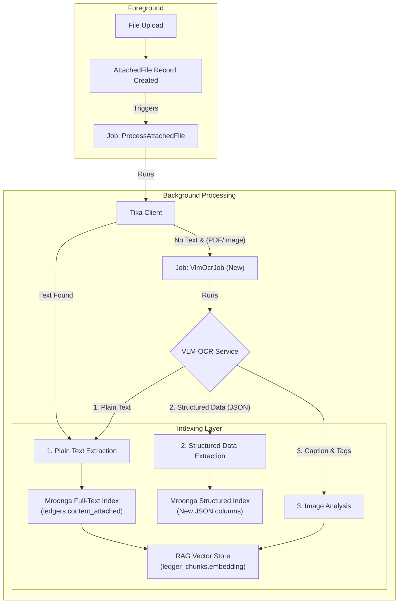

# 2025年 VLM-OCR技術とインデックス戦略の再評価 (改訂版)

**作成日:** 2025年10月23日
**ドキュメント種別:** 作業ファイル（技術検討・構想）
**ステータス:** 構想段階 (2025年10月23日 最新動向反映)

> **📖 関連ドキュメント:**
> - [RAG機能導入に関する技術検討](./2025-10-16-rag-implementation-study.md) - RAG導入の全体戦略
> - [AIアシスタントと検索の哲学](../../ai-and-search-guide.md) - LedgerLeapの検索思想
> - [添付ファイル機能](../../function/Attachment.md) - 既存のOCR/Tikaアーキテクチャ

---

## 1. はじめに

### 1.1. 本ドキュメントの目的

本ドキュメントは、2025年10月時点の最新のVLM（Visual Language Model）およびドキュメントAI技術動向を調査し、LedgerLeapの既存OCR機能（OcrMyPDF）の刷新、およびRAG機能と連携した次世代インデックス戦略を構想することを目的とする。

特に、プロジェクトの重要要件である「**オンプレミス・CPU環境での実行可能性**」を最優先事項とし、現実的な技術選定と段階的な導入アプローチを提案する。

### 1.2. 背景：現状の課題と機会

LedgerLeapは現在、OcrMyPDF（Tesseractベース）によるテキスト抽出と、Mroongaによるキーワードベースの全文検索を実装している。しかし、近年のVLM技術の急速な進化により、単なる「画像からの文字起こし」に留まらない、新たな可能性が生まれている。

| 項目 | 現状のOCR (OcrMyPDF) | 最新VLM-OCRがもたらす機会 |
| :--- | :--- | :--- |
| **抽出内容** | プレーンテキストのみ | **構造化データ (JSON)**, **画像キャプション**, **物体検出** |
| **精度** | 複雑なレイアウトや手書き文字に弱い | レイアウトを理解し、高精度な読取りが可能 |
| **検索** | キーワード検索のみ | **マルチモーダル検索**（「A社のロゴが入った契約書」など） |
| **CPU推論** | 実用的 | **量子化・最適化技術**により、CPUでの実行が現実的に |

本稿では、これらの機会をLedgerLeapにどう取り込み、「インデックスを強化」していくかの構想を具体化する。

---

## 2. 2025年 VLM/ドキュメントAI技術動向 (2025年10月更新)

2025年後半から2026年にかけて、VLM技術は以下のトレンドで進化している。

### トレンド1：オープンソース汎用VLMの成熟と高性能化

-   **概要:** 単一モデルで多様な視覚タスク（OCR、画像キャプション、物体検出、VQA）をこなす「スイスアーミーナイフ」的な汎用VLMが主流となっている。
-   **代表例:** **Google PaliGemma/Gemma 2**, **Microsoft Florence-2**, **LLaVA-NeXT**, **Qwen2.5-VL** シリーズ。

### トレンド2：CPU推論の現実化と高速化

-   **概要:** モデルの重みを低ビット（例: 4-bit）に圧縮する**量子化技術（GGUF, AWQ）**と、**ONNX Runtime**のような推論最適化フレームワークが成熟。これにより、これまでGPUが必須とされた高性能VLMを、CPUのみで現実的な速度で動作させることが可能になった。
-   **具体例:** 1.7B程度の軽量VLM（例: `VARCO-VISION-2.0`）がオンプレミスやエッジデバイスでの構造化文書処理に適用される事例が増加しており、CPU実行のハードルは大きく下がっている。
-   **実行環境:** `Ollama` のようなツールが普及し、ローカル環境でVLMをAPIサーバーとしてホストすることが容易になった。

### トレンド3：日本語・帳票特化モデルの進化

-   **概要:** 日本語のPDFや帳票データを用いて、「画像＋レイアウト＋テキスト」情報を統合的に学習するパイプラインが実証され、日本語帳票への特化が進んでいる。
-   **代表例:** **rinna社 `calm3-vision`**, **`Heron-Pretrained-v0.1`**, **`Swallow-VLM`** など。
-   **課題:** 視覚入力への対応が明確でないモデルも多く、ライセンスや推論負荷の確認が必須。帳票特化と汎用ドキュメント理解のどちらを優先するか、戦略的な判断が求められる。

### 補足トレンド：次世代OCRパラダイムの登場

-   **生成型OCR:** `VISTA-OCR` のように、テキスト領域の検出と認識を一体化した生成モデルとして扱うアプローチが登場。
-   **視覚圧縮OCR:** `DeepSeek-OCR` のように、文書を画像として圧縮（視覚トークン化）してからOCR処理を行う新しいパラダイムが提唱され、長文コンテキストでの精度と効率の向上が期待されている。

---

## 3. 注目すべきオープンソースVLMモデル (2025年版・再評価)

「帳票OCR＋構造化データ抽出」の用途と「オンプレ・CPU実行可否」に焦点を当て、モデルを再評価する。

| モデル | 特徴／補足 | オンプレ・CPU可否 | LedgerLeapへの適用考察 |
| :--- | :--- | :--- | :--- |
| **Donut / LayoutLMv3** | 請求書・フォームなど定型文書からの構造化抽出に強い。レイアウト＋テキスト入力が前提。 | 軽量版はCPU実行可能だが、本番量の処理にはGPUが望ましい。 | **[構造化抽出の核]** 特定帳票のデータ抽出フェーズで中心的役割。 |
| **PaddleOCR-VL** | 多言語・多様なレイアウト、特にテーブルや数式の認識に強いとされる。 | オープンソースであり、軽量化・最適化によりCPU実行の可能性あり。 | **[レイアウト多様性]** 複雑なレイアウトを持つ帳票への対応力強化に。 |
| **Qwen2.5-VL** | 汎用VLM。OCR, VQA, 物体検出など幅広いタスクに対応。 | パラメータサイズが大きく、CPUでのオンプレ実行は負荷の検証が必須。 | **[将来の拡張性]** 将来的なマルチモーダル検索機能の基盤として。 |
| **DeepSeek-OCR** | 最新パラダイム。視覚トークン圧縮＋長コンテキストOCRで高精度・高効率を両立。 | モデル・実装が公開されており、軽量版の登場も期待される。CPU適用検証の価値が高い。 | **[次世代アーキテクチャ]** 大量・長文の帳票処理の将来的な刷新候補。 |
| **Swallow-VLM** | 日本語特化LLM。視覚入力対応モデルの報告は少なく、帳票OCR用途には慎重な検証が必要。 | 視覚入力対応が確認できれば、CPU実行可能な軽量版の可能性あり。 | **[日本語精度]** 視覚対応が確認できれば、日本語帳票の精度向上に大きく貢献。 |

---

## 4. LedgerLeapにおけるインデックス強化構想 (ブラッシュアップ版)

### 4.1. 構想：VLMによる「リッチメタデータ」の自動生成

VLM-OCRで処理し、以下のような多層的な「リッチメタデータ」を生成する。

-   **プレーンテキスト (現状維持):** 全文検索の基本データ。
-   **構造化データ (JSON):** 請求書や点検表から抽出した項目と値。
-   **画像キャプション:** 画像の内容を説明する自然言語の文章。
-   **物体・テキストタグ:** 画像内に存在する物体や重要なキーワードのタグ。

### 4.2. 新しいデータフローとアーキテクチャ



### 4.3. ハイブリッド検索の実装構想

1.  **クエリ解析:** ユーザーの自然言語クエリをLLMで解析し、構造化クエリに変換する。
2.  **マルチエンジン検索:**
    *   **Mroonga (高速フィルタ):** キーワードと構造化フィルタで候補を高速に絞り込む。
    *   **ベクトル検索 (再ランキング):** 絞り込んだ候補に対し、意味的関連度で並べ替える。
3.  **結果の統合:** 両方のスコアをReciprocal Rank Fusion (RRF) 等で統合し、最終ランキングを決定する。

### 4.4. 実装・運用上の考慮事項

-   **リッチメタデータ生成:**
    *   **品質管理:** VLMによる誤生成（ハルシネーション）リスクを考慮し、人手レビューフローや信頼度スコアによる閾値処理を検討する。
    *   **テンプレート対応:** 帳票の種類に応じて、「汎用モデル」と「テンプレート別ファインチューニング/ルール補強」を使い分ける戦略を初期に判断する。
    *   **データ整合性:** 全文テキスト、構造化データ、タグの同期整合性を保ち、OCRロジック更新時の再インデックス計画を設計する。
-   **検索アーキテクチャ:**
    *   **マルチモーダルクエリ:** 将来的に「レイアウトや図表に基づくクエリ（例：『表1付き報告書』）」や「画像検索（例：ロゴ検索）」の設計を視野に入れる。
    *   **ランキング調整:** RRF等のスコア統合アルゴリズムの重み付けパラメータを調整可能にし、PoCで感度分析を行う。将来的には検索ログを活用したオンライン学習も検討する。
-   **運用とリスク管理:**
    *   **リソース監視:** オンプレVLMのCPU/メモリ負荷、推論遅延をPoC段階から定量的にモニタリングする。
    *   **カバレッジ管理:** 特殊レイアウト（手書き、縦書き）の対応可否を管理し、対応外データは人手処理へフォールバックするフローを設計する。
    *   **データ保護:** オンプレ構成であっても、推論ログや出力データへのアクセス・保存ポリシーを明文化する。

---

## 5. PoC（概念実証）計画 (拡充版)

### ステップ1：VLM-OCR環境構築と性能評価 (1週間)

-   **タスク:**
    1.  `Ollama` を利用し、**軽量モデル＋量子化**（例: `Swallow-VLM` 4-bit GGUF）と、**性能比較用モデル**（例: `Donut`）をローカルAPIサーバーとして起動する環境を構築する。
    2.  サンプル帳票を**難易度別に階層化**（例: シンプルな請求書、複雑なレイアウトの契約書、手書きメモ）して用意する。
    3.  各モデルのAPIを呼び出し、精度と性能を評価する。
-   **成功基準:**
    *   **精度:**
        *   [初期基準] シンプルな請求書から主要項目（請求番号, 日付, 合計金額）を85%以上の正答率で抽出できる。
        *   [拡張基準] 複雑なレイアウトの契約書から契約者名、契約日を70%以上の正答率で抽出できる。
    *   **性能:**
        *   **スループット:** 1CPUコアあたり、1分間に5ページ以上処理できる。
        *   **リソース:** 1プロセスあたりのメモリ使用量が4GB以内。
    *   **エラー率:** 処理失敗・再実行率が5%未満。

### ステップ2：インデックス強化とハイブリッド検索のプロトタイピング (2週間)

-   **タスク:**
    1.  ステップ1で抽出したJSONデータをMroongaのJSON型カラムに格納し、`mroonga_json_extract` を使った検索を検証する。**再インデックスフロー**も考慮する。
    2.  `RagSearchService` を改修し、Mroongaでのキーワード/構造化フィルタと、ベクトル検索の結果を統合するRRFアルゴ-   **成功基準:**
    *   「請求金額 > 50000」のような構造化フィルタが正しく機能する。
    *   ハイブリッド検索が、単一エンジン検索よりも優れた検索結果（より関連性の高いものが上位に来る）を返すことを、評価用データセットで確認できる。

---

## 6. 結論と推奨アプローチ（ロードマップ更新）

VLM-OCR技術はLedgerLeapの検索体験を根本から変えるポテンシャルを秘めている。リスクを管理しつつ、段階的に導入するアプローチを推奨する。

1.  **フェーズ1: PoCとOCR精度向上 (〜3ヶ月)**
    *   上記PoCを完了させ、まずは `Swallow-VLM` 等による**OCR精度の向上**を既存アーキテクチャの枠内で実現する。

2.  **フェーズ2: 限定的な構造化データ導入 (〜6ヶ月)**
    *   `Donut` 等による**構造化データ抽出**を特定の台帳定義（例: 請求書）に限定して導入し、データ入力自動化の価値を検証する。

3.  **フェーズ3: 運用安定化とハイブリッド検索導入 (〜12ヶ月)**
    *   リソース監視、モデル更新フローを確立する。
    *   ハイブリッド検索アーキテクチャを本格導入し、マルチモーダル検索の基盤を構築する。

4.  **フェーズ4: 機能拡張と継続的改善 (12ヶ月〜)**
    *   マルチモーダルクエリ、オンライン学習などを導入し、検索体験を継続的に向上させる。

このアプローチにより、LedgerLeapは技術的リスクを管理しつつ、継続的に検索機能の価値を高めていくことができる。


了解しました。
以下は、先ほどの改訂内容（A〜E）と Laravel ジョブサンプルを統合した **完全版 Markdown（そのまま社内提案資料に貼り付け可能）** です。
本文構成は次の通りです。

---

### 目次

1. 背景
2. 目的
3. 技術選定方針
4. 現状整理
5. 検証方針（PoC）
6. モデル選定チェックリスト
7. 評価指標
8. 運用・監視設計
9. ハードウェア要件（CPUオンプレ前提）
10. 実装方針とデータフロー
11. Laravel ジョブ実装サンプル
12. 今後の展開
13. 出典・参考文献

---

# VLMを活用した帳票OCRおよびハイブリッド検索基盤 PoC／設計提案書（改訂版）

---

## 1. 背景

既存の帳票OCR（OcrMyPDF 等）では、以下の課題が顕在化している。

* 複雑レイアウト（表、縦書き、手書き）の抽出精度が不十分
* 抽出結果が構造化されず後処理コストが高い
* OCR→全文検索のみの単一経路で、文脈検索が困難
* AI活用（画像理解・自然言語検索）との統合が難しい

一方で、2024〜2025 年にかけて **Visual Language Model（VLM）** が急速に進化し、OCR・レイアウト認識・キャプション生成・意味抽出を統合的に行えるようになってきた。

---

## 2. 目的

* **帳票画像を VLM により解析し、構造化・テキスト化する基盤を構築する。**
* **Mroonga × ベクトル検索（Hybrid Search）** による高速・高精度な情報探索を実現する。
* **将来的な文書生成・自動分類・QA検索** にも拡張できる基盤を先行整備する。

---

## 3. 技術選定方針

| 要素    | 方針                          | 備考                                                      |
| ----- | --------------------------- | ------------------------------------------------------- |
| モデル   | オープンVLM系を主対象                | Florence-2, Swallow-VLM, PaliGemma, Donut, LayoutLMv3 等 |
| 実行環境  | ローカルCPU前提                   | GPU無し構成を想定、量子化モデルを検討                                    |
| OCR互換 | 既存OcrMyPDFをフォールバックに残す       | 信頼性確保のため                                                |
| 検索    | Mroonga + ベクトルDB（pgvector等） | ハイブリッド検索構成                                              |
| 実装    | Laravel / Livewire ベース      | 内部システム統一性を確保                                            |
| 運用    | オンプレ／プライベートクラウド             | セキュリティ・コンプライアンス優先                                       |

---

## 4. 現状整理

* OcrMyPDF により PDF → テキスト変換までは自動化済み。
* 抽出テキストを Mroonga に格納し全文検索可能。
* ただし、複雑帳票（表・縦書き・画像付き）では文字化けや抽出漏れが発生。
* ベクトル検索による類似検索の試行は未実施。

---

## 5. 検証方針（PoC）

### ステップ概要

1. 軽量モデル（例：Donut-base, Florence-2-mini 等）で CPU実行可否と精度を確認。
2. 帳票3分類（請求書・契約書・手書き）で性能評価。
3. 抽出結果を以下の4種に分離して保存。

    * プレーンテキスト
    * 構造化JSON
    * キャプション（自然文）
    * タグ（キーワード）
4. Mroongaとベクトル検索を統合。

    * Mroongaでフィルタリング
    * ベクトルスコアで再ランク
    * RRF（Reciprocal Rank Fusion）で統合
5. 成果物：精度レポート・スループット・CPU負荷・PoCコード

---

## 6. モデル選定チェックリスト

| 項目    | 内容                  | 検討対象例                        |
| ----- | ------------------- | ---------------------------- |
| 視覚入力  | 画像を直接理解可能か          | Donut, Florence-2, PaliGemma |
| 日本語対応 | 縦書き／手書きに対応実績        | Swallow-VLM, PaddleOCR-VL    |
| 出力形式  | テキスト／JSON 構造化可否     | Donut, LayoutLMv3            |
| 推論速度  | CPU環境で実用的か          | 7B以下モデル中心                    |
| 量子化対応 | GGUF, AWQ, GPTQ 等対応 | Ollama, LM Studio            |
| ライセンス | 商用利用・改変可能か          | Apache2, MITなど確認             |
| 学習データ | 日本語帳票が含まれるか         | Donut, Swallow-VLM           |

（出典：）

---

## 7. 評価指標（PoC）

| 指標     | 定義        | 備考           |
| ------ | --------- | ------------ |
| 抽出精度   | 項目ごとの正答率  | 合計金額・日付・住所 等 |
| スループット | ページ／分     | CPU4コア換算     |
| レイテンシ  | P50/P95   | 平均・最大値       |
| メモリ使用量 | プロセス単位    | 16〜64GB目安    |
| エラー率   | 解析失敗／再実行率 | 例外発生割合       |
| ユーザ受容性 | サンプル評価    | 人的確認結果       |

---

## 8. 運用・監視設計

| 項目      | 内容                                         |
| ------- | ------------------------------------------ |
| メトリクス   | Prometheus + Grafana でジョブ実行時間・CPU・MEM等を可視化 |
| アラート    | 推論遅延・失敗率・ディスク容量閾値を通知                       |
| フォールバック | 失敗時に従来OCR (OcrMyPDF) を自動呼出                 |
| 再学習     | 検索ログを収集し定期再評価（四半期目安）                       |
| バージョン管理 | モデル・パラメータをGitとDBでバージョン化                    |

---

## 9. ハードウェア要件（CPUオンプレ前提）

| モデル規模     | 量子化形態    | メモリ     | vCPU  | 備考                |
| --------- | -------- | ------- | ----- | ----------------- |
| 軽量 (1.7B) | GGUF/AWQ | 8〜16GB  | 4〜8   | Donut, Tiny-VLM系  |
| 中規模 (7B)  | AWQ      | 32〜64GB | 8〜16  | Florence-2-mini 等 |
| 高負荷 (13B) | GPTQ     | 64GB〜   | 16〜32 | 並列推論向き            |

（出典：）

---

## 10. 実装方針とデータフロー

1. PDF／画像アップロード → `attached_files` テーブル登録
2. `VlmOcrJob` がジョブキューで起動
3. VLM APIへ multipart 送信 → JSONレスポンス受信
4. 抽出結果を保存（ocr_text, ocr_structured, caption, tags）
5. `IndexAttachedFileJob` が全文＋ベクトル両方に登録
6. 検索画面から Mroonga フィルタ + ベクトルスコア再ランク

---

## 11. Laravel ジョブ実装サンプル

```php
<?php

namespace App\Jobs;

use App\Models\AttachedFile;
use Illuminate\Bus\Queueable;
use Illuminate\Contracts\Queue\ShouldQueue;
use Illuminate\Foundation\Bus\Dispatchable;
use Illuminate\Queue\InteractsWithQueue;
use Illuminate\Queue\SerializesModels;
use GuzzleHttp\Client;

class VlmOcrJob implements ShouldQueue
{
    use Dispatchable, InteractsWithQueue, Queueable, SerializesModels;

    protected AttachedFile $file;

    /**
     * コンストラクタ
     *
     * @param AttachedFile $file 対象の添付ファイルレコード
     */
    public function __construct(AttachedFile $file)
    {
        $this->file = $file;
    }

    /**
     * ジョブ実行
     *
     * - Ollama 等のローカル VLM サーバへファイルを送信して解析を依頼する
     * - 結果をプレーンテキスト、構造化JSON、キャプション、タグに分割して保存する
     * - 失敗時は従来OCR (OcrMyPDF) をフォールバックで呼び出す
     *
     * @return void
     */
    public function handle(): void
    {
        $client = new Client(['base_uri' => config('vlm.ollama_base_uri')]);

        try {
            $response = $client->post('/v1/parse', [
                'multipart' => [
                    [
                        'name'     => 'file',
                        'contents' => fopen($this->file->path, 'r'),
                        'filename' => basename($this->file->path),
                    ],
                    ['name' => 'tasks', 'contents' => json_encode(['plain_text','structured','caption','tags'])]
                ],
                'timeout' => 120,
            ]);

            $body = json_decode((string) $response->getBody(), true);

            $this->file->update([
                'ocr_text' => $body['plain_text'] ?? null,
                'ocr_structured' => $body['structured'] ?? null,
                'image_caption' => $body['caption'] ?? null,
                'image_tags' => $body['tags'] ?? null,
            ]);

            \App\Jobs\IndexAttachedFileJob::dispatch($this->file);
        } catch (\Exception $e) {
            \Log::warning('VLM-OCR failed, falling back to OcrMyPDF: '.$e->getMessage());
            \App\Jobs\OcrMyPdfJob::dispatch($this->file);
        }
    }
}
```

---

## 12. 今後の展開

| 段階      | 内容             | 成果物           |
| ------- | -------------- | ------------- |
| Phase 1 | PoC実行（モデル3種比較） | 精度・性能レポート     |
| Phase 2 | 本番統合（既存OCRと共存） | Hybrid検索API実装 |
| Phase 3 | 拡張機能（分類・要約・QA） | VLM活用モジュール群   |
| Phase 4 | 運用最適化          | モデル監視・自動評価    |

---

## 13. 出典・参考文献

* Florence-2 / Swallow-VLM / PaliGemma / Donut / LayoutLMv3 最新情報（）
* 量子化推論実装とCPU運用実例（）
* VLM評価研究（OCR・レイアウト・マルチモーダルベンチマーク）（）

