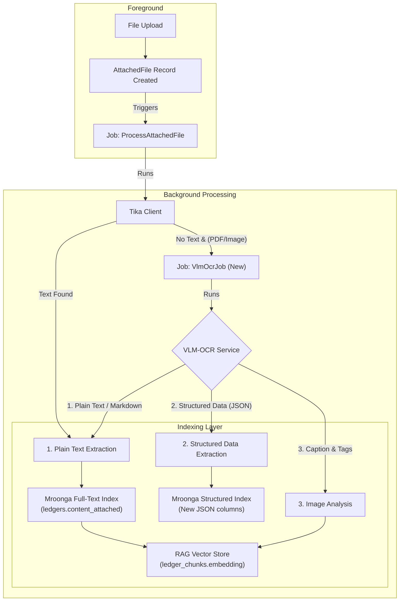

# 2025年 VLM-OCR技術とインデックス戦略の再評価 (改訂版)

**作成日:** 2025年10月23日
**ドキュメント種別:** 作業ファイル（技術検討・構想）
**ステータス:** 構想段階 (2025年10月24日 最新調査結果を反映)

> **📖 関連ドキュメント:**
> - [RAG機能導入に関する技術検討](./2025-10-16-rag-implementation-study.md) - RAG導入の全体戦略
> - [AIアシスタントと検索の哲学](../../ai-and-search-guide.md) - LedgerLeapの検索思想
> - [添付ファイル機能](../../function/Attachment.md) - 既存のOCR/Tikaアーキテクチャ

---

## 1. はじめに

### 1.1. 本ドキュメントの目的

本ドキュメントは、2025年10月時点の最新のVLM（Visual Language Model）およびドキュメントAI技術動向を調査し、LedgerLeapの既存OCR機能（OcrMyPDF）の刷新、およびRAG機能と連携した次世代インデックス戦略を構想することを目的とする。

特に、プロジェクトの重要要件である「**オンプレミス・CPU環境での実行可能性**」を最優先事項とし、現実的な技術選定と段階的な導入アプローチを提案する。

### 1.2. 背景：現状の課題と機会

LedgerLeapは現在、OcrMyPDF（Tesseractベース）によるテキスト抽出と、Mroongaによるキーワードベースの全文検索を実装している。しかし、近年のVLM技術の急速な進化により、単なる「画像からの文字起こし」に留まらない、新たな可能性が生まれている。

| 項目 | 現状のOCR (OcrMyPDF) | 最新VLM-OCRがもたらす機会 |
| :--- | :--- | :--- |
| **抽出内容** | プレーンテキストのみ | **構造化データ (JSON)**, **Markdown**, **画像キャプション** |
| **精度** | 複雑なレイアウトや手書き文字に弱い | レイアウトを理解し、高精度な読取りが可能 |
| **検索** | キーワード検索のみ | **ハイブリッド検索**（キーワード＋セマンティック） |
| **CPU推論** | 実用的 | **量子化・最適化技術**により、CPUでの実行が現実的に |

本稿では、これらの機会をLedgerLeapにどう取り込み、「インデックスを強化」していくかの構想を具体化する。

---

## 2. オンプレミスCPU実行可能な日本語帳票対応VLM・OCRツール調査結果

オンプレミス環境でCPU実行可能、日本語ビジネス文書（帳票）に強く、マークダウンや構造化データを出力できるOSSモデル・ツールを、以下のカテゴリで整理しました。

### 1. 文書・帳票特化型VLM

#### **Donut（Document Understanding Transformer）**
- **特徴**: OCRフリーのエンドツーエンドTransformerモデル。請求書・フォームなど定型帳票からの情報抽出に特化。[1][2]
- **日本語対応**: 韓国語レシート解析で高性能を発揮。日本語データでのファインチューニングが必要。[1]
- **CPU実行**: 可能だが、推論速度は遅い。
- **構造化出力**: JSON形式で構造化データを出力可能。

#### **LayoutLMv3**
- **特徴**: レイアウト情報とテキストを統合的に理解するモデル。文書理解ベンチマークでSOTA性能。[3][4]
- **日本語対応**: 多言語対応だが、日本語特化ではない。ファインチューニング必要。
- **CPU実行**: 可能。
- **構造化出力**: 文書構造を理解し、構造化データとして抽出可能。
- **応用**: MarkerツールがLayoutLMv3を内部で使用してPDF→Markdown変換を実現。[4]

#### **Florence-2**
- **特徴**: Microsoftの多機能VLM。OCR、キャプション、物体検出など多様なタスクに対応。[5]
- **日本語対応**: 日本語データでファインチューニングすることでOCR・キャプション生成が可能。[6]
- **CPU実行**: 可能（Apple Silicon MPSにも対応）。[6]
- **構造化出力**: タスク指定により多様な形式で出力可能。

### 2. 日本語特化型VLM

#### **Swallow-VLM（Llama 3 Swallow VLM）**
- **特徴**: 日本語に特化したLlama 3ベースのVLM。日本語理解と視覚情報の統合に優れる。[7][8]
- **日本語対応**: 日本語特化の事前学習済み。
- **CPU実行**: 7B/8Bモデルは量子化（GGUF）によりCPU実行可能。[7]
- **構造化出力**: プロンプト次第でMarkdownやJSON出力が可能。
- **応用**: 日本語VLMベンチマークで高性能を実証。

#### **Heron BLIP（日本語版）**
- **特徴**: Turing Motors開発の日本語VLM。BLIP + Japanese StableLMの組み合わせ。[9][10][11]
- **日本語対応**: 日本語VQAデータセットとLLaVA-620k日本語翻訳で学習。[10]
- **CPU実行**: 7Bモデルは量子化でCPU実行可能。
- **構造化出力**: プロンプトによりMarkdown等の出力可能。
- **実績**: ARM Macでの実行実績あり。[12]

#### **Heron-NVILA（最新版）**
- **特徴**: Qwen2.5-VLベースの日本語特化VLM。画像の高解像度処理とトークン圧縮が特徴。[13]
- **日本語対応**: 日本語最適化済み（15B/2B/1Bモデル）。
- **CPU実行**: 1B/2Bモデルは軽量でCPU実行可能性あり。
- **構造化出力**: Qwen2.5ベースのため、指示に応じた構造化出力に対応。

#### **Japanese Stable VLM**
- **特徴**: Stability AI Japan開発の日本語画像言語モデル。商用利用可能。[14][15][16]
- **日本語対応**: 日本語キャプション生成、VQAに特化。
- **CPU実行**: 7Bモデルで可能。
- **構造化出力**: タグ条件付きキャプション機能あり。

#### **rinna/nekomata-vision**
- **特徴**: rinna社のQwenベースVLM。日本語視覚言語理解に対応。[7]
- **日本語対応**: 日本語特化。
- **CPU実行**: 量子化（GGUF）でCPU実行可能。
- **構造化出力**: 指示に応じて対応。

### 3. 汎用VLM（日本語対応可能）

#### **LLaVA-NeXT**
- **特徴**: 高性能な汎用VLM。多言語対応。
- **日本語対応**: 英語ベースだが、日本語プロンプトで一定の対応可能。[10]
- **CPU実行**: 7B/8Bモデルは量子化でCPU実行可能。
- **構造化出力**: プロンプトにより対応。

#### **Qwen2-VL / Qwen2.5-VL**
- **特徴**: Alibaba開発の高性能VLM。画像・動画・OCRに強い。多言語対応（日本語含む）。[17][18][5]
- **日本語対応**: 日本語テキスト認識に対応。日本語VQAも可能。[19][20]
- **CPU実行**: 7Bモデルは量子化（GPTQ-Int4/AWQ）でCPU実行可能。[17]
- **構造化出力**: 高度な指示に対応し、Markdown等の出力可能。
- **実績**: 日本語PDF検索・OCRで実績あり。[20][21][22]

#### **PaliGemma / PaliGemma2**
- **特徴**: Google開発の3BパラメータVLM。軽量で多様なタスクに対応。[5]
- **日本語対応**: 多言語対応（日本語含む）。
- **CPU実行**: 3Bモデルのため、CPU実行が現実的。
- **構造化出力**: タスク指定により対応。

### 4. 新興・高性能モデル

#### **DeepSeek-VL / DeepSeek-OCR**
- **特徴**: 中国DeepSeek-AI開発の高性能VLM。DeepSeek-OCRは文書解析に特化した3BモデルでSOTA性能。[23][24][25]
- **日本語対応**: 多言語対応。日本語文書の認識も可能。[23]
- **CPU実行**: 3Bモデルは軽量でCPU実行可能。
- **構造化出力**: LaTeX、Markdown形式での出力に対応。[24]
- **特徴**: コンテキスト光学圧縮技術により、少ないトークンで高精度認識を実現。[24][23]

#### **PaddleOCR / PaddleOCR-VL-0.9B**
- **特徴**: Baidu開発の軽量OCRツール。PaddleOCR-VL-0.9Bは2025年10月リリースの超軽量VLM。[26][27][28][29]
- **日本語対応**: 日本語を含む109言語に対応。[27][28][30]
- **CPU実行**: **CPU実行に最適化**。0.9Bパラメータで通常のCPUで実行可能。[26][27]
- **構造化出力**: テキスト、表（HTML）、数式（LaTeX）を抽出可能。[27][26]
- **性能**: OmniBenchDoc V1.5で世界1位。72Bモデルを上回る。[26]
- **実績**: 日本語ビジネス文書での実用実績あり。[31][32]

### 5. PDF→Markdown変換特化ツール

#### **MinerU**
- **特徴**: PDF→Markdown/JSON変換に特化。表・数式・画像を高精度抽出。[33][34][35]
- **日本語対応**: 日本語含む84言語のOCRに対応。[34]
- **CPU実行**: CPU環境に対応。[34]
- **構造化出力**: Markdown、JSON、HTMLで出力。レイアウト情報を保持。[34]
- **特徴**: ヘッダー・フッター除去、見出し・段落構造の保持が優秀。[34]

#### **Marker**
- **特徴**: PDF/EPUB/MOBIをMarkdownに変換。速度と精度で既存ツールを凌駕。[36][37][4]
- **日本語対応**: 非英語圏言語では最適化されていないが、使用可能。[4]
- **CPU実行**: CPU/GPU/MPSで動作。[4]
- **構造化出力**: Markdown + JSON形式。[37]
- **技術**: LayoutLMv3、Nougat、T5を組み合わせた6段階処理パイプライン。[4]

#### **olmOCR**
- **特徴**: VLMベースのPDF→Markdown変換ツール。GPUも活用可能。[38][39]
- **日本語対応**: 日本語ビジネス文書で高精度。[39][38]
- **CPU実行**: 可能だが、GPU推奨。
- **構造化出力**: Markdown形式（JSONLファイル）。[38]

#### **Docling**
- **特徴**: IBM開発のAI文書変換ツール。複雑な文書構造の解析に強い。[40][41][42][43]
- **日本語対応**: 日本語PDFでの検証実績あり。[40]
- **CPU実行**: 可能。
- **構造化出力**: Markdown、JSON形式。
- **OCRエンジン**: EasyOCR、Tesseract、RapidOCRから選択可能。[40]

### 6. 数式・学術文書特化

#### **GOT-OCR2.0**
- **特徴**: 数式・表・グラフ・楽譜まで認識可能な高機能OCR。[44][45][46]
- **日本語対応**: **現在日本語非対応**（中国語・英語のみ）。将来的にファインチューニングで対応可能。[44]
- **CPU実行**: 580Mパラメータで軽量。CPU実行可能だが、GPU推奨。
- **構造化出力**: LaTeX、Markdown、TikZ、SMILES形式で出力。[45][44]

#### **Nougat**
- **特徴**: Meta AI開発の学術文書特化OCR。数式をLaTeX形式で出力。[47][48][49]
- **日本語対応**: 英語論文に特化。日本語は非対応。
- **CPU実行**: 可能だが非常に遅く、GPU推奨。[47]
- **構造化出力**: Mathpix Markdown互換形式（.mmd）。[47]

### 7. 従来型OCRエンジン

#### **Tesseract OCR**
- **特徴**: 歴史あるOSS OCR。日本語学習データあり。[50][40]
- **日本語対応**: 日本語対応だが、精度は新型VLMに劣る。[51][50]
- **CPU実行**: CPU専用。
- **構造化出力**: テキスト出力のみ。構造化には後処理が必要。

#### **EasyOCR**
- **特徴**: 80言語以上対応の軽量OCR。Pythonで簡単導入。[52]
- **日本語対応**: 日本語対応。[52]
- **CPU実行**: 可能。
- **構造化出力**: テキスト出力。構造化には後処理が必要。

### 総合推奨

| 優先順位 | モデル/ツール | 理由 |
|:---:|:---|:---|
| **1位** | **PaddleOCR-VL-0.9B** | CPU実行最適化、日本語対応109言語、表・数式抽出可能、SOTA性能[26][27] |
| **2位** | **MinerU** | PDF→Markdown特化、日本語84言語対応、CPU対応、構造保持に優秀[35][34] |
| **3位** | **Qwen2-VL-7B（量子化）** | 日本語OCR実績豊富、量子化でCPU実行可能、高性能VLM[20][17][18] |
| **4位** | **Heron BLIP / Swallow-VLM** | 日本語特化VLM、CPU実行可能、国内開発で実績あり[9][10][11] |
| **5位** | **DeepSeek-OCR** | 軽量3B、文書解析特化、Markdown出力対応、CPU実行可能[23][24][25] |

#### 用途別推奨
- **帳票・構造化データ抽出重視**: PaddleOCR-VL-0.9B[27][26]
- **PDF→Markdown変換**: MinerU、Marker[35][37][4][34]
- **日本語VQA・理解タスク**: Heron BLIP、Swallow-VLM[8][9][10][7]
- **汎用性重視**: Qwen2-VL（量子化版）[18][17]
- **軽量・高速処理**: PaddleOCR-VL-0.9B、DeepSeek-OCR[23][24][26]

---

## 3. LedgerLeapにおけるインデックス強化構想 (ブラッシュアップ版)

### 3.1. 構想：VLMによる「リッチメタデータ」の自動生成

VLM-OCRで処理し、以下のような多層的な「リッチメタデータ」を生成する。

-   **プレーンテキスト / Markdown (現状維持＋強化):** 全文検索の基本データ。レイアウトを維持したMarkdown形式を目指す。
-   **構造化データ (JSON):** 請求書や点検表から抽出した項目と値。
-   **画像キャプション:** 画像の内容を説明する自然言語の文章。
-   **物体・テキストタグ:** 画像内に存在する物体や重要なキーワードのタグ。

### 3.2. 新しいデータフローとアーキテクチャ

### 3.3. ハイブリッド検索の実装構想

1.  **クエリ解析:** ユーザーの自然言語クエリをLLMで解析し、構造化クエリに変換する。
2.  **マルチエンジン検索:** 
    *   **Mroonga (高速フィルタ):** キーワードと構造化フィルタで候補を高速に絞り込む。
    *   **ベクトル検索 (再ランキング):** 絞り込んだ候補に対し、意味的関連度で並べ替える。
3.  **結果の統合:** 両方のスコアをReciprocal Rank Fusion (RRF) 等で統合し、最終ランキングを決定する。

### 3.4. 実装・運用上の考慮事項

-   **リッチメタデータ生成:** 
    *   **品質管理:** VLMによる誤生成（ハルシネーション）リスクを考慮し、人手レビューフローや信頼度スコアによる閾値処理を検討する。
    *   **テンプレート対応:** 帳票の種類に応じて、「汎用モデル」と「テンプレート別ファインチューニング/ルール補強」を使い分ける戦略を初期に判断する。
    *   **データ整合性:** 全文テキスト、構造化データ、タグの同期整合性を保ち、OCRロジック更新時の再インデックス計画を設計する。
-   **検索アーキテクチャ:** 
    *   **マルチモーダルクエリ:** 将来的に「レイアウトや図表に基づくクエリ（例：『表1付き報告書』）」や「画像検索（例：ロゴ検索）」の設計を視野に入れる。
    *   **ランキング調整:** RRF等のスコア統合アルゴリズムの重み付けパラメータを調整可能にし、PoCで感度分析を行う。将来的には検索ログを活用したオンライン学習も検討する。
-   **運用とリスク管理:** 
    *   **リソース監視:** オンプレVLMのCPU/メモリ負荷、推論遅延をPoC段階から定量的にモニタリングする。
    *   **カバレッジ管理:** 特殊レイアウト（手書き、縦書き）の対応可否を管理し、対応外データは人手処理へフォールバックするフローを設計する。
    *   **データ保護:** オンプレ構成であっても、推論ログや出力データへのアクセス・保存ポリシーを明文化する。

---

## 4. PoC（概念実証）計画 (拡充版)

### ステップ1：VLM-OCR環境構築と性能評価 (1週間)

-   **タスク:**
    1.  Dockerを利用し、総合推奨1位の **PaddleOCR-VL-0.9B** と、PDF→Markdown変換に特化した **MinerU** の性能を評価する環境を構築する。
    2.  サンプル帳票を**難易度別に階層化**（例: シンプルな請求書、複雑なレイアウトの契約書、手書きメモ）して用意する。
    3.  各ツールのAPIを呼び出し、精度と性能を評価する。
-   **成功基準:**
    *   **精度:**
        *   [初期基準] シンプルな請求書から主要項目（請求番号, 日付, 合計金額）を85%以上の正答率で抽出できる。
        *   [拡張基準] 複雑なレイアウトの契約書から契約者名、契約日を70%以上の正答率で抽出できる。
    *   **性能:**
        *   **スループット:** 1CPUコアあたり、1分間に5ページ以上処理できる。
        *   **リソース:** 1プロセスあたりのメモリ使用量が4GB以内。
    *   **エラー率:** 処理失敗・再実行率が5%未満。

### ステップ2：インデックス強化とハイブリッド検索のプロトタイピング (2週間)

-   **タスク:**
    1.  ステップ1で抽出したJSONデータをMroongaのJSON型カラムに格納し、`mroonga_json_extract` を使った検索を検証する。**再インデックスフロー**も考慮する。
    2.  `RagSearchService` を改修し、Mroongaでのキーワード/構造化フィルタと、ベクトル検索の結果を統合するRRFアルゴリズムのプロトタイプを実装する。
-   **成功基準:**
    *   「請求金額 > 50000」のような構造化フィルタが正しく機能する。
    *   ハイブリッド検索が、単一エンジン検索よりも優れた検索結果（より関連性の高いものが上位に来る）を返すことを、評価用データセットで確認できる。

---

## 5. 結論と推奨アプローチ（ロードマップ更新）

VLM-OCR技術はLedgerLeapの検索体験を根本から変えるポテンシャルを秘めている。リスクを管理しつつ、段階的に導入するアプローチを推奨する。

1.  **フェーズ1: PoCとOCR精度向上 (〜3ヶ月)**
    *   上記PoCを完了させ、まずは **PaddleOCR-VL-0.9B** 等による**OCR精度の向上**を既存アーキテクチャの枠内で実現する。

2.  **フェーズ2: 限定的な構造化データ導入 (〜6ヶ月)**
    *   **MinerU** や **Donut** 等による**構造化データ抽出**を特定の台帳定義（例: 請求書）に限定して導入し、データ入力自動化の価値を検証する。

3.  **フェーズ3: 運用安定化とハイブリッド検索導入 (〜12ヶ月)**
    *   リソース監視、モデル更新フローを確立する。
    *   ハイブリッド検索アーキテクチャを本格導入し、マルチモーダル検索の基盤を構築する。

4.  **フェーズ4: 機能拡張と継続的改善 (12ヶ月〜)**
    *   マルチモーダルクエリ、オンライン学習などを導入し、検索体験を継続的に向上させる。

このアプローチにより、LedgerLeapは技術的リスクを管理しつつ、継続的に検索機能の価値を高めていくことができる。

---

## 6. 出典・参考文献
[1] https://sangdooyun.github.io/data/kim2021donut.pdf
[2] https://github.com/clovaai/donut
[3] https://huggingface.co/docs/transformers/model_doc/layoutlmv2
[4] https://note.com/panda_lab/n/ncedca96086b9
[5] https://github.com/gokayfem/awesome-vlm-architectures
[6] https://qiita.com/yosim/items/8622997580e10b206260
[7] https://github.com/llm-jp/awesome-japanese-llm
[8] https://swallow-llm.github.io/evaluation/about.en.html?index=%22__ALL__%22&task=%5B%22Llama+3+Swallow+8B+Instruct%22%2C%22Swallow-7b-instruct-v0.1%22%5D&scatter=%22__ALL__%22
[9] https://huggingface.co/turing-motors/heron-chat-blip-ja-stablelm-base-7b-v1
[10] https://zenn.dev/turing_motors/articles/00df893a5e17b6
[11] https://github.com/turingmotors/heron
[12] https://zenn.dev/singularity/articles/heron-blip-v1
[13] https://zenn.dev/turing_motors/articles/7ac8ebe8756a3e
[14] https://weel.co.jp/media/tech/japanese-stable-vlm/
[15] https://huggingface.co/stabilityai/japanese-stable-vlm
[16] https://huggingface.co/stabilityai/japanese-stable-vlm/blob/main/README.md
[17] https://github.com/xwjim/Qwen2-VL
[18] https://huggingface.co/Qwen/Qwen2-VL-7B-Instruct
[19] https://note.com/holyday_mylife/n/n27e772d01465
[20] https://tech-blog.abeja.asia/entry/vlm-ocr-202507
[21] https://zenn.dev/yumefuku/articles/pdf-search-colqwen2
[22] https://note.com/oshizo/n/n473a0124585b
[23] https://note.com/trans_n_ai/n/n73c538a209ff
[24] https://apidog.com/jp/blog/deepseek-ocr/
[25] https://www.iweaver.ai/blog/deepseek-ocr-vision-language-model/
[26] https://zenn.dev/czmilo/articles/dbdd4b06889510
[27] https://dev.to/czmilo/2025-complete-guide-paddleocr-vl-09b-baidus-ultra-lightweight-document-parsing-powerhouse-1e8l
[28] https://sonusahani.com/blogs/paddleocr-vl
[29] https://github.com/PaddlePaddle/PaddleOCR
[30] https://arxiv.org/html/2507.05595v1
[31] https://qiita.com/sakamoto1209/items/59288cd88133852d2e9e
[32] https://www.aska-ltd.jp/jp/blog/284
[33] https://glama.ai/mcp/servers/@FutureUnreal/mcp-pdf2md?locale=ja-JP
[34] https://zenn.dev/kun432/scraps/c87a2570953747
[35] https://github.com/opendatalab/MinerU
[36] https://qiita.com/yuji-arakawa/items/6d0299c505315bc3cdb0
[37] https://github.com/datalab-to/marker
[38] https://note.com/kakeyang/n/n1ba8a489b0c6
[39] https://blog.scuti.jp/olmocr-pdf-text-extraction-1-32-cost/
[40] https://zenn.dev/data_and_ai/articles/e06e47eb702fd5
[41] https://recruit.gmo.jp/engineer/jisedai/blog/docling-pdf-table-image-extraction/
[42] https://dev.classmethod.jp/articles/converting-document-files-using-oss-tool-docling/
[43] https://www.ibm.com/jp-ja/new/announcements/granite-docling-end-to-end-document-conversion
[44] https://note.com/panda_lab/n/n0a6e77f9cd3f
[45] https://blog.dolphinvoice.ai/archives/356
[46] https://docsaid.org/ja/papers/text-spotting/got/
[47] https://zenn.dev/hk_ilohas/articles/meta-ai-nougat-ocr
[48] https://note.com/daichi_mu/n/nd302ab7d8ffd
[49] https://facebookresearch.github.io/nougat/
[50] https://stackoverflow.com/questions/2557743/most-accurate-open-source-ocr-for-japanese
[51] https://www.reddit.com/r/MachineLearning/comments/170j47f/d_tesseractocr_vs_paddleocr_vs_easyocr_for/
[52] https://github.com/JaidedAI/EasyOCR
[53] https://www.reddit.com/r/LearnJapanese/comments/wm7qou/japanese_ocr_mobile_options_comparison/
[54] https://arxiv.org/html/2403.13187v1
[55] https://note.com/en2enzo/n/n121f72756e58
[56] https://www.scribd.com/document/859647459/kim2021donut
[57] https://docs.unsloth.ai/models/qwen3-vl-run-and-fine-tune
[58] https://openlibrary.telkomuniversity.ac.id/pustaka/files/219195/abstraksi/document-analysis-and-recognition-icdar-2023-17th-international-conference-san-jos-ca-usa-august-21-26-2023-proceedings-part-ii.pdf
[59] https://note.com/npaka/n/n1d99253ae2cf
[60] https://qiita.com/yosim/items/c65b28bf4be05a14f390
[61] https://aman.ai/papers/
[62] https://arxiv.org/html/2404.07824v1
[63] https://github.com/hiyouga/LLaMA-Factory/releases
[64] https://www.youtube.com/watch?v=sMgx05wthKw
[65] https://loner49th.hatenablog.com/entry/2024/04/21/220643
[66] https://stability.ai/news/stability-ai-new-jplm-japanese-language-model-stablelm
[67] https://goldpenguin.org/blog/stability-launches-japanese-ai-text-generator/
[68] https://www.reddit.com/r/LocalLLaMA/comments/1ocrocy/deepseekocr_lives_up_to_the_hype/
[69] https://huggingface.co/blog/ocr-open-models
[70] https://qiita.com/vko/items/04fb0756abd89dff8573
[71] https://note.com/masa_wunder/n/n7f361aa17128
[72] https://zenn.dev/nyagato_00/articles/719b8c4749365f
[73] https://qiita.com/keisuke-okb/items/ae1dbb4f3e3034713245
[74] https://www.linkedin.com/pulse/deepseek-introduction-coding-vl-vl2-prover-r1-qwen-dabass-ph-d-0bfvf
[75] https://speakerdeck.com/kuehara/da-gui-mo-ri-ben-yu-vlm-asagi-vlmniokeruhe-cheng-detasetutonogou-zhu-tomoderushi-zhuang
[76] https://qwenlm.github.io/blog/qwen2-vl/
[77] https://tadaoyamaoka.hatenablog.com/entry/2024/09/01/180813
[78] https://ironsoftware.com/csharp/ocr/blog/ocr-tools/best-ocr-for-japanese-list/
[79] https://unstract.com/blog/best-pdf-ocr-software/
[80] https://arxiv.org/html/2505.14381v1
[81] https://intuitionlabs.ai/articles/ai-ocr-models-pdf-structured-text-comparison
[82] https://github.com/kotaro-kinoshita/yomitoku
[83] https://www.reddit.com/r/MachineLearning/comments/i98wr6/p_choosing_an_ocr/
[84] https://note.com/kotaro_kinoshita/n/n70df91659afc
[85] https://huggingface.co/docs/transformers/model_doc/trocr