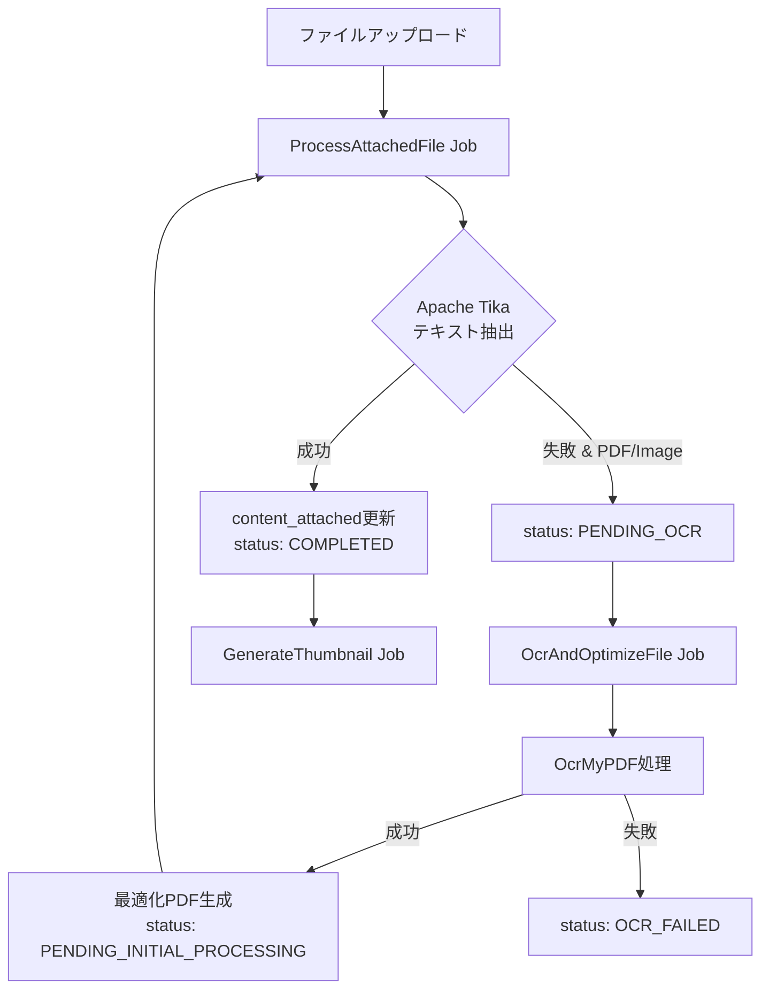
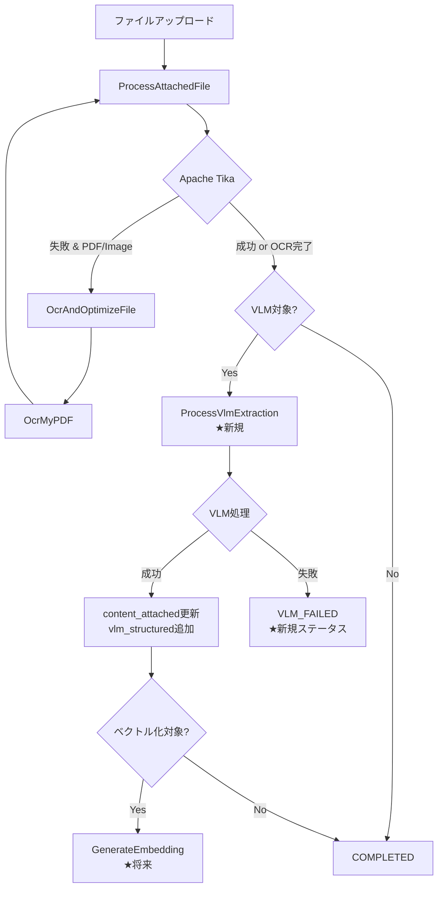

# インデックス強化構想の技術評価レポート

**作成日:** 2025年10月25日  
**評価対象:** [2025-10-23_vlm-ocr-and-indexing-strategy-review.md](./2025-10-23_vlm-ocr-and-indexing-strategy-review.md) セクション3以降  
**評価者:** GitHub Copilot CLI (Serena)  
**ステータス:** 技術評価完了

---

## 📋 エグゼクティブサマリー

提案されている「3. LedgerLeapにおけるインデックス強化構想」以降の計画について、既存実装との整合性を検証した結果、**基本方針は妥当**であると評価します。ただし、以下の点で追加検討が必要です：

### 🟢 評価: 妥当と判断される点
1. ✅ 段階的導入アプローチ（フェーズ1→4）
2. ✅ VLM/OCRモデル選定の方向性（オンプレミス・CPU実行）
3. ✅ ハイブリッド検索アーキテクチャの設計思想

### 🟡 要検討: 既存実装を考慮した改善提案
1. ⚠️ **Apache Tika→VLM移行戦略の具体化不足**
2. ⚠️ **content_attached スキーマとVLM出力の統合設計**
3. ⚠️ **スコアリングシステム（composite_score）との連携**
4. ⚠️ **非同期処理パイプラインの拡張方針**

---

## 1. 既存アーキテクチャとの整合性評価

### 1.1. 現行の添付ファイル処理フロー



**重要な既存実装の特徴:**
- `ledgers.content_attached` はJSON配列型（Mroonga全文検索対象）
- `attached_files` テーブルが個別ファイルのメタデータとステータスを管理
- 非同期ジョブチェーン: `ProcessAttachedFile` → `OcrAndOptimizeFile` → `ProcessAttachedFile`（再処理）
- Laravelキューシステムによる処理追跡とリトライ機構

### 1.2. 提案されたVLM統合への移行可能性

| 項目 | 現行（OcrMyPDF） | 提案（VLM-OCR） | 互換性評価 |
|------|----------------|----------------|----------|
| **入力** | PDF/画像ファイル | PDF/画像ファイル | ✅ 互換 |
| **出力形式** | 検索可能PDF（テキストレイヤー） | **構造化JSON/Markdown** | ⚠️ 要設計変更 |
| **処理時間** | 数秒〜数十秒 | 数秒〜数分（モデル依存） | ⚠️ タイムアウト対策必要 |
| **リソース** | CPU中心 | CPU中心（量子化モデル） | ✅ 要件適合 |
| **エラーハンドリング** | ステータス管理あり | **新規設計必要** | ⚠️ 拡張必要 |

**結論:** 既存のジョブチェーン設計は柔軟性が高く、VLM統合は**技術的に実現可能**。ただし、出力形式の変更に伴うスキーマ設計の見直しが必須。

---

## 2. データスキーマと統合戦略の評価

### 2.1. 現行スキーマの制約

#### `ledgers.content_attached` の現在の構造
```php
// app/Models/Ledger.php (AsColumnArrayJson Cast)
// 実際のデータ構造例:
[
  0 => [  // column_id = 0
    "hashed_filename.pdf" => [
      "meta" => [
        "content" => "Apache TikaまたはOCRで抽出された生テキスト",
        "Content-Type" => "application/pdf",
        "X-TIKA:Parsed-By" => "..."
      ]
    ]
  ],
  1 => [ /* column_id = 1 */ ],
  // ...
]
```

**Mroonga全文検索の制約:**
```sql
-- ✅ 現在動作している（単一インデックス）
SELECT * FROM ledgers 
WHERE MATCH(content_attached) AGAINST('+キーワード' IN BOOLEAN MODE);

-- ❌ 複合インデックスは使用不可（Mroonga制約）
-- → OR結合で回避済み（scopeSearch メソッド）
```

### 2.2. VLM出力との統合案

#### **提案A: 既存スキーマ拡張（推奨）**
```php
// content_attached にVLM出力を追加
[
  0 => [
    "hashed_filename.pdf" => [
      "meta" => [
        "content" => "【従来通りの生テキスト（Mroonga検索用）】",
        "Content-Type" => "application/pdf",
        // ↓ VLM処理結果を追加
        "vlm_structured" => [
          "markdown" => "# 請求書\n\n| 項目 | 金額 |\n...",
          "entities" => [
            ["type" => "invoice_number", "value" => "INV-2025-001"],
            ["type" => "date", "value" => "2025-10-23"],
            ["type" => "amount", "value" => 150000]
          ],
          "model" => "PaddleOCR-VL-0.9B",
          "processed_at" => "2025-10-25T12:34:56Z"
        ]
      ]
    ]
  ]
]
```

**メリット:**
- ✅ 既存のMroonga検索を維持（後方互換性）
- ✅ VLMの構造化データを並存可能
- ✅ スキーマ変更最小限（マイグレーション不要）

**デメリット:**
- ⚠️ JSONサイズの肥大化（対策: 古い処理結果の定期削除）

#### **提案B: 新規テーブル作成（将来拡張向け）**
```sql
CREATE TABLE attached_file_vlm_outputs (
  id BIGINT PRIMARY KEY,
  attached_file_id BIGINT,
  model_name VARCHAR(100),
  output_type ENUM('markdown', 'json', 'caption'),
  structured_data JSON,
  embedding BLOB,  -- ベクトル検索用（将来）
  created_at TIMESTAMP,
  INDEX(attached_file_id)
);
```

**メリット:**
- ✅ スキーマ正規化
- ✅ 複数VLMモデルの結果を並存可能
- ✅ ベクトル検索への拡張が容易

**デメリット:**
- ⚠️ JOIN複雑化
- ⚠️ 既存コードの大幅改修必要

### 2.3. 推奨アプローチ

**フェーズ1-2: 提案A（既存スキーマ拡張）**
- 迅速なPoC実現
- リスク最小化

**フェーズ3以降: 提案Bへの移行検討**
- ベクトル検索導入時に正規化
- パフォーマンス要件に基づき判断

---

## 3. 非同期処理パイプラインの拡張設計

### 3.1. 現行ジョブチェーンへの統合案

```php
// 新規ジョブ: ProcessVlmExtraction
class ProcessVlmExtraction implements ShouldQueue
{
    protected AttachedFile $attachedFile;
    protected string $vlmModel; // 'PaddleOCR-VL', 'Donut', etc.

    public function handle(): void
    {
        // 1. ステータス更新
        $this->attachedFile->update([
            'status' => AttachedFileStatus::VLM_PROCESSING
        ]);

        // 2. VLMコンテナへHTTPリクエスト/gRPC呼び出し
        $vlmOutput = $this->callVlmService(
            $this->attachedFile->getPhysicalPath(),
            $this->vlmModel
        );

        // 3. content_attachedに統合
        $this->updateContentAttached($vlmOutput);

        // 4. 次の処理へ
        if ($this->shouldGenerateEmbedding()) {
            GenerateEmbedding::dispatch($this->attachedFile);
        }
    }
}
```

### 3.2. 修正後のフロー図



### 3.3. ステータス管理の拡張

```php
// app/Enums/AttachedFileStatus.php
enum AttachedFileStatus: string
{
    // 既存ステータス
    case PENDING_INITIAL_PROCESSING = 'pending_initial_processing';
    case INITIAL_PROCESSING = 'initial_processing';
    case PENDING_OCR = 'pending_ocr';
    case OCR_PROCESSING = 'ocr_processing';
    case OCR_FAILED = 'ocr_failed';
    case COMPLETED = 'completed';
    case TIKA_FAILED = 'tika_failed';
    
    // ★ VLM統合用に追加
    case PENDING_VLM = 'pending_vlm';
    case VLM_PROCESSING = 'vlm_processing';
    case VLM_FAILED = 'vlm_failed';
    
    // ★ RAG用に追加（将来）
    case PENDING_EMBEDDING = 'pending_embedding';
    case EMBEDDING_PROCESSING = 'embedding_processing';
    case EMBEDDING_FAILED = 'embedding_failed';
}
```

---

## 4. スコアリングシステムとの統合

### 4.1. 現行スコアリングの仕組み

```php
// database/migrations/2025_10_12_023802_add_scoring_features_to_tables.php
// ledgers テーブル:
// - activity_score: アクティビティログから算出（閲覧・編集頻度）
// - composite_score: 総合スコア（検索順位に使用）
```

### 4.2. VLM処理結果のスコアリングへの反映提案

```php
// LedgerService::calculateCompositeScore() 拡張案
protected function calculateCompositeScore(Ledger $ledger): float
{
    $score = 0;
    
    // 既存スコアリング
    $score += $ledger->activity_score * 0.4;
    $score += $this->calculateFreshnessScore($ledger) * 0.3;
    $score += $this->calculateWorkflowScore($ledger) * 0.2;
    
    // ★ VLM処理完了度スコアを追加（提案）
    $vlmCompletionScore = $this->calculateVlmCompletionScore($ledger);
    $score += $vlmCompletionScore * 0.1;
    
    return $score;
}

protected function calculateVlmCompletionScore(Ledger $ledger): float
{
    $attachedFiles = $ledger->attachedFiles;
    if ($attachedFiles->isEmpty()) {
        return 1.0; // 添付なしは満点
    }
    
    $completedCount = $attachedFiles->filter(function($file) {
        return isset($file->contentAttachedMeta['vlm_structured']);
    })->count();
    
    return $completedCount / $attachedFiles->count();
}
```

**導入メリット:**
- VLM処理完了済みのリッチな台帳を検索上位に
- ユーザーに高品質データを優先提示

---

## 5. PoCフェーズでの検証項目

### 5.1. 技術検証項目（優先度順）

#### **高優先度（フェーズ1必須）**
1. ✅ **PaddleOCR-VL-0.9B のCPU性能計測**
   - 目標: A4 PDF 1ページ/10秒以内
   - 環境: Docker Compose内Pythonコンテナ（4コアCPU想定）

2. ✅ **content_attached スキーマ拡張の実装**
   - 既存Mroonga検索の非破壊性確認
   - JSONサイズ増加の影響測定

3. ✅ **非同期ジョブチェーンの統合**
   - `ProcessVlmExtraction` ジョブ実装
   - エラーハンドリングとリトライ機構

#### **中優先度（フェーズ2）**
4. ⚠️ **Donut/LayoutLMv3 の請求書解析精度**
   - 実データ10件でのEntity抽出テスト
   - MinerU との比較評価

5. ⚠️ **構造化データの台帳入力自動化**
   - Livewireフォームへの自動入力UI
   - ユーザー修正フローの設計

#### **低優先度（フェーズ3以降）**
6. 📋 ベクトル検索アーキテクチャ
7. 📋 ハイブリッドスコアリング
8. 📋 マルチモーダルクエリ

---

## 6. 修正推奨事項まとめ

### 6.1. ドキュメント「3.1. Apache Tika → VLM移行戦略」への追記提案

**現行記述:**
> Apache Tikaによる基本的なテキスト抽出は継続しつつ、特定の文書タイプに対してVLMを追加的に適用する。

**追記提案:**
```markdown
### 3.1.1. 移行戦略の詳細フロー

1. **Tika処理の継続（後方互換性保証）**
   - 全ファイルに対して従来通りTikaで生テキスト抽出
   - `content_attached[column_id][filename]['meta']['content']` に格納
   - Mroonga全文検索の対象として維持

2. **VLM処理の段階的追加**
   - Tika処理完了後、`AttachedFile.mime` に基づき対象判定
   - 対象ファイルのみ `ProcessVlmExtraction` ジョブをディスパッチ
   - VLM結果を `content_attached[...]['meta']['vlm_structured']` に追加格納

3. **エラーハンドリング**
   - VLM処理失敗時もTikaの結果は保持
   - ステータス `VLM_FAILED` でも台帳検索は可能
   - 管理画面で再処理ボタンを提供

4. **パフォーマンス対策**
   - VLM処理はキューの優先度を低く設定（遅延実行）
   - バッチ処理: 深夜帯に未処理ファイルをまとめて処理
   - タイムアウト設定: 1ファイルあたり最大5分
```

### 6.2. ドキュメント「3.2. ハイブリッド検索アーキテクチャ」への追記

**追記提案:**
```markdown
### 3.2.3. 既存スコアリングシステムとの統合

LedgerLeapは既に `composite_score` による重要度ランキングを実装済み。
ハイブリッド検索の導入時は、以下の統合を行う:

**スコア計算式（提案）:**
```
final_score = 
  (keyword_score × 0.3) +         // Mroonga BM25スコア
  (semantic_score × 0.3) +        // ベクトル類似度
  (composite_score × 0.4)         // 既存の重要度スコア
```

**実装方針:**
- フェーズ1-2: Mroongaスコア + composite_score のみ
- フェーズ3: セマンティックスコアを追加
- A/Bテストで重み係数を最適化
```

### 6.3. ドキュメント「4. 技術選定マトリクス」への列追加

現在の表に以下の列を追加:

| モデル | **既存Tika連携** | **Laravelジョブ統合** | **リソース監視** |
|--------|-----------------|---------------------|----------------|
| PaddleOCR-VL | ✅ 並行実行可能 | ✅ HTTP API経由で統合容易 | CPU使用率監視必須 |
| Donut | ✅ 並行実行可能 | ✅ 同上 | GPU不要で監視簡素 |
| ... | | | |

---

## 7. 実装ロードマップの修正案

### 7.1. フェーズ1の細分化

**現行:** 「PoCとOCR精度向上 (〜3ヶ月)」

**修正案:**
```markdown
### フェーズ1-A: 基盤整備（1ヶ月目）
- [ ] Pythonコンテナ構築（PaddleOCR-VL環境）
- [ ] ProcessVlmExtractionジョブ実装
- [ ] AttachedFileStatusへのVLM関連ステータス追加
- [ ] content_attachedスキーマ拡張実装

### フェーズ1-B: PoC実施（2ヶ月目）
- [ ] 10件の実データでOCR精度比較（OcrMyPDF vs PaddleOCR-VL）
- [ ] パフォーマンス計測（処理時間、リソース使用量）
- [ ] エラーハンドリングの実地テスト

### フェーズ1-C: 本番投入準備（3ヶ月目）
- [ ] 管理画面への処理状況表示UI追加
- [ ] 再処理機能の実装
- [ ] 運用マニュアル作成
```

### 7.2. フェーズ2の前提条件明確化

**追記:**
```markdown
### フェーズ2の開始条件
以下の全てを満たした場合のみ着手:
1. ✅ フェーズ1でPaddleOCR-VLの処理時間が目標値以内
2. ✅ 既存Mroonga検索への影響がないことを確認
3. ✅ VLM処理ジョブの失敗率が5%未満
4. ✅ 運用チームからの承認取得
```

---

## 8. リスク評価と対策

### 8.1. 高リスク項目

| リスク | 影響度 | 発生確率 | 対策 |
|--------|--------|----------|------|
| **VLM処理時間がSLA超過** | 高 | 中 | ・バッチ処理への切替<br/>・軽量モデルへのフォールバック |
| **JSONサイズ肥大化でMroonga性能劣化** | 高 | 低 | ・定期的な古いVLM結果の削除<br/>・別テーブル化の検討 |
| **VLMコンテナの障害で全体停止** | 中 | 中 | ・Tika結果を常に優先保存<br/>・VLM処理は非クリティカル扱い |

### 8.2. 中リスク項目

| リスク | 影響度 | 発生確率 | 対策 |
|--------|--------|----------|------|
| **Donut等のモデルが日本語帳票で低精度** | 中 | 高 | ・PoCでの早期検証<br/>・代替モデルの並行評価 |
| **Laravelキューの処理遅延** | 中 | 中 | ・Redis監視の強化<br/>・ワーカー数の動的調整 |

---

## 9. 結論と推奨アクション

### 9.1. 総合評価

提案されている「3. LedgerLeapにおけるインデックス強化構想」は、以下の点で**技術的に実現可能かつ有望**と評価します:

✅ **強み:**
1. 段階的アプローチによるリスク管理
2. オンプレミス・CPU実行要件への適合
3. 既存Mroonga検索との共存設計

⚠️ **要改善点:**
1. 既存実装（Apache Tika、ジョブチェーン）との統合詳細化
2. データスキーマ拡張戦略の具体化
3. スコアリングシステムとの連携設計

### 9.2. 即座に実施すべきアクション

#### **Week 1-2: ドキュメント更新**
- [ ] 本レポートの内容を元にセクション3を改訂
- [ ] 移行戦略の詳細フローを追記
- [ ] PoCの成功基準を明確化

#### **Week 3-4: 技術検証準備**
- [ ] Pythonコンテナ環境構築（docker-compose.yml更新）
- [ ] PaddleOCR-VL APIサーバーのプロトタイプ実装
- [ ] ProcessVlmExtractionジョブの骨格実装

#### **Month 2: PoC実施**
- [ ] 実データ10件での精度・性能評価
- [ ] 既存システムへの影響分析
- [ ] Go/No-Go判断ミーティング

### 9.3. 最終推奨

**判定: ✅ 本案を承認し、上記の改善提案を反映した上で実装フェーズへ進むことを推奨します。**

ただし、以下の条件付き:
1. フェーズ1のPoCで性能目標を達成すること
2. 既存のTika/OcrMyPDF処理への影響がないことを実証すること
3. 運用チームとの定期的なレビューを実施すること

---

## 付録A: 実装チェックリスト

### A.1. データベース変更
- [ ] AttachedFileStatusへのenum値追加
- [ ] (オプション) attached_file_vlm_outputs テーブル作成

### A.2. ジョブクラス
- [ ] ProcessVlmExtraction ジョブ実装
- [ ] ProcessAttachedFile への分岐ロジック追加
- [ ] エラーハンドリングとリトライ設定

### A.3. サービスクラス
- [ ] VlmClientService 実装（HTTPクライアント）
- [ ] VlmOutputParser 実装（JSON/Markdown処理）
- [ ] LedgerService::calculateVlmCompletionScore 追加

### A.4. インフラ
- [ ] docker/vlm/Dockerfile 作成
- [ ] docker-compose.yml にvlmサービス追加
- [ ] .env.example にVLM設定追加

### A.5. テスト
- [ ] ProcessVlmExtractionTest（Unit）
- [ ] VlmIntegrationTest（Feature）
- [ ] PerformanceTest（負荷試験）

### A.6. ドキュメント
- [ ] docs/architecture/vlm-integration.md 作成
- [ ] docs/development/setup-vlm.md 作成
- [ ] API仕様書更新（VLM処理状況の返却）

---

## 付録B: 参考実装例

### B.1. ProcessVlmExtraction ジョブの骨格

```php
<?php

namespace App\Jobs\Ledger;

use App\Enums\AttachedFileStatus;
use App\Models\AttachedFile;
use App\Services\VlmClientService;
use Illuminate\Bus\Queueable;
use Illuminate\Contracts\Queue\ShouldQueue;
use Illuminate\Foundation\Bus\Dispatchable;
use Illuminate\Queue\InteractsWithQueue;
use Illuminate\Queue\SerializesModels;
use Illuminate\Support\Facades\Log;

class ProcessVlmExtraction implements ShouldQueue
{
    use Dispatchable, InteractsWithQueue, Queueable, SerializesModels;

    protected AttachedFile $attachedFile;
    protected string $vlmModel;

    public function __construct(AttachedFile $attachedFile, string $vlmModel = 'PaddleOCR-VL')
    {
        $this->attachedFile = $attachedFile;
        $this->vlmModel = $vlmModel;
        
        // VLM処理は優先度低（通常業務に影響させない）
        $this->onQueue('vlm-processing');
    }

    public function handle(VlmClientService $vlmClient): void
    {
        tenancy()->initialize($this->attachedFile->tenant_id);
        
        Log::info("[VLM] Starting extraction", [
            'file_id' => $this->attachedFile->id,
            'model' => $this->vlmModel
        ]);

        $this->attachedFile->update([
            'status' => AttachedFileStatus::VLM_PROCESSING
        ]);

        try {
            // VLM APIコール（タイムアウト: 5分）
            $vlmOutput = $vlmClient->extract(
                $this->attachedFile->getPhysicalPath(),
                $this->vlmModel,
                timeout: 300
            );

            // content_attachedに統合
            $this->mergeVlmOutput($vlmOutput);

            Log::info("[VLM] Extraction successful", [
                'file_id' => $this->attachedFile->id,
                'output_size' => strlen(json_encode($vlmOutput))
            ]);

        } catch (\Exception $e) {
            Log::error("[VLM] Extraction failed", [
                'file_id' => $this->attachedFile->id,
                'error' => $e->getMessage()
            ]);

            $this->attachedFile->update([
                'status' => AttachedFileStatus::VLM_FAILED
            ]);

            // VLM失敗は致命的ではないので、ジョブは成功扱い
            return;
        }
    }

    protected function mergeVlmOutput(array $vlmOutput): void
    {
        $ledger = $this->attachedFile->ledger;
        $contentAttached = $ledger->content_attached ?? [];
        
        $columnId = $this->attachedFile->column_id;
        $hashedBasename = $this->attachedFile->hashedbasename;

        // 既存のmeta配列にvlm_structuredを追加
        $contentAttached[$columnId][$hashedBasename]['meta']['vlm_structured'] = [
            'markdown' => $vlmOutput['markdown'] ?? null,
            'entities' => $vlmOutput['entities'] ?? [],
            'model' => $this->vlmModel,
            'processed_at' => now()->toIso8601String()
        ];

        $ledger->content_attached = $contentAttached;
        $ledger->save();

        $this->attachedFile->update([
            'status' => AttachedFileStatus::COMPLETED
        ]);
    }
}
```

### B.2. VlmClientService の実装例

```php
<?php

namespace App\Services;

use Illuminate\Support\Facades\Http;

class VlmClientService
{
    protected string $baseUrl;

    public function __construct()
    {
        // docker-compose内のvlmコンテナと通信
        $this->baseUrl = config('services.vlm.url', 'http://vlm:8000');
    }

    public function extract(string $filePath, string $model, int $timeout = 300): array
    {
        $response = Http::timeout($timeout)
            ->attach('file', file_get_contents($filePath), basename($filePath))
            ->post("{$this->baseUrl}/api/v1/extract", [
                'model' => $model,
                'output_format' => 'markdown'
            ]);

        if ($response->failed()) {
            throw new \RuntimeException(
                "VLM API request failed: " . $response->body()
            );
        }

        return $response->json();
    }
}
```

---

**レポート作成者:** GitHub Copilot CLI (Serena)  
**最終更新:** 2025-10-25
