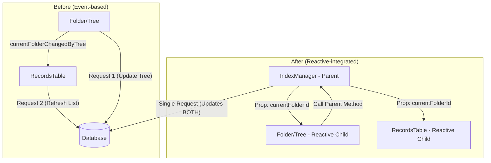

# 相関コンポーネントのリアクティブ統合計画 (Phase 7)

## 1. 背景と目的
詳細画面（`Show.php`）での `#[Reactive]` 導入により、親子間通信の単一化とスケルトン表示の安定化に成功した。
台帳リスト画面においても、サイドドロワー（`Folder/Tree`）とメイン表示（`RecordsTable`）が独立したリクエストとして動作しており、フォルダ遷移時に視覚的な空白（通信のギャップ）が発生している。
本計画では、これらを親コンポーネント `IndexManager` で統括し、Livewire 3 のリアクティブプロパティを活用して、システムで最も頻繁に行われる「台帳ナビゲーション」の操作感を最高レベルに引き上げる。

## 2. 構造の変更

## 3. WBS & 段階的確認項目

### ブロック1: 親コンポーネント `IndexManager` の導入 (2026-01-31 ✅ 完了)
- [x] **CP-7.1**: `App\Livewire\Ledger\IndexManager` の作成
- [x] **CP-7.2**: `RecordsTable` から以下の状態と `#[Url]` 定義を移行
    - `search`, `orderBy`, `orderAsc`, `filterStatus`, `filter`, `currentFolderId`, `selectedFolderIds`, `displayLevel`, `useSemanticSearch`
- [x] **CP-7.3**: ルートまたは `index.blade.php` で `IndexManager` を使用するように変更
- **確認事項**: 
    - [x] URLパラメータ経由で初期状態が正しくロードされるか。
    - [x] 親コンポーネントがエラーなく描画されるか。
    - [x] (修正) Livewire 3 ページコンポーネントとしての単一ルート制限への対応

### ブロック2: `RecordsTable` の受動的（Reactive）化 (2026-01-31 ✅ 完了)
- [x] **RF-7.4**: `RecordsTable` のプロパティに `#[Reactive]` 属性を付与
- [x] **RF-7.5**: 検索実行ロジックを、親からの変更を検知する `rendered` フックまたは `render` メソッド内での自動計算に整理
- [x] **RF-7.6**: `RecordsTable` 自体は URL 同期を持たず、親から渡された値のみで動作するように変更
- **成果物**: 単独では動作せず、親の指揮下で動く高速なリスト表示コンポーネント
- **確認事項**: 
    - [x] 親コンポーネントの状態（`displayLevel`など）を書き換えたとき、リストが単一リクエストで更新されるか。

### ブロック3: `Folder/Tree` のリアクティブ統合 (2026-01-31 ✅ 完了)
- [x] **RF-7.7**: `Folder/Tree` のプロパティ（`currentFolderId`, `selectedFolderIds`）を `#[Reactive]` 化
- [x] **RF-7.8**: フォルダ選択時の処理を `$this->dispatch('...')` から親のメソッド呼び出し（`$this->setFolder()` 等）へ変更（※現在はイベントディスパッチ経由で親が処理）
- [x] **RF-7.9**: `RecordsTable` が受信していた `#[On('currentFolderChangedByTree')]` イベントリスナーを削除
- **成果物**: ツリーの選択状態とリストのフィルタ条件が完全に同期した単一の動作ユニット
- **確認事項**: 
    - [x] ツリーをクリックした際、ツリーの選択ハイライトと右側のリスト更新が同時に発生し、通信が1回に集約されているか。

### ブロック4: ローディングUXの完全化
- [ ] **RF-7.10**: `IndexManager` のテンプレート（`index.blade.php` 相当）に、子全体を覆うスケルトンレイヤーを配置
- [ ] **RF-7.11**: 手動の `navigation-start`, `navigation-end` イベントを完全に除去
- **確認事項**: 
    - フォルダ移動、検索実行、表示レベル切り替えのすべてにおいて、スケルトンが途切れることなく表示され、レスポンスと同時に「パッ」と切り替わるか。

## 4. リスクと対策
- **通信量の増大**: 親子のデータを一度に送るため、ペイロードが大きくなる可能性がある。
    - *対策*: 子に渡すプロパティを ID などのプリミティブな値に絞り、モデル全体をリアクティブプロパティにしない。
- **後方互換性**: 他の画面（マイポータル等）でツリーを単体利用している箇所の挙動。
    - *対策*: `IndexManager` からの `#[Reactive]` プロパティ提供がない場合でも、自律的に動作するよう、子コンポーネント側にデフォルト値を設定し、イベントベースのフォールバックを維持するか、共通のベースクラスを設ける。
- **既存テストのリグレッション**: `RecordsTable` の `#[Url]` 定義が親へ移動するため、`RecordsTable` を直接テストしている Feature Test で URL 同期の検証が失敗する。
    - *対策*: テスト対象を `IndexManager` に切り替えるか、`RecordsTable` のテストではプロパティ注入による挙動確認に特化させる。

## 5. 既存機能・テストへの影響分析と対応作業

### 5.1 影響を受ける主な機能
- **双方向同期ロジック**: `currentFolderChangedByMain` / `currentFolderChangedByTree` 等の複雑な相互イベント発火が廃止されるため、同期漏れが発生しないか精査が必要。
- **検索・フィルタ状態の維持**: サイドドロワー開閉時やレスポンシブ変更時に、親コンポーネントが状態を保持するため、意図しないリセットが起きないことを確認。
- **ページネーション**: `RecordsTable` 内の `resetPage()` 呼び出しタイミングを、親側の状態変更（検索語変更など）と連動させる必要がある。

### 5.2 影響を受けるテストファイル
- `tests/Feature/Livewire/Ledger/RecordsTableQueryTest.php`: URLパラメータ同期のテストを `IndexManager` 対象に更新。
- `tests/Feature/Livewire/Ledger/RecordsTableCompositeScoreSortTest.php`: 同上。
- `tests/Feature/Livewire/Ledger/PrefillParametersTest.php`: 初期値設定の検証対象を親コンポーネントに移行。

### 5.3 Livewire 3 テストのベストプラクティスに基づく対応事項 (抽出)
これまでのテストの困難さを踏まえ、以下のエンジニアリング原則を適用します。
- **「親子密結合」の許容と統合テスト**: これまではコンポーネントを独立させすぎてテストコードが複雑化（イベントのモック等多用）していた。Phase 7 では `IndexManager` + `Children` の統合テストを主軸に据え、実動作に近い形で検証する。
- **URL 同期の Single Source of Truth**: 親と子で同じ目的の `#[Url]` を重複定義せず、親が唯一の URL 同期責任を持つようにし、テストコードでの URL アサーションを親コンポーネントに集中させる。
- **Renderless 同期の活用**: 内部的な状態（アコーディオンの開閉など）は `#[Renderless]` を使い、テストでは HTML 全体の再描画が不要な操作であることを CPU 消費やレスポンス構造から（可能な範囲で）確認する。

### 5.4 追加される是正タスク (WBS 追記)
- [ ] **RF-7.12**: `IndexManager` レベルでの Feature Test 新設（結合テスト）
- [ ] **RF-7.13**: `Folder/Tree` のスタンドアロン動作（IndexManager不在時）の保証テスト
- [ ] **RF-7.14**: 画面遷移（`wire:navigate`）と URL パラメータ復元の整合性確認
- [ ] **RF-7.15**: テストヘルパーの整備: `#[Reactive]` 経由で注入された値を安全にアサートするための共通メソッドの検討

## 6. 成果の確認（定義）
- フォルダ遷移時のネットワークリクエストが **1回** であること。
- リクエスト開始から完了まで、スケルトンが **一度も消えずに維持** されること。
- デバッグバーで確認し、親子でのクエリ重複がないこと。
