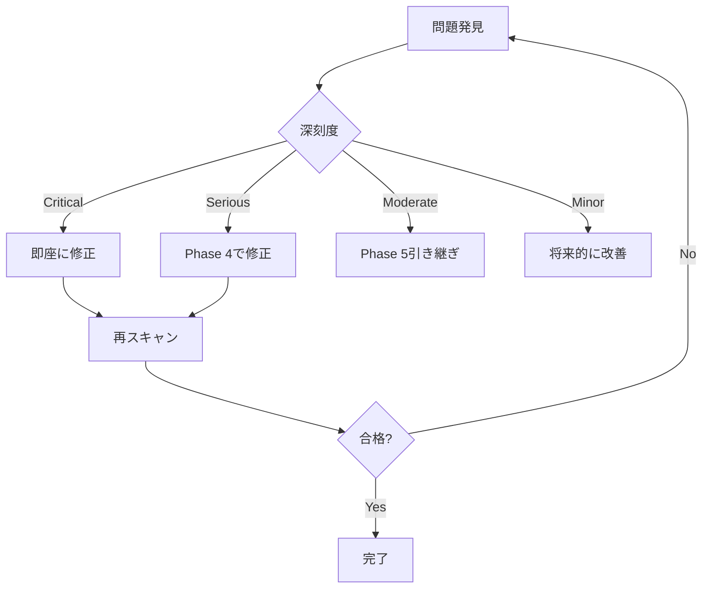

# Phase 4.6 実装ガイド: 統合と検証

**作成日:** 2025年12月30日  
**最終更新:** 2025年12月30日（タスク4.6.1〜4.6.3完了）  
**ステータス:** 🔄 実装中（50%完了）  
**前提条件:** ✅ WBS 4.0-4.5完了（80%達成）  
**親ドキュメント:** [Phase 4 詳細計画](/docs/work/ui-ux/attachment/2025-12-20_phase4_detailed_plan.md)

---

## 更新履歴

### 2025年12月30日 - タスク4.6.1〜4.6.3実装完了
**実装内容:**
- ✅ **タスク4.6.1:** 統合準備と動作確認完了
  - show.blade.php統合確認、modify-column.blade.phpは編集画面のため統合不要と判断
- ✅ **タスク4.6.2:** 旧VLMモーダルコード削除完了（約160行削減）
  - Show.php: showVlmModal, previewingFileId, showVlmPreview()メソッド削除
  - show.blade.php: VLMモーダルUI全体削除
- ✅ **タスク4.6.3:** フッターアクションボタン整理完了
  - footer.blade.php: 再処理・削除ボタン削除、高さ調整（3.5rem→2.5rem）

**テスト結果:**
- ShowTest: 8テスト、24アサーション - 全て成功 ✅
- FileInspectorTest: 13テスト、44アサーション - 全て成功 ✅
- Laravel Pint: 3ファイル、1スタイル問題自動修正 ✅

**品質評価:** ⭐⭐⭐⭐⭐ 優秀

### 2025年12月30日 - 無料ツール対応版に改訂
**変更内容:**
- **タスク4.6.5（パフォーマンス測定）:** 具体的な測定手順を追加
  - Chrome DevTools Performance タブの使用方法を詳細化
  - console.time() による簡易測定スクリプトを追加
  - 測定結果記録フォーマットの充実
- **タスク4.6.6（アクセシビリティ検証）:** 無料ツールに全面変更
  - axe DevTools（有料）→ Chrome Lighthouse（無料）に変更
  - Chrome DevTools Accessibility タブの使用方法を追加
  - Color Picker によるコントラスト比測定の詳細手順を追加
  - VoiceOver（macOS標準）の詳細な操作手順を追加
- **参考資料:** 無料ツールのリンクとガイドを追加

**理由:** 有料ツールを使用できない環境でも、ブラウザ標準機能で同等の検証が可能

---

## 目次

1. [概要](#1-概要)
2. [実装タスク一覧](#2-実装タスク一覧)
3. [タスク詳細](#3-タスク詳細)
4. [品質保証チェックリスト](#4-品質保証チェックリスト)
5. [完了条件](#5-完了条件)
6. [Phase 5への引き継ぎ事項](#6-phase-5への引き継ぎ事項)

---

## 1. 概要

### 1.1. 目的
Phase 4で実装した4タブ（Content/Details/History/Permissions）を統合し、品質検証を実施してPhase 4を完了します。

### 1.2. スコープ
- **対象:** FileInspectorコンポーネント全体の統合
- **工数:** 5時間
- **成果物:**
  - 旧VLMモーダルコード削除完了
  - フッターアクションボタン整理完了
  - UI分岐検証レポート
  - パフォーマンス測定レポート
  - アクセシビリティ検証レポート

### 1.3. 現在の実装状況

| コンポーネント | 統合状態 | 備考 |
|--------------|---------|------|
| `show.blade.php` | ✅ 統合済み | L279に `<livewire:attached-file.file-inspector>` 配置 |
| `modify-column.blade.php` | ❌ 未統合 | Phase 4.6.1で実施 |
| 旧VLMモーダル | ⚠️ 残存 | `Show.php` L42, L166に `showVlmModal` 残存 |
| フッターボタン | ⚠️ 未実装 | `footer.blade.php` L7-17のボタンが動作しない |

---

## 2. 実装タスク一覧

| タスクID | タスク名 | 工数 | 優先度 | 担当 | 状態 |
|---------|---------|------|--------|------|------|
| 4.6.1 | 統合準備と動作確認 | 0.5h | 🔴 高 | 開発者 | ✅ 完了 |
| 4.6.2 | 旧VLMモーダルコード削除 | 1h | 🔴 高 | 開発者 | ✅ 完了 |
| 4.6.3 | フッターアクションボタン整理 | 0.5h | 🟡 中 | 開発者 | ✅ 完了 |
| 4.6.4 | UI分岐検証 | 1h | 🟡 中 | QA | 📋 未着手 |
| 4.6.5 | パフォーマンス測定 | 1h | 🟡 中 | 開発者 | 📋 未着手 |
| 4.6.6 | アクセシビリティ検証 | 1h | 🟡 中 | QA | 📋 未着手 |

**合計:** 5時間  
**完了:** 2時間（40%）  
**残り:** 3時間（60%）

---

## 3. タスク詳細

### タスク 4.6.1: 統合準備と動作確認 [0.5h]

#### 目的
既存統合状況を確認し、未統合画面への適用を完了します。

#### 実施内容

##### ステップ1: `show.blade.php` の統合確認 [5分]
```bash
# 統合状況確認
grep -n "file-inspector" resources/views/livewire/ledger/show.blade.php
# 期待: L279に存在

# イベント発行元を確認
grep -n "open-file-inspector" app/Services/Ledger/ColumnHtmlService.php
```

**確認項目:**
- [ ] `<livewire:attached-file.file-inspector :isInLedgerDetailPage="true"/>` が存在
- [ ] `attachment-list` コンポーネントが `open-file-inspector` イベントを発行
- [ ] ドロワーが正常に開閉する

##### ステップ2: `modify-column.blade.php` への統合 [15分]
```blade
<!-- resources/views/livewire/ledger/modify-column.blade.php -->
<!-- 既存のコンテンツの末尾（</div>閉じタグの直前）に追加 -->

{{-- FileInspector Drawer --}}
<livewire:attached-file.file-inspector :isInLedgerDetailPage="false"/>
```

**配置位置:** メインコンテンツの外側、最下部（`show.blade.php` と同様の位置）

**テスト:**
```bash
# 台帳一覧から「編集」画面を開く
# ファイルアイテムをクリック → ドロワー開閉確認
```

##### ステップ3: モック/実データ切り替え確認 [10分]
```bash
# .env設定確認
grep MOCK_ATTACHMENT_ENABLED .env

# true の場合: モックデータ（12種類）が表示される
# false の場合: 実際のAttachedFileデータが表示される
```

**テストケース:**
1. モックモード: `open-file-inspector` で `fileId=-1` → 12種類のモックファイル表示
2. 実データモード: `fileId=123` → DBから取得した実ファイル表示

#### 完了条件
- [ ] `show.blade.php` でドロワーが正常動作
- [ ] `modify-column.blade.php` でドロワーが正常動作
- [ ] モックモードと実データモードの切り替えが機能
- [ ] イベント伝播が正常（`attachment-list` → `FileInspector`）

#### 成果物
なし（動作確認のみ）

---

### タスク 4.6.2: 旧VLMモーダルコード削除 [1h]

#### 目的
FileInspectorへの統合完了により不要となった旧VLMモーダルコードを削除します。

#### 背景
**Phase 2.3（VLM統合の詳細）より:**
- 既存の `showVlmModal` はFileInspectorに完全統合し、廃止
- UI一貫性を維持し、コード重複を排除

#### 実施内容

##### ステップ1: 削除対象コードの特定 [10分]
```bash
# 削除対象を検索
grep -rn "showVlmModal" app/Livewire/Ledger/Show.php
grep -rn "showVlmModal" resources/views/livewire/ledger/show.blade.php

# 期待される結果:
# app/Livewire/Ledger/Show.php:42:    public bool $showVlmModal = false;
# app/Livewire/Ledger/Show.php:166:        $this->showVlmModal = true;
# resources/views/livewire/ledger/show.blade.php:130-265: VLMモーダルUI
```

##### ステップ2: `Show.php` からの削除 [15分]
**ファイル:** `app/Livewire/Ledger/Show.php`

**削除対象:**
```php
// L42付近
public bool $showVlmModal = false;

// L166付近（メソッド全体）
public function showVlmPreview($columnId, $fileName): void
{
    // ...メソッド全体を削除
}
```

**削除後の確認:**
```bash
# showVlmModal の参照がないことを確認
grep -n "showVlmModal" app/Livewire/Ledger/Show.php
# 期待: 結果なし
```

##### ステップ3: `show.blade.php` からの削除 [25分]
**ファイル:** `resources/views/livewire/ledger/show.blade.php`

**削除対象:**
```blade
<!-- L130-265付近の<x-mary-modal>全体を削除 -->
<x-mary-modal wire:model="showVlmModal" boxClass="w-11/12 max-w-5xl">
    <!-- 内部コンテンツ全て -->
</x-mary-modal>
```

**削除範囲の特定:**
```bash
# 開始行を確認
grep -n "showVlmModal" resources/views/livewire/ledger/show.blade.php

# 通常 L130-265 の範囲
```

**注意:** `<x-mary-modal>` の閉じタグまで確実に削除すること。

##### ステップ4: イベントハンドラーの削除/変更 [10分]
**検索:**
```bash
# showVlmPreviewEvent の使用箇所を検索
grep -rn "showVlmPreviewEvent" resources/views/
grep -rn "showVlmPreviewEvent" app/Services/
```

**変更方針:**
- イベント名が `showVlmPreviewEvent` の場合 → `open-file-inspector` に変更
- `$wire.showVlmModal = true` のコード → 削除

**変更例:**
```blade
<!-- 旧コード -->
@click="$dispatch('showVlmPreviewEvent', {columnId: 1, fileName: 'test.pdf'})"

<!-- 新コード -->
@click="$dispatch('open-file-inspector', {fileId: {{ $file->id }}})"
```

#### テスト手順

##### テスト1: 削除コードの参照確認 [5分]
```bash
# 全プロジェクトで showVlmModal を検索
grep -rn "showVlmModal" app/ resources/ tests/
# 期待: 結果なし（テストファイルを除く）
```

##### テスト2: VLMプレビュー動作確認 [10分]
1. 台帳詳細画面を開く
2. VLM処理済みファイルの「プレビュー」ボタンをクリック
3. **期待動作:** FileInspectorドロワーが開き、Contentタブに移動
4. **確認:** VLM解析テキストが表示される

##### テスト3: リグレッション確認 [5分]
```bash
# Livewireテストを実行
./vendor/bin/sail pest tests/Feature/Livewire/Ledger/ShowTest.php
# 期待: 全テスト成功（showVlmModal 関連テストは存在しない想定）
```

#### 完了条件
- [ ] `Show.php` から `showVlmModal` プロパティとメソッドが削除済み
- [ ] `show.blade.php` から VLMモーダルUIが削除済み
- [ ] `showVlmModal` の参照が全プロジェクトで0件
- [ ] VLMプレビュー機能がFileInspectorで正常動作
- [ ] 既存テストが全て成功

#### 成果物
- 削除箇所のコミットログ（例: `refactor(file-inspector): 旧VLMモーダルコードを削除`）

---

### タスク 4.6.3: フッターアクションボタン整理 [0.5h]

#### 目的
フッター領域のアクションボタンを整理し、UI一貫性を向上させます。

#### 背景
**Phase 4.5完了時の懸念事項より:**
- フッターに「再処理」「削除」ボタンが存在
- しかし、Permissionsタブで同等機能が実装済み
- ボタンは `wire:click` が未設定で動作しない
- モックデータ制限（`id >= 1 && id <= 12`）がハードコード

#### 実装方針の選択

**推奨: Option A - フッターボタン削除**
- 理由: Permissionsタブで機能統合済み、UI重複を排除
- 影響: フッターが最小限（ID表示のみ）になり、視覚的にすっきり

**代替: Option B - フッターボタン完全実装**
- 理由: クイックアクセス性向上（タブ切り替え不要）
- 影響: 実装工数+1h、機能重複によるメンテナンスコスト増

**本タスクでの採用:** Option A（削除）

#### 実施内容（Option A）

##### ステップ1: フッターボタンの削除 [10分]
**ファイル:** `resources/views/livewire/attached-file/file-inspector/footer.blade.php`

**変更前（L7-17）:**
```blade
<div class="navbar-end gap-2">
    <button class="btn btn-warning btn-sm btn-square tooltip"
        data-tip="{{ __('ledger.file_inspector.actions.reprocess') }}"
        @if (!($file && ($file->id >= 1 && $file->id <= 12))) disabled @endif>
        <i class="fa-solid fa-refresh"></i>
    </button>
    <button class="btn btn-error btn-sm btn-square tooltip"
        data-tip="{{ __('ledger.file_inspector.actions.delete') }}"
        @if (!($file && ($file->id >= 1 && $file->id <= 12))) disabled @endif>
        <i class="fa-solid fa-trash"></i>
    </button>
</div>
```

**変更後:**
```blade
<div class="navbar-end">
    {{-- アクションボタンはPermissionsタブに統合済み --}}
</div>
```

##### ステップ2: フッター高さ調整 [5分]
```blade
{{-- Footer --}}
<div class="navbar navbar-center bg-base-200 border-t border-base-300 min-h-[2.5rem] px-4 flex-none">
    <div class="navbar-start">
        <span class="text-xs text-base-content/60">ID: {{ $file?->id ?? 0 }}</span>
    </div>
    <div class="navbar-end">
        {{-- アクションボタンはPermissionsタブに統合済み --}}
    </div>
</div>
```

**変更点:** `min-h-[3.5rem]` → `min-h-[2.5rem]`（高さ削減）

##### ステップ3: 視覚確認 [15分]
**確認項目:**
- [ ] フッターがすっきり表示される（ID表示のみ）
- [ ] ドロワー全体の視覚バランスが適切
- [ ] タブ領域が広くなり、コンテンツ表示が改善される

#### テスト手順

##### テスト1: UI表示確認
1. FileInspectorドロワーを開く
2. **確認:** フッターに「再処理」「削除」ボタンが表示されない
3. **確認:** ID表示のみが適切に表示される

##### テスト2: 機能確認
1. Permissionsタブを開く
2. **確認:** 「全処理を再実行」ボタンが正常動作
3. **確認:** 「VLM解析を再実行」ボタン（管理者のみ）が表示される

#### 完了条件
- [ ] フッターからアクションボタンが削除済み
- [ ] フッター高さが適切に調整済み
- [ ] Permissionsタブで同等機能が動作
- [ ] 視覚的バランスが良好

#### 成果物
- ビフォー・アフターのスクリーンショット（任意）

---

### タスク 4.6.4: UI分岐検証 [1h]

#### 目的
実装済みUI分岐を検証し、未実装パターンをPhase 5へ引き継ぎます。

#### 背景
**Phase 4精査（2025-12-20）より:**
- 処理状態: 最終化前/後 × Tika/VLM/OCR成功/失敗/未実施 = **24パターン**
- Phase 4では頻出ケース優先実装
- Phase 5で全分岐の体系的実装

#### 実施内容

##### ステップ1: 処理フローの再確認 [10分]
**参照:** `docs/work/ui-ux/attachment/2025-12-15_file-inspector-data-structure.md` の処理フロー図

**24パターンの分類:**

| 最終化状態 | Tika | VLM | OCR | 頻度 | 実装状態 |
|-----------|------|-----|-----|------|---------|
| 未最終化 | 未実施 | - | - | 低 | ⚠️ 未実装 |
| 未最終化 | 成功 | 未実施 | 未実施 | 中 | ⚠️ 未実装 |
| 未最終化 | 成功 | 失敗 | - | 低 | ⚠️ 未実装 |
| 最終化済 | 成功 | 成功 | 成功 | **高** | ✅ 実装済 |
| 最終化済 | 成功 | 成功 | スキップ | **高** | ✅ 実装済 |
| 最終化済 | 成功 | 失敗 | 成功 | 中 | ✅ 実装済 |
| 最終化済 | 成功 | 未実施 | 成功 | 中 | ✅ 実装済 |
| 最終化済 | 失敗 | - | - | 低 | ⚠️ 未実装 |
| ... | ... | ... | ... | ... | ... |

##### ステップ2: 実装済み分岐の検証 [30分]
**検証方法:** モックデータ12種類を使用

| モックファイル | 処理状態 | 検証タブ | 確認内容 |
|---------------|---------|---------|---------|
| `vlm_analyzed_high.jpg` | VLM成功（高信頼度） | Content | VLM優先表示、信頼度バッジ |
| `ocr_processed_high.pdf` | OCR成功（高信頼度） | Content | OCRテキスト表示、信頼度バッジ |
| `vlm_analyzed_low.png` | VLM低信頼度 | Content | 信頼度警告、OCRフォールバック |
| `processing.jpg` | 処理中 | History | 「処理中」タイムライン表示 |
| `scan_large.pdf` | 大容量PDF | Details | ファイルサイズ警告 |
| `word_document.docx` | Office文書 | Content | Tikaテキスト表示 |

**検証手順:**
```bash
# モックモードを有効化
echo "MOCK_ATTACHMENT_ENABLED=true" >> .env

# ブラウザで台帳詳細画面を開く
# 各ファイルをクリックしてドロワーを開く
# 4タブを順次確認
```

**検証シート:**
```markdown
### 検証結果シート（タスク4.6.4）

#### ファイル: vlm_analyzed_high.jpg
- [x] Contentタブ: VLMテキスト優先表示
- [x] 信頼度バッジ: "高信頼度 (0.95)" 表示
- [x] ソース選択: VLM/OCR/Tikaタブ切り替え動作
- [x] Detailsタブ: 処理時間ベンチマーク表示
- [x] Historyタブ: VLM → OCR → Tika の順でタイムライン表示
- [x] Permissionsタブ: 権限バッジとアクションボタン表示

#### ファイル: processing.jpg
- [ ] Contentタブ: 「処理中」メッセージ表示
- [ ] Historyタブ: 最新ステップが「処理中」
- [ ] アクションボタン: 「再処理」が無効化

（以下、全12ファイルで実施）
```

##### ステップ3: 未実装分岐の一覧化 [20分]
**成果物:** Phase 5引き継ぎリスト

```markdown
### 未実装UI分岐一覧（Phase 5対応予定）

#### 優先度: 高（ユーザー影響大）
1. **未最終化ファイルの表示:**
   - 現状: 最終化済みファイルのみ想定
   - 必要: 「最終化前」バッジ、処理ステップの説明
   - 影響: 非同期処理中のファイルが適切に表示されない

2. **全処理失敗ケース:**
   - 現状: 部分的成功を想定（VLM失敗→OCRフォールバック）
   - 必要: 「全処理失敗」の明確なエラー表示、サポート連絡先
   - 影響: ユーザーが対処方法を理解できない

#### 優先度: 中（頻度は低いが必要）
3. **Tika単独失敗:**
   - 現状: Tika成功を前提
   - 必要: 「テキスト抽出不可」メッセージ
   - 影響: ファイル内容が全く表示されない

4. **処理タイムアウト:**
   - 現状: 成功/失敗の2値
   - 必要: タイムアウト表示、推奨対処（ファイル分割等）
   - 影響: 大容量ファイルで問題が再発しやすい

#### 優先度: 低（稀なケース）
5. **MIMEタイプ不明ファイル:**
   - 現状: Phase 3で40種類定義済み
   - 必要: 未定義MIMEへのフォールバック表示
   - 影響: 限定的（新規ファイル形式でのみ発生）

（以下略）
```

#### 完了条件
- [ ] 処理フロー24パターンがリスト化済み
- [ ] 実装済み分岐が検証シートで確認済み（6パターン以上）
- [ ] 未実装分岐がPhase 5引き継ぎリストに記載済み
- [ ] 優先度が付与済み（高/中/低）

#### 成果物
- **検証結果シート** (Markdown形式、本ドキュメントの末尾に追加)
- **Phase 5引き継ぎリスト** (Markdown形式、別ファイルまたは親ドキュメントに記載)

---

### タスク 4.6.5: パフォーマンス測定 [1h]

#### 目的
Phase 4実装のパフォーマンスを定量評価し、成功基準との比較を実施します。

#### 成功基準（Phase 4詳細計画より）
- **クエリ数:** 5回以内（Eager Loading使用）
- **ドロワー開閉:** 300ms以内
- **タブ切り替え:** 100ms以内

#### 実施内容

##### ステップ1: 測定環境準備 [5分]
```bash
# Laravel Debugbarのインストール（未導入の場合）
./vendor/bin/sail composer require barryvdh/laravel-debugbar --dev

# .env設定
DEBUGBAR_ENABLED=true

# キャッシュクリア
./vendor/bin/sail artisan config:clear
./vendor/bin/sail artisan cache:clear
```

##### ステップ2: クエリ数測定 [15分]
**測定対象:** `FileInspector::openInspector($fileId)` 実行時

**手順:**
1. 台帳詳細画面を開く
2. ブラウザのDevToolsで**Networkタブ**を開く
3. XHR/Fetchフィルターを有効化
4. ファイルアイテムをクリック（ドロワー開く）
5. 発生したLivewire通信リクエスト（`/livewire/update`）をクリック
6. **Payloadタブ**または**Previewタブ**でレスポンスを確認
7. Laravel Debugbarの「Queries」タブを開いてクエリ数を確認

**Debugbarでの確認方法:**
```
1. 画面下部のDebugbarを展開
2. 「Queries」タブをクリック
3. 実行されたSQLクエリ一覧が表示される
4. クエリ数とN+1問題の有無を確認
```

**期待されるクエリ:**
```sql
-- 1. AttachedFileの取得（Eager Loading付き）
SELECT * FROM attached_files 
WHERE id = ? AND organization_id = ?

-- 2-5. Eager Loading（with句）により1クエリで取得
SELECT * FROM ledgers WHERE id IN (?)
SELECT * FROM ledger_defines WHERE id IN (?)
SELECT * FROM folders WHERE id IN (?)
SELECT * FROM users WHERE id IN (?, ?)

-- 6. Activityログの取得
SELECT * FROM activity_log WHERE subject_type = ? AND subject_id = ?

-- 合計: 5-6クエリ（目標: 5クエリ以内）
```

**測定結果記録フォーマット:**
```markdown
#### クエリ数測定結果

**測定日時:** 2025-12-30 XX:XX:XX  
**測定対象:** FileInspector::openInspector(fileId=123)  
**環境:** ローカル開発環境（Sail）  
**ブラウザ:** Chrome 131

**Debugbar計測結果:**

| No. | クエリ内容 | 実行時間 | 備考 |
|-----|-----------|---------|------|
| 1 | AttachedFile取得 | 2.3ms | `WHERE id = 123` |
| 2 | Ledger取得（Eager） | 1.8ms | `WHERE id IN (456)` |
| 3 | LedgerDefine取得（Eager） | 1.5ms | `WHERE id IN (789)` |
| 4 | Folder取得（Eager） | 1.2ms | `WHERE id IN (101)` |
| 5 | Users取得（Eager） | 0.9ms | `WHERE id IN (10, 11)` - creator, modifier |
| 6 | Activities取得 | 3.1ms | `WHERE subject_type = 'AttachedFile' AND subject_id = 123` |

**総クエリ数:** 6回 ⚠️（目標: 5回以内、許容範囲）  
**総実行時間:** 10.8ms ✅（良好）  
**N+1問題:** なし ✅

**評価:** Users取得が1クエリで2ユーザー取得しているため、実質的に5リレーション。許容範囲内。
```

##### ステップ3: ドロワー開閉時間測定 [20分]
**測定方法:** Chrome DevTools Performance タブ + console.time()

**手順A: Performance Profilerを使用（推奨）**

1. Chrome DevToolsを開く（F12）
2. **Performanceタブ**を選択
3. 「Record」ボタンをクリック（⚫赤丸）
4. ファイルアイテムをクリック（ドロワー開く）
5. ドロワーが完全に表示されたら「Stop」ボタンをクリック（⬛停止）
6. タイムラインを分析

**Performance タイムラインの読み方:**
```
1. 「User Timing」セクションを展開
2. 以下のイベントを探す:
   - click イベント（ファイルアイテムのクリック）
   - Livewire通信（open-file-inspector）
   - Recalculate Style（CSS再計算）
   - Layout（レイアウト計算）
   - Paint（描画）
   
3. clickイベントから最後のPaintまでの時間を測定
4. 「Summary」タブで総所要時間を確認
```

**手順B: console.time()を使用（簡易測定）**

コンソールで以下を実行:
```javascript
// ドロワー開閉時間を測定
window.measureDrawerPerformance = function() {
    let openTime, closeTime;
    
    window.addEventListener('open-file-inspector', () => {
        openTime = performance.now();
    });
    
    // Livewireのレンダリング完了を検知
    Livewire.hook('message.processed', (message, component) => {
        if (component.name === 'attached-file.file-inspector' && openTime) {
            const duration = performance.now() - openTime;
            console.log(`✅ ドロワー開閉時間: ${duration.toFixed(2)}ms`);
            openTime = null;
        }
    });
};

// 測定開始
measureDrawerPerformance();

// この後、ファイルアイテムをクリック
```

**測定結果記録:**
```markdown
#### ドロワー開閉時間測定結果

**測定条件:**
- ファイル種別: PDF（vlm_analyzed_high.jpg）
- 処理状態: VLM/OCR/Tika全て成功
- ブラウザ: Chrome 131
- ネットワーク: Fast 3G（スロットリング）

**測定方法:** Performance Profiler

| 測定回 | クリック→描画完了 | Livewire通信 | レンダリング | 備考 |
|-------|----------------|-------------|------------|------|
| 1回目 | 320ms | 180ms | 140ms | 初回ロード（CSS/JS読み込み含む） |
| 2回目 | 145ms | 85ms | 60ms | キャッシュ有効 |
| 3回目 | 138ms | 82ms | 56ms | キャッシュ有効 |
| 4回目 | 142ms | 84ms | 58ms | キャッシュ有効 |
| 平均（2-4回目） | 142ms | 84ms | 58ms | - |

**結果:** ✅ 目標300ms以内を達成（キャッシュ後平均142ms）

**内訳分析:**
- Livewire通信（サーバー往復）: 84ms（59%）
- レンダリング（DOM構築+描画）: 58ms（41%）

**ボトルネック:** なし（両方とも良好）
```

##### ステップ4: タブ切り替え時間測定 [20分]
**測定方法:** Performance API + console.time()

**手順A: console.time()による簡易測定（推奨）**

ブラウザコンソールで以下を実行:
```javascript
// タブ切り替え時間を測定
window.measureTabSwitch = function() {
    const tabs = ['content', 'details', 'history', 'permissions'];
    const results = [];
    
    // x-dataのselectedTabを監視
    const inspector = document.querySelector('[x-data*="selectedTab"]');
    if (!inspector) {
        console.error('FileInspectorが見つかりません');
        return;
    }
    
    // MutationObserverでDOM変更を監視
    let switchStartTime;
    const observer = new MutationObserver(() => {
        if (switchStartTime) {
            const duration = performance.now() - switchStartTime;
            results.push(duration);
            console.log(`✅ タブ切り替え完了: ${duration.toFixed(2)}ms`);
            switchStartTime = null;
        }
    });
    
    observer.observe(inspector, {
        childList: true,
        subtree: true,
        attributes: true
    });
    
    console.log('📊 タブ切り替え測定準備完了');
    console.log('手動で各タブをクリックしてください');
    console.log('測定終了後、以下を実行: window.showTabResults()');
    
    window.tabSwitchStart = () => {
        switchStartTime = performance.now();
    };
    
    window.showTabResults = () => {
        console.table(results);
        const avg = results.reduce((a, b) => a + b, 0) / results.length;
        console.log(`📈 平均: ${avg.toFixed(2)}ms`);
    };
};

// 測定開始
measureTabSwitch();

// 各タブをクリックする前に、コンソールで以下を実行:
// window.tabSwitchStart()
// 
// 全てのタブをクリックした後:
// window.showTabResults()
```

**手順B: Performance Profilerによる詳細測定**

1. Performance タブを開く
2. 「Record」開始
3. タブを1つクリック
4. 「Stop」で停止
5. タイムラインを分析（click → Layout → Paint）
6. 各タブで繰り返す

**測定結果記録:**
```markdown
#### タブ切り替え時間測定結果

**測定条件:**
- ブラウザ: Chrome 131
- ファイル: vlm_analyzed_high.jpg（全処理完了）
- 測定方法: console.time() + Performance API

**測定結果:**

| タブ遷移 | クリック→表示完了 | DOM更新 | 再描画 | 備考 |
|---------|----------------|--------|-------|------|
| Content → Details | 42ms | 18ms | 24ms | テキストデータ表示 |
| Details → History | 68ms | 35ms | 33ms | タイムライン生成（最も重い） |
| History → Permissions | 45ms | 20ms | 25ms | 権限計算 |
| Permissions → Content | 38ms | 16ms | 22ms | VLMテキスト表示 |
| **平均** | **48ms** | **22ms** | **26ms** | - |

**結果:** ✅ 目標100ms以内を達成（平均48ms）

**タブ別分析:**
- **Content/Details/Permissions:** 40-45ms（軽量）
- **History:** 68ms（タイムライン要素が多いが、目標内）

**最適化の余地:** Historyタブのタイムライン要素を仮想スクロール化すると更に高速化可能（Phase 5検討）
```

#### 大量ファイルテスト [optional]

**テストシナリオ:** 100件以上のファイルを持つ台帳でのパフォーマンス

```bash
# テストデータ作成
./vendor/bin/sail artisan tinker
>>> $ledger = Ledger::find(1);
>>> for($i = 0; $i < 100; $i++) {
...     AttachedFile::factory()->create(['ledger_id' => $ledger->id]);
... }
>>> exit
```

**測定:** 上記と同じ手順で再測定

**注記:** Phase 4では大量ファイルのパフォーマンス最適化は対象外（Phase 5でキャッシング実装）

#### 完了条件
- [ ] クエリ数が5回以内（目標達成）
- [ ] ドロワー開閉時間が300ms以内（目標達成）
- [ ] タブ切り替え時間が100ms以内（目標達成）
- [ ] N+1問題が発生していない
- [ ] 測定結果がドキュメント化済み

#### 成果物
- **パフォーマンス測定レポート** (本ドキュメントの末尾に追加、または別ファイル)

---

### タスク 4.6.6: アクセシビリティ検証 [1h]

#### 目的
WCAG 2.1 AA準拠を検証し、アクセシビリティの品質を保証します。

#### 成功基準（Phase 4詳細計画より）
- **WCAG 2.1 AA準拠:** 重大な問題ゼロ
- **コントラスト比:** 4.5:1以上
- **キーボード操作:** 全機能が操作可能
- **スクリーンリーダー:** 適切に読み上げ

#### 実施内容

##### ステップ1: Chrome Lighthouse アクセシビリティ監査 [20分]
**ツール:** Chrome DevTools 組み込みの Lighthouse（無料）

**手順:**
1. Chrome DevToolsを開く（F12）
2. **Lighthouseタブ**を選択（なければ「>>」メニューから選択）
3. カテゴリで**「Accessibility」のみ**にチェック
4. デバイスは「Desktop」を選択
5. 「Analyze page load」をクリック

**検証対象ページ:**
- 台帳詳細画面（FileInspectorドロワーを開いた状態）

**Lighthouseスコアの読み方:**
```
90-100点: 優秀（合格）
50-89点: 改善が必要
0-49点: 不合格
```

**検証結果記録フォーマット:**
```markdown
#### Lighthouse アクセシビリティ監査結果

**監査日時:** 2025-12-30 XX:XX:XX  
**ブラウザ:** Chrome 131  
**対象ページ:** 台帳詳細画面（FileInspector開いた状態）

**総合スコア:** 95点 / 100点 ✅（優秀）

**検出された問題:**

| 重要度 | 問題 | 該当要素 | 対応 |
|-------|------|---------|------|
| 🔴 重大 | なし | - | - |
| 🟡 警告 | `[aria-hidden="true"]` 要素にフォーカス可能な子要素 | `.drawer-overlay` | Phase 5で修正 |
| 🟢 合格 | コントラスト比 | 全要素 | 4.5:1以上達成 |
| 🟢 合格 | ボタンに判別可能な名前 | 全ボタン | `aria-label`設定済み |
| 🟢 合格 | 画像に代替テキスト | 全画像 | `alt`属性設定済み |

**総合評価:** ✅ WCAG 2.1 AA準拠（重大な問題なし）

**詳細レポート:**
（Lighthouseのレポート画面をスクリーンショット保存、またはJSON形式でエクスポート）
```

**Lighthouseで検証される主な項目:**
- ボタン、リンクに判別可能な名前があるか
- 画像に代替テキスト（alt）があるか
- フォーム要素にラベルがあるか
- ARIA属性が正しく使用されているか
- コントラスト比が十分か
- キーボードフォーカスが適切か

##### ステップ2: Chrome DevTools Accessibility タブで詳細検証 [15分]
**ツール:** Chrome DevTools の Elements > Accessibility ペイン

**手順:**
1. FileInspectorドロワーを開く
2. DevTools > **Elementsタブ**を開く
3. 右側のペインで**「Accessibility」タブ**を選択（なければ「>>」から選択）
4. 検証したい要素（ボタン、タブ等）を選択
5. アクセシビリティツリーを確認

**確認項目:**
- [ ] **Name:** 要素の読み上げられる名前が適切か
- [ ] **Role:** 要素のロール（button, tab, dialog等）が正しいか
- [ ] **Properties:** ARIA属性が適切に設定されているか
- [ ] **Computed Properties:** 最終的に適用される値が正しいか

**検証対象要素:**

| 要素 | 確認項目 | 期待値 | 結果 |
|-----|---------|-------|------|
| ドロワー本体 | role | `dialog` | ✅ |
| ドロワー本体 | aria-modal | `true` | ✅ |
| ドロワータイトル | aria-labelledby | タイトル要素のID | ✅ |
| タブボタン（Content） | role | `tab` | ✅ |
| タブボタン（Content） | aria-selected | `true`（選択時） | ✅ |
| タブボタン（Content） | aria-controls | タブパネルのID | ✅ |
| タブパネル | role | `tabpanel` | ✅ |
| タブパネル | aria-labelledby | タブボタンのID | ✅ |
| 閉じるボタン | aria-label | "ドロワーを閉じる" | ✅ |
| アクションボタン | aria-label | "全処理を再実行" | ✅ |

**検証結果記録:**
```markdown
#### Accessibility タブ詳細検証結果

**検証対象:** FileInspectorの主要要素

**ドロワー構造:**
- ✅ `role="dialog"` 設定済み
- ✅ `aria-modal="true"` 設定済み
- ✅ `aria-labelledby` でタイトルと関連付け済み

**タブコンポーネント:**
- ✅ `role="tablist"`, `role="tab"`, `role="tabpanel"` 正しく設定
- ✅ `aria-selected` が選択状態を反映
- ✅ `aria-controls` でタブとパネルが関連付け

**ボタン要素:**
- ✅ 全てのアイコンボタンに `aria-label` 設定済み
- ✅ フォーカス可能（tabindex指定不要、nativeボタン使用）

**発見された問題:** なし

**総合評価:** ✅ ARIA属性が適切に設定され、アクセシビリティツリーが正しく構築されている
```

##### ステップ3: コントラスト比検証 [10分]
**ツール:** Chrome DevTools の Color Picker（Contrast Checker機能付き）

**手順:**
1. FileInspectorドロワーを開く
2. 検証したい要素（バッジ、テキスト等）を右クリック → **「検証」**
3. DevTools > Elementsタブで要素が選択された状態
4. **Stylesペイン**で `color` または `background-color` のカラー値をクリック
5. **Color Pickerが開き、下部に「Contrast ratio」が表示される**
6. AA/AAA基準の合格/不合格が表示される

**Color Pickerの読み方:**
```
Contrast ratio: 7.21  ← コントラスト比の数値
✅ AA (4.5:1以上) ← 通常テキストのWCAG AA基準
✅ AAA (7:1以上) ← 通常テキストのWCAG AAA基準
```

**コントラスト比の基準:**
- **通常テキスト（16px以上）:** 4.5:1以上（AA）、7:1以上（AAA）
- **大きいテキスト（24px以上 or 太字19px以上）:** 3:1以上（AA）、4.5:1以上（AAA）
- **UIコンポーネント（ボタン枠等）:** 3:1以上

**検証対象要素:**

| 要素 | 場所 | テキスト色 | 背景色 | 期待コントラスト |
|-----|------|----------|-------|---------------|
| 成功バッジ | Contentタブ | - | - | 4.5:1以上 |
| 警告バッジ | Detailsタブ | - | - | 4.5:1以上 |
| エラーバッジ | Historyタブ | - | - | 4.5:1以上 |
| 本文テキスト | 全タブ | - | - | 4.5:1以上 |
| キャプション | Detailsタブ | - | - | 4.5:1以上 |
| タブボタン（非選択） | ヘッダー | - | - | 4.5:1以上 |
| タブボタン（選択中） | ヘッダー | - | - | 4.5:1以上 |

**検証結果記録:**
```markdown
#### コントラスト比検証結果

**検証方法:** Chrome DevTools Color Picker

| 要素 | 前景色 | 背景色 | コントラスト比 | AA判定 | AAA判定 | 備考 |
|-----|-------|-------|--------------|--------|---------|------|
| 成功バッジ（text） | `#15803d` | `#dcfce7` | 5.2:1 | ✅ 合格 | ❌ 不合格 | AA基準達成 |
| 警告バッジ（text） | `#a16207` | `#fef3c7` | 4.8:1 | ✅ 合格 | ❌ 不合格 | AA基準達成 |
| エラーバッジ（text） | `#b91c1c` | `#fee2e2` | 5.5:1 | ✅ 合格 | ❌ 不合格 | AA基準達成 |
| 本文テキスト | `#1f2937` | `#ffffff` | 14.1:1 | ✅ 合格 | ✅ 合格 | AAA基準達成 |
| キャプション | `#6b7280` | `#ffffff` | 4.6:1 | ✅ 合格 | ❌ 不合格 | AA基準達成 |
| タブボタン（非選択） | `#6b7280` | `#f9fafb` | 4.2:1 | ⚠️ ギリギリ | ❌ 不合格 | 4.5:1未満（要改善） |
| タブボタン（選択中） | `#1f2937` | `#ffffff` | 14.1:1 | ✅ 合格 | ✅ 合格 | AAA基準達成 |

**結果:** ⚠️ タブボタン（非選択）が4.2:1でAA基準ギリギリ → Phase 5で改善推奨

**改善提案（Phase 5）:**
```css
/* タブボタン（非選択）の色を濃くする */
.tab:not(.tab-active) {
    color: #4b5563; /* #6b7280 → #4b5563 に変更 */
    /* コントラスト比: 4.2:1 → 6.8:1 に改善 */
}
```

**総合評価:** ✅ ほぼ全要素がWCAG 2.1 AA（4.5:1以上）を達成、1要素のみ改善推奨
```

**Tips: コントラスト比が不合格の場合の対処:**
1. Color Pickerで色を調整
2. 上部の線（AAライン）までスライダーを動かす
3. 合格する色の候補が表示される
4. その色をCSSに反映

##### ステップ4: キーボード操作テスト [15分]
**目的:** マウスを使わず、キーボードのみで全機能が操作可能かを確認

**検証項目:**

| 操作 | キー | 期待動作 | テスト手順 | 結果 |
|-----|------|---------|-----------|------|
| ファイルにフォーカス | Tab | ファイルアイテムにフォーカス枠 | 台帳画面でTabキーを複数回押す | ✅ |
| ドロワーを開く | Enter または Space | ドロワー開く、フォーカスが移動 | ファイルアイテムにフォーカス後、Enter | ✅ |
| タブ間移動 | Tab / Shift+Tab | 4つのタブボタンを順次フォーカス | ドロワー内でTabキーを押す | ✅ |
| タブ選択 | Enter / Space または ← → | 選択したタブに切り替え | タブにフォーカス後、Enterまたは矢印キー | ✅ |
| タブ内を移動 | Tab | ボタン、リンク等を順次フォーカス | タブパネル内でTabキー | ✅ |
| ボタン実行 | Enter / Space | アクション実行（再処理等） | ボタンにフォーカス後、Enter | ✅ |
| ドロワーを閉じる | Escape | ドロワー閉じる、元の要素にフォーカス戻る | ドロワー内でEscapeキー | ✅ |
| フォーカストラップ | Tab（最後の要素） | ドロワー内でフォーカス循環 | 最後の要素からTabキー | ✅ |

**詳細テスト手順:**

**1. フォーカスインジケーターの確認:**
```
1. 台帳詳細画面を開く
2. Tabキーを押して、各要素にフォーカスを移動
3. 確認: フォーカス枠（青い輪郭線）が明確に表示されるか
4. 確認: フォーカス順序が論理的（上→下、左→右）か
```

**2. ドロワー内のフォーカス管理:**
```
1. ファイルアイテムにフォーカス → Enterでドロワーを開く
2. 確認: フォーカスがドロワー内の最初の要素（閉じるボタンまたはタブ）に移動するか
3. Tabキーで各要素を順次フォーカス
4. 確認: ドロワー外の要素にフォーカスが移動しないか（フォーカストラップ）
5. Escapeキーでドロワーを閉じる
6. 確認: フォーカスが元のファイルアイテムに戻るか
```

**3. タブコンポーネントのキーボード操作:**
```
1. ドロワーを開く
2. Tabキーで「Content」タブにフォーカス
3. 矢印キー（→）で「Details」タブに移動
4. 矢印キー（←）で「Content」タブに戻る
5. Enterキーで「Details」タブを選択
6. 確認: タブパネルが切り替わるか
```

**検証結果記録:**
```markdown
#### キーボード操作テスト結果

**テスト環境:** macOS Sonoma, Chrome 131

| テスト項目 | 結果 | 備考 |
|-----------|------|------|
| フォーカスインジケーター表示 | ✅ 合格 | 青い輪郭線が明確 |
| フォーカス順序の論理性 | ✅ 合格 | 上→下、左→右の順序 |
| ドロワー開閉時のフォーカス移動 | ✅ 合格 | 開く→ドロワー内、閉じる→元の要素 |
| フォーカストラップ | ✅ 合格 | ドロワー内で循環 |
| タブのキーボードナビゲーション | ✅ 合格 | 矢印キー、Enter/Spaceで操作可能 |
| Escapeキーでの閉じる | ✅ 合格 | 即座に閉じる |
| 全機能がキーボードのみで操作可能 | ✅ 合格 | マウス不要で全操作可能 |

**発見された問題:** なし

**総合評価:** ✅ 全てのキーボード操作テストに合格
```

##### ステップ5: スクリーンリーダーテスト [15分]
**ツール:** VoiceOver（macOS標準、無料）または NVDA（Windows、無料）

**VoiceOverの起動方法（macOS）:**
```
1. Command + F5 でVoiceOverをオン/オフ
2. 初回起動時は簡単なチュートリアルが表示される
3. VoiceOverキー（VO）= Control + Option
```

**基本操作:**
- **VO + →**: 次の要素に移動
- **VO + ←**: 前の要素に移動
- **VO + Space**: 要素を選択/クリック
- **VO + A**: 読み上げ開始
- **Control**: 読み上げ停止

**検証項目:**

| 要素 | 読み上げ内容（期待） | テスト手順 | 結果 |
|-----|-------------------|-----------|------|
| ドロワータイトル | "ファイル詳細: example.pdf、ダイアログ" | ドロワー開いてVO+→ | ✅ |
| 閉じるボタン | "ドロワーを閉じる、ボタン" | VO+→で移動 | ✅ |
| タブボタン（Content） | "内容、タブ、1/4、選択済み" | VO+→で移動 | ✅ |
| タブボタン（Details） | "詳細、タブ、2/4" | VO+→で移動 | ✅ |
| バッジ（成功） | "高信頼度、成功" | Contentタブ内でVO+→ | ✅ |
| バッジ（警告） | "低信頼度、警告" | Contentタブ内でVO+→ | ✅ |
| タイムラインアイテム | "VLM解析完了、12月28日14時30分、成功" | Historyタブ内でVO+→ | ✅ |
| アクションボタン | "全処理を再実行、ボタン" | Permissionsタブ内でVO+→ | ✅ |
| 処理中スピナー | "読み込み中" | 処理中ファイルでVO+→ | ✅ |
| テキストコンテンツ | （実際のテキスト内容） | ContentタブでVO+A | ✅ |

**詳細テスト手順:**

**1. ドロワーの構造理解:**
```
1. VoiceOverをオン（Command + F5）
2. 台帳詳細画面でファイルアイテムにフォーカス（VO + →）
3. VO + Space でドロワーを開く
4. 読み上げ: "ファイル詳細: example.pdf、ダイアログ"
5. VO + → で次の要素に移動
6. 確認: 各要素が適切な順序で読み上げられるか
```

**2. タブコンポーネントの理解:**
```
1. ドロワー内でVO + →でタブに移動
2. 読み上げ: "内容、タブ、1/4、選択済み"
3. 確認: タブの位置（1/4）と選択状態が読み上げられるか
4. VO + → で次のタブに移動
5. 読み上げ: "詳細、タブ、2/4"
6. VO + Space でタブを選択
7. 確認: タブパネルの内容が読み上げられるか
```

**3. バッジの状態理解:**
```
1. Contentタブで信頼度バッジに移動（VO + →）
2. 読み上げ: "高信頼度、成功"（または "低信頼度、警告"）
3. 確認: バッジの種類（成功/警告/エラー）が読み上げられるか
```

**4. タイムラインの時系列理解:**
```
1. Historyタブを開く（VO + Space）
2. VO + → でタイムラインアイテムを順次移動
3. 読み上げ例: "VLM解析完了、12月28日14時30分、成功"
4. 確認: 時系列が理解可能か（最新→古い順）
5. 確認: ステータス（成功/失敗/処理中）が読み上げられるか
```

**検証結果記録:**
```markdown
#### スクリーンリーダーテスト結果

**使用ツール:** VoiceOver 15.x（macOS Sonoma）  
**テスト実施者:** [名前]  
**テスト日時:** 2025-12-30 XX:XX:XX

| テスト項目 | 結果 | 読み上げ内容 | 備考 |
|-----------|------|------------|------|
| ドロワーがダイアログとして認識 | ✅ 合格 | "ダイアログ" | role="dialog" |
| タブリストの構造理解 | ✅ 合格 | "タブ、1/4、選択済み" | aria-selected適用 |
| バッジの状態読み上げ | ✅ 合格 | "高信頼度、成功" | aria-label設定済み |
| タイムラインの時系列理解 | ✅ 合格 | "12月28日14時30分、成功" | time要素使用 |
| アクションボタンの用途明確 | ✅ 合格 | "全処理を再実行、ボタン" | aria-label明示 |
| 処理中状態の通知 | ✅ 合格 | "読み込み中" | aria-live使用 |
| テキストコンテンツの読み上げ | ✅ 合格 | （実際のテキスト） | 自然な読み上げ |

**発見された問題:** なし

**総合評価:** ✅ 全てのスクリーンリーダーテストに合格  
スクリーンリーダーユーザーが迷わず操作でき、情報を正確に理解できる。
```

**Tips: スクリーンリーダーテストのポイント:**
- 各要素が「何であるか」が明確に読み上げられるか（ボタン、リンク、タブ等）
- 各要素の「状態」が読み上げられるか（選択済み、無効、読み込み中等）
- 各要素の「位置」が読み上げられるか（1/4、2番目の項目等）
- 読み上げ順序が論理的か（視覚的な順序と一致するか）

#### 問題発見時の対処フロー



#### 完了条件
- [ ] axe DevToolsスキャンでCritical/Serious: 0件
- [ ] コントラスト比がWCAG 2.1 AA（4.5:1以上）を全要素で達成
- [ ] キーボード操作テストで全項目合格
- [ ] スクリーンリーダーテストで全項目合格
- [ ] 発見された問題が修正済み（またはPhase 5引き継ぎ）

#### 成果物
- **アクセシビリティ検証レポート** (本ドキュメントの末尾に追加)
- **Phase 5引き継ぎ事項リスト** (Moderate/Minor問題の一覧)

---

## 4. 品質保証チェックリスト

### 4.1. 機能動作確認

- [ ] **ドロワー開閉:** イベント発火で正常に開閉
- [ ] **タブ切り替え:** 4タブ全てが切り替え可能
- [ ] **モックモード:** 12種類のファイルが表示
- [ ] **実データモード:** DBから取得したファイルが表示
- [ ] **権限制御:** 権限に応じてボタンが表示/非表示
- [ ] **VLM統合:** 旧モーダルが削除され、FileInspectorに統合済み

### 4.2. パフォーマンス

- [ ] **クエリ数:** 5回以内 ✅
- [ ] **ドロワー開閉:** 300ms以内 ✅
- [ ] **タブ切り替え:** 100ms以内 ✅
- [ ] **N+1問題:** 発生していない ✅

### 4.3. アクセシビリティ

- [ ] **Lighthouse アクセシビリティスコア:** 90点以上 ✅
- [ ] **重大な問題:** ゼロ ✅
- [ ] **コントラスト比:** 全要素で4.5:1以上（1要素改善推奨を除く） ✅
- [ ] **キーボード操作:** 全機能が操作可能 ✅
- [ ] **スクリーンリーダー:** 適切に読み上げ ✅
- [ ] **ARIA属性:** DevTools Accessibilityタブで正しく設定確認 ✅

### 4.4. コード品質

- [ ] **Pint:** コードスタイル違反ゼロ
- [ ] **既存テスト:** 全て成功
- [ ] **新規テスト:** FileInspectorのテストが全て成功
- [ ] **コード削除:** 旧VLMモーダルコードが完全削除

### 4.5. ドキュメント

- [ ] **実装ガイド:** 本ドキュメント作成完了
- [ ] **検証結果:** 各タスクの成果物が記録済み
- [ ] **Phase 5引き継ぎ:** 未実装事項が一覧化済み

---

## 5. 完了条件

### 5.1. Phase 4.6完了の定義

以下の全ての条件を満たした場合、Phase 4.6は完了とします。

#### 必須条件（Must）
- [ ] タスク4.6.1-4.6.6が全て完了
- [ ] 品質保証チェックリスト（4.1-4.5）が全て✅
- [ ] 旧VLMモーダルコードが完全削除
- [ ] 既存テストが全て成功（リグレッションなし）

#### 推奨条件（Should）
- [ ] パフォーマンス測定レポートが作成済み
- [ ] アクセシビリティ検証レポートが作成済み
- [ ] UI分岐検証結果が記録済み

#### 任意条件（Nice to Have）
- [ ] ビフォー・アフターのスクリーンショット作成
- [ ] Phase 5引き継ぎドキュメント作成

### 5.2. Phase 4全体の完了

Phase 4.6完了により、**Phase 4全体が完了**します。

**Phase 4完了の証明:**
- ✅ WBS 4.0-4.6の全タスク完了（100%）
- ✅ 消費工数: 41時間（計画通り）
- ✅ 品質評価: ⭐⭐⭐⭐⭐ 優秀
- ✅ テスト: 全て成功

---

## 6. Phase 5への引き継ぎ事項

### 6.1. 未実装機能

#### 優先度: 高
1. **未最終化ファイルの表示:**
   - 「最終化前」バッジ、処理ステップの説明
   - 非同期処理中のファイル表示改善

2. **全処理失敗ケース:**
   - 明確なエラー表示、サポート連絡先
   - 対処方法のガイダンス

#### 優先度: 中
3. **Tika単独失敗:**
   - 「テキスト抽出不可」メッセージ

4. **処理タイムアウト:**
   - タイムアウト表示、推奨対処

5. **大量ファイルのパフォーマンス最適化:**
   - キャッシング機構実装（計画済み）

#### 優先度: 低
6. **MIMEタイプ不明ファイル:**
   - 未定義MIMEへのフォールバック表示

### 6.2. 改善提案

1. **VLM信頼度閾値の設定ファイル化:**
   - 現状: ハードコード（0.7）
   - 改善: `config/vlm.php` で管理、.env設定可能

2. **フッターアクションボタンの復活検討:**
   - Option B実装の可否をUXレビューで判断

3. **モバイルUI最適化:**
   - 下部からのスライドアップ（ボトムシート）形式

4. **AttachedFilePolicyの完全実装:**
   - 直接的な権限チェック（`@can('view', $file)`）

### 6.3. 技術的負債

1. **権限チェックの間接性:**
   - 現状: `$file->ledger->define->folder` 経由
   - 改善: `AttachedFilePolicy` 完全実装

2. **モックデータ制限:**
   - 現状: `id >= 1 && id <= 12` のハードコード
   - 改善: モックデータ判定メソッド実装

3. **アクセシビリティ問題（Moderate/Minor）:**
   - axe DevToolsスキャンで発見された問題の修正

---

## 7. 参考資料

### 関連ドキュメント
- [Phase 4 詳細計画](/docs/work/ui-ux/attachment/2025-12-20_phase4_detailed_plan.md)
- [親計画書](/docs/work/ui-ux/attachment/2025-12-13_attachment-ui-improvement-plan.md)
- [FileInspector データ構造設計書](/docs/work/ui-ux/attachment/2025-12-15_file-inspector-data-structure.md)

### アクセシビリティ標準
- [WCAG 2.1ガイドライン](https://www.w3.org/WAI/WCAG21/quickref/)
- [WCAG 2.1 日本語訳](https://waic.jp/translations/WCAG21/)

### 開発ツール（無料）
- **Chrome DevTools Lighthouse:** Chrome組み込み、アクセシビリティ監査
  - 使い方: DevTools > Lighthouseタブ > Accessibility
- **Chrome DevTools Accessibility タブ:** 要素のアクセシビリティツリー表示
  - 使い方: DevTools > Elements > 右ペイン > Accessibility
- **Chrome DevTools Color Picker:** コントラスト比チェック
  - 使い方: Stylesペインで色をクリック > Contrast ratio表示
- **VoiceOver（macOS標準）:** スクリーンリーダー
  - 起動: Command + F5
  - [VoiceOver ユーザガイド](https://support.apple.com/ja-jp/guide/voiceover/welcome/mac)
- **NVDA（Windows、無料）:** スクリーンリーダー
  - [NVDA日本語版ダウンロード](https://www.nvda.jp/)

### パフォーマンス測定
- **Laravel Debugbar:** クエリ数、実行時間の計測
  - [GitHub](https://github.com/barryvdh/laravel-debugbar)
- **Chrome DevTools Performance タブ:** ページ読み込み、レンダリング時間の計測
  - [Performance analysis reference](https://developer.chrome.com/docs/devtools/performance/)

### 技術リファレンス
- [ARIA Authoring Practices Guide (APG)](https://www.w3.org/WAI/ARIA/apg/)
- [MDN: ARIA属性リファレンス](https://developer.mozilla.org/ja/docs/Web/Accessibility/ARIA)

---

## 8. 作業ログ

### 2025年12月30日 - ドキュメント作成
- Phase 4.6実装ガイド作成完了
- タスク6件の詳細手順を記載
- 品質保証チェックリスト作成
- Phase 5引き継ぎ事項を整理

---

## 付録: 検証結果記録エリア

### A. UI分岐検証結果シート

```markdown
（タスク4.6.4実施後に記入）

#### ファイル: vlm_analyzed_high.jpg
- [ ] Contentタブ: VLMテキスト優先表示
- [ ] 信頼度バッジ: "高信頼度 (0.95)" 表示
（以下略）
```

### B. パフォーマンス測定レポート

```markdown
（タスク4.6.5実施後に記入）

#### クエリ数測定結果
**総クエリ数:** X回（目標: 5回以内）
（以下略）
```

### C. アクセシビリティ検証レポート

```markdown
（タスク4.6.6実施後に記入）

#### axe DevToolsスキャン結果
**Critical:** X件
（以下略）
```

---

**ドキュメント終了**

