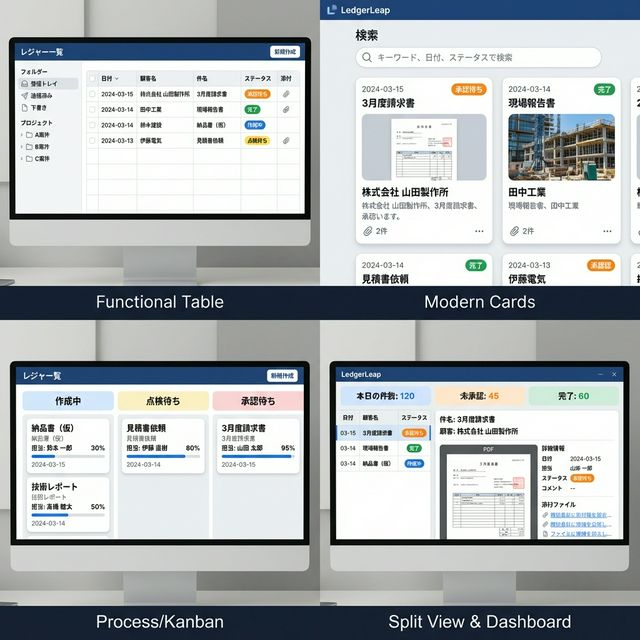
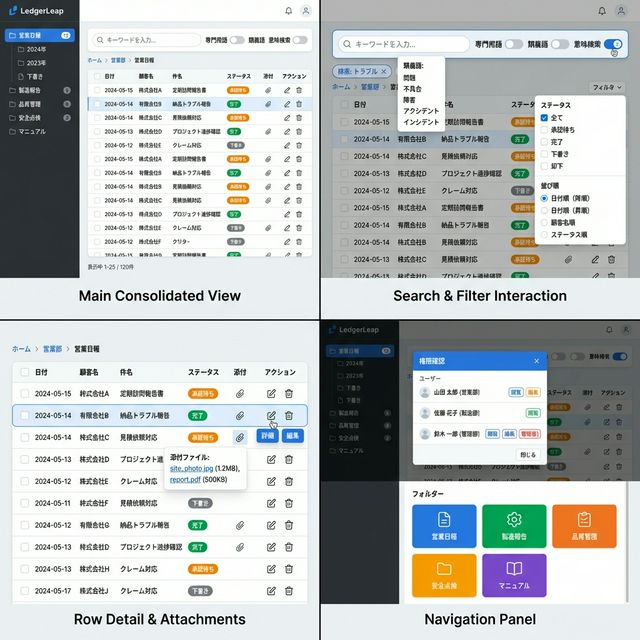

# 台帳リスト画面 UIリニューアル計画 (2026-02-11)

本ドキュメントは、台帳リスト画面のUIリニューアルに関する検討プロセス、デザイン案、および採用されたデザイン詳細をまとめたものです。

## 1. 背景と目的

*   **背景**: 現在のUIは機能要件を満たしているものの、日本の製造業の現場従事者にとって「直感的」「使いやすい」と感じさせるためのさらなる改善の余地がある。
*   **目的**: ペルソナ（実務担当者、管理者など）のニーズに基づき、操作性と視認性を向上させた新しいUIデザインを策定する。

## 2. デザインコンセプトの検討 (Phase 1)

4つの異なる方向性でUIデザイン案を作成し、最適なアプローチを検討しました。

| デザイン案 | 特徴 | ターゲット | メリット |
| :--- | :--- | :--- | :--- |
| **Functional Table** | Excelライクな高密度グリッド | 実務担当者、管理者 | 一覧性が高く、既存業務からの移行負荷が低い。 |
| **Modern Cards** | 視覚的・タッチ操作重視 | 現場リーダー | 直感的で、添付ファイルの確認が容易。 |
| **Process/Kanban** | ワークフロー可視化 | マネージャー | 業務の停滞を防ぎ、進捗状況が一目瞭然。 |
| **Split View/Dashboard** | 全体と詳細の並行操作 | パワーユーザー | 画面遷移なしで高速に詳細確認・処理が可能。 |

**採用案**: **Functional Table**
*   **理由**: 既存の業務フローとの親和性が最も高く、大量のデータを扱う現場のニーズに即しているため。また、他の案（ダッシュボードやカンバン）の要素も、将来的にタブ切り替えなどで導入する基盤として適している。

## 3. 詳細デザイン仕様 (Phase 2)

採用された「Functional Table」コンセプトに基づき、既存の全機能（検索、フィルタ、権限管理など）を組み込んだ詳細デザインです。

### 3.1. 画面構成 (Main Consolidated View)

*   **Header Area**:
    *   **検索バー**: 画面中央に大きく配置し、アクセス性を向上。
    *   **検索オプション**: 「専門用語」「類義語」「意味検索」のトグルを検索バーの近くに配置し、モード切替を容易に。
    *   **ブレッドクラム**: 現在位置（フォルダ階層）を明確に表示。
*   **Sidebar Navigation**:
    *   **フォルダツリー**: 階層構造を可視化。バッジで未処理件数を表示。
    *   **レスポンシブ**: モバイル時はドロワーとして格納。
*   **Data Grid**:
    *   **高密度表示**: 行の高さを抑制し、1画面の情報量を最大化。
    *   **明瞭な列定義**: 日付、顧客名、件名、ステータス、添付、アクションを固定幅などで整理。
    *   **Zebra Striping**: 行の視認性を高める縞模様。

### 3.2. インタラクション設計

*   **検索体験 (Search & Filter)**:
    *   **検索バッジ**: 入力したキーワードや適用されたフィルタをバッジとして表示し、「現在の検索条件」を可視化。
    *   **意味検索の強調**: セマンティック検索ON時は検索バーを発光させるなどのフィードバックを追加。
*   **詳細確認 (Row Detail)**:
    *   **ホバーエフェクト**: 行ホバーでのハイライト。
    *   **添付ファイルツールチップ**: クリップアイコンにマウスオーバーするだけでファイル名一覧を表示。
*   **コンテキスト操作 (Navigation & Modals)**:
    *   **権限確認モーダル**: ユーザーアイコンとバッジを用いて、誰がどのような権限を持っているかを直感的に表示。

## 4. 実装方針

本デザインを実現するために、以下のコンポーネント改修を行う予定です。

1.  **`IndexManager` (コンテナ)**:
    *   レイアウト構造の見直し（サイドバーとメインコンテンツの分割）。
    *   検索状態・フィルタ状態の管理強化。
2.  **`RecordsTable` (リスト表示)**:
    *   MaryUI / DaisyUI のテーブルコンポーネントをベースに、カスタムCSSで密度とスタイルを調整。
    *   行ごとのアクションボタン、添付ファイルツールチップの実装。
3.  **`Search` (検索バー)**:
    *   トグルスイッチのレイアウト変更。
    *   バッジ表示ロジックの統合。

## 5. 関連資料
*   `docs/features/PersonaUseCaseScenario.md`: ペルソナ定義
*   `app/Livewire/Ledger/IndexManager.php`: バックエンドロジック
