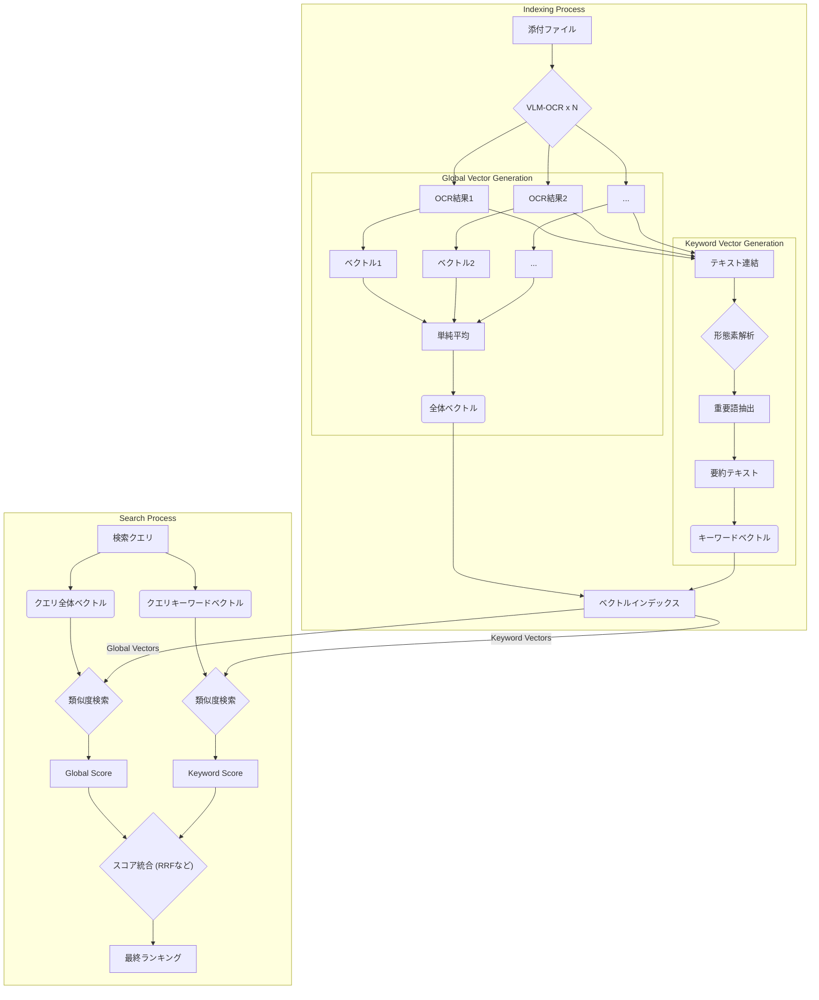

# 2025年 VLM-OCR技術とベクトルインデックス高度化戦略

**作成日:** 2025年11月15日
**ドキュメント種別:** 技術戦略・実装記録
**ステータス:** 基本機能実装完了。高度化戦略は今後の課題。

> **📖 関連ドキュメント:**
> - [RAG機能導入に関する技術検討](../rag-implementation/2025-10-16-rag-implementation-study.md) - RAG導入の全体戦略
> - [AIアシスタントと検索の哲学](../../ai-and-search-guide.md) - LedgerLeapの検索思想
> - [添付ファイル機能](../../function/Attachment.md) - 既存のOCR/Tikaアーキテクチャ

---

## 1. はじめに

### 1.1. 本ドキュメントの目的

本ドキュメントは、2025年11月時点のVLM技術動向調査に基づき、LedgerLeapに導入されたVLM-OCR機能とベクトル検索機能のアーキテクチャを記録し、現状の実装を評価すると共に、将来の高度化に向けた戦略を定義する。

当初は構想段階のドキュメントであったが、基本機能の実装完了に伴い、現状のアーキテクチャを反映した**確定版の技術戦略ドキュメント**として更新する。

### 1.2. 背景：現状の課題と機会

LedgerLeapは、OcrMyPDF（Tesseractベース）によるキーワード検索に加え、VLM技術を活用したセマンティック検索機能を導入した。これにより、単なる「画像からの文字起こし」に留まらない、新たな検索体験が実現可能となった。

| 項目 | 従来のOCR (OcrMyPDF) | VLM-OCRによる強化 |
| :--- | :--- | :--- |
| **抽出内容** | プレーンテキストのみ | **構造化データ (JSON)**, **Markdown** |
| **精度** | 複雑なレイアウトに弱い | レイアウトを理解し、高精度な読取りが可能 |
| **検索** | キーワード検索のみ | キーワード検索に加え、**セマンティック検索**が可能に |
| **CPU推論** | 実用的 | **量子化・最適化技術**により、CPUでの実行を実現 |

本稿では、実装済みのアーキテクチャを整理しつつ、検索精度をさらに向上させるための「ベクトルインデックス高度化戦略」を具体的に定義する。

---

## 2. オンプレミスCPU実行可能な日本語帳票対応VLM・OCRツール調査結果

オンプレミス環境でCPU実行可能、日本語ビジネス文書（帳票）に強く、マークダウンや構造化データを出力できるOSSモデル・ツールを調査・評価した。

| 優先順位 | モデル/ツール | 理由 |
|:---:|:---|:---|
| **1位** | **PaddleOCR-VL-0.9B** | CPU実行最適化、日本語対応109言語、表・数式抽出可能、SOTA性能 |
| **2位** | **MinerU** | PDF→Markdown特化、日本語84言語対応、CPU対応、構造保持に優秀 |
| **3位** | **Qwen2-VL-7B（量子化）** | 日本語OCR実績豊富、量子化でCPU実行可能、高性能VLM |
| **4位** | **Heron BLIP / Swallow-VLM** | 日本語特化VLM、CPU実行可能、国内開発で実績あり |
| **5位** | **DeepSeek-OCR** | 軽量3B、文書解析特化、Markdown出力対応、CPU実行可能 |

**結論:** `PaddleOCR-VL` または `MinerU` が、LedgerLeapの要件（オンプレミス、CPU実行、構造化出力）に最も合致する。複数のツールを併用し、結果を統合するアプローチも視野に入れる。

---

## 3. LedgerLeapにおけるインデックス強化構想

### 3.1. 基本構想：VLMによる「リッチメタデータ」の自動生成

VLM-OCRで処理し、以下のような多層的な「リッチメタデータ」を生成する。

-   **プレーンテキスト / Markdown (現状維持＋強化):** 全文検索の基本データ。レイアウトを維持したMarkdown形式を目指す。
-   **構造化データ (JSON):** 請求書や点検表から抽出した項目と値。
-   **画像キャプション:** 画像の内容を説明する自然言語の文章。

### 3.2. ハイブリッド検索インデックス戦略

キーワード検索の速度・網羅性と、セマンティック検索の精度・柔軟性を両立させるため、以下の2つのインデックスを併用する。

1.  **キーワード検索用インデックス (Mroonga):**
    *   **対象:** `ledgers.content_attached`
    *   **内容:** VLM、OCR、Tikaなど複数のソースから最も品質の高いテキストを選択（最終化処理）し、格納する。これにより、既存のMroonga全文検索の品質が向上する。
    *   **役割:** 高速なキーワード検索、網羅的な情報取得。

2.  **セマンティック検索用インデックス (RAG):**
    *   **対象:** `ledger_chunks`
    *   **内容:** VLMが生成した**構造化Markdown**をチャンク化し、ベクトル化して格納する。
    *   **役割:** 文脈を理解した高精度な意味検索、類似文書の発見。

---

## 4. ベクトルインデックスの高度化戦略（今後の課題）

現状の実装は、単一のベクトル（全体ベクトル）によるセマンティック検索だが、さらなる精度向上のため、複数のベクトル表現を組み合わせる以下の戦略を今後の課題として定義する。

### 4.1. 課題：複数OCR結果の最適な統合

`PaddleOCR-VL`や`MinerU`など、特性の異なる複数のツールを併用した場合、それぞれのOCR結果をいかにして統合し、最も質の高い単一のベクトル表現を得るかが課題となる。

### 4.2. アプローチ1：複数OCR結果のベクトル統合手法

#### 4.2.1. 単純平均法 (ベースライン)
- **手法:** 各OCR/VLMツールから得られたテキストをそれぞれベクトル化し、それらのベクトルを単純に平均する。
- **利点:** 実装が極めて容易であり、計算コストも低い。
- **欠点:** 特定のツールのノイズに全体の品質が引きずられる可能性がある。

#### 42.2. 連結法
- **手法:** 全てのOCR結果テキストを一つに連結し、巨大な単一ドキュメントとしてベクトル化する。
- **利点:** 全ての情報を損失なくベクトルに含めることができる。
- **欠点:** 文脈が不自然になる可能性、計算コストとメモリ消費の増加。

#### 4.2.3. 重み付き平均法
- **手法:** 各OCR/VLMツールの信頼度や特性に応じて、生成されたベクトルに重みを付けて平均化する。
- **利点:** 信頼性の高いツールの結果を重視でき、ノイズの影響を低減できる。
- **欠点:** 最適な重みを決定するための評価ロジックが必要。

### 4.3. アプローチ2：形態素解析による意味の先鋭化

#### 4.3.1. キーワード・重要句ベクトルの生成
- **手法:**
    1. 形態素解析エンジン（`logue/igo-php`等）を使い、OCRテキストから名詞、動詞、形容詞、固有表現等の「重要語」を抽出。
    2. 抽出した重要語を連結した「要約テキスト」を生成し、ベクトル化。「キーワードベクトル」として利用する。
- **利点:** OCRの誤認識ノイズを除去し、文書の核心的な意味に絞ったベクトルを生成できる。
- **欠点:** 元の文章の細かな文脈やニュアンスが失われる可能性がある。

### 4.4. 推奨戦略：ハイブリッド・ベクトルインデックス

上記のアプローチを組み合わせ、**1つのドキュメントに対して複数のベクトル表現を持たせる「ハイブリッド・ベクトルインデックス」戦略**を最終目標とする。

- **全体ベクトル (Global Vector):**
    - **生成方法:** アプローチ1（単純平均法など）で生成。ドキュメント全体の文脈を捉える。
- **キーワードベクトル (Keyword Vector):**
    - **生成方法:** アプローチ2で生成。文書の核心的なキーワード群を捉える。

---

## 5. 実装ステータスと今後の課題

### Phase 1: VLM-OCR基盤の導入 (完了済み)
-   **実装済み:**
    1.  VLMサービス (`vlm`) をDocker Compose環境に統合。
    2.  `attached_files`テーブルにVLM結果を保存するカラムを追加。
    3.  VLM抽出を実行する `ProcessVlmExtraction` ジョブを実装。
    4.  VLM/OCR/Tikaの結果を統合する「最終化」アーキテクチャ (`ledger:finalize-processing` コマンド) の基盤を構築。

### Phase 2: セマンティック検索の導入 (部分的に完了)
-   **実装済み:**
    1.  `ProcessLedgerForRagJob`にて、`vlm_markdown` の内容をRAGパイプラインのソースとして利用する処理。
    2.  単一のベクトル（全体ベクトルに相当）を生成し、`ledger_chunks`テーブルに保存する処理。
    3.  既存台帳を再処理するための `rag:chunk-existing-ledgers` Artisanコマンド。
-   **今後の課題 (未実装):**
    1.  **キーワードベクトルの生成:** 形態素解析を活用し、「キーワードベクトル」を生成して`ledger_chunks`テーブルに別途保存する機能。
    2.  **2種類のベクトルの保持:** `ledger_chunks`テーブルに`embedding_keyword`のようなカラムを追加し、全体ベクトルとキーワードベクトルの両方を保持する改修。

### Phase 3: ハイブリッド検索の実装 (部分的に完了)
-   **実装済み:**
    1.  UI（`RecordsTable`）上で、キーワード検索とセマンティック検索を**切り替える**機能。
    2.  `SearchLedgersTool`にて、`order_by=semantic_score`によるセマンティック検索を実行するバックエンド機能。
-   **今後の課題 (未実装):**
    1.  **真のハイブリッド検索:** キーワード検索と、2種類のベクトル検索（全体・キーワード）の結果をRRF等のアルゴリズムで**統合（フュージョン）**し、より精度の高いランキングを生成する機能。
    2.  **UI/UXの改善:** 検索モードの「切り替え」ではなく、単一の検索ボックスでハイブリッド検索が実行され、ユーザーがその内訳を意識しないシームレスな体験の提供。

---

## 6. UI/UXへの影響

-   **添付ファイル表示エリア:**
    -   VLM処理のステータス（処理中、完了、失敗）を表示する。
    -   抽出されたMarkdownや構造化JSONをプレビューまたはダウンロードできる機能を追加する。
-   **検索結果画面:**
    -   検索結果がどのインデックス（キーワード/セマンティック）でヒットしたかを示すインジケーターを表示する。
    -   セマンティック検索の類似度スコアを可視化する。

---

## 7. 結論と推奨事項

VLM-OCRとセマンティック検索の基本機能導入は完了した。これにより、従来不可能だった「意味」による検索が可能となり、検索機能は大きく前進した。

**次のステップとして、Phase 2, 3の「今後の課題」に着手し、特に「キーワードベクトルの生成」と「検索結果の統合（ハイブリッド検索）」を実装することで、検索精度とユーザー体験をさらなる高みへと引き上げることを推奨する。**
