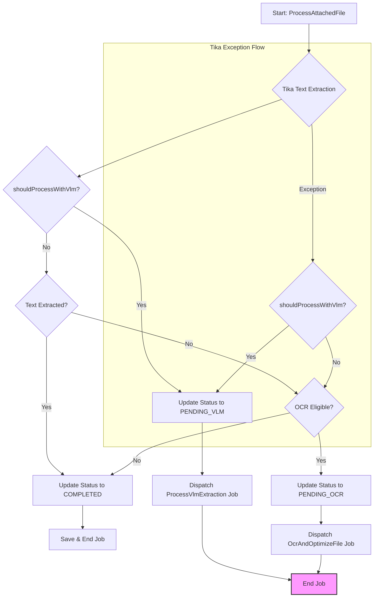

# `ProcessAttachedFile` ジョブ改修 詳細計画書

**ドキュメントバージョン:** 1.0
**作成日:** 2025年11月4日
**作成者:** Gemini

---

## 1. 概要

### 1.1. 目的
本ドキュメントは、WBS「VLM/RAG統合 - Phase2」のタスクID 3.1「`ProcessAttachedFile` ジョブ改修」に関する詳細な実装計画を定義するものです。

この改修の目的は、既存のファイル処理ジョブ `ProcessAttachedFile` にVLM（Vision Language Model）処理を統合し、Tikaによるテキスト抽出後に、画像やPDFなどの特定ファイルを対象として `ProcessVlmExtraction` ジョブをディスパッチするロジックを組み込むことです。

### 1.2. 関連ドキュメント
- [VLM/RAG統合 - Phase2 VLM処理実装 WBS](./2025-11-03_phase2-wbs.md)
- [VLM/RAG統合実装計画書（最終版）](../../architecture/vlm-rag-integration.md)

---

## 2. 予備調査と懸念事項の明確化

計画策定に先立ち、以下の懸念事項について調査を実施し、その結果を計画に反映しました。

### 2.1. `env()` ヘルパーのBoolean型評価
- **懸念:** `config/vlm.php` 内の `env('VLM_ENABLED', false)` が、`.env` ファイル内の `'false'` という文字列によって `true` と評価されるリスク。
- **調査結果:** Laravelの `env()` ヘルパーは `'true'`, `'false'`, `'null'`, `'empty'` といった文字列を自動的に対応するPHPの型に変換します。しかし、コードの堅牢性と可読性を高めるため、`config` ファイル内では `(bool) env(...)` のように明示的に型キャストすることがベストプラクティスとされています。
- **対応:** 本計画では、`config/vlm.php` を修正し、明示的なキャストを行うステップを設けます。

### 2.2. `AttachedFile` のステータス競合
- **懸念:** `ProcessAttachedFile` ジョブと `ProcessVlmExtraction` ジョブが、それぞれ `AttachedFile` の `status` を更新するため、競合や意図しない上書きが発生するリスク。
- **調査結果:** これはロジック設計で回避可能です。`ProcessAttachedFile` ジョブが `ProcessVlmExtraction` ジョブをディスパッチした後は、自身の処理を即座に終了し、後続のステータス更新（例: `COMPLETED` への変更）や `save()` 処理を行わないように制御します。
- **対応:** 処理フローにおいて、VLMジョブをディスパッチした場合は `return;` で即座に処理を抜けることを徹底するよう計画に明記します。

### 2.3. Tikaエラー時の処理フロー
- **懸念:** Tikaでのテキスト抽出が失敗した場合のVLM連携が考慮されていない。
- **調査結果:** `ProcessAttachedFile` の既存の `catch` ブロックでは、Tikaエラー時でも対象ファイル（PDF/画像）であれば `OcrAndOptimizeFile` ジョブをディスパッチしています。このフォールバックの思想を踏襲し、VLMが有効な場合は `OcrAndOptimizeFile` の代わりに `ProcessVlmExtraction` をディスパッチするべきです。
- **対応:** `try` ブロック内だけでなく、`catch` ブロック内にもVLM処理の要否判定とディスパッチのロジックを追加するステップを計画に含めます。

---

## 3. 詳細改修計画

### ステップ1: `config/vlm.php` の堅牢化
`env` 変数の評価をより厳密にするため、`config/vlm.php` を以下のように修正します。

- **ファイル:** `config/vlm.php`
- **変更内容:** `env('VLM_ENABLED', false)` を `(bool) env('VLM_ENABLED', false)` にキャストし、意図しない文字列が `true` と評価されることを防ぎます。

### ステップ2: `AttachedFileStatus` Enumの拡張
VLM処理待ちの状態を明確に管理するため、Enumに新しいステータスを追加します。

- **ファイル:** `app/Enums/AttachedFileStatus.php`
- **追加する値:** `PENDING_VLM = 'pending_vlm';`
- **対応:** `icon()`, `colorClass()`, `tooltip()` の各メソッドにも、`PENDING_VLM` に対応する定義（例: `PENDING_OCR` と同様の表示）を追加します。

### ステップ3: `shouldProcessWithVlm` ヘルパーメソッドの導入
VLM処理の要否を判定する責務を単一のメソッドに集約します。

- **ファイル:** `app/Jobs/Ledger/ProcessAttachedFile.php`
- **追加するメソッド:** `private function shouldProcessWithVlm(AttachedFile $file): bool`
- **判定ロジック:**
    1. `config('vlm.enabled')` が `false` なら `false` を返す。
    2. ファイルのMIMEタイプが `image/*` または `application/pdf` でなければ `false` を返す。
    3. `vlm_processed_at` カラムが `null` でなければ（処理済みであれば） `false` を返す。
    4. 上記の条件をすべてクリアした場合に `true` を返す。

### ステップ4: `handle` メソッドの改修 (`try` ブロック)
Tikaによるテキスト抽出処理の後に、VLMへの連携ロジックを実装します。

- **ファイル:** `app/Jobs/Ledger/ProcessAttachedFile.php`
- **改修箇所:** `handle()` メソッド内の `try` ブロック、Tikaの処理 (`$extractedText = ...`) の直後。
- **実装内容:**
    1. Tikaでのテキスト抽出が完了した後、`$this->shouldProcessWithVlm($this->attachedFile)` を呼び出してVLM処理の要否を判定します。
    2. **判定が `true` の場合:**
        - `Log::info()` でVLM処理へ移行することを記録します。
        - `$this->attachedFile->update(['status' => AttachedFileStatus::PENDING_VLM]);` を実行します。
        - `ProcessVlmExtraction::dispatch($this->attachedFile);` を実行します。
        - **`return;`** を実行し、後続の処理（`ledger->save()` や `attachedFile->save()` など）をスキップしてジョブを正常に終了します。
    3. **判定が `false` の場合:**
        - 既存のロジック（テキスト抽出成功/失敗に応じた `COMPLETED` への更新、または `OcrAndOptimizeFile` のディスパッチ）をそのまま実行します。

### ステップ5: `handle` メソッドの改修 (`catch` ブロック)
Tikaが例外を発生させた場合にも、VLM処理へのフォールバックを可能にします。

- **ファイル:** `app/Jobs/Ledger/ProcessAttachedFile.php`
- **改修箇所:** `handle()` メソッド内の `catch (Exception $e)` ブロック。
- **実装内容:**
    1. `catch` ブロックの先頭で `$this->shouldProcessWithVlm($this->attachedFile)` を呼び出してVLM処理の要否を判定します。
    2. **判定が `true` の場合:**
        - `Log::info()` でTikaエラー後、VLM処理へフォールバックすることを記録します。
        - `$this->attachedFile->update(['status' => AttachedFileStatus::PENDING_VLM]);` を実行します。
        - `ProcessVlmExtraction::dispatch($this->attachedFile);` を実行します。
        - **`return;`** を実行し、後続の `catch` ブロック内の処理をスキップします。
    3. **判定が `false` の場合:**
        - 既存の `catch` ブロック内のロジック（`OcrAndOptimizeFile` のディスパッチなど）をそのまま実行します。

---

## 4. 実装後の処理フロー

---

## 5. まとめ

本計画に基づき `ProcessAttachedFile` ジョブを改修することで、既存のファイル処理体系を維持しつつ、VLMによる高度なドキュメント解析機能を柔軟に統合することが可能となります。特に、設定による機能のON/OFF、明確なステータス管理、エラー発生時のフォールバックを考慮することで、堅牢で保守性の高い実装を目指します。
