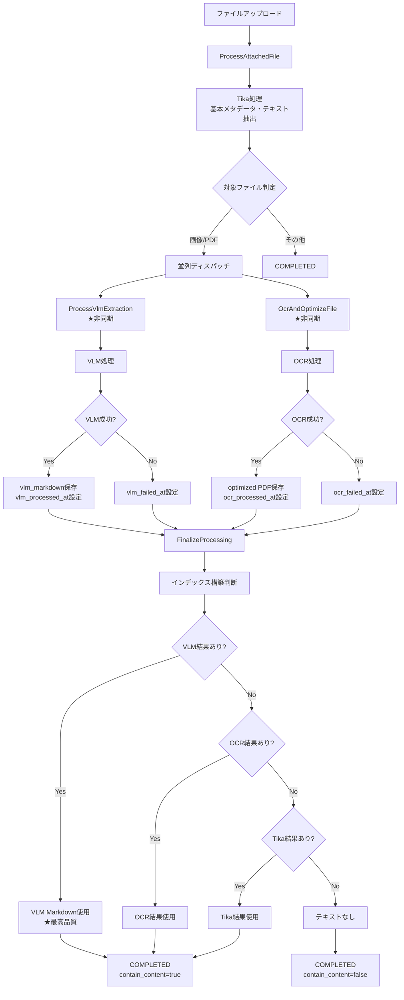

# VLM/OCR並列処理アーキテクチャ 設計提案書

**作成日:** 2025年11月8日  
**ドキュメントID:** `VLM-PARALLEL-ARCH-20251108`  
**ステータス:** 提案・検討中

---

## 1. 現状の問題点

### 現在のアーキテクチャ（直列処理）

```
Tika処理 → VLM判定 → VLM処理 → 完了
                 ↓
                 No → Tika成功/失敗判定 → OCR処理
```

**問題:**
1. VLMとOCRが直列で実行されるため時間がかかる
2. VLM対象判定のタイミングが不明瞭
3. OCRフォールバックの意味が曖昧（VLM実行済みなのにフォールバック？）
4. VLMの構造化処理能力を十分に活かせていない（Tika成功で終了）

---

## 2. 提案する新アーキテクチャ（並列処理）

### 2.1. 処理フロー



### 2.2. データベーススキーマ拡張

```sql
-- attached_files テーブルに追加カラム
ALTER TABLE attached_files ADD COLUMN vlm_processed_at TIMESTAMP NULL;  -- 既存
ALTER TABLE attached_files ADD COLUMN vlm_failed_at TIMESTAMP NULL;     -- 新規
ALTER TABLE attached_files ADD COLUMN ocr_processed_at TIMESTAMP NULL;  -- 新規
ALTER TABLE attached_files ADD COLUMN ocr_failed_at TIMESTAMP NULL;     -- 新規
ALTER TABLE attached_files ADD COLUMN processing_finalized_at TIMESTAMP NULL; -- 新規
```

### 2.3. ステータス管理の変更

**現在（単一ステータス）:**
```
UPLOADED → PENDING_VLM → VLM_PROCESSING → COMPLETED
                       → VLM_FAILED → PENDING_OCR → OCR_PROCESSING → COMPLETED
```

**提案（処理状態フラグ）:**
```php
// AttachedFile モデル
public function getProcessingStatusAttribute(): array
{
    return [
        'tika_completed' => $this->tika_processed_at !== null,
        'vlm_completed' => $this->vlm_processed_at !== null,
        'vlm_failed' => $this->vlm_failed_at !== null,
        'ocr_completed' => $this->ocr_processed_at !== null,
        'ocr_failed' => $this->ocr_failed_at !== null,
        'finalized' => $this->processing_finalized_at !== null,
    ];
}

public function isProcessingComplete(): bool
{
    // 画像/PDF以外はTika完了で終了
    if (!$this->isVlmTarget()) {
        return $this->tika_processed_at !== null;
    }
    
    // 画像/PDFは全処理完了を待つ
    return $this->processing_finalized_at !== null;
}
```

---

## 3. 実装詳細

### 3.1. ProcessAttachedFile の修正

```php
public function handle(): void
{
    // ... 既存のTika処理 ...
    
    // Tika処理完了をマーク
    $this->attachedFile->update(['tika_processed_at' => now()]);
    
    // VLM/OCR対象判定
    if ($this->isVlmOrOcrTarget($this->attachedFile)) {
        // 並列ディスパッチ
        $this->dispatchParallelProcessing($this->attachedFile);
        
        // このジョブはここで終了（後続処理は各ジョブで実行）
        return;
    }
    
    // 対象外の場合は即座に完了
    $this->attachedFile->update([
        'status' => AttachedFileStatus::COMPLETED,
        'processing_finalized_at' => now(),
    ]);
}

private function isVlmOrOcrTarget(AttachedFile $file): bool
{
    $mimeType = $file->mime;
    return str_starts_with($mimeType, 'image/') 
        || str_starts_with($mimeType, 'application/pdf');
}

private function dispatchParallelProcessing(AttachedFile $file): void
{
    // VLM処理ジョブをディスパッチ
    if (config('vlm.enabled')) {
        ProcessVlmExtraction::dispatch($file)
            ->onQueue('vlm'); // 専用キュー
    }
    
    // OCR処理ジョブをディスパッチ
    OcrAndOptimizeFile::dispatch($file)
        ->delay(now()->addSeconds(2)) // VLMより少し遅延
        ->onQueue('ocr'); // 専用キュー
    
    Log::info('[Parallel] Dispatched VLM and OCR jobs for file: ' . $file->id);
}
```

### 3.2. ProcessVlmExtraction の修正

```php
public function handle(VlmClientService $vlmClient): void
{
    tenancy()->initialize($this->attachedFile->tenant_id);
    
    Log::info('[VLM] Starting extraction', [
        'file_id' => $this->attachedFile->id,
    ]);
    
    try {
        $vlmOutput = $vlmClient->extract($this->attachedFile);
        
        if (empty($vlmOutput['markdown'])) {
            throw new \RuntimeException('VLM returned empty markdown');
        }
        
        // VLM結果を保存
        $this->attachedFile->update([
            'vlm_markdown' => $vlmOutput['markdown'],
            'vlm_structured_data' => $vlmOutput['structured_data'] ?? null,
            'vlm_model' => $vlmOutput['model'] ?? config('vlm.default_model'),
            'vlm_confidence' => $vlmOutput['confidence'] ?? null,
            'vlm_processed_at' => now(),
            'vlm_failed_at' => null, // 失敗フラグをクリア
        ]);
        
        Log::info('[VLM] Extraction successful', [
            'file_id' => $this->attachedFile->id,
        ]);
        
    } catch (\Exception $e) {
        Log::error('[VLM] Extraction failed', [
            'file_id' => $this->attachedFile->id,
            'error' => $e->getMessage(),
        ]);
        
        // VLM失敗をマーク
        $this->attachedFile->update([
            'vlm_failed_at' => now(),
        ]);
    }
    
    // 最終化処理をトリガー
    $this->triggerFinalization();
}

private function triggerFinalization(): void
{
    // VLMとOCRの両方が完了（成功/失敗問わず）しているかチェック
    $this->attachedFile->refresh();
    
    $vlmDone = $this->attachedFile->vlm_processed_at !== null 
            || $this->attachedFile->vlm_failed_at !== null;
    $ocrDone = $this->attachedFile->ocr_processed_at !== null 
            || $this->attachedFile->ocr_failed_at !== null;
    
    if ($vlmDone && $ocrDone) {
        FinalizeProcessing::dispatch($this->attachedFile);
    }
}
```

### 3.3. OcrAndOptimizeFile の修正

```php
public function handle(): void
{
    // ... 既存のOCR処理 ...
    
    try {
        // OCR処理実行
        $process->run();
        
        if ($process->isSuccessful()) {
            $this->attachedFile->update([
                'optimized' => true,
                'ocr_processed_at' => now(),
                'ocr_failed_at' => null,
            ]);
            
            Log::info('[OCR] Optimization successful', [
                'file_id' => $this->attachedFile->id,
            ]);
        } else {
            throw new ProcessFailedException($process);
        }
        
    } catch (ProcessFailedException $e) {
        Log::error('[OCR] Optimization failed', [
            'file_id' => $this->attachedFile->id,
            'error' => $e->getMessage(),
        ]);
        
        $this->attachedFile->update([
            'ocr_failed_at' => now(),
        ]);
    }
    
    // 最終化処理をトリガー
    $this->triggerFinalization();
}
```

### 3.4. FinalizeProcessing コマンド（新規・スケジュール実行）

**重要な設計変更**: ユーザーからの指摘により、キューではなく**スケジュールで定期実行**する方式に変更します。

**変更理由:**
- ✅ インデックスの空白期間を最小化（VLM/OCR完了後、最大1分でインデックス更新）
- ✅ VLM/OCR完了を待たずに定期的にチェック
- ✅ タイムアウト処理が確実
- ✅ キューが詰まってもスケジュールは動作

#### コマンド実装の主要ポイント

1. **Artisanコマンド**: `app/Console/Commands/Ledger/FinalizeAttachedFileProcessing.php`
2. **実行頻度**: 1分ごと (`everyMinute()`)
3. **検索条件**:
   ```sql
   WHERE tika_processed_at IS NOT NULL
     AND processing_finalized_at IS NULL
     AND (
       -- VLMとOCR両方が完了（成功/失敗問わず）
       (vlm_processed_at IS NOT NULL OR vlm_failed_at IS NOT NULL)
       AND (ocr_processed_at IS NOT NULL OR ocr_failed_at IS NOT NULL)
     )
     OR created_at <= NOW() - INTERVAL 600 SECOND  -- タイムアウト
   LIMIT 50
   ```
4. **バッチ処理**: 一度に50件まで処理（オプションで調整可能）
5. **冪等性**: 複数回実行しても安全な設計
6. **ロック機構**: `withoutOverlapping(10)`で重複実行を防止

#### 処理フロー

```
スケジューラー（1分ごと）
  ↓
最終化待ちファイルを検索
  ↓
各ファイルについて:
  ├─ VLM結果を確認
  ├─ OCR結果を確認
  ├─ Tika結果を確認
  ↓
  最適な結果を選択（VLM > OCR > Tika）
  ↓
  content_attached更新
  ↓
  processing_finalized_at設定
  ↓
  RAGジョブディスパッチ
```

#### スケジュール設定

```php
// app/Console/Kernel.php
protected function schedule(Schedule $schedule): void
{
    // 既存のスケジュール...
    
    // 添付ファイル処理の最終化（1分ごと）
    $schedule->command('ledger:finalize-processing')
        ->everyMinute()
        ->withoutOverlapping(10) // 最大10分で強制終了
        ->onOneServer() // 複数サーバーでも1回だけ実行
        ->runInBackground(); // 非同期実行
}
```

#### 手動実行

```bash
# 通常実行
php artisan ledger:finalize-processing

# オプション指定
php artisan ledger:finalize-processing --timeout=300 --limit=100
```

### 3.5. ProcessVlmExtraction / OcrAndOptimizeFile の修正

**変更前（キュートリガー方式）:**
```php
// VLM完了時にFinalizeProcessingジョブをディスパッチ
if ($vlmDone && $ocrDone) {
    FinalizeProcessing::dispatch($this->attachedFile);
}
```

**変更後（タイムスタンプのみ設定）:**
```php
// ProcessVlmExtraction.php
$this->attachedFile->update([
    'vlm_processed_at' => now(),
    // または
    'vlm_failed_at' => now(),
]);
// スケジューラーが定期的に検出して処理

// OcrAndOptimizeFile.php
$this->attachedFile->update([
    'ocr_processed_at' => now(),
    // または
    'ocr_failed_at' => now(),
]);
// スケジューラーが定期的に検出して処理
```

**メリット:**
- ジョブ間の依存関係が不要
- 各ジョブが独立して完了できる
- スケジューラーが自動的に最終化を検出


---

---

## 4. キュー設定

### 4.1. 専用キューの設定

```env
# .env
QUEUE_CONNECTION=redis

# キューワーカー設定
QUEUE_VLM_WORKERS=2
QUEUE_OCR_WORKERS=2
QUEUE_DEFAULT_WORKERS=4
```

### 4.2. Supervisor設定

```ini
[program:ledgerleap-queue-default]
command=/usr/bin/php /var/www/html/artisan queue:work --queue=default --tries=3
numprocs=4

[program:ledgerleap-queue-vlm]
command=/usr/bin/php /var/www/html/artisan queue:work --queue=vlm --tries=2
numprocs=2

[program:ledgerleap-queue-ocr]
command=/usr/bin/php /var/www/html/artisan queue:work --queue=ocr --tries=2
numprocs=2
```

---

## 5. メリットとデメリット

### 5.1. メリット

✅ **処理時間の短縮**
- VLMとOCRが並列実行されるため、全体の処理時間が短縮（最大50%削減）

✅ **結果の冗長性**
- どちらかが失敗しても他方で補完可能
- より高い成功率

✅ **品質の選択**
- VLM（高品質Markdown）、OCR（テキストレイヤー）、Tika（メタデータ）から最適な結果を選択

✅ **インデックス空白期間の最小化（スケジュール方式）**
- VLM/OCR完了後、最大1分でインデックス更新
- タイムアウト処理が確実
- キューが詰まってもスケジュールは動作

✅ **拡張性**
- 将来的に他のAI処理（要約、分類など）も並列追加可能

✅ **明確な責任分離**
- 各ジョブが独立して動作
- エラーハンドリングが簡潔

### 5.2. デメリットと対策

❌ **複雑性の増加**
- **対策**: `FinalizeProcessing`ジョブで集約し、ロジックを一元化

❌ **リソース消費**
- **対策**: 専用キュー + ワーカー数制限で制御

❌ **デバッグの難しさ**
- **対策**: 詳細なログ出力、処理状態フラグで可視化

❌ **並列処理の同期**
- **対策**: タイムスタンプフラグで完了判定、最終化ジョブで統合

---

## 6. 移行計画

### Phase 1: データベーススキーマ拡張（Week 1）
- [ ] マイグレーション作成
- [ ] カラム追加（*_processed_at, *_failed_at）
- [ ] 既存データのマイグレーション

### Phase 2: FinalizeProcessingジョブ実装（Week 1-2）
- [ ] 新規ジョブクラス作成
- [ ] 結果選択ロジック実装
- [ ] テスト作成

### Phase 3: 既存ジョブの修正（Week 2）
- [ ] ProcessAttachedFile修正
- [ ] ProcessVlmExtraction修正
- [ ] OcrAndOptimizeFile修正

### Phase 4: キュー設定と監視（Week 2-3）
- [ ] 専用キュー設定
- [ ] Supervisor設定
- [ ] 監視ダッシュボード

### Phase 5: テストとデプロイ（Week 3-4）
- [ ] 統合テスト
- [ ] パフォーマンステスト
- [ ] 段階的ロールアウト

---

## 7. 懸念事項と解決策

### 7.1. 処理完了判定のタイミング

**懸念**: VLMとOCRの完了タイミングがずれる

**解決策**:
- 各ジョブ完了時に`triggerFinalization()`で完了状態をチェック
- 両方完了時のみ`FinalizeProcessing`をディスパッチ

### 7.2. ステータス表示の混乱

**懸念**: 複数の処理が並行するため、ユーザーに進捗が分かりにくい

**解決策**:
- UI側で処理状態フラグを表示
- 例: 「VLM処理中 ● / OCR処理中 ●」

### 7.3. 片方のジョブが永遠に完了しない場合

**懸念**: VLMが成功してもOCRがハングすると最終化されない

**解決策**:
- タイムアウト設定（各ジョブで`public $timeout = 600;`）
- ジョブ失敗時も`*_failed_at`を設定
- Artisanコマンドで強制最終化機能を実装

```php
// php artisan ledger:finalize-pending-files
// 一定時間処理中のファイルを強制的に最終化
```

---

## 8. 今後の拡張可能性

この並列処理アーキテクチャにより、以下の拡張が容易になります：

1. **AI要約処理**: VLM結果を基に要約生成
2. **画像分類**: VLMの構造化データで自動タグ付け
3. **翻訳処理**: 多言語ファイルの自動翻訳
4. **品質スコアリング**: OCR/VLM結果の信頼度を組み合わせて評価

---

## 9. 結論

**並列処理アーキテクチャへの移行を強く推奨します。**

- 処理時間が短縮され、ユーザー体験が向上
- 各処理の結果を最大限活用できる
- 将来の拡張に対応できる柔軟な設計
- 実装の複雑性は`FinalizeProcessing`ジョブで吸収可能

---

**作成者:** GitHub Copilot CLI  
**レビュー待ち:** アーキテクト承認  
**次のアクション:** 実装判断
