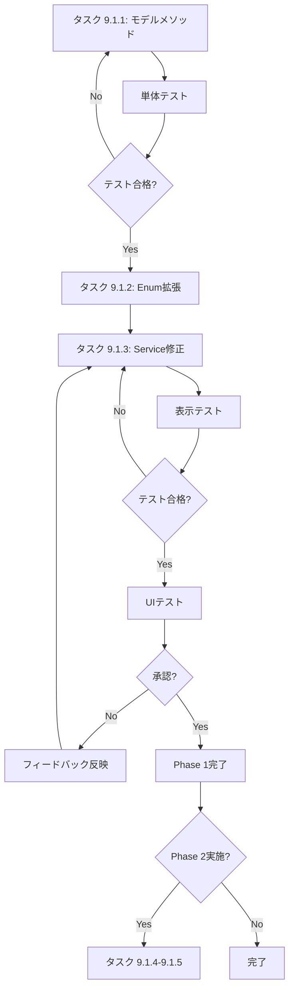

# Phase5: UI改善 詳細計画書

**作成日:** 2025年11月8日  
**対象:** WBS 9.1 UI/UX改善の慎重な実装  
**方針:** アイコン+ツールチップを基本とし、既存UIとの整合性を重視

**関連ドキュメント:**
- [Phase5 実装報告書](./2025-11-08_phase5-implementation-report.md)
- [Phase5 WBS](./2025-11-08_phase5-wbs.md)

---

## 📋 基本設計方針

### 1. UI表示の原則

1. **アイコンファースト**
   - ステータスは必ずアイコンで表示
   - ツールチップで詳細説明を提供
   - バッジは補助的に使用（必須ではない）

2. **技術用語の最小化**
   - 一般ユーザーに不要な技術詳細は隠蔽
   - エラーメッセージは分かりやすく
   - 専門用語は管理者向けツールチップに限定

3. **既存UIとの調和**
   - Phase4で実装済みの表示を尊重
   - VLMプレビューボタン等の既存機能を活用
   - 破壊的変更を避ける

4. **段階的実装**
   - まずモデルメソッドを実装
   - 次にツールチップ内容を改善
   - 最後に必要に応じてアイコンを追加

---

## 🔍 技術調査: 品質表示（信頼度）の実現可能性

### 調査日: 2025年11月8日 (2025年11月8日更新)

本調査では、LedgerLeapに実装されているテキスト抽出機能の品質（信頼度）をUIに表示する実現可能性について、現状のコードと関連技術のドキュメントに基づき詳細に分析します。

LedgerLeapのテキスト抽出アーキテクチャは、大きく分けて以下の2つの独立した系統が存在します。

1.  **VLM系API処理**: `vlm` Dockerサービスとして提供されるAPI。複数のモデルを切り替え可能。
2.  **従来型OCR処理**: `ocrmypdf` Dockerサービスを直接コマンドで実行する従来型のOCR。

これら2系統と、テキストレイヤー抽出を担う `Tika` について、それぞれ信頼度取得の可否を評価します。

---

### 第1部: VLM系API処理における信頼度

#### アーキテクチャ
VLM系のテキスト抽出は、`docker-compose.yml` で定義された `vlm` サービスによって提供されます。このサービスは `docker/paddle/unified_api.py` に実装されたFastAPIアプリケーションを実行しており、`http://localhost:8001` 等のポートでAPIを公開します。

`ProcessVlmExtraction` ジョブなどがこのAPIの `/extract/structured` エンドポイントを呼び出すことで、テキスト抽出が行われます。

#### 利用可能モデルと信頼度取得方法
`vlm-switch.sh` スクリプトおよび `unified_api.py` の実装から、`VLM_MODEL` 環境変数を変更することで、以下の4つのモデルを切り替えられることが判明しています。モデルごとに信頼度の扱いは大きく異なります。

---

##### **1. `paddleocr` モデル (PaddleOCR 2.7.3)**

-   **概要**: 安定版のOCRエンジン。
-   **API実装**: `unified_api.py` の `process_with_paddleocr` 関数で処理されます。この関数は内部で `paddleocr` ライブラリの `model_engine.ocr()` を呼び出します。
-   **信頼度取得**: `model_engine.ocr()` の戻り値は、検出されたテキスト行のリストです。各行は `[bounding_box, ('text', confidence)]` というタプル構造を持っており、`confidence` がその行の信頼度スコア（0.0〜1.0）です。
    ```python
    # unified_api.py より抜粋
    result = model_engine.ocr(img, cls=True)
    # ...
    if result and result[0]:
        for idx, line in enumerate(result[0]):
            if len(line) >= 2:
                # ...
                text_info = line[1]
                text = text_info[0]
                confidence = text_info[1] if len(text_info) > 1 else 1.0 # 信頼度を抽出
                
                text_blocks.append({
                    # ...
                    "confidence": float(confidence), # JSONレスポンスに含める
                })
    ```
-   **DB保存**: APIは抽出した各テキストブロックの信頼度をレスポンスに含めます。呼び出し元の `ProcessVlmExtraction` ジョブは、これらの信頼度の平均値を計算し、`attached_files.vlm_confidence` カラムに保存します。
-   **結論**: ✅ **信頼度取得可能。** 現在の実装で取得・保存されており、UI表示に利用できます。

---

##### **2. `paddleocr-vl` モデル (PaddleOCR-VL 0.9B)**

-   **概要**: 文書構造理解に特化した実験版モデル。
-   **API実装**: `unified_api.py` の `process_with_paddleocr_vl` 関数で処理されます。
-   **信頼度取得**: この関数は `model_engine.predict()` を呼び出しますが、返される結果にはレイアウト検出（例: `figure`, `table`）の信頼度は含まれるものの、**抽出されたテキストブロック自体の信頼度スコアは含まれていません。** APIの実装上、テキストの信頼度を抽出するロジックは存在しません。
-   **結論**: ⚠️ **テキスト内容の信頼度は取得できません。** レイアウト検出の信頼度は取得できますが、ユーザーが求める「OCR精度」とは異なります。

---

##### **3. `marker` モデル**

-   **概要**: PDFをMarkdownに高品質に変換するモデル。
-   **API実装**: `unified_api.py` の `process_with_marker` 関数内で、`marker_single` という外部コマンドを `subprocess` で実行します。
-   **信頼度・品質スコアの取得**:
    -   **単語信頼度**: `marker` の公式リポジトリを調査した結果、**OCR結果の単語ごとの信頼度スコアを取得・出力する機能は提供されていません。**
    -   **レイアウト品質スコア**: `marker` は、開発段階での性能評価のために `Heuristic Score` や `LLM Score` といったベンチマーク指標を使用します。これらは文書構造の再現度を評価するためのものですが、あくまで**モデル開発時の評価用データセットに対するスコア**です。個別のPDFファイルを処理する際に、その処理結果のレイアウト品質を動的にスコアとして出力する機能は提供されていません。
-   **現在のAPI実装**: `marker_single` コマンドは信頼度や品質スコアを返しません。そのため、API実装 (`unified_api.py`) では、生成されたMarkdownをパースする際に、**`0.95` などの固定値（ハードコード）を `confidence` として付与しています。** これは実際の品質評価値ではありません。
-   **結論**: ❌ **信頼度・品質スコアの取得は不可能です。** `marker` は最終的なMarkdownの構造と可読性を重視しており、個々のテキスト認識の信頼度や、実行ごとのレイアウト品質スコアを提供するようには設計されていません。

---

##### **4. `mineru` モデル**

-   **概要**: PDFをMarkdownに変換する別の高機能モデル。
-   **API実装**: `unified_api.py` の `process_with_mineru` 関数内で、`mineru` コマンドを外部実行します。
-   **信頼度・品質スコアの取得**:
    -   **単語信頼度**: `mineru` の公式リポジトリを調査した結果、`marker` と同様に、**単語ごとの信頼度スコアを取得・出力する機能は提供されていません。**
    -   **レイアウト品質スコア**: `mineru` は、レイアウト検出精度を評価するために `mAP` や `PageIoU` といった指標を用いています。これはユーザーの推測通り、文書構造の再現度を評価するスコアです。しかし、これらも `marker` と同様に**モデルのベンチマークに使用される指標**であり、個別のPDFファイルを処理した際に、その結果のスコアを直接出力する機能は見つかりませんでした。
-   **現在のAPI実装**: `mineru` コマンドも品質スコアを返さないため、API実装では `marker` と同じく**固定値の信頼度がAPIレスポンスに付与されます。**
-   **結論**: ❌ **信頼度・品質スコアの取得は不可能です。** `mineru` も最終的な出力品質を重視する設計思想であり、個別の実行結果に対して動的な評価スコアは提供されません。

---

#### VLM系API処理の総括
VLM系API処理において、**意味のある信頼度スコアを取得できるのは `paddleocr` モデルを使用した場合のみ**です。この信頼度は既に `vlm_confidence` としてDBに保存されています。

---

### 第2部: 従来型OCR処理 (ocrmypdf) における信頼度

#### アーキテクチャ
`OcrAndOptimizeFile` ジョブによって実行される、VLM系APIとは完全に独立した処理系統です。このジョブは `docker exec` を使用して `ledgerleap-ocrmypdf-1` コンテナ内で `ocrmypdf` コマンドを直接実行します。

#### 使用エンジン
`docker/ocrmypdf/Dockerfile` および `docker-compose.yml` の定義から、`ocrmypdf` はデフォルトのOCRエンジンである **Tesseract** を使用しています。ドキュメントに記載のあった `PaddleOCR` はVLM系APIで使用されるものであり、こちらの従来型OCR処理では使用されていません。

#### 信頼度取得の実現可能性
`ocrmypdf` はTesseractの信頼度情報を直接コマンドの戻り値としては返しませんが、`--sidecar` オプションを利用することで、信頼度を含む詳細な出力ファイル（サイドカーファイル）を生成させることが可能です。

-   **具体的な方法**:
    1.  `ocrmypdf` の実行コマンドに `--sidecar output.tsv` と `--tesseract-config "tsv"` オプションを追加します。
    2.  これにより、OCR処理済みのPDFと同時に、`output.tsv` というファイルが生成されます。
    3.  このTSVファイルには、単語（word）レベルでの詳細な認識結果がタブ区切りで記録されています。11列目の `conf` が、0から100の範囲で表される単語ごとの信頼度です（-1は非テキスト要素など）。

-   **TSVファイルの内容例**:
    ```tsv
    level	page_num	block_num	par_num	line_num	word_num	left	top	width	height	conf	text
    1       1           0           0       0           0           0       0   595     841     -1      
    2       1           1           0       0           0           108     33  340     16      -1      
    3       1           1           1       0           0           108     33  340     16      -1      
    4       1           1           1       1           0           108     33  340     16      -1      
    5       1           1           1       1           1           108     33  49      15      96.125031	Hello
    5       1           1           1       1           2           167     33  64      15      95.336945	World
    5       1           1           1       1           3           241     33  207     16      95.336945	Tesseract
    ```

-   **実装案**:
    `OcrAndOptimizeFile` ジョブ内でTSVファイルを生成させ、そのファイルをパースします。`conf` 列の値が `0` 以上の行（有効な単語）を対象に、信頼度の平均値を算出し、新設する `attached_files.ocr_confidence` カラムに保存します。

#### 現在の実装状況
現在の `OcrAndOptimizeFile` ジョブの実装では、`--sidecar` オプションは使用されていません。したがって、TesseractによるOCR処理は実行されているものの、**信頼度情報は取得されず、完全に破棄されています。**

#### 従来型OCR処理の結論
⚠️ **追加実装が必要です。** `OcrAndOptimizeFile` ジョブを改修し、`ocrmypdf` のサイドカー機能を利用してTesseractの信頼度を抽出し、DBに保存する処理を追加することで、信頼度表示は実現可能です。

---

### 第3部: Tikaによるテキスト抽出

Tikaは、PDFなどのファイルに埋め込まれた既存のテキストレイヤーやメタデータを抽出するツールです。自身でOCR（光学的文字認識）を行う機能はないため、抽出したテキストに対する信頼度という概念は存在しません。

**結論**: ❌ **Tikaの信頼度表示は不可能です。**

---
### 総合結論と実装方針の提案

1.  **VLM系処理の信頼度表示 (即時可能)**
    - `finalized_source` が `vlm` であり、かつ `vlm_confidence` に有効な値が記録されている場合に、その値をUIに表示します。
    - これは主に `paddleocr` モデルが使用された場合に該当します。

2.  **従来型OCR処理の信頼度表示 (要追加実装)**
    - **DBスキーマ変更**: `attached_files` テーブルに `ocr_confidence` (DECIMAL) カラムを追加します。
    - **ジョブ改修**: `OcrAndOptimizeFile` ジョブを修正し、`ocrmypdf` 実行時にTSVサイドカーファイルを生成させ、その内容をパースして平均信頼度を計算し、`ocr_confidence` カラムに保存するロジックを追加します。
    - **UI表示**: `finalized_source` が `ocr` であり、`ocr_confidence` に値があれば、それをUIに表示します。

この修正により、VLM系と従来型OCRの両方で、それぞれの実態に即した信頼度情報をユーザーに提示することが可能になります。

---

### 実装方針の決定

技術調査の結果、VLM系処理と従来型OCR処理で信頼度取得の状況が異なるため、実装方針を以下のように定めます。

#### フェーズ5.1（現在）: VLM系処理の信頼度表示

VLM系処理（主に `paddleocr` モデル）で取得した信頼度をUIに表示します。これは既にDBに保存されているため、フロントエンドの改修で対応可能です。

```php
// モーダル内での表示ロジック (Blade)
// finalized_source が 'vlm' の場合に vlm_confidence を表示する

@if($file->finalized_source === 'vlm' && $file->vlm_confidence)
    <div class="text-sm text-gray-600">
        {{ __('file.status.quality') }}: 
        <span class="font-semibold">{{ $file->formatted_confidence }}</span>
        @if($file->vlm_confidence >= 0.9)
            <x-heroicon-s-check-badge class="w-4 h-4 text-success inline" />
        @elseif($file->vlm_confidence >= 0.7)
            <x-heroicon-s-shield-check class="w-4 h-4 text-info inline" />
        @else
            <x-heroicon-s-exclamation-triangle class="w-4 h-4 text-warning inline" />
        @endif
    </div>
@elseif($file->finalized_source === 'ocr')
    <div class="text-sm text-gray-600">
        {{-- 現状、信頼度がないため静的なテキストを表示 --}}
        抽出方法: 従来型OCR (Tesseract)
    </div>
@endif
```

**表示ルール:**
- **VLM系処理の場合**:
    - `vlm_confidence` の値に基づき、信頼度をパーセント表示。
    - 90%以上: 高精度（緑チェック）
    - 70-90%: 標準精度（青シールド）
    - 70%未満: 低精度（黄色警告）
- **従来型OCR処理の場合**:
    - 現状では信頼度がないため、「従来型OCR (Tesseract) で抽出」のような静的な情報のみ表示します。
- **Tikaの場合**: 信頼度表示なし。

#### フェーズ6（将来）: 従来型OCR処理の信頼度取得実装

技術調査で明らかになった、Tesseractの信頼度を取得するための追加実装を行います。

**実装タスク:**
1.  **DBスキーマ変更**:
    - `attached_files` テーブルに `ocr_confidence` カラム（例: `DECIMAL(5, 2)`）を追加するマイグレーションを作成します。
2.  **ジョブ改修 (`OcrAndOptimizeFile.php`):**
    - `ocrmypdf` の実行コマンドに `--sidecar {一時ファイル名}.tsv` と `--tesseract-config "tsv"` オプションを追加します。
    - 処理後、生成されたTSVファイルを読み込みます。
    - `conf` 列の値が0以上の単語を対象に、信頼度の平均値を計算します。
    - 計算した平均値を、新設した `ocr_confidence` カラムに保存します。
    - 一時的に生成したTSVファイルは削除します。
3.  **UI表示ロジックの拡張**:
    - `finalized_source` が `ocr` の場合、`ocr_confidence` の値をパーセント表示するロジックを追加します。

**優先度:** 中（Phase6以降で検討）

この実装により、従来型のOCR処理結果に対しても、VLM系処理と同様の客観的な品質指標を提供できるようになります。

---

## 🎯 WBS 9.1: UI改善タスク分解

### タスク 9.1.1: AttachedFileモデルの表示ロジック整理

**目的:** UI表示用のヘルパーメソッドを整理・追加

**優先度:** 高

#### 9.1.1.1 エラー判定メソッド

```php
/**
 * テキスト抽出に失敗したか判定
 * - 管理者向けのエラーハンドリング用
 * - UI表示での分岐に使用
 */
public function hasExtractionError(): bool
{
    // 最終化済みだがコンテンツが空
    if ($this->processing_finalized_at && !$this->contain_content) {
        return true;
    }

    // VLM/OCR対象なのに両方失敗してコンテンツなし
    if ($this->isVlmOrOcrTarget() &&
        $this->vlm_failed_at &&
        $this->ocr_failed_at &&
        !$this->contain_content) {
        return true;
    }

    return false;
}
```

**使用箇所:**
- `AttachedFileStatus::FINALIZED`の判定
- 再処理ボタンの表示条件
- エラーアイコンの表示

**テストケース:**
- ✅ 最終化済み・コンテンツあり → false
- ✅ 最終化済み・コンテンツなし → true
- ✅ VLM/OCR両方失敗・コンテンツなし → true
- ✅ VLM失敗・OCR成功・コンテンツあり → false

#### 9.1.1.2 処理完了度判定メソッド

```php
/**
 * VLMによる高精度抽出が完了したか
 * - VLMプレビューボタン表示の判定
 * - 品質表示の基準
 */
public function isHighQualityExtraction(): bool
{
    return $this->processing_finalized_at &&
           $this->finalized_source === 'vlm' &&
           $this->vlm_confidence >= 0.7;
}

/**
 * フォールバック処理で完了したか
 * - OCRまたはTikaで完了
 * - 品質改善の余地あり
 */
public function isFallbackExtraction(): bool
{
    return $this->processing_finalized_at &&
           in_array($this->finalized_source, ['ocr', 'tika']);
}
```

**使用箇所:**
- アイコン色の判定
- ツールチップ内容の分岐
- 再処理提案の判定

#### 9.1.1.3 再処理可否判定メソッド

```php
/**
 * 管理者が再処理を実行できるか
 * - エラー時は常に可能
 * - 低精度時も可能
 */
public function canAdminRetry(): bool
{
    return $this->hasExtractionError() ||
           ($this->finalized_source === 'vlm' && 
            $this->vlm_confidence < 0.7) ||
           ($this->finalized_source === 'ocr' && 
            $this->vlm_failed_at);
}

/**
 * 一般ユーザーが再処理をリクエストできるか
 * - エラー時のみ（明らかな失敗）
 */
public function canUserRequestRetry(): bool
{
    return $this->hasExtractionError();
}
```

**使用箇所:**
- 再処理ボタンの表示条件
- 権限チェック

---

### タスク 9.1.2: ツールチップ内容の改善

**目的:** アイコンのツールチップでわかりやすい説明を提供

**優先度:** 高

#### 9.1.2.1 AttachedFileStatusのtooltip()メソッド拡張

**現状確認:**
```php
// app/Enums/AttachedFileStatus.php
public function tooltip(): string
{
    return match ($this) {
        self::UPLOADED => 'アップロード完了',
        self::PROCESSING => '処理中',
        self::COMPLETED => '処理完了',
        // ...
    };
}
```

**改善案:** `AttachedFile`オブジェクトを受け取り、詳細なツールチップを生成

```php
/**
 * ファイルの状態に応じた詳細なツールチップを生成
 */
public function getDetailedTooltip(AttachedFile $file): string
{
    return match ($this) {
        self::FINALIZED => $this->getFinalizedTooltip($file),
        self::INITIAL_PROCESSING => 'テキストを読み取り中...',
        self::PARALLEL_PROCESSING => $this->getParallelProcessingTooltip($file),
        self::READY_FOR_FINALIZATION => '最終処理を待機中',
        self::TIKA_FAILED => 'ファイル処理に失敗しました',
        self::OCR_FAILED => 'OCR処理に失敗しました',
        self::VLM_FAILED => 'VLM処理に失敗しました',
        default => $this->tooltip(),
    };
}

private function getFinalizedTooltip(AttachedFile $file): string
{
    if ($file->hasExtractionError()) {
        return 'テキストを抽出できませんでした';
    }

    return match ($file->finalized_source) {
        'vlm' => $file->vlm_confidence >= 0.9
            ? '高精度でテキストを抽出しました'
            : 'テキストを抽出しました',
        'ocr' => 'OCRでテキストを抽出しました',
        'tika' => 'テキスト処理が完了しました',
        default => '処理が完了しました',
    };
}

private function getParallelProcessingTooltip(AttachedFile $file): string
{
    $parts = [];
    
    if (!$file->vlm_processed_at && !$file->vlm_failed_at) {
        $parts[] = '画像を解析中';
    }
    if (!$file->ocr_processed_at && !$file->ocr_failed_at) {
        $parts[] = 'OCR処理中';
    }
    
    return empty($parts) ? '処理中...' : implode('、', $parts) . '...';
}
```

**実装方法:**
- 既存の`AttachedFileStatus::tooltip()`は維持
- `ColumnHtmlService`で`$attachment->status->getDetailedTooltip($attachment)`を呼び出す

**メリット:**
- ユーザーに分かりやすい説明
- 技術用語を隠蔽
- 状況に応じた適切な情報提供

#### 9.1.2.2 ColumnHtmlServiceの修正

```php
// 現在の実装
$statusIconHtml = <<<HTML
<div class="tooltip tooltip-bottom" data-tip="{$attachment->status->tooltip()}">
    <i class="{$attachment->status->icon()} {$attachment->status->colorClass()} text-lg"></i>
</div>
HTML;

// 改善案
$tooltip = $attachment->status->getDetailedTooltip($attachment);
$statusIconHtml = <<<HTML
<div class="tooltip tooltip-bottom" data-tip="{$tooltip}">
    <i class="{$attachment->status->icon()} {$attachment->status->colorClass()} text-lg"></i>
</div>
HTML;
```

---

### タスク 9.1.3: 再処理ボタンのUI改善

**目的:** エラー時に一般ユーザーも再処理を依頼できるようにする

**優先度:** 中

#### 9.1.3.1 再処理ボタンの表示条件更新

```php
// 現在の実装（Phase4互換）
if ($attachment->status === \App\Enums\AttachedFileStatus::TIKA_FAILED ||
    $attachment->status === \App\Enums\AttachedFileStatus::OCR_FAILED ||
    $attachment->status === \App\Enums\AttachedFileStatus::THUMBNAIL_FAILED) {
    // 再処理ボタン表示
}

// Phase5改善案
if ($attachment->canUserRequestRetry() || 
    ($attachment->status === \App\Enums\AttachedFileStatus::THUMBNAIL_FAILED)) {
    $retryTooltip = $attachment->hasExtractionError()
        ? 'テキスト抽出を再試行'
        : '再処理';
    // 再処理ボタン表示
}
```

#### 9.1.3.2 ツールチップの改善

```php
// より分かりやすいツールチップ
$retryTooltip = match (true) {
    $attachment->hasExtractionError() => 'テキスト抽出を再試行',
    $attachment->status === AttachedFileStatus::THUMBNAIL_FAILED => 'サムネイル再生成',
    default => '再処理',
};
```

**実装のポイント:**
- エラー時は明確に「テキスト抽出を再試行」と表示
- サムネイル失敗は「サムネイル再生成」と明示
- 一般的な再処理は「再処理」のまま

---

### タスク 9.1.4: VLMプレビューボタンのツールチップ改善

**目的:** VLMプレビュー機能をより分かりやすく説明

**優先度:** 低

#### 9.1.4.1 現在の実装

```php
if ($attachment->hasVlmResult()) {
    $vlmPreviewTooltip = __('ledger.vlm.preview_button');
    $vlmPreviewButtonHtml = <<<HTML
<div class="tooltip btn btn-square btn-ghost btn-sm" data-tip="{$vlmPreviewTooltip}">
    <i class="fa-solid fa-eye cursor-pointer" 
    wire:click="\$dispatch('showVlmPreviewEvent', { fileId: {$attachment->id} })"></i>
</div>
HTML;
}
```

#### 9.1.4.2 改善案

```php
if ($attachment->hasVlmResult()) {
    // より具体的なツールチップ
    $vlmPreviewTooltip = $attachment->isHighQualityExtraction()
        ? '抽出されたテキストをプレビュー'
        : 'AIが読み取ったテキストを確認';
    
    $vlmPreviewButtonHtml = <<<HTML
<div class="tooltip btn btn-square btn-ghost btn-sm" data-tip="{$vlmPreviewTooltip}">
    <i class="fa-solid fa-eye cursor-pointer" 
    wire:click="\$dispatch('showVlmPreviewEvent', { fileId: {$attachment->id} })"></i>
</div>
HTML;
}
```

**メリット:**
- 「VLM」という技術用語を使わない
- ユーザーに何ができるか明確に伝える

---

### タスク 9.1.5: VLMプレビューモーダルでの品質表示

**目的:** VLMプレビューモーダル内で品質情報を表示し、クリップボードコピー機能を提供

**優先度:** 中（Phase 2）

**方針:**
- ~~ファイル一覧にアイコン表示~~ → モーダル内で品質情報を表示
- VLMプレビューを開いた時に詳細な品質情報を確認
- ファイル一覧は簡潔なアイコン+ツールチップのみ
- **クリップボードコピーをメイン機能として強調**

#### 9.1.5.1 モーダル内の機能要件

**現状:**
- 既にVLM信頼度が表示されている（バッジ形式）
- ファイル名とマークダウンプレビューを表示
- ダウンロードボタン（Markdown/JSON）あり

**追加・改善要件:**

**1. クリップボードコピーボタン（メイン機能）**
- **配置:** モーダル上部、目立つ位置に配置
- **ボタンデザイン:** プライマリボタン（強調色）
- **コピー対象:** VLMマークダウン全文
- **フィードバック:** 
  - クリック時にボタンテキスト変化「コピーしました！」
  - Toast通知で成功を表示
  - 2秒後に元のテキストに戻る
- **アイコン:** `fa-copy` または `fa-clipboard`
- **優先順位:** ダウンロードボタンより目立たせる

**実装イメージ:**
```
┌─────────────────────────────────────────────┐
│ VLMプレビュー - invoice.pdf                 │
├─────────────────────────────────────────────┤
│ 📄 invoice_simple.pdf                       │
│                                             │
│ [🎨抽出手法: VLM] [📊信頼度: 92%] [⭐高精度] │
│                                             │
│ [📋 クリップボードにコピー] ← メインボタン    │
│ [⬇️ Markdown] [⬇️ JSON]                     │
├─────────────────────────────────────────────┤
│ [マークダウンプレビュー]                     │
│ # 請求書                                    │
│ 株式会社○○御中                              │
│ ...                                         │
└─────────────────────────────────────────────┘
```

**2. 品質情報バッジ（2025-11-08更新）**

**変更方針:**
技術調査の結果、**VLMのみ信頼度表示が可能**であることが判明しました。

**実装する表示:**

- **抽出手法:**
  - 表示しない（ユーザーには不要な技術情報）
  - ツールチップで管理者向けに表示
  
- **信頼度表示（VLMのみ）:**
  - VLM処理かつconfidenceが存在する場合のみ表示
  - 表示形式: 「92.3%」（既存の`formatted_confidence`を使用）
  - アイコンで視覚化:
    - 90%以上: ✅ `heroicon-s-check-badge`（緑）
    - 70-89%: 🛡️ `heroicon-s-shield-check`（青）
    - 70%未満: ⚠️ `heroicon-s-exclamation-triangle`（黄）
  
- **品質レベル:**
  - 表示しない（信頼度%で十分）
  
- **OCR/Tika:**
  - 信頼度表示なし
  - 処理完了のステータスのみ表示

**理由:**
1.  **VLM系処理と従来型OCR処理の分離:** LedgerLeapには2つの独立したテキスト抽出系統があり、それぞれ信頼度の扱いが異なります。
2.  **VLM系 (`paddleocr` モデル):** API経由で信頼度を取得し、`vlm_confidence` としてDBに保存済みです。**これは表示可能です。**
3.  **従来型OCR (`ocrmypdf` + Tesseract):** 現在の実装では信頼度を取得・保存していません。**追加実装が必要です。**
4.  **Tika:** そもそもOCR機能がなく、信頼度の概念が存在しません。

**モーダル表示例:**

```
┌─────────────────────────────────────────────┐
│ VLMプレビュー - invoice.pdf                 │
├─────────────────────────────────────────────┤
│ 📄 invoice_simple.pdf                       │
│                                             │
│ 【VLM系処理の場合】                         │
│ 信頼度: 92.3% ✅ (モデル: paddleocr)         │
│                                             │
│ 【従来型OCRの場合】                         │
│ 抽出エンジン: Tesseract (信頼度未実装)      │
│                                             │
│ 【Tikaの場合】                              │
│ 抽出方法: テキストレイヤー抽出              │
│                                             │
│ [📋 クリップボードにコピー] ← メインボタン    │
│ [⬇️ Markdown] [⬇️ JSON]                     │
├─────────────────────────────────────────────┤
│ [マークダウンプレビュー]                     │
│ # 請求書                                    │
│ 株式会社○○御中                              │
│ ...                                         │
└─────────────────────────────────────────────┘
```

**実装コード例:**

```blade
{{-- 品質情報表示 --}}
@if($file->finalized_source === 'vlm' && $file->vlm_confidence)
    <div class="flex items-center gap-2 text-sm">
        <span class="text-gray-600">{{ __('file.status.confidence') }}:</span>
        <span class="font-semibold">{{ $file->formatted_confidence }}</span>
        @if($file->vlm_confidence >= 0.9)
            <x-heroicon-s-check-badge class="w-5 h-5 text-success" />
        @elseif($file->vlm_confidence >= 0.7)
            <x-heroicon-s-shield-check class="w-5 h-5 text-info" />
        @else
            <x-heroicon-s-exclamation-triangle class="w-5 h-5 text-warning" />
        @endif
    </div>
@elseif($file->finalized_source === 'ocr')
    <div class="text-sm text-gray-600">
        {{ __('file.status.ocrEngine') }}: Tesseract ({{ __('file.status.confidenceNotImplemented') }})
    </div>
@elseif($file->finalized_source === 'tika')
    <div class="text-sm text-gray-600">
        {{ __('file.status.textExtracted') }}
    </div>
@endif
```

**翻訳キー追加:**

```json
// lang/ja/file.php
'status' => [
    'confidence' => '信頼度',
    'ocrEngine' => '抽出エンジン',
    'confidenceNotImplemented' => '信頼度未実装',
    'textExtracted' => 'テキストレイヤーから抽出',
],
```

**Phase6での拡張計画:**
- **`OcrAndOptimizeFile` ジョブの改修:**
  - `ocrmypdf` 実行時に `--sidecar` オプションを付与し、Tesseractの信頼度を含むTSVファイルを生成。
  - TSVをパースして平均信頼度を計算し、新設する `ocr_confidence` DBカラムに保存する。
- **UI表示ロジックの拡張:**
  - `finalized_source` が `ocr` の場合でも、`ocr_confidence` の値を基に信頼度を表示するよう修正。

**3. ボタン配置の優先順位**
```
優先度 高 → 低:
1. [📋 クリップボードにコピー] ← btn-primary（強調）
2. [⬇️ Markdownダウンロード] ← btn-outline
3. [⬇️ JSONダウンロード] ← btn-outline
4. [閉じる] ← btn-ghost
```

**4. JavaScript実装要件**
- **Clipboard API使用:**
  ```javascript
  navigator.clipboard.writeText(markdownText)
  ```
- **フォールバック:** 
  - 古いブラウザ向けに`document.execCommand('copy')`も実装
- **エラーハンドリング:**
  - コピー失敗時は「コピーに失敗しました」Toast表示
- **セキュリティ:**
  - HTTPS環境でのみ動作（開発環境はlocalhost例外）

**5. UX配慮事項**
- **コピー成功時のフィードバック:**
  - ボタンテキスト: 「コピー」→「コピーしました！」
  - アイコン変化: `fa-copy` → `fa-check`
  - Toast通知: 「クリップボードにコピーしました」
  - 2秒後に元の表示に戻る
  
- **モバイル対応:**
  - タッチデバイスでも正常にコピー動作
  - ボタンサイズを適切に確保

- **アクセシビリティ:**
  - `aria-label`で「抽出されたテキストをクリップボードにコピー」
  - キーボード操作対応

**6. エラー時の表示**
- VLM/OCR両方失敗の場合:
  - エラーメッセージバッジ表示（赤色）
  - 「テキストを抽出できませんでした」
  - クリップボードコピーボタンは非表示
  - 代わりに「再処理」ボタンを表示

**メリット:**
- **ユーザーの主要ニーズに対応:** 抽出テキストをすぐに他の場所で使える
- **ワンクリック操作:** ダウンロードより手軽
- **ファイル管理不要:** ダウンロードフォルダが散らからない
- **既存機能との両立:** ダウンロード機能も残す（詳細確認・保存用）

**実装ファイル:**
- `resources/views/livewire/ledger/show.blade.php` - モーダルUI
- `app/Livewire/Ledger/Show.php` - Livewireコンポーネント（必要に応じて）
- Alpine.js/JavaScript - クリップボードコピー処理

**技術スタック:**
- **Clipboard API:** 標準Web API
- **Alpine.js:** 状態管理とイベント処理
- **Mary UI:** バッジ・ボタンコンポーネント
- **Livewire:** Toast通知ディスパッチ

---

## 📊 実装優先順位

### Phase 1: 基本改善（必須）

1. ✅ **タスク 9.1.1: モデルメソッド追加**
   - `hasExtractionError()`
   - `canUserRequestRetry()`
   - `canAdminRetry()`（オプション）

2. ✅ **タスク 9.1.2: ツールチップ改善**
   - `AttachedFileStatus::getDetailedTooltip()`
   - `ColumnHtmlService`の修正

3. ✅ **タスク 9.1.3: 再処理ボタン改善**
   - 表示条件の更新
   - ツールチップの明確化

### Phase 2: 拡張改善（オプション）

4. ⚠️ **タスク 9.1.4: VLMプレビューボタン改善**
   - ツールチップの具体化

5. ⚠️ **タスク 9.1.5: VLMプレビューモーダル品質表示**
   - **クリップボードコピーボタン追加（メイン機能）**
   - モーダル内に品質情報を表示
   - 抽出手法・信頼度・品質レベル等
   - 既存モーダル実装の確認と拡張

---

## 🧪 テスト計画

### 単体テスト

```php
// tests/Unit/Models/AttachedFileTest.php

test('hasExtractionError detects finalized file with no content', function () {
    $file = AttachedFile::factory()->create([
        'processing_finalized_at' => now(),
        'contain_content' => false,
    ]);
    
    expect($file->hasExtractionError())->toBeTrue();
});

test('hasExtractionError detects VLM and OCR both failed', function () {
    $file = AttachedFile::factory()->create([
        'mime' => 'image/png',
        'vlm_failed_at' => now(),
        'ocr_failed_at' => now(),
        'contain_content' => false,
    ]);
    
    expect($file->hasExtractionError())->toBeTrue();
});

test('canUserRequestRetry only for extraction errors', function () {
    $errorFile = AttachedFile::factory()->create([
        'processing_finalized_at' => now(),
        'contain_content' => false,
    ]);
    
    $successFile = AttachedFile::factory()->create([
        'processing_finalized_at' => now(),
        'contain_content' => true,
    ]);
    
    expect($errorFile->canUserRequestRetry())->toBeTrue();
    expect($successFile->canUserRequestRetry())->toBeFalse();
});
```

### 表示テスト

```php
// tests/Feature/Livewire/LedgerIndexTest.php

test('shows extraction error tooltip', function () {
    $file = AttachedFile::factory()->create([
        'processing_finalized_at' => now(),
        'contain_content' => false,
    ]);
    
    Livewire::test(LedgerIndex::class)
        ->assertSee('テキストを抽出できませんでした');
});

test('shows retry button for extraction error', function () {
    $file = AttachedFile::factory()->create([
        'processing_finalized_at' => now(),
        'contain_content' => false,
    ]);
    
    Livewire::test(LedgerIndex::class)
        ->assertSee('fa-arrow-rotate-right');
});
```

---

## 📝 実装手順

### ステップ1: モデルメソッド追加

```bash
# AttachedFile.phpに以下を追加
# - hasExtractionError()
# - canUserRequestRetry()
# 
# テスト実行
./vendor/bin/sail pest tests/Unit/Models/AttachedFileTest.php
```

### ステップ2: Enumの拡張

```bash
# AttachedFileStatus.phpに以下を追加
# - getDetailedTooltip()
# - getFinalizedTooltip()
# - getParallelProcessingTooltip()
```

### ステップ3: ColumnHtmlService修正

```bash
# ツールチップをgetDetailedTooltip()に変更
# 再処理ボタンの条件をcanUserRequestRetry()に変更
# 
# 表示テスト実行
./vendor/bin/sail pest tests/Feature/Livewire/
```

### ステップ4: UIテスト

```bash
# ブラウザで動作確認
# - エラーファイルのツールチップ表示
# - 再処理ボタンの表示
# - VLMプレビューボタンの表示
```

---

## ✅ 完了基準

### Phase 1（必須）

- [ ] `hasExtractionError()`メソッド実装
- [ ] `canUserRequestRetry()`メソッド実装
- [ ] `AttachedFileStatus::getDetailedTooltip()`実装
- [ ] ツールチップが分かりやすい日本語で表示される
- [ ] エラー時に再処理ボタンが表示される
- [ ] 全テストが合格
- [ ] UIテストで動作確認

### Phase 2（オプション）

- [ ] VLMプレビューボタンのツールチップ改善
- [ ] **VLMプレビューモーダル内でのクリップボードコピー機能追加**
  - プライマリボタンとして目立つ配置
  - Clipboard API使用
  - コピー成功のフィードバック（Toast + ボタン変化）
- [ ] VLMプレビューモーダル内での品質情報表示
  - 抽出手法（VLM/OCR/Tika）
  - VLM信頼度スコア
  - 品質レベル（高精度/標準/低精度）
- [ ] 管理者向け機能の追加（要望があれば）

---

## 📌 注意事項

### 1. 既存機能の維持

- Phase4で実装したVLMプレビュー機能は維持
- 既存のステータスアイコン表示は変更しない
- `AttachedFileStatus`のenumは追加のみ

### 2. 段階的実装

- Phase 1を完了してからPhase 2に進む
- 各ステップでテストとUIテストを実施
- 問題があれば前のステップに戻る

### 3. ユーザーフィードバック

- Phase 1実装後、ユーザーに確認
- 品質情報はモーダル内で表示（ファイル一覧は簡潔に）
- 追加機能は要望ベースで実装

### 4. 品質情報の表示方針

- **ファイル一覧:** アイコン+ツールチップで簡潔に
- **モーダル内:** 詳細な品質情報を表示
  - 抽出手法、信頼度、処理時間等
  - ユーザーが必要な時に確認できる

---

## 🔄 実装サイクル



---

## 📞 参考情報

### 関連ドキュメント

- [Phase5 実装報告書](./2025-11-08_phase5-implementation-report.md)
- [Phase5 WBS](./2025-11-08_phase5-wbs.md)
- [Phase5 技術ドキュメント](../../phase5-vlm-ocr-parallel-processing.md)

### 実装者

- **計画作成:** 2025年11月8日
- **Phase 1実装予定:** TBD
- **Phase 2実装予定:** ユーザーフィードバック次第

---

**Phase5 UI改善詳細計画書 - 完**
