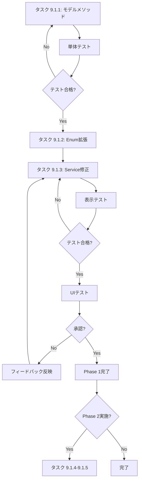

# Phase5: UI改善 詳細計画書

**作成日:** 2025年11月8日  
**対象:** WBS 9.1 UI/UX改善の慎重な実装  
**方針:** アイコン+ツールチップを基本とし、既存UIとの整合性を重視

**関連ドキュメント:**
- [Phase5 実装報告書](./2025-11-08_phase5-implementation-report.md)
- [Phase5 WBS](./2025-11-08_phase5-wbs.md)

---

## 📋 基本設計方針

### 1. UI表示の原則

1. **アイコンファースト**
   - ステータスは必ずアイコンで表示
   - ツールチップで詳細説明を提供
   - バッジは補助的に使用（必須ではない）

2. **技術用語の最小化**
   - 一般ユーザーに不要な技術詳細は隠蔽
   - エラーメッセージは分かりやすく
   - 専門用語は管理者向けツールチップに限定

3. **既存UIとの調和**
   - Phase4で実装済みの表示を尊重
   - VLMプレビューボタン等の既存機能を活用
   - 破壊的変更を避ける

4. **段階的実装**
   - まずモデルメソッドを実装
   - 次にツールチップ内容を改善
   - 最後に必要に応じてアイコンを追加

---

## 🔍 技術調査: 品質表示（信頼度）の実現可能性

### 調査日: 2025年11月8日

### 調査結果サマリー

| 処理手法 | 信頼度データの有無 | 実装状況 | 表示可否 |
|---------|----------------|---------|---------|
| **VLM (PaddleOCR-VL)** | ✅ あり (`vlm_confidence`) | ✅ DB保存済み | ✅ 可能 |
| **OCR (PaddleOCR)** | ✅ あり（API提供） | ❌ 未保存 | ⚠️ 追加実装必要 |
| **Tika** | ❌ なし | - | ❌ 不可能 |

### 詳細調査内容

#### 1. VLMの信頼度

**データベース設計:**
```sql
vlm_confidence DECIMAL(4,3) -- 0.000-1.000の範囲
```

**現在の実装:**
- ✅ `ProcessVlmExtraction`ジョブで保存済み
- ✅ `AttachedFile::getFormattedConfidenceAttribute()`で%表示
- ✅ 0.7以上を高精度、未満を低精度とする閾値設定済み

**UI表示:**
```php
// 既存実装（app/Models/AttachedFile.php）
public function getFormattedConfidenceAttribute(): ?string
{
    if ($this->vlm_confidence === null) {
        return null;
    }
    return number_format($this->vlm_confidence * 100, 1) . '%';
}

// Phase5で追加実装
public function isHighQualityExtraction(): bool
{
    return $this->finalized_source === 'vlm' &&
           $this->vlm_confidence >= 0.7;
}
```

**結論:** ✅ **VLMの信頼度表示は実装可能**

---

#### 2. PaddleOCRの信頼度

**API仕様（公式ドキュメント調査）:**

PaddleOCRは各検出テキストに対して信頼度スコア（0.0-1.0）を返します:

```python
# PaddleOCR出力フォーマット
[
  [
    [[x1, y1], [x2, y2], [x3, y3], [x4, y4]],  # bounding box
    ('recognized_text', confidence_score)      # text and score
  ],
  ...
]

# 例:
[[[[641.0, 65.0], [813.0, 61.0], [815.0, 130.0], [643.0, 134.0]], 
  ('FRLU', 0.988)],  # 98.8% confidence
 [[[645.0, 156.0], [953.0, 152.0], [954.0, 214.0], [645.0, 217.0]], 
  ('8616911', 0.963)]]  # 96.3% confidence
```

**REST API JSON形式:**
```json
{
  "results": [
    {
      "text": "XPO",
      "confidence": 0.995,
      "bounding_box": [[329, 124], [515, 128], [513, 200], [327, 197]]
    }
  ]
}
```

**現在の実装:**

LedgerLeapでは`OcrAndOptimizeFile`ジョブが`ocrmypdf`コマンドを実行していますが、**confidence情報を取得・保存していません**:

```php
// app/Jobs/Ledger/OcrAndOptimizeFile.php （現在）
$command = [
    'ocrmypdf',
    '--force-ocr',
    '-l', 'jpn+eng',
    $dockerInputPath,
    $dockerOutputPath,
];
// → PDFを生成するのみ、confidence情報は取得しない
```

**問題点:**
- `ocrmypdf`はPaddleOCRのconfidence情報を公開していない
- 現在のPDF→Tika抽出フローではconfidence情報が失われる
- PaddleOCR APIを直接呼び出す必要がある

**実装の選択肢:**

**オプションA: PaddleOCR APIの直接呼び出し（推奨）**
```python
# 新規Pythonスクリプト: scripts/paddleocr_extract.py
from paddleocr import PaddleOCR

ocr = PaddleOCR(use_angle_cls=True, lang='japan')
result = ocr.ocr(img_path, cls=True)

# 平均confidenceを計算
confidences = [line[1][1] for line in result[0]]
avg_confidence = sum(confidences) / len(confidences)

return {
    "text": "
".join([line[1][0] for line in result[0]]),
    "confidence": avg_confidence,
    "details": result
}
```

**オプションB: ocrmypdfの出力ログをパース（非推奨）**
- ocrmypdfのverbose出力にconfidence情報が含まれる場合がある
- 信頼性が低く、バージョン依存のリスク

**結論:** ⚠️ **OCRの信頼度表示には追加実装が必要**
- 短期的には「標準精度」と表示（confidenceなし）
- 長期的にはPaddleOCR API直接呼び出しに移行

---

#### 3. Tikaの信頼度

**公式ドキュメント調査:**
Apache Tikaはメタデータ抽出に特化しており、**信頼度スコアは提供していません**。

**理由:**
- Tikaは既存テキストレイヤーの抽出のみ
- OCRは行わない（PDFに既に埋め込まれたテキストを読む）
- 信頼度の概念が存在しない

**結論:** ❌ **Tikaの信頼度表示は不可能**

---

### 実装方針の決定

#### フェーズ5.1（現在）: VLMのみ信頼度表示

```php
// モーダル内で表示
@if($file->finalized_source === 'vlm' && $file->vlm_confidence)
    <div class="text-sm text-gray-600">
        {{ __('file.status.quality') }}: 
        <span class="font-semibold">{{ $file->formatted_confidence }}</span>
        @if($file->vlm_confidence >= 0.9)
            <x-heroicon-s-check-badge class="w-4 h-4 text-success inline" />
        @elseif($file->vlm_confidence >= 0.7)
            <x-heroicon-s-shield-check class="w-4 h-4 text-info inline" />
        @else
            <x-heroicon-s-exclamation-triangle class="w-4 h-4 text-warning inline" />
        @endif
    </div>
@endif
```

**表示ルール:**
- VLM処理の場合のみ信頼度を表示
- 90%以上: 高精度（緑チェック）
- 70-90%: 標準精度（青シールド）
- 70%未満: 低精度（黄色警告）
- OCR/Tika: 信頼度表示なし（「標準抽出」等の文言のみ）

#### フェーズ6（将来）: OCR信頼度の追加

**実装タスク:**
1. PaddleOCR APIラッパースクリプト作成
2. `ocr_confidence`カラムをマイグレーション追加
3. `OcrAndOptimizeFile`を改修してconfidence保存
4. UI表示ロジックを拡張

**優先度:** 低（Phase6以降で検討）

---

## 🎯 WBS 9.1: UI改善タスク分解

### タスク 9.1.1: AttachedFileモデルの表示ロジック整理

**目的:** UI表示用のヘルパーメソッドを整理・追加

**優先度:** 高

#### 9.1.1.1 エラー判定メソッド

```php
/**
 * テキスト抽出に失敗したか判定
 * - 管理者向けのエラーハンドリング用
 * - UI表示での分岐に使用
 */
public function hasExtractionError(): bool
{
    // 最終化済みだがコンテンツが空
    if ($this->processing_finalized_at && !$this->contain_content) {
        return true;
    }

    // VLM/OCR対象なのに両方失敗してコンテンツなし
    if ($this->isVlmOrOcrTarget() &&
        $this->vlm_failed_at &&
        $this->ocr_failed_at &&
        !$this->contain_content) {
        return true;
    }

    return false;
}
```

**使用箇所:**
- `AttachedFileStatus::FINALIZED`の判定
- 再処理ボタンの表示条件
- エラーアイコンの表示

**テストケース:**
- ✅ 最終化済み・コンテンツあり → false
- ✅ 最終化済み・コンテンツなし → true
- ✅ VLM/OCR両方失敗・コンテンツなし → true
- ✅ VLM失敗・OCR成功・コンテンツあり → false

#### 9.1.1.2 処理完了度判定メソッド

```php
/**
 * VLMによる高精度抽出が完了したか
 * - VLMプレビューボタン表示の判定
 * - 品質表示の基準
 */
public function isHighQualityExtraction(): bool
{
    return $this->processing_finalized_at &&
           $this->finalized_source === 'vlm' &&
           $this->vlm_confidence >= 0.7;
}

/**
 * フォールバック処理で完了したか
 * - OCRまたはTikaで完了
 * - 品質改善の余地あり
 */
public function isFallbackExtraction(): bool
{
    return $this->processing_finalized_at &&
           in_array($this->finalized_source, ['ocr', 'tika']);
}
```

**使用箇所:**
- アイコン色の判定
- ツールチップ内容の分岐
- 再処理提案の判定

#### 9.1.1.3 再処理可否判定メソッド

```php
/**
 * 管理者が再処理を実行できるか
 * - エラー時は常に可能
 * - 低精度時も可能
 */
public function canAdminRetry(): bool
{
    return $this->hasExtractionError() ||
           ($this->finalized_source === 'vlm' && 
            $this->vlm_confidence < 0.7) ||
           ($this->finalized_source === 'ocr' && 
            $this->vlm_failed_at);
}

/**
 * 一般ユーザーが再処理をリクエストできるか
 * - エラー時のみ（明らかな失敗）
 */
public function canUserRequestRetry(): bool
{
    return $this->hasExtractionError();
}
```

**使用箇所:**
- 再処理ボタンの表示条件
- 権限チェック

---

### タスク 9.1.2: ツールチップ内容の改善

**目的:** アイコンのツールチップでわかりやすい説明を提供

**優先度:** 高

#### 9.1.2.1 AttachedFileStatusのtooltip()メソッド拡張

**現状確認:**
```php
// app/Enums/AttachedFileStatus.php
public function tooltip(): string
{
    return match ($this) {
        self::UPLOADED => 'アップロード完了',
        self::PROCESSING => '処理中',
        self::COMPLETED => '処理完了',
        // ...
    };
}
```

**改善案:** `AttachedFile`オブジェクトを受け取り、詳細なツールチップを生成

```php
/**
 * ファイルの状態に応じた詳細なツールチップを生成
 */
public function getDetailedTooltip(AttachedFile $file): string
{
    return match ($this) {
        self::FINALIZED => $this->getFinalizedTooltip($file),
        self::INITIAL_PROCESSING => 'テキストを読み取り中...',
        self::PARALLEL_PROCESSING => $this->getParallelProcessingTooltip($file),
        self::READY_FOR_FINALIZATION => '最終処理を待機中',
        self::TIKA_FAILED => 'ファイル処理に失敗しました',
        self::OCR_FAILED => 'OCR処理に失敗しました',
        self::VLM_FAILED => 'VLM処理に失敗しました',
        default => $this->tooltip(),
    };
}

private function getFinalizedTooltip(AttachedFile $file): string
{
    if ($file->hasExtractionError()) {
        return 'テキストを抽出できませんでした';
    }

    return match ($file->finalized_source) {
        'vlm' => $file->vlm_confidence >= 0.9
            ? '高精度でテキストを抽出しました'
            : 'テキストを抽出しました',
        'ocr' => 'OCRでテキストを抽出しました',
        'tika' => 'テキスト処理が完了しました',
        default => '処理が完了しました',
    };
}

private function getParallelProcessingTooltip(AttachedFile $file): string
{
    $parts = [];
    
    if (!$file->vlm_processed_at && !$file->vlm_failed_at) {
        $parts[] = '画像を解析中';
    }
    if (!$file->ocr_processed_at && !$file->ocr_failed_at) {
        $parts[] = 'OCR処理中';
    }
    
    return empty($parts) ? '処理中...' : implode('、', $parts) . '...';
}
```

**実装方法:**
- 既存の`AttachedFileStatus::tooltip()`は維持
- `ColumnHtmlService`で`$attachment->status->getDetailedTooltip($attachment)`を呼び出す

**メリット:**
- ユーザーに分かりやすい説明
- 技術用語を隠蔽
- 状況に応じた適切な情報提供

#### 9.1.2.2 ColumnHtmlServiceの修正

```php
// 現在の実装
$statusIconHtml = <<<HTML
<div class="tooltip tooltip-bottom" data-tip="{$attachment->status->tooltip()}">
    <i class="{$attachment->status->icon()} {$attachment->status->colorClass()} text-lg"></i>
</div>
HTML;

// 改善案
$tooltip = $attachment->status->getDetailedTooltip($attachment);
$statusIconHtml = <<<HTML
<div class="tooltip tooltip-bottom" data-tip="{$tooltip}">
    <i class="{$attachment->status->icon()} {$attachment->status->colorClass()} text-lg"></i>
</div>
HTML;
```

---

### タスク 9.1.3: 再処理ボタンのUI改善

**目的:** エラー時に一般ユーザーも再処理を依頼できるようにする

**優先度:** 中

#### 9.1.3.1 再処理ボタンの表示条件更新

```php
// 現在の実装（Phase4互換）
if ($attachment->status === \App\Enums\AttachedFileStatus::TIKA_FAILED ||
    $attachment->status === \App\Enums\AttachedFileStatus::OCR_FAILED ||
    $attachment->status === \App\Enums\AttachedFileStatus::THUMBNAIL_FAILED) {
    // 再処理ボタン表示
}

// Phase5改善案
if ($attachment->canUserRequestRetry() || 
    ($attachment->status === \App\Enums\AttachedFileStatus::THUMBNAIL_FAILED)) {
    $retryTooltip = $attachment->hasExtractionError()
        ? 'テキスト抽出を再試行'
        : '再処理';
    // 再処理ボタン表示
}
```

#### 9.1.3.2 ツールチップの改善

```php
// より分かりやすいツールチップ
$retryTooltip = match (true) {
    $attachment->hasExtractionError() => 'テキスト抽出を再試行',
    $attachment->status === AttachedFileStatus::THUMBNAIL_FAILED => 'サムネイル再生成',
    default => '再処理',
};
```

**実装のポイント:**
- エラー時は明確に「テキスト抽出を再試行」と表示
- サムネイル失敗は「サムネイル再生成」と明示
- 一般的な再処理は「再処理」のまま

---

### タスク 9.1.4: VLMプレビューボタンのツールチップ改善

**目的:** VLMプレビュー機能をより分かりやすく説明

**優先度:** 低

#### 9.1.4.1 現在の実装

```php
if ($attachment->hasVlmResult()) {
    $vlmPreviewTooltip = __('ledger.vlm.preview_button');
    $vlmPreviewButtonHtml = <<<HTML
<div class="tooltip btn btn-square btn-ghost btn-sm" data-tip="{$vlmPreviewTooltip}">
    <i class="fa-solid fa-eye cursor-pointer" 
    wire:click="\$dispatch('showVlmPreviewEvent', { fileId: {$attachment->id} })"></i>
</div>
HTML;
}
```

#### 9.1.4.2 改善案

```php
if ($attachment->hasVlmResult()) {
    // より具体的なツールチップ
    $vlmPreviewTooltip = $attachment->isHighQualityExtraction()
        ? '抽出されたテキストをプレビュー'
        : 'AIが読み取ったテキストを確認';
    
    $vlmPreviewButtonHtml = <<<HTML
<div class="tooltip btn btn-square btn-ghost btn-sm" data-tip="{$vlmPreviewTooltip}">
    <i class="fa-solid fa-eye cursor-pointer" 
    wire:click="\$dispatch('showVlmPreviewEvent', { fileId: {$attachment->id} })"></i>
</div>
HTML;
}
```

**メリット:**
- 「VLM」という技術用語を使わない
- ユーザーに何ができるか明確に伝える

---

### タスク 9.1.5: VLMプレビューモーダルでの品質表示

**目的:** VLMプレビューモーダル内で品質情報を表示し、クリップボードコピー機能を提供

**優先度:** 中（Phase 2）

**方針:**
- ~~ファイル一覧にアイコン表示~~ → モーダル内で品質情報を表示
- VLMプレビューを開いた時に詳細な品質情報を確認
- ファイル一覧は簡潔なアイコン+ツールチップのみ
- **クリップボードコピーをメイン機能として強調**

#### 9.1.5.1 モーダル内の機能要件

**現状:**
- 既にVLM信頼度が表示されている（バッジ形式）
- ファイル名とマークダウンプレビューを表示
- ダウンロードボタン（Markdown/JSON）あり

**追加・改善要件:**

**1. クリップボードコピーボタン（メイン機能）**
- **配置:** モーダル上部、目立つ位置に配置
- **ボタンデザイン:** プライマリボタン（強調色）
- **コピー対象:** VLMマークダウン全文
- **フィードバック:** 
  - クリック時にボタンテキスト変化「コピーしました！」
  - Toast通知で成功を表示
  - 2秒後に元のテキストに戻る
- **アイコン:** `fa-copy` または `fa-clipboard`
- **優先順位:** ダウンロードボタンより目立たせる

**実装イメージ:**
```
┌─────────────────────────────────────────────┐
│ VLMプレビュー - invoice.pdf                 │
├─────────────────────────────────────────────┤
│ 📄 invoice_simple.pdf                       │
│                                             │
│ [🎨抽出手法: VLM] [📊信頼度: 92%] [⭐高精度] │
│                                             │
│ [📋 クリップボードにコピー] ← メインボタン    │
│ [⬇️ Markdown] [⬇️ JSON]                     │
├─────────────────────────────────────────────┤
│ [マークダウンプレビュー]                     │
│ # 請求書                                    │
│ 株式会社○○御中                              │
│ ...                                         │
└─────────────────────────────────────────────┘
```

**2. 品質情報バッジ（2025-11-08更新）**

**変更方針:**
技術調査の結果、**VLMのみ信頼度表示が可能**であることが判明しました。

**実装する表示:**

- **抽出手法:**
  - 表示しない（ユーザーには不要な技術情報）
  - ツールチップで管理者向けに表示
  
- **信頼度表示（VLMのみ）:**
  - VLM処理かつconfidenceが存在する場合のみ表示
  - 表示形式: 「92.3%」（既存の`formatted_confidence`を使用）
  - アイコンで視覚化:
    - 90%以上: ✅ `heroicon-s-check-badge`（緑）
    - 70-89%: 🛡️ `heroicon-s-shield-check`（青）
    - 70%未満: ⚠️ `heroicon-s-exclamation-triangle`（黄）
  
- **品質レベル:**
  - 表示しない（信頼度%で十分）
  
- **OCR/Tika:**
  - 信頼度表示なし
  - 処理完了のステータスのみ表示

**理由:**
1. **PaddleOCRのconfidence:** API仕様では提供されるが、現在の`ocrmypdf`実装では取得していない
2. **Tikaのconfidence:** 信頼度の概念が存在しない（既存テキスト抽出のみ）
3. **Phase6で拡張可能:** PaddleOCR API直接呼び出しに移行すればOCR信頼度も追加可能

**モーダル表示例:**

```
┌─────────────────────────────────────────────┐
│ VLMプレビュー - invoice.pdf                 │
├─────────────────────────────────────────────┤
│ 📄 invoice_simple.pdf                       │
│                                             │
│ 【VLMの場合】                               │
│ 信頼度: 92.3% ✅                            │
│                                             │
│ 【OCRの場合】                               │
│ OCRで抽出完了                               │
│                                             │
│ 【Tikaの場合】                              │
│ テキスト抽出完了                            │
│                                             │
│ [📋 クリップボードにコピー] ← メインボタン    │
│ [⬇️ Markdown] [⬇️ JSON]                     │
├─────────────────────────────────────────────┤
│ [マークダウンプレビュー]                     │
│ # 請求書                                    │
│ 株式会社○○御中                              │
│ ...                                         │
└─────────────────────────────────────────────┘
```

**実装コード例:**

```blade
{{-- 品質情報表示（VLMのみ） --}}
@if($file->finalized_source === 'vlm' && $file->vlm_confidence)
    <div class="flex items-center gap-2 text-sm">
        <span class="text-gray-600">{{ __('file.status.confidence') }}:</span>
        <span class="font-semibold">{{ $file->formatted_confidence }}</span>
        @if($file->vlm_confidence >= 0.9)
            <x-heroicon-s-check-badge class="w-5 h-5 text-success" />
        @elseif($file->vlm_confidence >= 0.7)
            <x-heroicon-s-shield-check class="w-5 h-5 text-info" />
        @else
            <x-heroicon-s-exclamation-triangle class="w-5 h-5 text-warning" />
        @endif
    </div>
@elseif($file->finalized_source === 'ocr')
    <div class="text-sm text-gray-600">
        {{ __('file.status.ocrCompleted') }}
    </div>
@elseif($file->finalized_source === 'tika')
    <div class="text-sm text-gray-600">
        {{ __('file.status.textExtracted') }}
    </div>
@endif
```

**翻訳キー追加:**

```json
// lang/ja/file.php
'status' => [
    'confidence' => '信頼度',
    'ocrCompleted' => 'OCRで抽出完了',
    'textExtracted' => 'テキスト抽出完了',
],
```

**Phase6での拡張計画:**
- PaddleOCR APIラッパースクリプト作成
- `ocr_confidence`カラム追加
- `OcrAndOptimizeFile`改修
- UI表示ロジック拡張（OCRでも信頼度表示）

**3. ボタン配置の優先順位**
```
優先度 高 → 低:
1. [📋 クリップボードにコピー] ← btn-primary（強調）
2. [⬇️ Markdownダウンロード] ← btn-outline
3. [⬇️ JSONダウンロード] ← btn-outline
4. [閉じる] ← btn-ghost
```

**4. JavaScript実装要件**
- **Clipboard API使用:**
  ```javascript
  navigator.clipboard.writeText(markdownText)
  ```
- **フォールバック:** 
  - 古いブラウザ向けに`document.execCommand('copy')`も実装
- **エラーハンドリング:**
  - コピー失敗時は「コピーに失敗しました」Toast表示
- **セキュリティ:**
  - HTTPS環境でのみ動作（開発環境はlocalhost例外）

**5. UX配慮事項**
- **コピー成功時のフィードバック:**
  - ボタンテキスト: 「コピー」→「コピーしました！」
  - アイコン変化: `fa-copy` → `fa-check`
  - Toast通知: 「クリップボードにコピーしました」
  - 2秒後に元の表示に戻る
  
- **モバイル対応:**
  - タッチデバイスでも正常にコピー動作
  - ボタンサイズを適切に確保

- **アクセシビリティ:**
  - `aria-label`で「抽出されたテキストをクリップボードにコピー」
  - キーボード操作対応

**6. エラー時の表示**
- VLM/OCR両方失敗の場合:
  - エラーメッセージバッジ表示（赤色）
  - 「テキストを抽出できませんでした」
  - クリップボードコピーボタンは非表示
  - 代わりに「再処理」ボタンを表示

**メリット:**
- **ユーザーの主要ニーズに対応:** 抽出テキストをすぐに他の場所で使える
- **ワンクリック操作:** ダウンロードより手軽
- **ファイル管理不要:** ダウンロードフォルダが散らからない
- **既存機能との両立:** ダウンロード機能も残す（詳細確認・保存用）

**実装ファイル:**
- `resources/views/livewire/ledger/show.blade.php` - モーダルUI
- `app/Livewire/Ledger/Show.php` - Livewireコンポーネント（必要に応じて）
- Alpine.js/JavaScript - クリップボードコピー処理

**技術スタック:**
- **Clipboard API:** 標準Web API
- **Alpine.js:** 状態管理とイベント処理
- **Mary UI:** バッジ・ボタンコンポーネント
- **Livewire:** Toast通知ディスパッチ

---

## 📊 実装優先順位

### Phase 1: 基本改善（必須）

1. ✅ **タスク 9.1.1: モデルメソッド追加**
   - `hasExtractionError()`
   - `canUserRequestRetry()`
   - `canAdminRetry()`（オプション）

2. ✅ **タスク 9.1.2: ツールチップ改善**
   - `AttachedFileStatus::getDetailedTooltip()`
   - `ColumnHtmlService`の修正

3. ✅ **タスク 9.1.3: 再処理ボタン改善**
   - 表示条件の更新
   - ツールチップの明確化

### Phase 2: 拡張改善（オプション）

4. ⚠️ **タスク 9.1.4: VLMプレビューボタン改善**
   - ツールチップの具体化

5. ⚠️ **タスク 9.1.5: VLMプレビューモーダル品質表示**
   - **クリップボードコピーボタン追加（メイン機能）**
   - モーダル内に品質情報を表示
   - 抽出手法・信頼度・品質レベル等
   - 既存モーダル実装の確認と拡張

---

## 🧪 テスト計画

### 単体テスト

```php
// tests/Unit/Models/AttachedFileTest.php

test('hasExtractionError detects finalized file with no content', function () {
    $file = AttachedFile::factory()->create([
        'processing_finalized_at' => now(),
        'contain_content' => false,
    ]);
    
    expect($file->hasExtractionError())->toBeTrue();
});

test('hasExtractionError detects VLM and OCR both failed', function () {
    $file = AttachedFile::factory()->create([
        'mime' => 'image/png',
        'vlm_failed_at' => now(),
        'ocr_failed_at' => now(),
        'contain_content' => false,
    ]);
    
    expect($file->hasExtractionError())->toBeTrue();
});

test('canUserRequestRetry only for extraction errors', function () {
    $errorFile = AttachedFile::factory()->create([
        'processing_finalized_at' => now(),
        'contain_content' => false,
    ]);
    
    $successFile = AttachedFile::factory()->create([
        'processing_finalized_at' => now(),
        'contain_content' => true,
    ]);
    
    expect($errorFile->canUserRequestRetry())->toBeTrue();
    expect($successFile->canUserRequestRetry())->toBeFalse();
});
```

### 表示テスト

```php
// tests/Feature/Livewire/LedgerIndexTest.php

test('shows extraction error tooltip', function () {
    $file = AttachedFile::factory()->create([
        'processing_finalized_at' => now(),
        'contain_content' => false,
    ]);
    
    Livewire::test(LedgerIndex::class)
        ->assertSee('テキストを抽出できませんでした');
});

test('shows retry button for extraction error', function () {
    $file = AttachedFile::factory()->create([
        'processing_finalized_at' => now(),
        'contain_content' => false,
    ]);
    
    Livewire::test(LedgerIndex::class)
        ->assertSee('fa-arrow-rotate-right');
});
```

---

## 📝 実装手順

### ステップ1: モデルメソッド追加

```bash
# AttachedFile.phpに以下を追加
# - hasExtractionError()
# - canUserRequestRetry()
# 
# テスト実行
./vendor/bin/sail pest tests/Unit/Models/AttachedFileTest.php
```

### ステップ2: Enumの拡張

```bash
# AttachedFileStatus.phpに以下を追加
# - getDetailedTooltip()
# - getFinalizedTooltip()
# - getParallelProcessingTooltip()
```

### ステップ3: ColumnHtmlService修正

```bash
# ツールチップをgetDetailedTooltip()に変更
# 再処理ボタンの条件をcanUserRequestRetry()に変更
# 
# 表示テスト実行
./vendor/bin/sail pest tests/Feature/Livewire/
```

### ステップ4: UIテスト

```bash
# ブラウザで動作確認
# - エラーファイルのツールチップ表示
# - 再処理ボタンの表示
# - VLMプレビューボタンの表示
```

---

## ✅ 完了基準

### Phase 1（必須）

- [ ] `hasExtractionError()`メソッド実装
- [ ] `canUserRequestRetry()`メソッド実装
- [ ] `AttachedFileStatus::getDetailedTooltip()`実装
- [ ] ツールチップが分かりやすい日本語で表示される
- [ ] エラー時に再処理ボタンが表示される
- [ ] 全テストが合格
- [ ] UIテストで動作確認

### Phase 2（オプション）

- [ ] VLMプレビューボタンのツールチップ改善
- [ ] **VLMプレビューモーダル内でのクリップボードコピー機能追加**
  - プライマリボタンとして目立つ配置
  - Clipboard API使用
  - コピー成功のフィードバック（Toast + ボタン変化）
- [ ] VLMプレビューモーダル内での品質情報表示
  - 抽出手法（VLM/OCR/Tika）
  - VLM信頼度スコア
  - 品質レベル（高精度/標準/低精度）
- [ ] 管理者向け機能の追加（要望があれば）

---

## 📌 注意事項

### 1. 既存機能の維持

- Phase4で実装したVLMプレビュー機能は維持
- 既存のステータスアイコン表示は変更しない
- `AttachedFileStatus`のenumは追加のみ

### 2. 段階的実装

- Phase 1を完了してからPhase 2に進む
- 各ステップでテストとUIテストを実施
- 問題があれば前のステップに戻る

### 3. ユーザーフィードバック

- Phase 1実装後、ユーザーに確認
- 品質情報はモーダル内で表示（ファイル一覧は簡潔に）
- 追加機能は要望ベースで実装

### 4. 品質情報の表示方針

- **ファイル一覧:** アイコン+ツールチップで簡潔に
- **モーダル内:** 詳細な品質情報を表示
  - 抽出手法、信頼度、処理時間等
  - ユーザーが必要な時に確認できる

---

## 🔄 実装サイクル



---

## 📞 参考情報

### 関連ドキュメント

- [Phase5 実装報告書](./2025-11-08_phase5-implementation-report.md)
- [Phase5 WBS](./2025-11-08_phase5-wbs.md)
- [Phase5 技術ドキュメント](../../phase5-vlm-ocr-parallel-processing.md)

### 実装者

- **計画作成:** 2025年11月8日
- **Phase 1実装予定:** TBD
- **Phase 2実装予定:** ユーザーフィードバック次第

---

**Phase5 UI改善詳細計画書 - 完**
